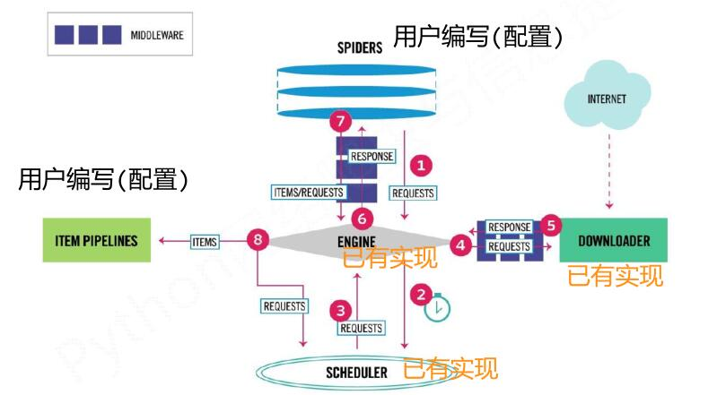

<!-- TOC -->

- [**网络爬虫之框架**](#网络爬虫之框架)
    - [**1.scrapy爬虫框架介绍**](#1scrapy爬虫框架介绍)
        - [**1.1.scrapy爬虫框架介绍**](#11scrapy爬虫框架介绍)
        - [**1.2.scrapy爬虫框架解析**](#12scrapy爬虫框架解析)
        - [**1.3.requests库和scrapy爬虫的比较**](#13requests库和scrapy爬虫的比较)
        - [**1.4.scrapy爬虫的常用命令**](#14scrapy爬虫的常用命令)
    - [**2.scrapy爬虫框架介绍**](#2scrapy爬虫框架介绍)
        - [**2.1.scrapy爬虫的第一个实例**](#21scrapy爬虫的第一个实例)
        - [**2.2.yield关键字的使用**](#22yield关键字的使用)
        - [**2.3.scrapy爬虫的基本使用**](#23scrapy爬虫的基本使用)
    - [**3."股票数据Scrapy爬虫"实例**](#3股票数据scrapy爬虫实例)
        - [**3.1功能描述**](#31功能描述)
        - [**3.2.数据网站的确定**](#32数据网站的确定)
        - [**3.3.程序框架**](#33程序框架)
        - [**3.4.实例优化**](#34实例优化)
    - [**4.课程展望**](#4课程展望)

<!-- /TOC -->
# **网络爬虫之框架**
## **1.scrapy爬虫框架介绍**
### **1.1.scrapy爬虫框架介绍**
**安装方法：**


简要地说，**Scrapy不是一个函数功能库，而是一个快速功能强大的网络爬虫框架。**
（爬虫框架是实现爬虫功能的一个**软件结构和功能组件集合**，是一个**半成品**，能够帮助用户实现**专业**网络爬虫。）


**scrapy爬虫框架的组成**如下：


用户提交的网络请求以及从网络上获取的信息形成数据流，在这些模块间流动。


**数据流的路径有：**


**数据流的出入口：**


框架中有两个模块是需要用户编写的（可理解为 为框架进行**配置**），另外的三个是已经实现的。



### **1.2.scrapy爬虫框架解析**
**Engine**
(1) 控制所有模块之间的数据流
(2) 根据条件触发事件
(3)**不需要用户修改**

**Downloader**
(1)根据请求下载网页
(2)**不需要用户修改**

**Scheduler**
(1)对所有爬取请求进行调度管理
(2)**不需要用户修改**

**Downloader Middleware**（Middleware是**中间设备**之意）
(1)目的：实施Engine、 Scheduler和Downloader之间进行用户可配置的控制
(2)功能：修改、丢弃、新增请求或响应
(3)**用户可以编写配置代码**

**Spider**
(1) 解析Downloader返回的响应（Response）
(2) 产生爬取项（scraped item）
(3) 产生额外的爬取请求（Request）
**(4)需要用户编写配置代码**

**Item Pipelines**
(1) 以流水线方式处理Spider产生的爬取项
(2) 由一组操作顺序组成，类似流水线，每个操作是一个Item Pipeline类型
(3) 可能操作包括：清理、检验和查重爬取项中的HTML数据、将数据存储到数据库
**(4)需要用户编写配置代码**

### **1.3.requests库和scrapy爬虫的比较**
**相同点：**
两者都可以进行页面请求和爬取，Python爬虫的两个重要技术路线
两者可用性都好，文档丰富，入门简单
两者都没有处理js、提交表单、应对验证码等功能（可扩展）

**具体区别：**


**那么选用哪个技术路线开发爬虫呢？**

具体看情况，对于非常小的需求，使用requests库；对于不太小的需求，使用Scrapy框架。
而对于定制程度很高的需求（不考虑规模），最好选择自搭框架（requests > Scrapy）。

### **1.4.scrapy爬虫的常用命令**
Scrapy是为持续运行设计的专业爬虫框架，提供操作的Scrapy命令行。命令格式：


常用的命令：


**为什么Scrapy采用命令行创建和运行爬虫？**

命令行（不是图形界面）更容易自动化，适合脚本控制。而本质上，Scrapy是给程序员用的，功能（而不是界面）更重要。

## **2.scrapy爬虫框架介绍**
### **2.1.scrapy爬虫的第一个实例**

演示HTML页面地址：http://python123.io/ws/demo.html


首先要有一个概念：应用Scrapy爬虫框架主要是**编写配置型代码**

实例步骤：

**步骤1：建立一个Scrapy爬虫工程**

选取一个目录（如E:\Code\），然后执行如下命令：

```python
scrapy startproject mydemo
```

等待一段时候后，可以看到输出如下：


而在对应目录下有python123demo这个文件夹（其实就是**工作目录**）生成


工作目录的细节解释：


而spiders目录的内部目录解释如下，**用户自定义的spider代码就是增加在此处。**


**步骤2：在工程中产生一个Scrapy爬虫**

进入工程目录（E:\Code\python123demo），然后执行如下命令：

```python
scrapy genspider demo python123.io
```
该命令作用：

(1) 生成一个名称为**demo**的**spider**

(2) 在s**piders目录下**增加代码文件**demo.py**

注意：**该命令仅用于生成demo.py，该文件也可以手工生成**

对应输出：


打开demo.py后，显示如下：

```python
# -*- coding: utf-8 -*-
import scrapy


class DemoSpider(scrapy.Spider):
    name = "demo"
    allowed_domains = ["python123.io"]
    start_urls = (
        'http://www.python123.io/',
    )

    def parse(self, response):
        pass

```

其中**parse()用于处理响应，解析内容形成字典，发现新的URL爬取请求。**

**步骤3：配置产生的spider爬虫**

配置：**（1）初始URL地址 （2）获取页面后的解析方式**
修改demo.py为：

```python
# -*- coding: utf-8 -*-
import scrapy


class DemoSpider(scrapy.Spider):
    name = "demo"
    #allowed_domains = ["python123.io"]#可选
    #配置初始URL地址
    start_urls = (
        'http://www.python123.io/ws/demo.html',
    )

    def parse(self, response):
    	#配置获取页面后的解析方式：将捕获页面存储在demo.html
        fname=response.url.split('/')[-1]
        with open(fname,'wb') as f:
        	f.write(response.body)
        self.log('Save file %s.'% fname)
```

**步骤4：运行爬虫，获取网页**

在命令行下，执行如下命令：

```
scrapy crawl demo
```
显示的部分效果为：


demo爬虫被执行后，捕获页面存储在demo.html。打开python123demo目录，可以看到demo文件。


至此，第一个实例已经完成了。

而在实际使用scrapy库时，在实际编写代码的时候，将上面的demo.py改写成如下的形式（等价的）会更好。

```python
# -*- coding: utf-8 -*-
import scrapy


class DemoSpider(scrapy.Spider):
    name = "demo"
    #allowed_domains = ["python123.io"]#可选
    #配置初始URL地址
    def start_requests(self):
    urls = (
        'http://www.python123.io/ws/demo.html',
    )
    for url in urls:
    	yield scrapy.Request(url=url,callback=self.parse)

    def parse(self, response):
    	#配置获取页面后的解析方式：将捕获页面存储在demo.html
        fname=response.url.split('/')[-1]
        with open(fname,'wb') as f:
        	f.write(response.body)
        self.log('Save file %s.'% fname)
```
两份代码的区别如下：


而为什么start_requests函数里要使用yield呢？这样做有什么好处吗？下面分晓~

### **2.2.yield关键字的使用**
yield是**python3**中的一个关键字。包含yield语句的函数称为**生成器**。

yield 生成器每次产生一个值（yield语句），函数被冻结，被唤醒后再产生一个值。

简单地说，生成器是一个不断产生值的函数。

实例：


可见：**生成器每调用一次在yield位置产生一个值，直到函数执行结束。**

看到这里，感觉和写个for循环没差别呀，最后的输出效果都一样。那么为何要使用yield呢？

对于上面的实例，两种写法如下：


可以看到,生成器相比一次列出所有内容的优势：
**1)更节省存储空间**              
**2)响应更迅速** 
**3)使用更灵活**

如果n=1M、 10M、 100M时，优势明显就体现出来了。

那么回到2.1中两份代码的区别的问题，使用yield语句的那份代码在url有成千上万个的时候可以有效的减少计算机资源的占用。

### **2.3.scrapy爬虫的基本使用**
使用步骤如下：
步骤1：创建一个工程和Spider模板
步骤2：编写Spider
步骤3：编写Item Pipeline
步骤4：优化配置策略

 在这些步骤中会涉及3个类：Request类、Response类、Item类。下面对其一一介绍。
 
**Request类**（scrapy.http.Request）

 **一个Request对象表示一个HTTP请求，其由Spider生成，由Downloader执行**
 
其有如下使用属性和方法：


**Response类**（scrapy.http.Response）

**一个Response对象表示一个HTTP响应，其由Downloader生成，由Spider处理**

其有如下使用属性和方法：


**Item类**（scrapy.item.Item）

**Item对象表示一个从HTML页面中提取的信息内容，其由Spider生成，由Item Pipeline处理.**

Item类似字典类型，可以按照字典类型操作。

而Scrapy爬虫支持多种HTML信息提取方法如下：
• Beautiful Soup
• lxml
• re
• XPath Selector
• CSS Selector

下面介绍 CSS Selector的基本使用：

其基本使用语法：


注：CSS Selector由W3C组织维护并规范

关于CSS Selector的实例，在下面会介绍。

## **3."股票数据Scrapy爬虫"实例**
### **3.1功能描述**
目标：获取上交所和深交所所有股票的名称和交易信息
输出：保存到文件中
技术路线：scrapy

由于这个例子在上一篇文章已有介绍，这里只是用scrapy实现了而已，所以不具体解释太多细节。

### **3.2.数据网站的确定**
获取股票列表：
东方财富网：http://quote.eastmoney.com/stocklist.html

获取个股信息：
百度股票：https://gupiao.baidu.com/stock/
单个股票：https://gupiao.baidu.com/stock/sz002439.html

### **3.3.程序框架**

编写spider处理链接爬取和页面解析，编写pipelines处理信息存储。


具体的实例编写步骤则为：

步骤1：**建立工程和Spider模板**------->步骤2：**编写Spider**---------->步骤3：**编写ITEM Pipelines**

**步骤1：建立工程和Spider模板**

首先，在CMD下一次输入下面3条语句以创建工程：

```
scrapy startproject BaiduStocks
cd BaiduStocks
scrapy genspider stocks baidu.com
```
接着进一步修改spiders/stocks.py文件。

**步骤2：编写Spider**

配置stocks.py文件：

----->1.修改**对返回页面的处理**

----->2.修改**对新增URL爬取请求的处理**

修改之前，stock.py内容如下：

```python
# -*- coding: utf-8 -*-
import scrapy


class StocksSpider(scrapy.Spider):
    name = "stocks"
    allowed_domains = ["baidu.com"]
    start_urls = (
        'http://www.baidu.com/',
    )

    def parse(self, response):
        pass

```
修改之后：

```python
# -*- coding: utf-8 -*-
import scrapy
import re


class StocksSpider(scrapy.Spider):
    name = "stocks"
    #从动东方财富网开始爬取
    start_urls = ['http://quote.eastmoney.com/stocklist.html']

    def parse(self, response):
        #获取a标签
        for href in response.css('a::attr(href)').extract():
            try:
                #得到股票代号
                stock = re.findall(r"[s][hz]\d{6}", href)[0]
                #根据股票代号在得到要在百度股票上查询的url
                url = 'https://gupiao.baidu.com/stock/' + stock + '.html'
                yield scrapy.Request(url, callback=self.parse_stock)
            except:
                continue

    def parse_stock(self, response):
        #单支股票信息
        infoDict = {}
        #得到tock-bets区域的信息
        stockInfo = response.css('.stock-bets')
        #得到bets-name区域的信息
        name = stockInfo.css('.bets-name').extract()[0]
        #得到键值中的键 所在的html代码块
        keyList = stockInfo.css('dt').extract()
        #得到键值中的值 所在的html代码块
        valueList = stockInfo.css('dd').extract()
        for i in range(len(keyList)):
            #得到键
            key = re.findall(r'>.*</dt>', keyList[i])[0][1:-5]
            #得到值
            try:
                val = re.findall(r'\d+\.?.*</dd>', valueList[i])[0][0:-5]
            except:
                val = '--'
            #用key-val键值对更新infoDict
            infoDict[key]=val
        #更新infoDict
        infoDict.update(
            {'股票名称': re.findall('\s.*\(',name)[0].split()[0] + \
             re.findall('\>.*\<', name)[0][1:-1]})
        yield infoDict

```

**步骤3：编写ITEM Pipelines**

配置pipelines.py文件

---------->定义对爬取项（Scraped Item）的处理类

配置ITEM_PIPELINES选项（在settting.py中修改）

修改之前的pipelines.py：

```python
# -*- coding: utf-8 -*-

# Define your item pipelines here
#
# Don't forget to add your pipeline to the ITEM_PIPELINES setting
# See: http://doc.scrapy.org/en/latest/topics/item-pipeline.html


class BaidustocksPipeline(object):
    def process_item(self, item, spider):
        return item

```

修改之后：

```python
# -*- coding: utf-8 -*-

# Define your item pipelines here
#
# Don't forget to add your pipeline to the ITEM_PIPELINES setting
# See: http://doc.scrapy.org/en/latest/topics/item-pipeline.html


class BaidustocksPipeline(object):
    def process_item(self, item, spider):
        return item
        
#自定义的类BaidustocksInfoPipeline
class BaidustocksInfoPipeline(object):

	#open_spider在开始进行爬虫时调用
    def open_spider(self, spider):
        self.f = open('BaiduStockInfo.txt', 'w')
	
	#close_spider在结束爬虫时调用
    def close_spider(self, spider):
        self.f.close()
        
	#process_item在爬虫“运行”时调用
    def process_item(self, item, spider):
        try:
            line = str(dict(item)) + '\n'
            self.f.write(line)
        except:
            pass
        return item
```
由于上面的代码自定义了一个新类——BaidustocksInfoPipeline，为了让该类可以被调用，需要修改setting.py。（就是pipelines.py文件上面的注释说的：Don't forget to add your pipeline to the ITEM_PIPELINES setting）

setting.py的ITEM_PIPELINES设置代码在修改之前为：
```python
# Configure item pipelines
# See http://scrapy.readthedocs.org/en/latest/topics/item-pipeline.html
#ITEM_PIPELINES = {
#    'BaiduStocks.pipelines.SomePipeline': 300,
#}
```
注：该段代码在setting.py的65-69行代码里

修改之后：

```python
# Configure item pipelines
# See http://scrapy.readthedocs.org/en/latest/topics/item-pipeline.html
ITEM_PIPELINES = {
    'BaiduStocks.pipelines.BaidustocksInfoPipeline': 300,
}
```

**步骤4：执行程序**
在命令行上输入：

```
scrapy crawl stocks
```
要运行结束需要花较长的一段时间，这里给出运行几十秒的结果：

```python
{'最低': '5.58', '换手率': '0.50%', '总股本': '53.43亿', '量比': '0.14', '市净率': '1.26', '振幅': '1.77%', '内盘': '8.55万手', '涨停': '6.22', '股票名称': '金科股份000656', '流通股本': '36.74亿', '外盘': '9.85万手', '总市值': '302.97亿', '今开': '5.65', '跌停': '5.09', '昨收': '5.65', '每股净资产': '4.51', '成交量': '18.40万手', '每股收益': '0.23', '最高': '5.68', '市盈率<sup>MRQ</sup>': '22.53', '委比': '34.25%', '成交额': '1.04亿', '流通市值': '208.30亿'}
{'最低': '32.90', '换手率': '3.54%', '总股本': '3.16亿', '量比': '0.25', '市净率': '7.21', '振幅': '2.26%', '内盘': '2.80万手', '涨停': '36.97', '股票名称': '浙江世宝002703', '流通股本': '1.39亿', '外盘': '2.11万手', '总市值': '105.34亿', '今开': '33.64', '跌停': '30.25', '昨收': '33.61', '每股净资产': '4.63', '成交量': '4.90万手', '每股收益': '0.16', '最高': '33.66', '市盈率<sup>MRQ</sup>': '155.41', '委比': '38.65%', '成交额': '1.63亿', '流通市值': '46.20亿'}
{'最低': '18.90', '换手率': '2.37%', '总股本': '5.75亿', '量比': '1.02', '市净率': '4.30', '振幅': '2.43%', '内盘': '2.17万手', '涨停': '20.86', '股票名称': '新宝股份002705', '流通股本': '1.64亿', '外盘': '1.71万手', '总市值': '109.81亿', '今开': '19.16', '跌停': '17.06', '昨收': '18.96', '每股净资产': '4.44', '成交量': '3.88万手', '每股收益': '0.57', '最高': '19.36', '市盈率<sup>MRQ</sup>': '25.19', '委比': '35.47%', '成交额': '7413.77万', '流通市值': '31.29亿'}
{'最低': '14.50', '换手率': '0.77%', '总股本': '3.81亿', '量比': '0.50', '市净率': '3.42', '振幅': '1.31%', '内盘': '1.27万手', '涨停': '16.01', '股票名称': '金新农002548', '流通股本': '3.17亿', '外盘': '1.19万手', '总市值': '55.41亿', '今开': '14.56', '跌停': '13.10', '昨收': '14.55', '每股净资产': '4.25', '成交量': '2.45万手', '每股收益': '0.32', '最高': '14.69', '市盈率<sup>MRQ</sup>': '33.58', '委比': '12.85%', '成交额': '3577.45万', '流通市值': '46.07亿'}
{'最低': '7.76', '换手率': '0.61%', '总股本': '10.40亿', '量比': '0.66', '市净率': '2.84', '振幅': '1.15%', '内盘': '2.55万手', '涨停': '8.58', '股票名称': '亚太科技002540', '流通股本': '7.05亿', '外盘': '1.75万手', '总市值': '81.12亿', '今开': '7.83', '跌停': '7.02', '昨收': '7.80', '每股净资产': '2.74', '成交量': '4.30万手', '每股收益': '0.19', '最高': '7.85', '市盈率<sup>MRQ</sup>': '30.33', '委比': '65.18%', '成交额': '3357.04万', '流通市值': '54.95亿'}
{'最低': '23.15', '换手率': '2.44%', '总股本': '2.17亿', '量比': '0.68', '市净率': '6.56', '振幅': '2.02%', '内盘': '1.89万手', '涨停': '25.59', '股票名称': '汉王科技002362', '流通股本': '1.76亿', '外盘': '2.41万手', '总市值': '51.08亿', '今开': '23.20', '跌停': '20.93', '昨收': '23.26', '每股净资产': '3.58', '成交量': '4.30万手', '每股收益': '0.10', '最高': '23.62', '市盈率<sup>MRQ</sup>': '239.61', '委比': '56.00%', '成交额': '1.01亿', '流通市值': '41.51亿'}
{'最低': '20.25', '换手率': '0.70%', '总股本': '2.28亿', '量比': '0.68', '市净率': '4.01', '振幅': '1.17%', '内盘': '8591手', '涨停': '22.54', '股票名称': '北京科锐002350', '流通股本': '2.18亿', '外盘': '6571手', '总市值': '46.14亿', '今开': '20.49', '跌停': '18.44', '昨收': '20.49', '每股净资产': '5.06', '成交量': '1.52万手', '每股收益': '0.12', '最高': '20.49', '市盈率<sup>MRQ</sup>': '132.68', '委比': '57.99%', '成交额': '3085.15万', '流通市值': '44.10亿'}
{'最低': '14.93', '换手率': '1.92%', '总股本': '16.07亿', '量比': '1.96', '市净率': '3.23', '振幅': '1.79%', '内盘': '9.69万手', '涨停': '16.58', '股票名称': '利欧股份002131', '流通股本': '8.87亿', '外盘': '7.31万手', '总市值': '242.13亿', '今开': '15.16', '跌停': '13.56', '昨收': '15.07', '每股净资产': '4.66', '成交量': '17.00万手', '每股收益': '0.27', '最高': '15.20', '市盈率<sup>MRQ</sup>': '41.68', '委比': '12.02%', '成交额': '2.56亿', '流通市值': '133.74亿'}
{'最低': '15.05', '换手率': '1.12%', '总股本': '8.62亿', '量比': '0.88', '市净率': '2.55', '振幅': '1.64%', '内盘': '3.42万手', '涨停': '16.77', '股票名称': '梦网荣信002123', '流通股本': '5.23亿', '外盘': '2.44万手', '总市值': '130.62亿', '今开': '15.25', '跌停': '13.72', '昨收': '15.25', '每股净资产': '5.94', '成交量': '5.86万手', '每股收益': '0.20', '最高': '15.30', '市盈率<sup>MRQ</sup>': '58.11', '委比': '12.98%', '成交额': '8865.35万', '流通市值': '79.22亿'}
{'最低': '11.66', '换手率': '1.60%', '总股本': '17.29亿', '量比': '2.84', '市净率': '1.56', '振幅': '1.60%', '内盘': '6.68万手', '涨停': '13.07', '股票名称': '华映科技000536', '流通股本': '7.77亿', '外盘': '5.73万手', '总市值': '202.44亿', '今开': '11.80', '跌停': '10.69', '昨收': '11.88', '每股净资产': '7.49', '成交量': '12.41万手', '每股收益': '0.23', '最高': '11.85', '市盈率<sup>MRQ</sup>': '51.16', '委比': '68.54%', '成交额': '1.46亿', '流通市值': '91.00亿'}
{'最低': '10.40', '换手率': '0.72%', '总股本': '5.84亿', '量比': '0.60', '市净率': '5.05', '振幅': '2.35%', '内盘': '2.35万手', '涨停': '11.69', '股票名称': '广弘控股000529', '流通股本': '5.67亿', '外盘': '1.74万手', '总市值': '61.30亿', '今开': '10.64', '跌停': '9.57', '昨收': '10.63', '每股净资产': '2.08', '成交量': '4.09万手', '每股收益': '0.13', '最高': '10.65', '市盈率<sup>MRQ</sup>': '58.38', '委比': '4.86%', '成交额': '4293.30万', '流通市值': '59.56亿'}
{'最低': '10.27', '换手率': '1.57%', '总股本': '5.60亿', '量比': '1.15', '市净率': '2.46', '振幅': '1.65%', '内盘': '4.47万手', '涨停': '11.35', '股票名称': '华意压缩000404', '流通股本': '5.58亿', '外盘': '4.29万手', '总市值': '58.37亿', '今开': '10.32', '跌停': '9.29', '昨收': '10.32', '每股净资产': '4.25', '成交量': '8.76万手', '每股收益': '0.32', '最高': '10.44', '市盈率<sup>MRQ</sup>': '24.17', '委比': '21.16%', '成交额': '9082.32万', '流通市值': '58.24亿'}
{'最低': '14.06', '换手率': '2.49%', '总股本': '13.48亿', '量比': '2.10', '市净率': '1.94', '振幅': '5.03%', '内盘': '16.88万手', '涨停': '15.75', '股票名称': '冀东水泥000401', '流通股本': '13.47亿', '外盘': '16.69万手', '总市值': '193.37亿', '今开': '14.29', '跌停': '12.89', '昨收': '14.32', '每股净资产': '7.41', '成交量': '33.57万手', '每股收益': '0.04', '最高': '14.78', '市盈率<sup>MRQ</sup>': '365.64', '委比': '42.30%', '成交额': '4.84亿', '流通市值': '193.32亿'}

```
可以看到这效果还是不错的。

### **3.4.实例优化**
一般优化的是爬虫的速度，这里需要借助的就是修改scrapy爬虫的参数，更具体地，是配置setting.py中的并发连接选项。

setting.py中的并发连接选项如下：


更多的设置见scrapy的相关文档。

## **4.课程展望**
为期4周的课程已经结束啦。但是关于爬虫的知识还是远远不够的，比如表单提交、爬取周期、入库存储等等。而对于爬虫的技术路线，该门课介绍了两种：requests‐bs4‐re和scrapy，而进阶部分可以考虑添加使用PhantomJS库（任何基于webkit浏览器做的事情，它都能做到），有可考虑使用scrapy‐*等库来进一步为scrapy配置更高级的功能（具体见https://pypi.python.org）。

补充：
对scrapy爬虫地位的认识：

scrapy是Python语言最好的爬虫框架，其具备**企业级专业爬虫的**扩展性（**7x24**高可靠性），可应付**千万级**URL爬取管理与部署。

简单说：**Scrapy足以支撑一般商业服务所需的爬虫能力**。

总结以下便是：持续爬取、商业服务、高可靠性。

**普通价值**：
---基于Linux，7x24，稳定爬取输出
---商业级部署和应用 (scrapyd‐*)
---千万规模内URL爬取、内容分析和存储

然后只有Scrapy还不够，可结合其他技术实现更**高阶的价值**：
---基于docker，虚拟化部署
---中间件扩展，增加调度和监控
---各种反爬取对抗技术