<!-- TOC -->

- [class 2](#class-2)
    - [1.感知器(perceptron)模型简介](#1感知器perceptron模型简介)
    - [2.PLA: perceptron learning algorithm](#2pla-perceptron-learning-algorithm)
    - [3.PLA什么时候会停下来](#3pla什么时候会停下来)
    - [4.应用PLA在非线性可分的数据集上](#4应用pla在非线性可分的数据集上)

<!-- /TOC -->
# class 2

## 1.感知器(perceptron)模型简介

对于给定的数据x=(x1,x2,x3,...,xd),其中xi是x在对应的第i个特征下的数据。

则perceptron hypothesis就定义为：

其中（忽略0），也即是h(x)仅有两个取值，因此perceptron也被称为二分类器。

公式中的wi是给不同特征赋予的权重，threshold是控制h(x)划分边界的阈值。

上面的公式实际上还可以化简为更简洁的形式：

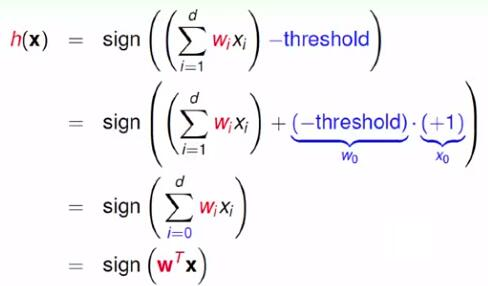

这里为x引入第0维度的数据x0=+1，引入对应的权重w0=threshold。从而将式子表示为对两个向量的点乘的结果进行取符号操作。

实际上h(x)可表示为空间中的一个超平面，在其一边分类为+1，在其另外一边分类为-1。以下图为例，在R2上的h(x)就是一边直线，其将二维平面划分为两个部分。

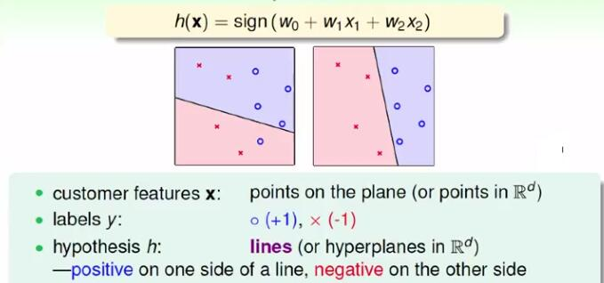

看到这里，可以说perceptrons是一种**线性的**二分类器。

## 2.PLA: perceptron learning algorithm

从1中知道了perceptrons这种hypothesis set了，那么我们该如何确定一个最佳的perceptron呢？也即是说**如何确定最佳的w**?（threshold这个参数应是人为先确定好的）

回想上一节的内容，我们需要实现的就是**让g几乎接近f的效果**，也即是：

**对于给定的数据集D，我们要尽量实现对于每个xn，都有g(xn)=f(xn)=yn。**

而空间中的超平面是有无数多个的，也即是说：我们不可能通过遍历来找到最佳的w。因此，结合数据集，可以通过下面的idea来找到最佳的w：

首先从一个随意设置的g0（或者说w0）开始，不断地用D中的数据集来矫正g0(w0),直到所有数据都被划分到对应的一边上。（这个说法有点不严谨，仅供理解）

该算法可表示如下：

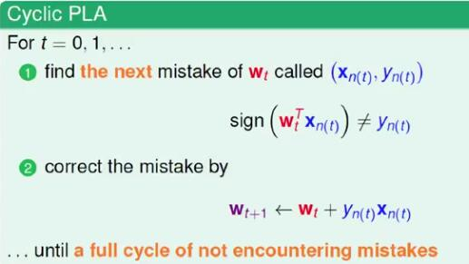

其中，第一步中判断分类错误的情况可分为如下两种：

-> +1 类被划分为 -1类：也即是超平面法向量与x的夹角为钝角（本应是锐角）

矫正方法：用w+x（向量加法）替换w

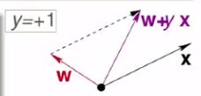

-> -1 类被划分为 +1类：也即是超平面法向量与x的夹角为锐角（本应是钝角）

矫正方法：用w-x（向量加法）替换w

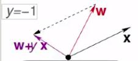

观察以上的这两种矫正方法，发现可统一写成：用w+y*x替换w。

该算法运行直到没有分类错误时才结束，其中常见的得到next mistake的方法可以是随机挑选，也可以是循环遍历的。

下面给出算法运行的一个实例，经过了10次更新后所有点的分类都没有错误。

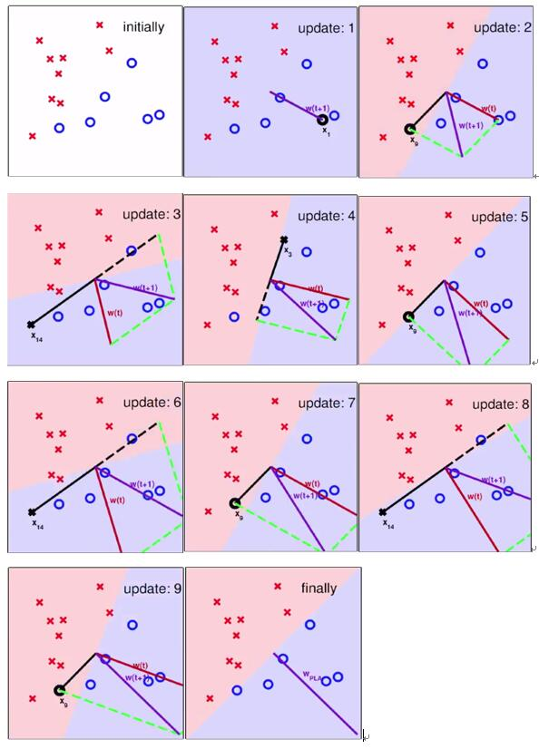

注意：update 1理解起来可能有点奇怪，这是因为初始化时w0都为0，因此xn(1)这个点分类错误，更新w1为w0+y*xn(1)，因此图片中看起来w(t+1)会和xn(1)在同个方向上。

## 3.PLA什么时候会停下来

上面讲到，当分类没有错误时，PLA才会停止算法运行。因此，PLA要能停下来的条件就是：**数据集是可用一个超平面划分为两个部分的，即是线性可分的。**

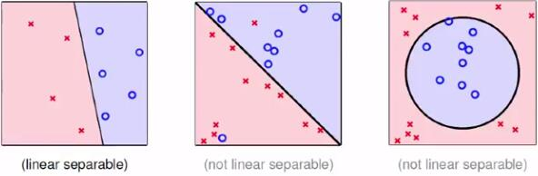

PLA会停下来 等价于 在线性可分的条件下，PLA能找到一条可以将数据集无错地分成两类的超平面，也即是符合target function f 标准"的w，我们将其命名为wf，则有：

那么对于任意的xn，有：

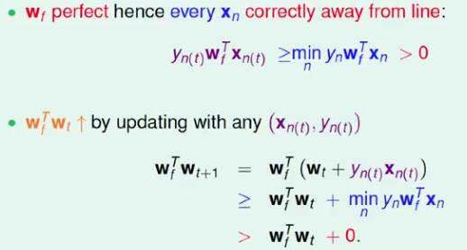

注：这里用wf与w(t+1)的内积的大小来判断两者的接近程度。

可以看到wf与w(t+1)的内积随着t的增长会越来越大，但若要证明两者是越来越接近的，就需要证明wt（或者w(t+1)）本身模长的增长d的影响是否可以忽略。

由于算法中是遇到分类错误点才进行更新的，因此对分类错误点，有：

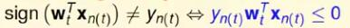

则有：

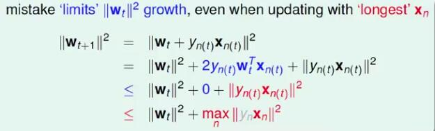

因此由于错误点的存在，wt的增长是缓慢的。

结合上面的推论，可得如下结论：

从w0=0开始,经过T次的错误矫正，有：

因此T越大，cos<wf,wt>越大，由于cos<wf,wt>有上界1，因此wt最终会解决wf，因此PLA会停止。

----
思考题：假设： 并且，求T的上界。

解：

首先，根据上面的推导，可得知如下的关系式：

则:

又因：

根据该递推式，可得：

则：

又因：

则：

即：

则可得：

即T的上界为：

----

## 4.应用PLA在非线性可分的数据集上

对于非线性可分的数据集，我们无法找到一个可完全将数据集完全分离的超平面，因此只能推而求其次，找到一个能最接近f的g,也即是求下列优化问题：

这个问题已被证明为NP-hard的。

这里给出一种解法——pocket algorithm：

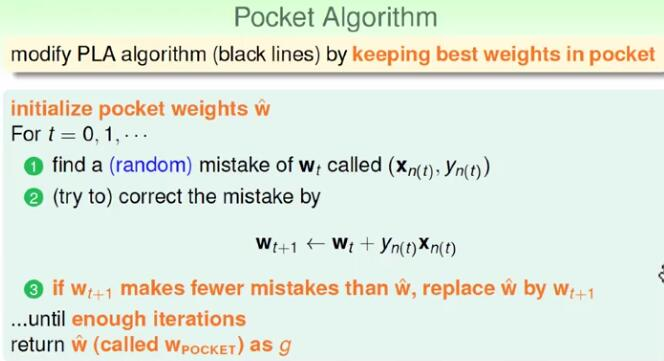
