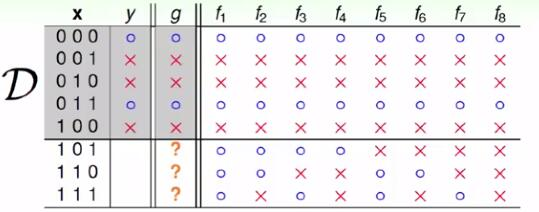
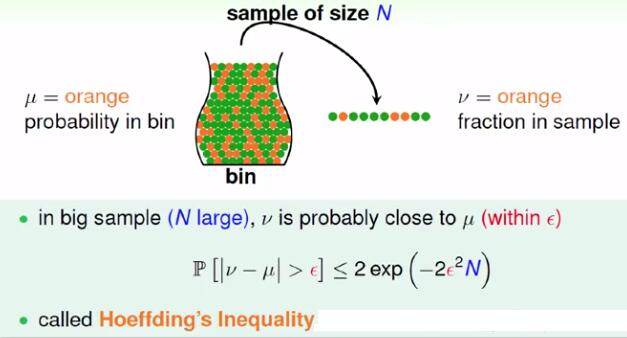

# class 4

## 1.learning is impossible

这里讲的是这样的一件事情，如下图，x是3位二进制输入，其对应的输入为y（即标签数据），模型学习到的“规则”为g，而实际的目标函数f有可能的是f1-f8这8个中的任意一个，因此在数据集内g与f相符，但是在数据集D外却不一定。

因此，在没有其他信息的前提下，仅仅是用数据集D训练得到的模型可能在D之外的数据没有任何预测作用，而这恰好是learning的目的。

## 2.probability to the rescue

很明显，要想让通过数据集D训练出来的模型能在数据D之外使用，我们需要确保数据集D相对未来将会遇到的所有数据（数据整体）是占有相当大的一部分的。很自然的，数据集D是数据整体的抽样，所以我们需要引入与概率相关的知识。

-----

Hoeffding不等式：

当抽样数N较大时，可以说：

 是大概正确的 (probably approximately corret, PAC)，即是此时样本可以用来大概地描述整体。

-----

