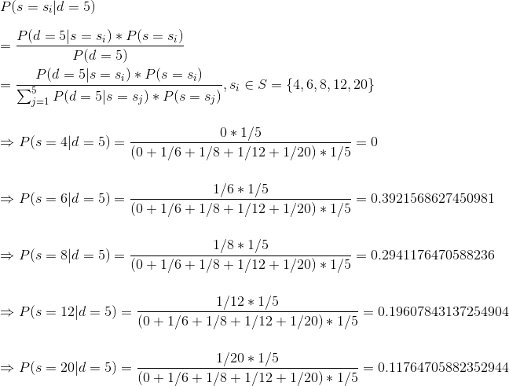
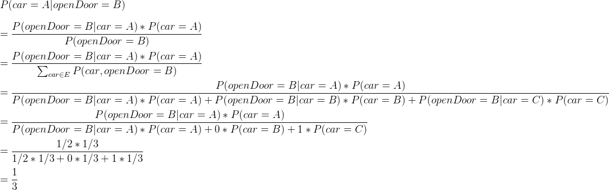
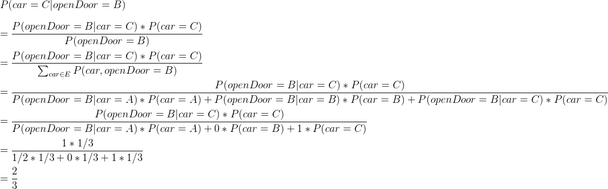

<!-- TOC -->

- [leture 1 - Intro](#leture-1---intro)
- [leture 2 - Foundation of Mathematics](#leture-2---foundation-of-mathematics)
    - [概率](#概率)
    - [番外](#番外)

<!-- /TOC -->
# leture 1 - Intro

leture 1中基本都是介绍性的东西，了解即可，相关重要的知识点后续也会讲到，故这里不再列举。

# leture 2 - Foundation of Mathematics

## 概率

乘法法则：


加法法则：


测试题1

求的值：

A.1

B.P(X=boy)

C.None of the above

正确答案：A。

测试题2

假设有一盒骰子，里面有4面的（点数为1、2、3、4），6面的、8面的、12面的、20面的均匀骰子各1个。如果我随机从盒子中选一个骰子，投掷它得到了点数5。那么我选中的骰子为4面、6面、8面、12面、20面的概率各是多少？（要求用上面提出的两条概率公式求解）

正确答案：

用变量代表骰子，用代表点数。

即求：

则有：


 
测试题3

Suppose there are k types of fruits, and that each new one collected is, **independent of previous ones**, a type j fruit with probability , and . Find the probability that the n-th fruit collected is a different type than any of the preceding n-1.

正确答案：

设置如下变量：

N: the event that that the n-th fruit collected is a different type than any of the preceding n-1.

: the n-th fruit is type j。

则：


测试题4（难）

如果你参加“来做个交易”节目，其规则是这样的：主持人向你示意三个关闭的大门，然后告诉你每个门后都有一个奖品：一个奖品是一辆车，另外两个是像花生酱和面包这样不值钱的奖品。奖品随机配置，且主持人知道每个奖品在哪。游戏的目的是要猜哪个门后有车。如果你猜对了就可以拿走。你先挑选一扇门，我们姑且称之为 A，其他两个称为 B 和 C。在打开你选中的门 A 之前，为了增加悬念，主持人会打开 B或 C 中一个没有车的门来增加悬念（如果汽车实际上就是在门A 后面，那么主持人打开门 B 或门 C 都是安全的，此时他可以随意选择一个；如果汽车在门 B 后面，那么他会打开门 C）。然后主持人给你一个选择：坚持最初的选择还是换到剩下的未打开的门上。两个选择能够拿走汽车的概率分别是多少？

正确答案：

解法一：单独的分析，简单粗暴，没有用到公式，信服力没有公式强。

首先，只有一扇门背后是有车的，因此最开始选中的概率是1/3（也即是说选错的概率是2/3）。如果保持最初的选择，那么能拿走汽车的概率就是1/3了，相反，如果换到剩下的未打开的门上，那么概率就是1-1/3=2/3。

解法二：有些类似解法一的图形化解释，信服力同解法一。

第一次选的就是A，假设车是在A后面。那么有：

```
           *
       /   |  \  <----第一次选择
      (A)  B   C
      / \  |   | <---第二次选择：换还是不换
     B   C C   B 
       ^    ^---^------对于这两个，由于车在A后面，因此主持人肯定是选择除了A之后的两
       |               扇门，同时也不可能打开“你”第一次选择的那扇门（不然就是傻的了）。
       |               在这两种情况下，换就一定可以拿到汽车，因此在这里换了之后能拿到
       |               汽车的概率是1/3+1/3=2/3（这个概率是相对于全局的）。
       |
对于另外的一种情况，主持人可以随便选择B或者C，这时只有不换可以拿到汽车，因此在这里可拿到
汽车的概率为1/3（这个概率也是是相对于全局的）

因此总的来说：
坚持最初的选择能够拿走汽车的概率是：1/3+0=1/3
还是换到剩下的未打开的门能够拿走汽车的概率:0+2/3=2/3

```       
实际上，这也是一种枚举的办法。
               
解法三：使用这节leture学到的概率公式进行推导，信服力强。

假设主持人在“你”选了A之后没有打开B或者C来增加悬念。那么凭着“你”的主观置信度（也就是根据经验判断得到的先验概率），“你”能拿到汽车的概率就是1/3。

好了，现在主持人来了增加悬念这一招，那么这时你脑海中关于能拿到汽车的概率（就是前面的先验概率）就要根据“你”从主持人的表现中所观察到的数据（或事件、也即是后验事实）而发生改变了。

现在来设置一些变量：

-   ：表示主持人打开的门（A或B或C）

-   ：表示（A或B或C）哪扇门后有车

假设“你”首先选择的是A，主持人打开的门是B。

则有：



这里有三个地方要解释一下：
- P(openDoor=B|car=A)=1/2：A中有车，那么主持人可打开B或者C，所以这里就认为主持人选择B的概率是1/2。
- P(openDoor=B|car=B)=0：B中有车，主持人自然不会选择打开B（所以概率为0）。
- P(openDoor=B|car=C)=1：C中有车，“你”又选了A，那么主持人肯定选择B（所以概率为1）。

所以，从P(car=A|openDoor=B)=1/3可看出，不换可拿到汽车的概率就为1/3，那么取个反，换了之后可拿到汽车的概率就是2/3啦，不信？那下面再证明一下。



推理成立！

---

## 番外

除此之外，本次课还介绍了协方差、相关系数、欧几里得距离等概念，这里给出自己针对这三个概念写出的三个函数，并将运算结果与numpy库中的函数进行对比，最终可看到结果一致，函数实现没有错误。

ps：这三个函数虽然看起来简单，但是学了公式要会用代码实现（这里不贴公式了，wiki一下马上有）并且在实现的过程中要尽量keep it simple（能用一行代码搞定的决不用两行），这还是可以锻炼到的~

```python
import numpy as np
def getCov(X, Y):
    '''协方差：cov(X,Y) = E[XY] - E[X]E[Y]'''
    return (X * Y).mean() - X.mean() * Y.mean()

def getCorrcoef(X, Y):
    '''相关系数：corrcoef(X,Y) = cov(X,Y)/sqrt(var(X)*var(Y))'''
    return getCov(X, Y)/(np.sqrt(X.var()*Y.var()))

def getEucliDis(X, Y, n=2):
    '''欧几里得距离'''
    return max(abs(X-Y)) if n == 'inf' else sum(abs(X-Y)**n)**(1./n)

#每行代表一个变量
a = np.array([[2, 9, 7, 5], 
              [19, 6, 15, 12]])
X, Y = a[0], a[1]
print('\n--计算协方差--')
print('自行实现的函数的运算结果： ', getCov(X, Y))
print('使用numpy库函数的运算结果：', np.cov(a, bias=True)[0][1]) #bias为True表示无偏估计

print('\n--计算相关系数--')
print('自行实现的函数的运算结果： ', getCorrcoef(X, Y))
print('使用numpy库函数的运算结果：', np.corrcoef(a)[0][1])

print('\n--计算欧几里得距离（n=2）--')
print('自行实现的函数的运算结果： ', getEucliDis(X, Y, 2))
print('使用numpy库函数的运算结果：', np.linalg.norm(X-Y,2))

print('\n--计算欧几里得距离（n=inf）--')
print('自行实现的函数的运算结果： ', getEucliDis(X, Y, 'inf'))
print('使用numpy库函数的运算结果：', np.linalg.norm(X-Y,np.inf))

```
输出结果：

```
--计算协方差--
自行实现的函数的运算结果：  -10.5
使用numpy库函数的运算结果： -10.5

--计算相关系数--
自行实现的函数的运算结果：  -0.855984976722
使用numpy库函数的运算结果： -0.855984976722

--计算欧几里得距离（n=2）--
自行实现的函数的运算结果：  20.2731349327
使用numpy库函数的运算结果： 20.2731349327

--计算欧几里得距离（n=inf）--
自行实现的函数的运算结果：  17
使用numpy库函数的运算结果： 17.0

```


