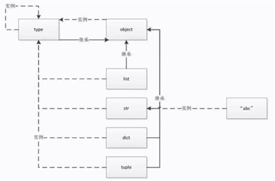

## type、object和class之间的关系

总体逻辑：type --生成--> class --生成--> object

例子1-type内置类型：

```
In[2]: a = 1
In[3]: type(a)
Out[3]: int
In[4]: type(int)
Out[4]: type
In[5]: type(type)
Out[5]: type
```

例子2-type自定义类型：

```
In[6]: class Student:
  ...:     pass
  ...: stu = Student()
In[7]: type(stu), type(Student)
Out[7]: (__main__.Student, type)
```

例子3-关于type和object的深入探讨

在python中一切皆为对象，那么type的基类又是什么呢？

```
In[8]: type.__bases__
Out[8]: (object,)
```

那么object的类型以及基类又是什么呢？

```
In[9]: type(object)
Out[9]: type
In[10]: object.__bases__
Out[10]: ()
```
这里就发现一个很奇怪的点了，type的基类是object，而object的类型又是type，感觉出现了一个循环。

可看下图解决疑惑：



- 虚线代表实例，实线代表继承关系
- python中的一切都是对象，都是type的对象，一切对象都是由type生成的
- python中一切类最终都继承于object

## python中的内置类型

对象的三个特征：身份（通过id函数可以拿到对象的id）、类型、值

None全局只有一个：
```
In[12]: a = None
In[13]: b = None
In[14]: id(a), id(b), id(None)
Out[14]: (140715032102928, 140715032102928, 140715032102928)
```

数值：int float complex bool

迭代：range str ...

映射：dict

集合：set frozenset
