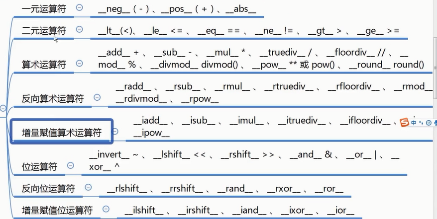

## 魔法函数

魔法函数：诸如`__getitem__`等python预先定义好的以双下划线开头和结尾的函数，我们可以通过实现魔法函数来为类添加新特性。

举例：

- 类中定义__getitem__后类就变成了一个序列，因此可以对它进行切片操作。

- 在类中使用__len__后，可以对它进行求长度

### 非数学运算魔法函数

`__str__` 和 `__repr__` 的区别

- `__repr__`和`__str__`这两个方法都是用于显示的`__str__`是面向用户的，而`__repr__`面向程序员。

- `__str__` 是在字符串格式化的时候调用，比如print(obj)会调用对象内部的`__str__`方法

- `__repr__`用于所有其他的环境中：用于交互模式下提示回应以及repr函数，在交互模式下直接输入对象名，会出现对象相关的描述信息

### 数学运算魔法函数

