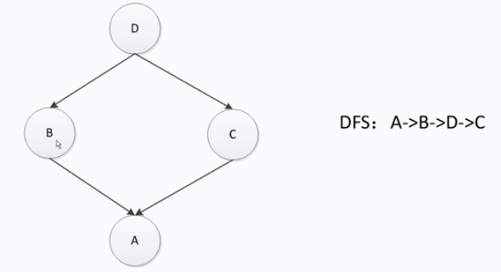
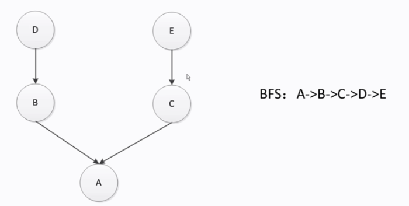

## 鸭子类型和多态

鸭子类型：当看到一只鸟走起来像鸭子，游泳起来像鸭子，叫起来也像鸭子，那么这只鸟可以被称为鸭子。

python中的多态：只要多个类中有相同名字以及相同参数的函数时，就可视为这多个类属于同一类。


```python
class Cat:
    def say(self):
        print("i am a %s" % "cat")

class Dog:
    def say(self):
        print("i am a %s" % "dog")

class Duck:
    def say(self):
        print("i am a %s" % "duck")

animals = [Cat(), Dog(), Duck()]
for animal in animals:
    animal.say()
```

输出：

```
i am a cat
i am a dog
i am a duck
```

## isinstance与type的区别

```
In[11]: class A:
   ...:     pass
   ...: class B(A):
   ...:     pass
   ...: isinstance(B(), B), isinstance(B(), A)
Out[11]: (True, True)
In[12]: type(B()) == B, type(B()) == A 
Out[12]: (True, False)
```

相对来说，isinstance可以判断是否属于某个基类，type只能判断生成该对象时的唯一的那个类

## 类变量和实例变量

```
In[2]: class A:
  ...:     aa = 1
  ...:     def __init__(self, a):
  ...:         self.a = a
  ...: a = A(5)
In[3]: print(a.a, a.aa) # 第一次调用aa:因为实例a没有aa这个变量，所以直接输出类的变量aa
5 1
In[4]: a.aa = 100 # 这里对实例a的aa赋值后，就相当于为实例a新增了一个变量aa了，这个aa不是类变量aa
  ...: print(A.aa, a.aa) # 可见类变量aa没有被修改
1 100
```

## 类和实例的查找顺序-MRO查找

MRO: Method Resolution Order

若是DFS-MRO，对于菱形继承会有问题，如下图，若C中重载了D中的一个方法，当从A出发去查找这个方法时，假设方法不在B中，那么最终找到的是D中的方法，但是实际上应该返回的是C中的方法。



若是BFS-RMO，对于下图例子也有问题，若D和C中都有同一个方法，B中没有，当BFS遍历到B时发现B中没有该方法就接着遍历C，但是实际上应该是遍历到B的时候应该接着把B的父类也遍历一边（此时应该把B和D看成一个整体），正确的结果应该是返回D中的方法而不是C中的。



python实现C3-MRO

通过print类名的`__mro__`方法可打印出MRO查找顺序


## 类方法、静态方法、实例方法

举例类如下：

```python
class Date:
    def __init__(self, y, m, d):
        self.year, self.month, self.day = y, m, d

    def change_to_next_year(self):
        """实例方法"""
        self.year += 1

    @staticmethod
    def parse_from_string(date_str):
        """静态方法"""
        y, m, d = tuple(map(int, date_str.split("-")))
        return Date(y, m, d)

    @classmethod
    def parse_from_string2(cls, date_str):
        """类方法"""
        y, m, d = tuple(map(int, date_str.split("-")))
        return cls(y, m, d)

    @staticmethod
    def is_valid_year(date_str):
        """静态方法"""
        y, m, d = tuple(map(int, date_str.split("-")))
        return True if y > 0 else False

    def __str__(self):
        return "year: %4d month:%2d day:%2d" % (self.year, self.month, self.day)

```

这里有点需要注意的是，parse_from_string和parse_from_string2实现的都是同样的功能，两者的区别就在于：后者在调用的时候python还会把类的名字也一并作为参数传过去，这样做的好处是一旦我们下次想改类的名字，就不用修改这个方法的代码了，相比之下，前者是硬编码的，已经把Date写死在代码里，这样显得不够优雅。

但是静态方法也还是有用武之地的，比如is_valid_year这个函数，它不需要类名作为参数传入，因此用静态方法来实现再合适不过了。

测试结果如下：

```
In[3]: date = Date(2018, 12, 10)
  ...: print(date)
  ...: 
year: 2018 month:12 day:10
In[4]: date.change_to_next_year()
  ...: print(date)
  ...: 
year: 2019 month:12 day:10
In[5]: date = Date.parse_from_string("2018-12-10")
  ...: print(date)
  ...: 
year: 2018 month:12 day:10
In[6]: date = Date.parse_from_string2("2018-12-10")
  ...: print(date)
  ...: 
year: 2018 month:12 day:10
In[7]: Date.is_valid_year("2018-12-10")
Out[7]: Tru
```

## 数据封装和私有属性

以双下划线开头命名的变量
- => 相当于java的private变量
- => 无法直接访问，比如对于变量__a，类名为C，则可通过_C__a进行

## python对象的自省机制

自省：通过一定的机制查询到对象的内部结构


`__dict__`：保存类的变量（不包含父类的变量）
```
In[9]: date.__dict__
Out[9]: {'year': 2018, 'month': 12, 'day': 10}
In[10]: date.__dict__["year"] = 5415
In[11]: date.__dict__
Out[11]: {'year': 5415, 'month': 12, 'day': 10}
In[12]: print(date)
year: 5415 month:12 day:10
```

dir函数：获取类中所有对象(包含从父类继承的变量或函数)

```

In[13]: dir(date)
Out[13]: 
['__class__',
 '__delattr__',
 '__dict__',
 '__dir__',
 '__doc__',
 '__eq__',
 '__format__',
 '__ge__',
 '__getattribute__',
 '__gt__',
 '__hash__',
 '__init__',
 '__init_subclass__',
 '__le__',
 '__lt__',
 '__module__',
 '__ne__',
 '__new__',
 '__reduce__',
 '__reduce_ex__',
 '__repr__',
 '__setattr__',
 '__sizeof__',
 '__str__',
 '__subclasshook__',
 '__weakref__',
 'change_to_next_year',
 'day',
 'is_valid_year',
 'month',
 'parse_from_string',
 'parse_from_string2',
 'year']

```

## super函数

super函数不一定调用的是父类的函数，而是调用MRO这个顺序里面的下一个类的函数。举例：

```python
class A:
    def __init__(self):
        print("A")


class B(A):
    def __init__(self):
        print("B")
        super().__init__()


class C(A):
    def __init__(self):
        print("C")
        super().__init__()


class D(B, C):
    def __init__(self):
        print("D")
        super().__init__()
        
d = D()
print(D.mro())
```

输出为：

```
D
B
C
A
[<class '__main__.D'>, <class '__main__.B'>, <class '__main__.C'>, <class '__main__.A'>, <class 'object'>]
```

## mixin继承案例

python支持多继承，但是如果设计不好可能会带来问题，所以一般不建议使用多继承，而是使用mixin方式。

mixin模式特点：
- 类功能单一，比如一个类只实现一个函数
- 不和基类关联，可以和任意基类组合，基类可以不和mixin关联就能初始化成功
- 在mixin中不要使用super这种用法（super的调用顺序涉及到MRO，可能会出现意料外的情况）


## with语句+上下文管理器协议

示例代码：

```python
class Sample:
    def __enter__(self):
        print("enter")
        return self

    def __exit__(self, exc_type, exc_val, exc_tb):
        print("exit")

    def do_something(self):
        print("do something")


with Sample() as sample:
    sample.do_something()

```

输出：

```
enter
do something
exit
```
这里在类中实现了`__enter__`以及`__exit__`两个魔法函数来支持python的上下文管理器协议，然后使用with语句就可以自动调用`__enter__`以及`__exit__`两个魔法函数了，其中前者可以负责获取资源，后者可以负责释放资源，相比try-except-finally的用法，这样的写法更加精简。


## contextlib简化上下文管理器

这里使用contextlib来代替实现`__enter__`以及`__exit__`两个魔法函数的方法，实现的效果和前者一样，只是说后者相对来说使用了生成器所以比较复杂，这个要谨慎使用。


```python
import contextlib


@contextlib.contextmanager
def sample():
    #### 这部分相当于 __enter__ 函数的内容
    print("enter")
    ##################################
    yield {}
    ##### 这部分相当于 __exit__ 函数的内容
    print("exit")
    ##################################


with sample() as sample:
    print("do something")

```
输出：

```
enter
do something
exit
```


