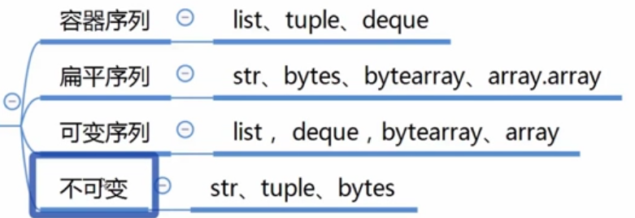

## 序列类型的分类



## 实现可切片的对象

举例：实现一个组类Group，要求可以切片和随机索引，并且切片或随机索引后返回的对象依旧是Group类对象，而切片或随机索引后只是员工数据发生了变化，其他不变。

```python
from numbers import Integral


class Group:
    def __init__(self, group_name, company_name, staffs):
        self.group_name = group_name
        self.company_name = company_name
        self.staffs = staffs

    def __getitem__(self, item):
        """支持切片和随机索引"""
        cls = type(self)
        if isinstance(item, slice):
            # 若是切片
            return cls(group_name=self.group_name, company_name=self.company_name, staffs=staffs[item])
        elif isinstance(item, Integral):
            # 若是随机索引
            return cls(group_name=self.group_name, company_name=self.company_name, staffs=[staffs[int(item)]])

    def __len__(self):
        """支持获取长度"""
        return len(self.staffs)

    def __reversed__(self):
        """支持反转"""
        self.staffs.reverse()

    def __contains__(self, item):
        """支持in判断"""
        return True if item in self.staffs else False


staffs = ["bob", "alice", "john", "mike", "sylvia"]
group = Group(group_name="py-coders", company_name="test", staffs=staffs)
subgroup1 = group[1:3]
print(isinstance(subgroup1, Group), subgroup1, subgroup1.staffs, len(subgroup1))
subgroup2 = group[4]
print(isinstance(subgroup1, Group), subgroup2, subgroup2.staffs, len((subgroup2)))

```

输出：

```
True <__main__.Group object at 0x000001C6A3B35518> ['alice', 'john'] 2
True <__main__.Group object at 0x000001C6A3B35A58> ['sylvia'] 1
```

## bisect模块-二分查找or二分插入

```python
import bisect

a = []
bisect.insort(a, 1)
bisect.insort(a, 4)
bisect.insort(a, 5)
bisect.insort(a, 2)
bisect.insort(a, 8)
print(a)

```

输出：

```
[1, 2, 4, 5, 8]
```

## 列表表达式、生成器表达式

两者在语法上的区别就是：前者是中括号，后者是圆括号

```python
a = [i for i in range(15) if i % 2 == 0]
b = (i for i in range(15) if i % 2 == 0)
print(a)
print(b)
print(list(b))
```

输出：

```
[0, 2, 4, 6, 8, 10, 12, 14]
<generator object <genexpr> at 0x000001C7059C3A98>
[0, 2, 4, 6, 8, 10, 12, 14]
```


