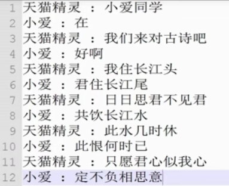

## python中的GIL

GIL:global interpreter lock，使得同一时刻只有一个线程在一个CPU上执行字节码，无法将多个线程映射到多个CPU上。

GIL会根据执行的字节码行数以及时间片释放，在遇到IO操作时主动释放。

## 多线程编程

以爬虫为例子，get_detail_url获取文章列表url，get_detail_html获取具体单篇文章的HTML。

实现方式一：

```python
from threading import Thread
import time


def get_detail_html(url):
    """爬取文章详情页"""
    print("get detail html started")
    time.sleep(2)
    print("get detail html end")


def get_detail_url(url):
    """爬取文章列表页"""
    print("get detail url started")
    time.sleep(3)
    print("get detail url end")


t1 = Thread(target=get_detail_html, args=("",))
t2 = Thread(target=get_detail_url, args=("",))
start_time = time.time()
t1.start()
t2.start()
t1.join()
t2.join()
print("total time: %s" % (time.time() - start_time))
```

输出：

```
get detail html started
get detail url started
get detail html end
get detail url end
total time: 3.002349615097046
```

这种实现方式适用于简单的逻辑或者是需要线程池相关的操作的情况。


实现方式二：

```python
from threading import Thread
import time


class GetDetailHtml(Thread):
    def __init__(self, name):
        super().__init__(name=name)

    def run(self):
        print(self.name + " started")
        time.sleep(2)
        print(self.name + " end")


class GetDetailUrl(Thread):
    def __init__(self, name):
        super().__init__(name=name)

    def run(self):
        print(self.name + " started")
        time.sleep(3)
        print(self.name + " end")


t1 = GetDetailHtml("get detail html")
t2 = GetDetailUrl("get detail url")
start_time = time.time()
t1.start()
t2.start()
t1.join()
t2.join()
print("total time: %s" % (time.time() - start_time))
```
输出：
```
get detail html started
get detail url started
get detail html end
get detail url end
total time: 3.0011937618255615
```

这种方式相对来说比较模块化，用得比较多。

## 线程间通信-共享变量和Queue

```python
from threading import Thread
from queue import Queue
import time


def get_detail_html(queue):
    """爬取文章详情页"""
    while True:
        url = queue.get()
        print("get detail html started for %s" % url)
        time.sleep(2)
        print("get detail html end")


def get_detail_url(queue):
    """爬取文章列表页"""
    while True:
        print("get detail url started")
        time.sleep(3)
        for i in range(20):
            # 假设文章列表有20项
            queue.push("http://www.xxx.com/{id}".format(id=i))
        print("get detail url end")


detail_url_queue = Queue(maxsize=1000)  # 设置maxsize可以防止内存溢出
t1 = Thread(target=get_detail_html, args=(detail_url_queue,))
t2 = Thread(target=get_detail_url, args=(detail_url_queue,))
start_time = time.time()
t1.start()
t2.start()
detail_url_queue.join() # 调用task_done函数后join才不会阻塞主线程
print("total time: %s" % (time.time() - start_time))
```

重点就在于push和get这两个会阻塞的函数上。

## 线程同步-Lock、RLock

用锁可以实现线程同步，但是也会带来问题：
- 影响性能
- 可能会带来死锁，比如：A线程拥有a资源申请b资源，而B线程拥有b资源申请a资源

Lock例子：
```python
from threading import Thread, Lock

lock = Lock()
total = 0


def add():
    global total, lock
    for i in range(1000):
        lock.acquire()
        total += 1
        lock.release()


def desc():
    global total, lock
    for i in range(1000):
        lock.acquire()
        total -= 1
        lock.release()


t1, t2 = Thread(target=add), Thread(target=desc)
t1.start()
t2.start()
t1.join()
t2.join()
print(total)
```

Lock可能有一个问题：如上面的例子，如果连续在同一个线程中调用多次`lock.acquire()`，那么将会导致死锁，因此便引入了RLock。

RLock：在同一个线程里面，可以连续调用多次acquire，但是一定要注意acquire的调用次数和release的调用次数应相等。

```python
from threading import Thread, Lock, RLock

lock = RLock()
total = 0


def add():
    global total, lock
    for i in range(1000):
        lock.acquire()
        lock.acquire() # 区别一
        total += 1
        lock.release()
        lock.release() # 区别二


def desc():
    global total, lock
    for i in range(1000):
        lock.acquire()
        total -= 1
        lock.release()


t1, t2 = Thread(target=add), Thread(target=desc)
t1.start()
t2.start()
t1.join()
t2.join()
print(total)
```

## 线程同步-condition 使用以及源码分析

实现目标：使用condition实现如下对话



实现代码：

```python
from threading import Thread, Condition


class TianMao(Thread):
    def __init__(self, cond, lines):
        super().__init__(name="天猫精灵")
        self.cond = cond
        self.lines = lines

    def run(self):
        with self.cond:
            for line in self.lines:
                print("%s : %s" % (self.name, line))
                self.cond.notify()
                self.cond.wait()


class XiaoAi(Thread):
    def __init__(self, cond, lines):
        super().__init__(name="小爱同学")
        self.cond = cond
        self.lines = lines

    def run(self):
        with self.cond:
            for line in self.lines:
                self.cond.wait()
                print("%s : %s" % (self.name, line))
                self.cond.notify()


lines = ["小爱同学", "在", "我们来对古诗吧", "好啊",
         "我住在长江头", "君住长江尾", "日日思君不见君", "共饮长江水",
         "此水几时休", "此恨何时已", "只愿君心似我心", "定不负相思意"]

cond = Condition()
tian_mao = TianMao(cond, lines[::2])
xiao_ai = XiaoAi(cond, lines[1::2])

# 这里顺序非常重要，如果是先tian_mao.start()，那么xiao_ai的wait方法就不能收到tian_mao的notify信息了
# 因为此时xiao_ai还没来得及start而tian_mao已经先notify了，而wait只能由notify来解除阻塞状态
xiao_ai.start()
tian_mao.start()
```
输出：
```
天猫精灵 : 小爱同学
小爱同学 : 在
天猫精灵 : 我们来对古诗吧
小爱同学 : 好啊
天猫精灵 : 我住在长江头
小爱同学 : 君住长江尾
天猫精灵 : 日日思君不见君
小爱同学 : 共饮长江水
天猫精灵 : 此水几时休
小爱同学 : 此恨何时已
天猫精灵 : 只愿君心似我心
小爱同学 : 定不负相思意
```

这里的with语句：

```python
from threading import Condition
cond = Condition()

with cond:
    pass # do something

```
等价于：
```python
from threading import Condition
cond = Condition()

cond.acquire()
pass # do something
cond.release()
```

相对来说，with语句更加方便。

需要注意的是：在调用 with cond 之后（获取锁之后）才能调用 wait或者notify方法

##  线程同步-Semaphore使用以及源码分析

Semaphore:用于控制进入数量的锁

举例：在爬虫项目中，经常要限制并发的数目以免被禁IP

代码：

```python
from threading import Semaphore, Thread
import time


class HtmlSpider(Thread):
    def __init__(self, url, sem):
        super().__init__()
        self.url = url
        self.sem = sem

    def run(self):
        time.sleep(2)
        print("got html text success")
        self.sem.release()


class UrlProducer(Thread):
    def __init__(self, sem):
        super().__init__()
        self.sem = sem

    def run(self):
        for i in range(20):
            self.sem.acquire()
            html_thread = HtmlSpider("https://baidu.com/{}".format(i), self.sem)
            html_thread.start()


sem = Semaphore(3)
url_producer = UrlProducer(sem)
url_producer.start()
```

实现效果：每次只爬取固定个数（如3个）的页面（命令行每隔固定时间输出3条信息）

## ThreadPoolExecutor线程池

通过future对象，主线程可以获取某个子线程的状态或者某一个任务的状态，以及返回值，当某一个子线程完成时主线程可以立即知道。

另外，futures可以让多线程和多进程编码接口一致。

```python
from concurrent.futures import ThreadPoolExecutor
import time


def get_html(second):
    time.sleep(second)
    print("got html text success for %s second" % second)
    return second


executor = ThreadPoolExecutor(max_workers=2)
task1 = executor.submit(get_html, 3)
task2 = executor.submit(get_html, 2)

print(task1.done(), task1.result())
print(task1.cancel())
time.sleep(3)
print(task1.done(), task1.result())
print(task2.done(), task2.result())


```

输出：


```
got html text success for 2 second
got html text success for 3 second
False 3
False
True 3
True 2
```

说明：
- submit()：提交任务，返回任务的句柄
- done()：判断当前任务是否完成
- cancel()：取消未执行的任务，当任务完成时或正在执行时取消失败
- result()：执行的任务的结果

另外，还可以使用as_completed获取已经完成的task的结果。

```python
from concurrent.futures import ThreadPoolExecutor, as_completed
import time


def get_html(second):
    time.sleep(second)
    print("got html text success for %s second" % second)
    return second


executor = ThreadPoolExecutor(max_workers=2)
urls = [3, 2, 4]
all_tasks = [executor.submit(get_html, url) for url in urls]
# 获取已经成功的task的结果
for future in as_completed(all_tasks):
    data = future.result()
    print("got page which costs %s second success" % data)

```

输出：

```
got html text success for 2 second
got page which costs 2 second success
got html text success for 3 second
got page which costs 3 second success
got html text success for 4 second
got page which costs 4 second success
```

也可以使用map函数来获取已经完成的task的结果。

```python
from concurrent.futures import ThreadPoolExecutor, as_completed
import time


def get_html(second):
    time.sleep(second)
    print("got html text success for %s second" % second)
    return second


executor = ThreadPoolExecutor(max_workers=2)
urls = [3, 2, 4]
for data in executor.map(get_html, urls):
    print("got page which costs %s second success" % data)

```

输出：

```
got html text success for 2 second
got html text success for 3 second
got page which costs 3 second success
got page which costs 2 second success
got html text success for 4 second
got page which costs 4 second success
```

对比两种方法，前者是一旦有任务完成就在for循环中输出，后者是严格按照传入的参数(3 2 4)的顺序依次输出的。

## 多线程和多进程对比

由于GIL的存在，python中多线程无法充分发挥CPU的计算资源，因此python引入了多进程编程。

对于计算密集型，用多进程编程；对于IO密集型，用多线程编程（其实对于IO密集型来说，使用多进程编程也行，但是相对多线程来说，后者进程切换的开销相对较大）。

### 计算密集型举例测试

```python
from concurrent.futures import ThreadPoolExecutor, ProcessPoolExecutor, as_completed
import time


def fib(n):
    return 1 if n <= 2 else fib(n - 1) + fib(n - 2)


def test(thread_or_process_pool_executor):
    # 这里使用了with语句，是因为对象里面实现了__enter__和__exit__这两个魔法函数，可以借鉴学习下
    with thread_or_process_pool_executor(3) as executor:
        all_tasks = [executor.submit(fib, num) for num in range(25, 40)]
        start_time = time.time()
        for future in as_completed(all_tasks):
            print("execute result: %s" % future.result())
        print("total time: %s\n" % (time.time() - start_time))


if __name__ == "__main__":
    print("test ThreadPoolExecutor")
    test(ThreadPoolExecutor)
    print("test ProcessPoolExecutor")
    test(ProcessPoolExecutor)

```

输出：

```
test ThreadPoolExecutor
execute result: 75025
execute result: 121393
execute result: 196418
execute result: 317811
execute result: 514229
execute result: 832040
execute result: 1346269
execute result: 2178309
execute result: 3524578
execute result: 5702887
execute result: 9227465
execute result: 14930352
execute result: 24157817
execute result: 39088169
execute result: 63245986
total time: 41.20642280578613

test ProcessPoolExecutor
execute result: 75025
execute result: 121393
execute result: 196418
execute result: 317811
execute result: 514229
execute result: 832040
execute result: 1346269
execute result: 2178309
execute result: 3524578
execute result: 5702887
execute result: 9227465
execute result: 14930352
execute result: 24157817
execute result: 39088169
execute result: 63245986
total time: 21.085623025894165

```

结论：多进程在计算密集型任务上执行效率高于多线程。

### IO密集型举例测试

```python
from concurrent.futures import ThreadPoolExecutor, ProcessPoolExecutor, as_completed
import time


def just_sleep(second):
    time.sleep(second)
    return second


def test(thread_or_process_pool_executor):
    with thread_or_process_pool_executor(3) as executor:
        all_tasks = [executor.submit(just_sleep, num) for num in [2]*30]
        start_time = time.time()
        for future in as_completed(all_tasks):
            print("execute result: %s" % future.result())
        print("total time: %s\n" % (time.time() - start_time))


if __name__ == "__main__":
    print("test ThreadPoolExecutor")
    test(ThreadPoolExecutor)
    print("test ProcessPoolExecutor")
    test(ProcessPoolExecutor)

```

输出：

```
test ThreadPoolExecutor
execute result: 2
execute result: 2
execute result: 2
execute result: 2
execute result: 2
execute result: 2
execute result: 2
execute result: 2
execute result: 2
execute result: 2
execute result: 2
execute result: 2
execute result: 2
execute result: 2
execute result: 2
execute result: 2
execute result: 2
execute result: 2
execute result: 2
execute result: 2
execute result: 2
execute result: 2
execute result: 2
execute result: 2
execute result: 2
execute result: 2
execute result: 2
execute result: 2
execute result: 2
execute result: 2
total time: 20.004639148712158

test ProcessPoolExecutor
execute result: 2
execute result: 2
execute result: 2
execute result: 2
execute result: 2
execute result: 2
execute result: 2
execute result: 2
execute result: 2
execute result: 2
execute result: 2
execute result: 2
execute result: 2
execute result: 2
execute result: 2
execute result: 2
execute result: 2
execute result: 2
execute result: 2
execute result: 2
execute result: 2
execute result: 2
execute result: 2
execute result: 2
execute result: 2
execute result: 2
execute result: 2
execute result: 2
execute result: 2
execute result: 2
total time: 20.25994062423706
```

可以看到，多线程的执行效率稍微快于多进程。

## multiprocessing 多进程编程

基本使用（和Thread很像）：

```python
import multiprocessing
import time


def get_html(second):
    time.sleep(second)
    print("subprocess end")
    return second


if __name__ == "__main__":
    process = multiprocessing.Process(target=get_html, args=(2,))
    print("pid", process.pid)
    process.start()
    print("pid", process.pid)
    process.join()
    print("main process end")

```

输出：

```
pid None
pid 9316
subprocess end
main process end

```

注意这里要先调用start函数后才可以看到pid。

Tips:对于多进程来说，进程数等于CPU个数(os.cpu_count())时性能最高。

使用进程池：

```python
import multiprocessing
import time


def get_html(second):
    print("subprocess start")
    time.sleep(second)
    print("subprocess end")
    return second


if __name__ == "__main__":
    pool = multiprocessing.Pool(multiprocessing.cpu_count())
    result = pool.apply_async(get_html, args=(3,))
    pool.close()  # 等待所有任务完成，不再接受新的任务
    pool.join()
    print(result.get())

```

输出：

```
subprocess start
subprocess end
3
```

类似Thread的as_completed的用法：

```python
import multiprocessing
import time


def get_html(second):
    print("subprocess(sleep %s seconds) start" % second)
    time.sleep(second)
    print("subprocess end")
    return second


if __name__ == "__main__":
    pool = multiprocessing.Pool(multiprocessing.cpu_count())
    for res in pool.imap_unordered(get_html, [1, 5, 3]):
        print("%s seconds sleep success" % res)

```

输出：

```
subprocess(sleep 1 seconds) start
subprocess(sleep 5 seconds) start
subprocess(sleep 3 seconds) start
subprocess end
1 seconds sleep success
subprocess end
3 seconds sleep success
subprocess end
5 seconds sleep success
```

这里的 imap_unordered 相当于Thread的 as_completed , imap 相当于Thread的 map。


## 进程间通信-Queue、Pipe、Manager

注意点1+2：

- 在多线程中使用的Queue是queue模块的，而这个模块的Queue若在多进程中使用会报错，在多进程中应该使用multiprocessing的Queue，两者的接口基本一致，只需要注意import时注意下来源就行了。
- multiprocessing的Queue不能用于进程池创建的进程中，在进程池中，进程通信需要使用manager中的queue

```python
import multiprocessing
import time


def producer(queue):
    queue.put("A")
    time.sleep(0.5)


def consumer(queue):
    time.sleep(0.5)
    print("data:", queue.get())


if __name__ == "__main__":
    queue = multiprocessing.Manager().Queue(10)
    # queue = multiprocessing.Queue(10) # 如果是用这句声明queue则会没有输出
    pool = multiprocessing.Pool(2)

    pool.apply_async(producer, args=(queue,))
    pool.apply_async(consumer, args=(queue,))

    pool.close()
    pool.join()

```

输出：

```
data: A
```

注意点2：多进程不支持共享全局变量的通信方式，多线程则可以，在新建进程的时候对象都会被复制到一份，不影响原来的对象。

```python
import multiprocessing
import threading
import time


def producer(a):
    a += ["2"]
    time.sleep(0.5)


def consumer(a):
    time.sleep(0.5)
    print("a=", a)


def test(process_or_thread):
    a = ["1"] # 可变对象
    my_producer = process_or_thread(target=producer, args=(a,))
    my_consumer = process_or_thread(target=consumer, args=(a,))
    my_producer.start()
    my_consumer.start()
    my_producer.join()
    my_consumer.join()


if __name__ == "__main__":
    print("test Process")
    test(multiprocessing.Process)
    print("test Thread")
    test(threading.Thread)

```

输出:

```
test Process
a= ['1']
test Thread
a= ['1', '2']
```

pipe的使用：
- 为什么使用pipe?    
    - pipe只能用于两个进程间的通信，相比于queue，其性能更好
    
 ```python
import multiprocessing

def producer(pipe):
    pipe.send("hello~")


def consumer(pipe):
    print("copy that. you have said:", pipe.recv())


if __name__ == "__main__":
    recv_pipe, send_pipe = multiprocessing.Pipe()
    my_producer = multiprocessing.Process(target=producer, args=(send_pipe,))
    my_consumer = multiprocessing.Process(target=consumer, args=(recv_pipe,))
    my_consumer.start()
    my_producer.start()
    my_producer.join()
    my_consumer.join()

```

输出：

```
copy that. you have said: hello~
```

