<!-- TOC -->

- [week 1](#week-1)
    - [1-1 Game Theory Intro - TCP Backoff](#1-1-game-theory-intro---tcp-backoff)
    - [1-2 Self-interested Agents and Utility Theory](#1-2-self-interested-agents-and-utility-theory)
    - [1-3 Defining Games](#1-3-defining-games)
    - [1-4 Example of Games](#1-4-example-of-games)
    - [1-5 Nash Equilibrium（纳什均衡） Intro](#1-5-nash-equilibrium纳什均衡-intro)
    - [1-6 Strategic Reasoning（战略推理）](#1-6-strategic-reasoning战略推理)
    - [1-7 Best Response and Nash Equilibrium](#1-7-best-response-and-nash-equilibrium)
    - [1-8 Nash Equilibrium of Example Games](#1-8-nash-equilibrium-of-example-games)
        - [prisoner's dilemma(囚徒困境)](#prisoners-dilemma囚徒困境)
        - [Which side of the road should you drive on?](#which-side-of-the-road-should-you-drive-on)
        - [Battle of the Sexes](#battle-of-the-sexes)
        - [Matching penny](#matching-penny)
    - [1-9 Dominant Strategies（主导策略）](#1-9-dominant-strategies主导策略)
    - [1-10 Pareto Optimality](#1-10-pareto-optimality)

<!-- /TOC -->

# week 1

## 1-1 Game Theory Intro - TCP Backoff

 Game Theory is a way of thinking  about strategic interactions between self-interested people.

TCP : 传输控制协议 Backoff : 退避机制

TCP Backoff : 

一个博弈论可以应用的例子。在实际的互联网网络传输过程中，假设数据要从A点传输到B点，通常中间会经历许多个中间节点M1、M2、M3，数据在传输的过程中可能会丢失，原因可能是传输的数据量超过对应节点的数据承载量或者其他原因。

当B成功接收到数据后会发送反馈（feedback）数据给A，表示数据接受成功。若A在一段时间内没有接收到B的反馈数据，则A会再次发送数据给B，同时减少发送的数据量并对发送数据的频率进行调整。这个就是所谓的backoff机制。

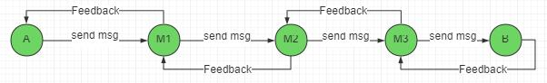

这节课讨论的是：在上图的数据传输流程中，若有一些节点采用的是backoff的TCP协议，一些节点采用的是有缺陷的TCP协议（即是直接使所有数据一拥而上而全然不考虑其他节点的数据承载问题）。

分析的方案如下：


注：

- 1.这里的数据，比如1ms的延时，只是一个大意上的估计。
- 2.这里分析的是two player game也可以应用到实际成百上千个节点的网络中。

## 1-2 Self-interested Agents and Utility Theory

What does it mean to say that an agent is **self-interested**?

- not that they want to harm others or only care about themselves

- only that the agent has its own description of states of the world
that it likes, and acts based on this description

Each such agent has a **utility function(收益函数)**
  - **quantifies** degree of preference across alternatives
  - explains the impact of **uncertainty**
  - **Decision-theoretic rationality**: _act to maximize expected utility._

## 1-3 Defining Games

Key Ingredients:

- Players: who are the decision makers?
  - People? Governments? Companies? Somebody employed by a
Company?...

- Actions: what can the players do?
  - Enter a bid in an auction? Decide whether to end a strike? Decide when to sell a stock? Decide how to vote?...

- Payoffs: what motivates players?
  - Do they care about some profit? Do they care about otherplayers?...

Two Standard Representations:

- Normal Form (a.k.a. Matrix Form, Strategic Form) List what payoffs get as a function of their actions
  - It is as if players moved simultaneously
  - But strategies encode many things...

- Extensive Form Includes timing of moves (later in course)
  - Players move sequentially, represented as a tree
     - Chess: white player moves, then black player can see white’s move and react...
  - Keeps track of what each player knows when he or she makes each decision
    - Poker: bet sequentially – what can a given player see when they bet?

Example:

- Normal Form 

普遍定义如下：

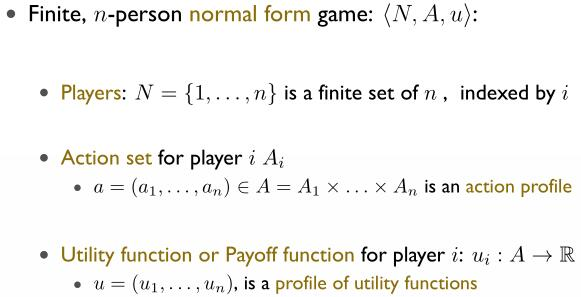

在这种情况下，收益函数可用 标准矩阵 形式表示：

以TCP Backoff为例，矩阵表示为：

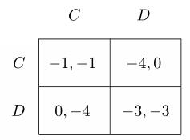

一般来说，标准矩阵形式 是two player的情况的表示方式（因为矩阵就是二维的）。矩阵的行代表 player 1，每行对应player 1采取的不同的action，矩阵的列代表player 2，每列对应player 2采取的不同的action。矩阵的每个元素代表不同player的收益(u1,u2)。

## 1-4 Example of Games

- Games of Pure Competition

  - Players have **exactly opposed interests**

     - There must be precisely two players (otherwise they can’t have exactly opposed interests)
     -  For all action profiles a ∈ A, u 1 (a) + u 2 (a) = c for some constant c(常和博弈)
         -  Special case: zero sum(零和博弈)
     - Thus, we only need to store a utility function for one player
         - in a sense, we only have to think about one player’s interests
  - example: Rock-Paper-Scissors(剪刀石头布)
     - 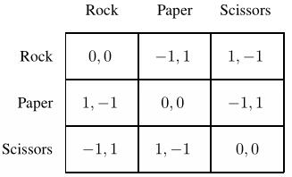

- Games of Pure Cooperation
  - Players have exactly the same interests.
     - no conflict: all players want the same things
     - ∀a ∈ A,∀i, j, u i (a) = u j (a)
     - we often write such games with a single payoff per cell
  - example: Which side of the road should you drive on?
    - 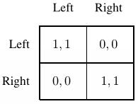

- Games combine elements of cooperation and competition

   Battle of the Sexes：一对夫妻要去看电影，丈夫想看F，妻子想看B，两个人要一起看电影才会开心（当两者分开去看电影时收益均为0）。
   - 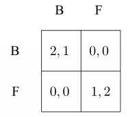

## 1-5 Nash Equilibrium（纳什均衡） Intro

关于纳什均衡，可以参考知乎中的如下理解：

```
在发生一件事情（Game）的时候，假设在这个事情里，每个被牵扯进来的人都必须做出一个决策，每个人只能做关于自己的决定，而不能帮别人做决定。假设每个人都是非常聪明和理性的，做出的决策一定是对自己最有利的。如果在某种情况下，每个人都发现现在他们能做的已经是当前情况下最好的选择了，没有人想改变自己的策略，因为如果别人不改变策略的话，自己的选择已经没有办法更好了。如果每个人都是这样的，那么就没有人有改变策略的意愿，那么就是一个纳什均衡。

作者：David Dong
链接：https://www.zhihu.com/question/19804990/answer/69370269
来源：知乎
著作权归作者所有。商业转载请联系作者获得授权，非商业转载请注明出处。

```
这节课 主要介绍了一个Game:

```
Each player names an integer between 1 and 100.The player who names the integer closest to two thirds of the average integer wins a prize, the other players get nothing.

注：这个Game是 the Beauty Contest Game的简单版本。
```

这个Game就涉及到 **每个player要猜测其他player的决策进行决策** 的情况

## 1-6 Strategic Reasoning（战略推理）

该节讲解上节提出的问题的solution。

• Suppose a player believes the average play will be X (includinghis or her own integer)

• That player’s optimal strategy is to say the closest integer to 2/3*X

• X has to be less than 100, so the optimal strategy of any playerhas to be no more than 67.

• If X is no more than 67, then the optimal strategy of any player has to be no more than 2/3*67

• If X is no more than 2/3*67, then the optimal strategy of anyplayer has to be no more than (2/3)^2*67

• Iterating, the **unique Nash equilibrium** of this game is for every player to announce 1!

下图是由超过10000个player参加这个游戏的数据统计图：横轴代表player选择的数字（从1-100），纵轴代表对应数字被选择的频率


分析：

1.图像中可看到数字67以上仍然有player选择，这说明该部分player是不够理智的。
2.选择50的player最多
3.相对较理智的player猜测可能有很多人会选择50，因此他们会选择50*2/3=33,而更加理智的player会选择33*2/3=22
4.选择1的player的人数排名第二，该部分人知道纳什均衡，但是由于他们没有考虑到所有的player并不都是足够理智的（也即是纳什均衡的前提没有达到）

若所有参与者再次参加这个Game,可能有如下的结果：

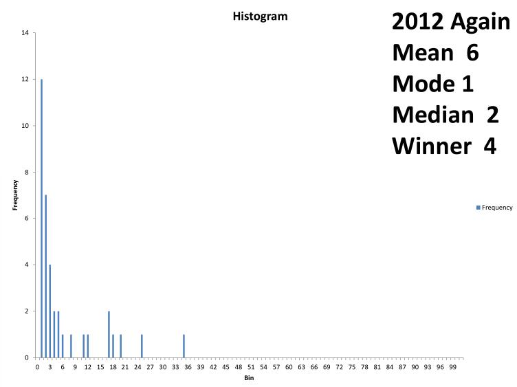

分析：

1.选择50和大于67的player基本消失，大部分player选择的数字向1靠拢，由于还是存在部分player不够理智的情况，所以最后还是无法达到纳什均衡点

总结：

- 考虑到他人的行为，每个玩家的采取的行动可最大化自身的收益(**每个人的策略都是对其他人的策略的最优反应**)。
- 如果达到了均衡点，没有人有动机去偏离这个均衡点（谁偏离该点谁就输了）
- 一旦有人偏离均衡点，就无法形成均衡点(Someone has an incentive to deviate from a profile of actions that do not form an equilibrium.)

## 1-7 Best Response and Nash Equilibrium

这节给出Best Response和Nash Equilibrium的严格数学定义。

Best Response：

对于第i个player，在其他player采取的行动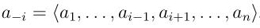已知的前提下，有如下的定义：

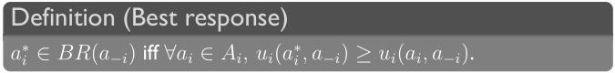
其中BR(a-i)代表对其他player反映的Best Response的集合

Nash Equilibrium:

每个player的Response都是对其他player的Best Response，数学上则表示为：

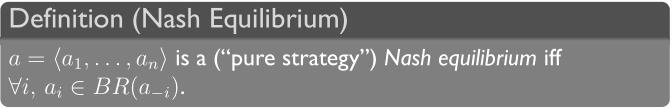

## 1-8 Nash Equilibrium of Example Games

### prisoner's dilemma(囚徒困境)

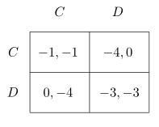

注：C代表合作，D代表不合作

分析：由于一旦有一方想要合作，另一方则可通过采取不合作来使得自己收益最高（即是获刑0年），因此对于两者，采取不合作对他们自身来说是“最优的”，因此两者都采取不合作就是纳什均衡点。

### Which side of the road should you drive on?


分析：当一方选择left/right，另一方最优的策略便是也选择left/right，因此存在两个均衡点：(left,left)、(right,right)

### Battle of the Sexes


分析：由于只有两者一起时才有收益，因此当一方选择B/F，另一方最优的策略也是选择B/F，因此存在两个均衡点：(B,B)、(F,F)

### Matching penny

当两者都选择相同的面时，player 1赢；不同时player 2赢。

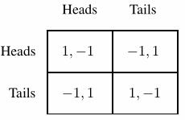

分析：player 1选择heads，player 2的最优策略是选择tails;player 2选择tais,player 1选择tails；player 1选择tails,player 2选择heads;player 2选择heads,player 1选择heads。
因此这里形成了一个循环，故不存在纳什均衡点。

## 1-9 Dominant Strategies（主导策略）

定义：

<a href="https://www.codecogs.com/eqnedit.php?latex=s_i" target="_blank"></a> ： player i 采取的一个策略

<a href="https://www.codecogs.com/eqnedit.php?latex=s_i^'" target="_blank"></a> ：player i 采取的另一个策略

<a href="https://www.codecogs.com/eqnedit.php?latex=S_{-i}" target="_blank"></a> : 除了player i之外的其他player可能采取的策略的集合（对于two player，即是另一个player对应的行或列的所有策略）

有：


**dominant**: If one strategy dominates **all others**, we say it is dominant.

A strategy profile consisting of **dominant** strategies for every player must be a Nash equilibrium.(**每个人采取的都是最优策略，任何一个改变策略的人都会有损失，因此该情况下必定为纳什均衡**)

更多的，An equilibrium in strictly dominant strategies must be unique.（反证法）

以囚徒困境为例子：


对于player 1，当player 2选择C时，其会偏向选择D;当player 2选择D时，其仍会偏向选择D。对于palyer 2也是如此，因此(D,D)对应两者都是strictly dominant的策略，因此这是唯一的均衡点。

在这个例子中，对于player 1，<a href="https://www.codecogs.com/eqnedit.php?latex=s_i" target="_blank"></a> 为D，<a href="https://www.codecogs.com/eqnedit.php?latex=s_i^'" target="_blank"></a>为C，<a href="https://www.codecogs.com/eqnedit.php?latex=S_{-i}" target="_blank"></a> 为{C,D}(即是·player 2可能选择的策略的集合)。

## 1-10 Pareto Optimality

这节是从整体的角度看待问题，以Normal Form的标准矩阵为例，我们称矩阵的每个元素为一个outcome。

有时一个 outcome o 相对另一个 outcome o1 至少对每个player都是更好的，并且其中有一些player更**严格**偏爱于outcome o。在这种情况下，我们说outcome o相对outcome o1更加好是合理的。即称：o Pareto-dominates o1

从而有 Pareto-optimal 的定义：


关于  Pareto-optimal 的存在性和唯一性的问题讨论：

- 存在性：一定存在，至少存在一个outcome是Pareto-optimal的，可用反证的思路，一个outcome不是Pareto-optimal的前提是 其被另外一个outcome Pareto-dominate，而若没有outcome是Pareto-optimal的，则应该出现o1 Pareto-dominate o2,o2 Pareto-dominate o3,o3 Pareto-dominate o1的循环的情况，而根据Pareto-dominate的定义，这是不存在的。

- 唯一性：不一定只有一个，比如所有的outcome都是相同的，则所有outcome都是Pareto-optimal的

Pareto Optimal Outcomes in Example Games:

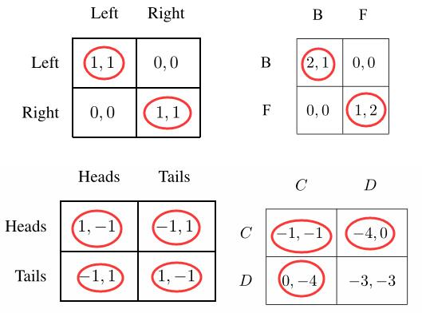

注：由于不同的player的收益函数之间的数值比例(scale)在这里无法得知，因此以右下的囚徒困境为例，(-1,-1)和(-4,0)、(0,-4)都属于Pareto-optimal，他们之间无法比较大小，而(3,3)之所以不是Pareto-optimal的是因为其被其他三个outcome Pareto-dominate。

值得注意的是：**在囚徒困境中，唯一一个not Pareto Optimal的outcome是唯一的纳什均衡点。**


