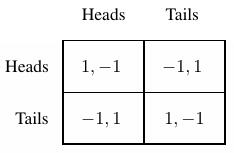
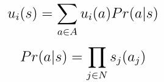
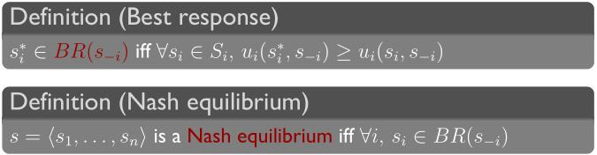
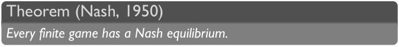
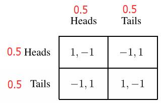
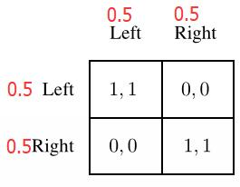
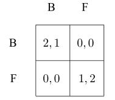
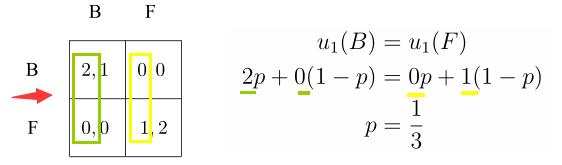
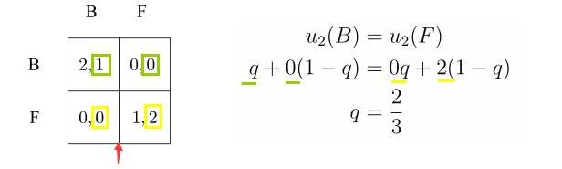

<!-- TOC -->

- [week 2](#week-2)
    - [2-1 & 2-2 Mixed Strategies and Nash Equilibrium (I)(II)](#2-1--2-2-mixed-strategies-and-nash-equilibrium-iii)
    - [2-3 Computing Mixed Nash Equilibrium](#2-3-computing-mixed-nash-equilibrium)
    - [2-4 Hardness Beyond 2x2 Games](#2-4-hardness-beyond-2x2-games)
    - [2-5 Example: Mixed Strategy Nash](#2-5-example-mixed-strategy-nash)
    - [2-6 Data: Professional Sports and Mixed Strategies](#2-6-data-professional-sports-and-mixed-strategies)

<!-- /TOC -->
# week 2

## 2-1 & 2-2 Mixed Strategies and Nash Equilibrium (I)(II)

以matching pennies这个Game为例：



对于任何一个player，如果其总是选择特定的策略，那么这个player就无法胜出了。比如，player 1选择Heads，那么player 2可以通过选择Tails来赢得游戏；player 1选择Tails，那么player 2可以通过选择Heads来赢得游戏。而若player 1是以某种概率选择Heads、以某种概率选择Tails(confuse the opponent by playing randomly)，那么player 2就无法一定赢得游戏了。这就是一种混合策略。

首先给出混合策略和纯策略各自的定义：

**Mixed Strategies（混合策略**）：
在每个给定信息下，只以某种概率选择不同策略（more than one action is played with positive probability, these actions are called the **support** of the mixed strategy）

更多直观深入的理解可参考  [如何理解经济学中的混合策略 (Mixed Strategy) ？][1]

[1]:https://www.zhihu.com/question/34133677

**pure Strategies（纯策略）**：
在每个给定信息下，只能选择一种特定策略（only one action is played with positive probability）

相关的符合定义如下：

</a> :  a strategy for agent i as any probability distribution over the actions .

 :  the set of all strategies for i.

 : the set of all strategy profiles

由于在混合策略中，我们不会选择game martrix中特定的元素，因此混合策略的Utility function也需要修改。

定义混合策略中的Utility function为expected utility（预期效用）:



同样地，在混合策略中的Best Response 和 Nash Equilibrium也需要修改 ：



其相对纯策略中的定义的区别为：混合策略为纯策略中的**actions**向**strategies**的结果（即是纯策略中使用字母a，混合策略中使用字母s）

更多地，在混合策略中有如下定理成立：



注：这里的**finite** game的意思是 game中的player是finite，选择的actions也是finite的，由player和actions决定的utility values也是finite的。

这个定理是相当的awesome，因为**每个finite Game都有一个NE，都有一定平衡点使得所有的player都不愿意从这个点偏离出去**。这也是为什么Nash能够获得Nobel Prize的原因。

**注意：在纯策略中，这个定理就不存在了。**

Example:

- **matching pennies**



解释：对于每个player，其NE点为 "每个player以50%的概率选择Heads，以50%的概率选择Tails"，具体计算方法后续再讲。

- **Which side of the road should you drive on?**



解释：同上。

## 2-3 Computing Mixed Nash Equilibrium

由上节可知，对于一个finite game，都存在 纳什均衡点，但是这个定理却没有告诉我们怎么去得到 纳什均衡点，而当game的规模越大，想要得出纳什均衡点就变得越困难。

该节提供了一种计算纳什均衡点的方法： compute Nash equilibria by  guessing the support of the game

关于support的定义如下：

```
A support is the set of pure strategies that receive positive probability under  the mix strategy of the players.
Namely, a an equilibrium support is a set of actions that occur with positive  probability. 
```

以Battle of the Sexes这个game作为例子：



equilibrium support为集合{B,F}

让player 2以p的概率选择B这个action，以1-p的概率选择F这个action，那么有如下因果关系成立：
if player 1 **best-responds with a mixed strategy**, player 2 must make him indifferent between F and B.
即是，player 1要对player2做出的action做出类型为mixed strategy的best respond，即是player 2做出的这个action要达到的效果是让player 1无论选择F还是选择B的结果（收益）都是一样的，因为如果存在选择F的收益大于选择B的收益，那么player 1会偏向于选择F，这样就变成了pure strategy了，同时直观上来看，如果player 2采取的这个action能让player 1处在 “无从更好的选择” 的情况下自然是对他更有利的。

则有：



求得P为1/3。

同理，让player 1以q的概率选择B这个action，以1-q的概率选择F这个action，有：



求得此时q为2/3。

因此，混合策略:(2/3,1/3),(1/3,2/3) 为一个纳什均衡。

**Interpreting Mixed Strategy Equilibria**

What does it mean to play a mixed strategy? Different interpretations:
- Randomize to confuse your opponent
    - example： matching pennies example（若选择固定的策略则明显会输）
- Randomize when uncertain about the other’s action（这里的Randomize和上面的有一些区别，这里应该理解为 reflect uncertainty）
    - example：battle of the sexes(if I am uncertain about the other  person's action, then, and then I best respond given that  uncertainty and I do that in a way that leaves you kind of uncertain in a  particular way. We can also find ourselves in balance.  That's really the way that I understand the stability of the equilibrium in  battle of the sexes, that if we make each other uncertain in a  precise way, we can find ourselves, in balance.  Even though we would really like it better if we were just to end up in the,  in one of these pure equilibrium.)
- Mixed strategies are a concise description of what might happen
in repeated play: count of pure strategies in the limit
- Mixed strategies describe population dynamics: 2 agents chosen
from a population, all having deterministic strategies. Mixed strategies gives
the probability of getting each pure strategies.

## 2-4 Hardness Beyond 2x2 Games

难，不知所云。

## 2-5 Example: Mixed Strategy Nash

计算纳什均衡点的例子，和2-3的例子没什么区别。

## 2-6 Data: Professional Sports and Mixed Strategies

通过实际数据计算纳什均衡点，对比实际数据，验证纳什均衡点在实际的应用的有效性。
