# week 3

## 3-1 Beyond the Nash Equilibrium

用三个实际例子引入。

## 3-2 Strictly Dominated Strategies & Iterative Removal

首先需要注意Dominated Strategies和Dominant Strategies的区别：前者是被主导的策略（存在比这个策略更好的策略），后者是主导策略（不存在比这个策略更好的策略）

假设所有的player都想最大化自身的payoff，并且所有的player都知道其他的player都想最大化自身的payoff并且都是完全理性的，那么Strictly Dominated Strategies就不可能被选择执行（若是执行这种action, player的payoff就不是最高的了），因为总是存在比这个策略更好的策略（player都是足够理性的）。找到一个Strictly Dominated Strategies，因为其不存在于player想要选择的action的集合里面，因此，我们可以将这个action移除出去，从而简化整个game，不断地进行这个步骤直到停止的过程就称为**iterated removal of strictly dominated strategies**。

Strictly Dominated Strategies定义如下：

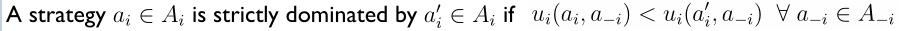

Example 1 :

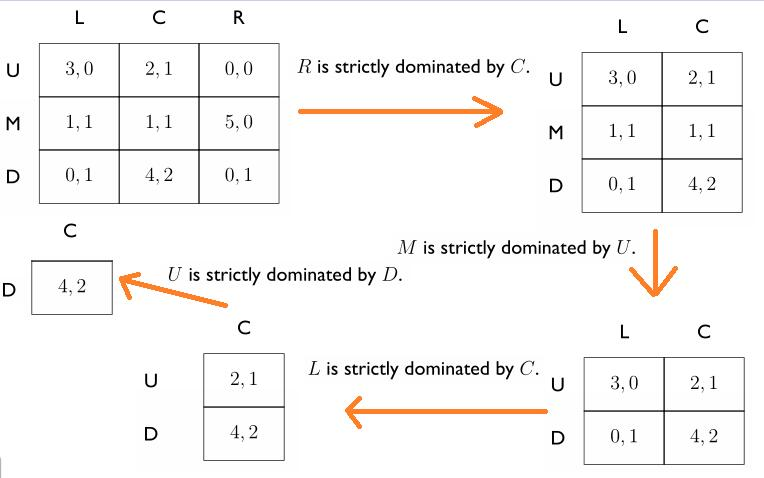

分析：通过iterated removal of strictly dominated strategies，这里最终得到了**唯一的**outcome：(D,C),实际上这也是这个game唯一的一个纳什均衡点。

Example 2 :

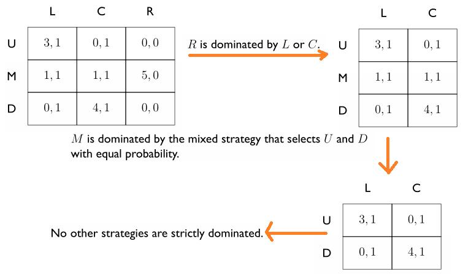

**注意：第二步removal使用了mixed strategies来定义domination，这是可行的。**

分析：不同于上一个例子，该例在有4个outcome时就停止迭代了。那么自然会有个疑问，这4个outcome都是纳什均衡点吗？答案是不都是，通过第一周学习的判断方法，(U,L)和(D,C)才是纳什均衡点，而另外两个则不是。

### Iterated Removal of Strictly Dominated Strategies 的性质

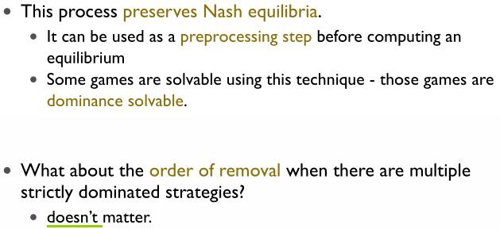

### Weakly Dominated Strategies

其定义如下：

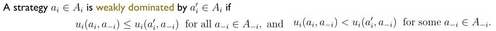

同理，也存在Iterated Removal of Weakly Dominated Strategies，但是其性质相比Iterated Removal of Strictly Dominated Strategies有一些区别：

- Order of removal can matter.
- At least one equilibrium preserved.

总结：在两种情况下，纳什均衡点都是最终剩下的outcome的子集。

## 3-3 Dominated Strategies & Iterative Removal: An Application

与上一节的Example 1类似。

## 3-4 Maxmin Strategies

### maxmin strategy & maxmin value

**maxmin strategy** :

Player i’s **maxmin strategy** is a strategy that **maximizes i’sworst-case payoff**, in the situation where all the other players (whom we denote −i ) happen to play the strategies which cause the greatest harm to i .

**maxmin value** :

The **maxmin value** (or **safety level**) of the game for player i is that **minimum** payoff guaranteed by a maxmin strategy.

两者严格的定义如下：

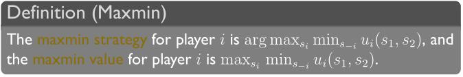

**Why would i want to play a maxmin strategy?**
- a conservative agent maximizing worst-case payoff
- a paranoid agent who believes everyone is out to get him（顽固地相信对手将会最大程度地降低i的payoff）

### minmax strategy & minmax value

Player i’s minmax strategy against player −i in a 2-player game is a strategy that minimizes −i’s best-case payoff, and the minmax value for i against −i is payoff.

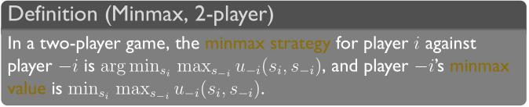

**Why would i want to play a minmax strategy?**
- to punish the other agent as much as possible

### Minimax Theorem（极小值定理）

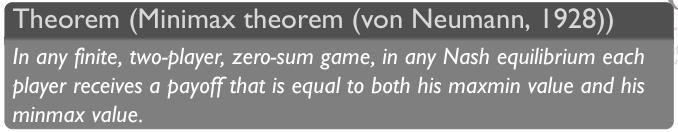

即是在任何Nash equilibrium中，都有如下说法成立：
 
- 1. Each player’s maxmin value is equal to his minmax value. The maxmin value for player 1 is called the **value of the game**.（这里可以理解为 在零和博弈 中，只看player 1的maxmin value就可知道整个game的value的分布了）
- 2. For both players, the set of maxmin strategies coincides with the set of minmax strategies.(namely, **trying to improve your worst case situation** is the same as** trying to minimize the other guy's best case situation**.)
- 3. Any maxmin strategy profile (or, equivalently, minmax strategy profile) is a Nash equilibrium. Furthermore, these are all the Nash equilibria. Consequently, all Nash equilibria have the same payoff vector (namely,those in which player 1 gets the value of the game).

下图是该定理在 Matching Pennies 的直观图像示意图：

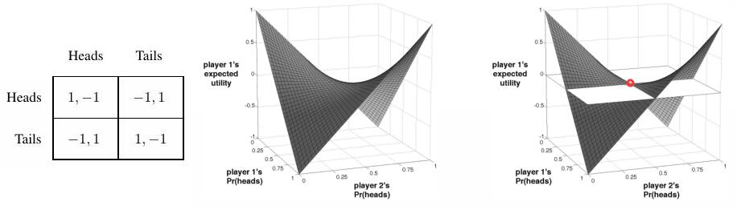

标红的那个点便为 混合策略 下的纳什均衡点 (50 to 50)，在这个点上，player 1的expected utility为0，上面的3个说法在这个图中都可以体现出来。

Example : Penalty Kick Game

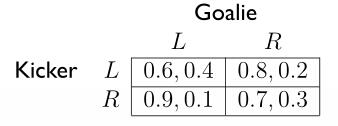

注：L : left R : right

分析：这是一个零和博弈(zero-sum game)，可以应用Minimax Theorem求解，

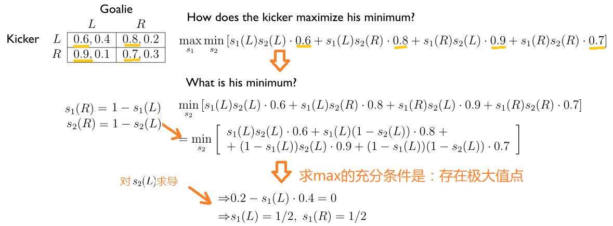

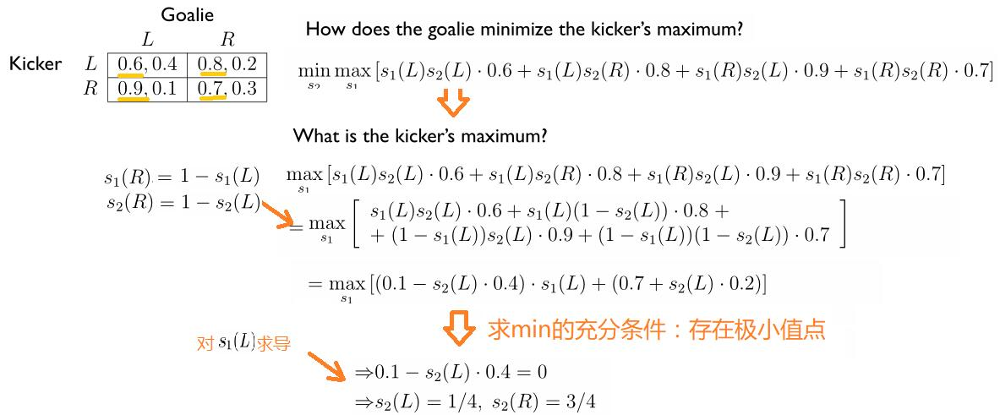

所求的(1/2,1/2),(1/4,3/4)就是纳什均衡点。

实际上，对于two player的zero-sum game，我们可以使用Minimax Theorem求解，这是一个可解的LP问题(Linear Programming)。

即是将上例展开的形式用更加抽象的语言概括为如下的优化问题：

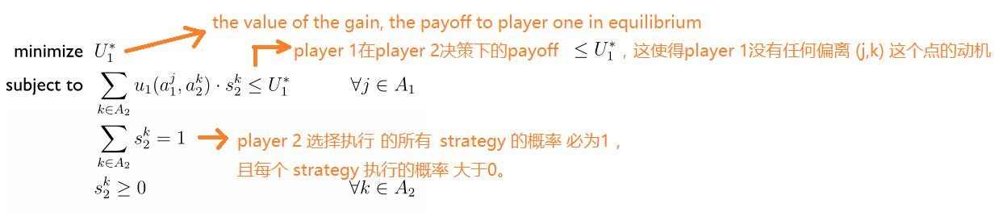

## 3-5 Correlated Equilibrium（关联均衡）: Intuition

Correlated Equilibrium (informal):

a **randomized** assignment of (potentially correlated) action **recommendations** to agents, such that nobody wants to deviate.

Example:  Traffic Game

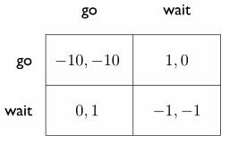

假设现在有两辆车（player 1 and player 2）要过一个 **一次只能通过一辆车** 的路口，这辆车有两种action : go 或者 wait。那么便存在如下矛盾的情况：
- 如果只是基于混合策略下的纳什均衡，比如选择了(go,wait)，那么对于player 2就显得有些不公平了；(wait,go)同理。而若选择了(go,go) 或 (wait,wait)，这对两个player都没有好处，特别地，这两种情况两个player都不想看到。

而我们实际生活中的解决办法是：

引入 A traffic light: a fair randomizing device that tells one of the agentsto go and the other to wait.

因此带来的好处是：

- the negative payoff outcomes are completely avoided
- fairness is achieved
- the sum of social welfare can **exceed** that of any Nash equilibrium

总之，就是皆大欢喜。

