<!-- TOC -->

- [week 4](#week-4)
    - [4-1 Perfect Information Extensive Form: Taste](#4-1-perfect-information-extensive-form-taste)
    - [4-2 Formalizing Perfect Information Extensive Form Games](#4-2-formalizing-perfect-information-extensive-form-games)
    - [4-3 Perfect Information Extensive Form: Strategies, BR, NE](#4-3-perfect-information-extensive-form-strategies-br-ne)
        - [Pure Strategies](#pure-strategies)
        - [Induced Normal Form](#induced-normal-form)
    - [4-4 Subgame Perfection](#4-4-subgame-perfection)
    - [4-5 Backward Induction](#4-5-backward-induction)
    - [4-6 Subgame Perfect Application: Ultimatum Bargaining](#4-6-subgame-perfect-application-ultimatum-bargaining)
    - [4-7 Imperfect Information Extensive Form: Poker](#4-7-imperfect-information-extensive-form-poker)
    - [4-8 Imperfect Information Extensive Form: Definition, Strategies](#4-8-imperfect-information-extensive-form-definition-strategies)
    - [4-9 Mixed and Behavioral Strategies](#4-9-mixed-and-behavioral-strategies)
        - [randomized strategies](#randomized-strategies)
        - [Games of imperfect recall](#games-of-imperfect-recall)
    - [4-10 Incomplete Information in the Extensive Form: Beyond Subgame Perfection](#4-10-incomplete-information-in-the-extensive-form-beyond-subgame-perfection)

<!-- /TOC -->
# week 4

## 4-1 Perfect Information Extensive Form: Taste

 Extensive Form的一些例子，不仅仅是想好当前的决策，也同时想好在未来的决策。

## 4-2 Formalizing Perfect Information Extensive Form Games

Extensive Form Games有两种:
- perfect information extensive-form games
- imperfect-information extensive-form games

这里先给出 前者 的定义：

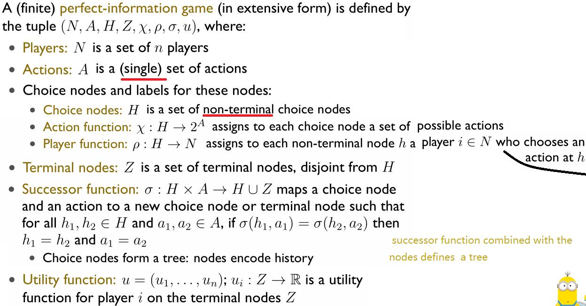

Example : the sharing game

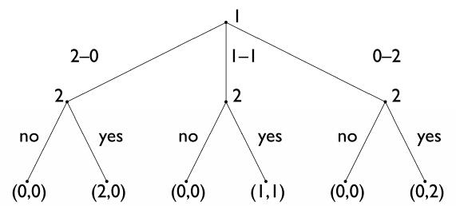

两个player在决定如何划分2美元，player 1提供划分方案，player 2对方案表示 是否同意。

## 4-3 Perfect Information Extensive Form: Strategies, BR, NE

### Pure Strategies
Pure Strategies在Normal Form中可简单地理解为单一的action，但在Extensive Form中却有新的定义：

A pure strategy for a player in a perfect-information game is a **complete specification** of which action to take at each node belonging to that player.

严格的定义如下：

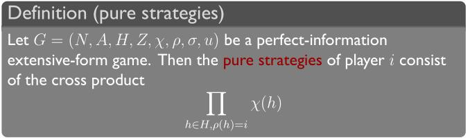

Example:

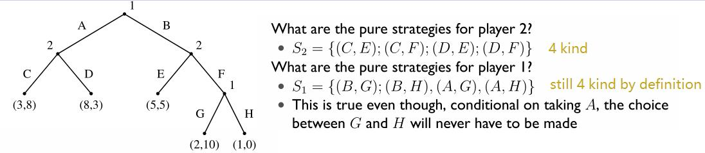

而有了Pure Strategies在Extensive Form中的新的定义，下列的概念在Extensive Form中应用也无需修改：
- mixed strategies : 
   - in normal form games, we define **mixed  strategies as probability distributions over peer strategies** and in an  extensive-form game, we can use exactly the same definition word for word. 
   - A mixed strategy in an extensive-form game is a probability distribution over  mixed strategies. All the changes is that the underlying  peer strategies themselves are different. They're now policies of what to do at  every choice node in the game. 
- best response : given a  mixed strategy profile of the other agents, a mixed strategy that maximizes expected utility.
- Nash equilibrium : a strategy profile in which every agent is best responding to every other agent.

### Induced Normal Form

根据之前所学的，求解Normal Form的game matrix的纳什均衡点是有理可循的。那么我们可以将Extensive Form的game转换成Normal Form的，从而求解纳什均衡点。

Example:

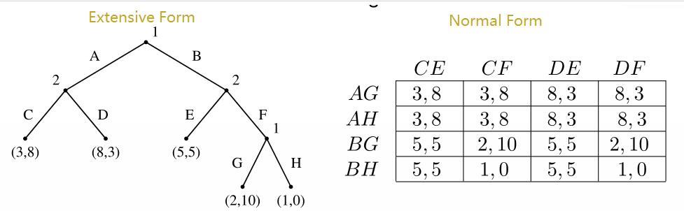

可得纳什均衡点有3个：((A,G),(C,F)),((A,H),(C,F)),((B,H),(C,E))

相关地，有如下定理成立：

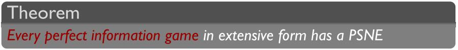

想起来也简单，因为所有的player的pure strategies都是可以有限个写出来的。

但是，很明显的，这种方法有一个必然的缺点：转换出来的Normal Form显得太过冗余，这在game“大”的时候转换效果就更差了。在这个例子中，不重复的payoff本来只有5个，但是准换后的payoff却有16个，冗余度大大增加。

有趣的是，根据定理，既然一定可以将Perfect Information Extensive Form转换成Normal Form，那么一定可以将Normal Form转换成Perfect Information Extensive Form吗？

答案是 不一定。matching pennies这个game就不可以，两个player都是同时执行决策的，如果一方先决策完，另一方就可以选择对自己有利的方式赢得game了，那这个game此时就和原来的game不一样了。

## 4-4 Subgame Perfection

回想上一节讲到的例子：

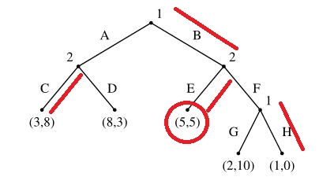

我们知道(B,H),(C,E)是一个**纳什均衡点**，但是直觉上我们可能会对这个纳什均衡点感觉有点怪怪的，因此有如下的问题：

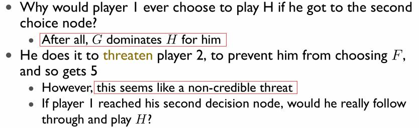

为解决如上问题，先引入如下的一些定义：

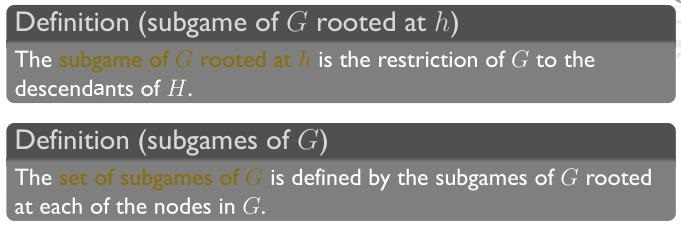

并有如下推论：

- s is a **subgame perfect equilibrium** of G iff **for any** subgame G′ of G, the restriction of s to G′ is a Nash equilibrium of G′.（即是在每个subgame中，没有一个player想偏离当前的局面）
- this definition rules out “non-credible threats”（排除了“不可信威胁”）

运用如下概念到之前的例子，有：

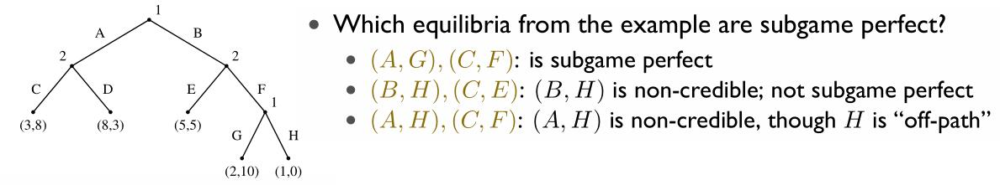

详细解释：

对于(A,G),(C,F):

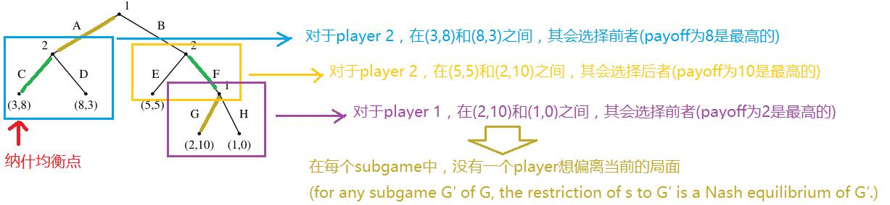

## 4-5 Backward Induction

Backward Induction can be viewed as a way of **computing the subgame perfect  equilibrium** of a game. 

算法伪代码为：

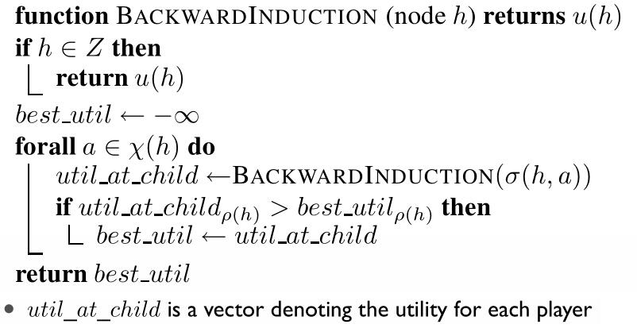

the procedure **doesn’t return an equilibrium strategy**, but rather **labels each node with a vector of real numbers.**
- This labeling can be seen as **an extension of the game’s utility function to the non-terminal nodes**
- for equilibrium strategies take a best action at each node, it is easy to find out nash equilibrium with the help of this vector.

对于zero-sum game, Backward Induction也称为 the minimax algorithm.
- It is enough to store one number per node.
- It’s possible to speed things up by pruning（修剪） nodes that will never be reached in play: “alpha-beta pruning”.

Example : Centipede Game

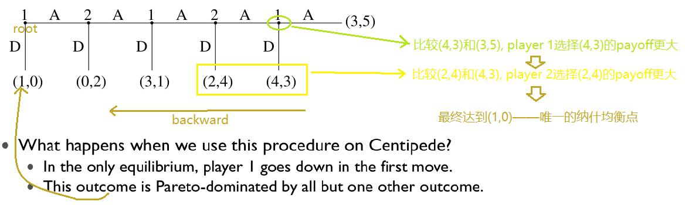

Two considerations:
- practical: human subjects don’t go down right away
- theoretical: what should player 2 do if player 1 doesn’t go down?
  - SPE analysis says to go down. However, that same analysis says that player 1 would already have gone down.   How should player 2 update beliefs upon observation of a measure zero event?
  - but if player 1 knows that player 2 will do something else, it is rational for him not to go down anymore... a paradox
  - there’s a whole literature on this question

## 4-6 Subgame Perfect Application: Ultimatum Bargaining

Ultimatum Bargaining:
- Player 1 makes an offer x ∈ {0,1,...10} to player 2
- Player 2 can accept or reject
- 1 gets 10 − x and 2 gets x if accepted
- Both get 0 if rejected

不知所云。

## 4-7 Imperfect Information Extensive Form: Poker

这里用Poker引入IIEF，Poker是典型的Imperfect Information Extensive Form Game。其有如下特点：
- Many possible hands!（只能根据当前自己手上和以及打出的牌进行推断，可能性很多）
- Many betting strategies!（对手采取的策略也有很多种）
- Impossible to draw the tree...(However, there is much we can learn about such games.)

## 4-8 Imperfect Information Extensive Form: Definition, Strategies

in **Perfect** Information Extensive Form:
-  players know the node they are in and all the prior choices, including those of other agents.

in **Imperfect** Information Extensive Form:
- each player’s choice nodes partitioned into **information sets**.
- agents cannot distinguish between choice nodes in the same information set.

后者的严格定义为：

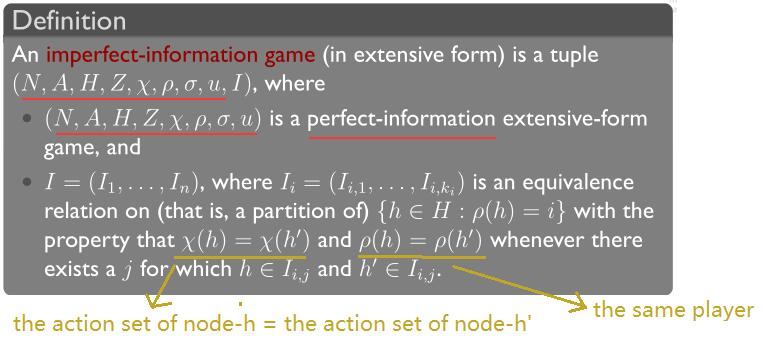

Example of **the equivalence classes**：

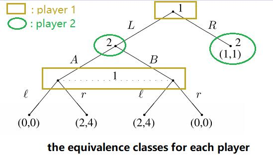

以上图为参考，如何在IIEF中定义pure strategies呢？
- unformally, it is **the choice of an action** in each equivalence class.
    - formally, the pure strategies of player i consist of the cross product ，其中
        - example : the pure strategies of player 1 in the figure above are : 

同PIEF，IIEF也可以通过枚举pure strategies来得到Normal Form game，但不同的是，NF也可以转换成IIEF。

Example :

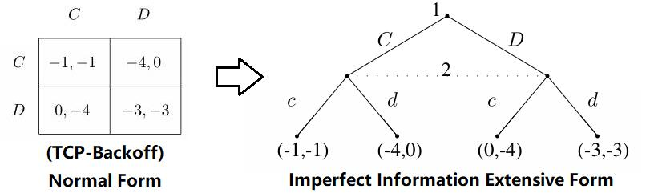

注意：在这里也可以把player 2放置到根节点上，这两者是等价的，因为player 2决策时并不能知道player 1做了什么决策（两者是同时决策的），因此注意与PIEF区分。

而在其他方面，IIEF和NF是一样的：
- Mixed strategies are just mixtures over the pure strategies.
- Nash equilibria are also preserved.

qustion：将一个NF转换成IIEF，再将其转换成NF后，问最终得到是不是之前的那个NF。

answer: might not end up with the same game, but we do get one with the same strategy spaces and equilibria.

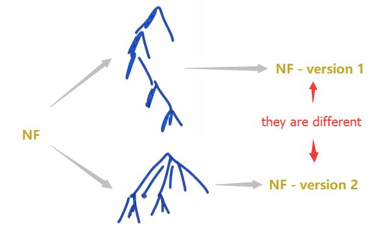

## 4-9 Mixed and Behavioral Strategies

### randomized strategies

在IIEF中，存在两种 **randomized strategies**：
- Mixed strategies : randomize over **pure strategies**
- Behavioral strategy : independent coin toss every time **an information set** is encountered（应该是有多少个information set就toss多少次）

Example:

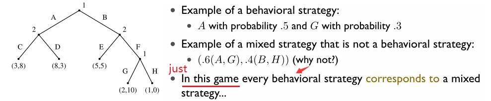

### Games of imperfect recall

---

**perfect recall & imperfect recall:**

perfect recall :  the agents have full recollection of their experience in  the game, which means that wherever they are in each  information set, they know all the information sets they visited previously  and all the actions they've taken. 
imperfect recall : Contrary to perfect recall

---

Imagine that player 1 sends two proxies to the game with the same strategies. When one arrives, he doesn’t know if the other has arrived before him, or if he’s the first one.

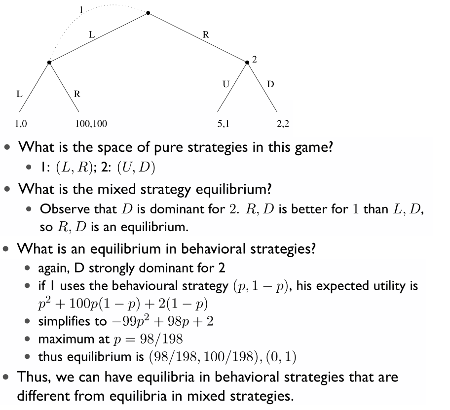

对于这个例子，本人有两个问题不太理解：
- 1.为什么player 1的pure stategies只包含(L,R)，这里的虚线到底代表着什么意义？和之前介绍的equivalence classes貌似又不太一样。
- 2.在求mixed strategy的equilibrium时，好像是认为(L,R)是不会执行的，这又是为什么？

## 4-10 Incomplete Information in the Extensive Form: Beyond Subgame Perfection

With **incomplete** information, there's **no** proper subgames. So, **players don't really know exactly which node they're at in the game** and that can be difficult. So, there may not be many proper subgames. So, the basic reasoning doesn't apply, subgame perfection does not apply directly in a lot of games.

But, there are ways of extending the reasoning. So, there are ways to take the same kind of credibility ideas that are behind subgame perfection and apply them in these kinds of games.

Example : firm 1 (player 1) wanna join the market which have already been "occupied" by firm 2 (player 2)

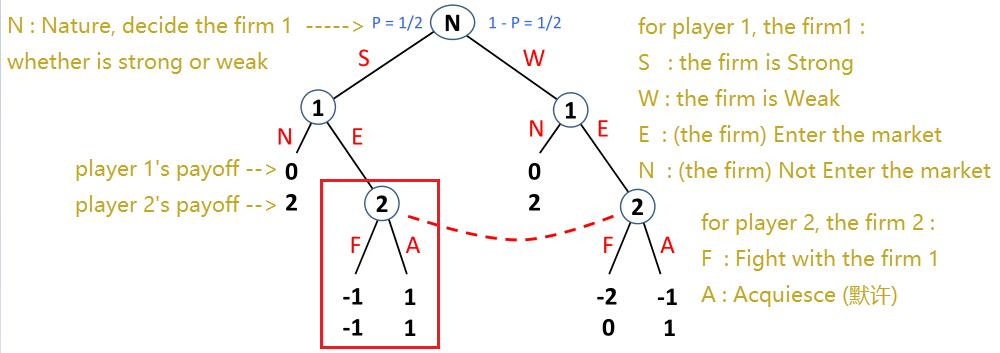

在这里，我们并不能说 上图红色框部分 是一个subgame，因为我们还不确定这部分是否会发生，即是我们掌握的关于这部分的信息是incomplete的，而实际上，正是由于information 是 incomplete 的，这整个game的subgame就是这个game本身。

因此，整个game的subgame perfect equilibrium就是这个game的nash equilibrium。（相关定理见 4-4）

Equilibrium concepts that explicitly model players’ beliefs aboutwhere they are in the tree for every information set (what the other players have done)

Sequential Equilibrium and Perfect Bayesian Equilibrium - key features:

- Beliefs are not contradicted by the actual play of the game (on the
equilibrium path)
- Players best respond to their beliefs

Once beliefs are modele, the ideas of sequential rationality extend ...

该节仅整理出重点的笔记，但是原理还不太懂。这里的Beliefs和sequential rationality的概念尚未清晰。
