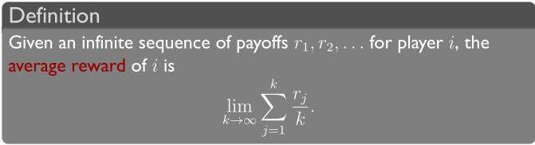
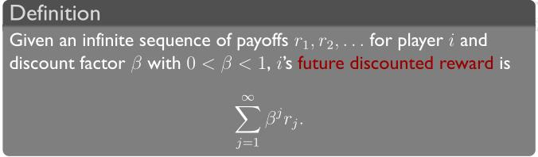
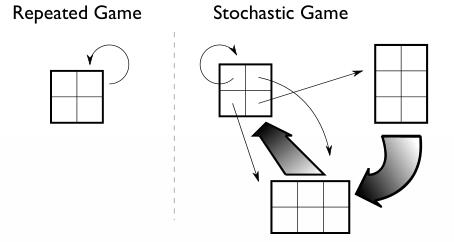
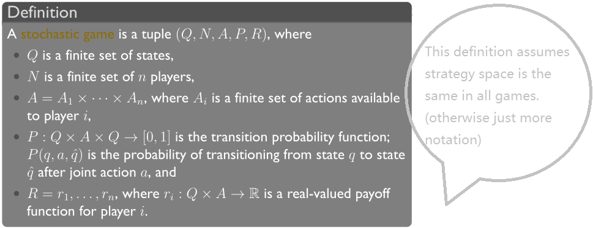

<!-- TOC -->

- [week 5](#week-5)
    - [5-1 Repeated Games](#5-1-repeated-games)
    - [5-2 Infinitely Repeated Games: Utility](#5-2-infinitely-repeated-games-utility)
    - [5-3 Stochastic Games](#5-3-stochastic-games)

<!-- /TOC -->
# week 5

## 5-1 Repeated Games

一些例子的介绍。Repeated Games help players making better decision.

## 5-2 Infinitely Repeated Games: Utility

当players play无穷多个重复的Games时，我们无法写出它的Extensive Form（如果要写那就是一颗无穷深度的树，永远找不到树的叶节点），那么我们就需要定义一种新的Utility判断方式：

该计算方式是 无穷多次game的payoff的求和平均值(average reward)。

但是这样的计算方式就有一个缺点：假设刚开始的前1000次game的payoff为-1000000，而在后续的game的payoff均为1，那么求出来的average reward就是1了。在数学上没问题，但是在通常实际上，我们更希望刚开始的时候的payoff不要太低，也就是初期的payoff的重要性要大些。为了解决这个问题，引入如下定义：

**Two equivalent interpretations of the discount factor**:
- 1. the agent **cares more about** his well-being in the **near term** than in the long term
- 2. the agent cares about the future just as much as the present, but with **probability 1 − β** the game will end in any given round.(或者说在每一轮新的game都以概率β接着进行)

## 5-3 Stochastic Games

A stochastic game is a generalization of repeated games：
- agents **repeatedly** play games from **a set of normal-form games**
- the game played at any iteration depends on the previous game played and (also depends) on the actions taken by all agents in that game

其和repeated game的区别可参考下图：

Stochastic Games会随机地从当前的game跳到新的game中去。

正式定义如下：

Notes: **MDP(Markov Decision Process)  is a single-agent stochastic game.**

Can do analysis as with repeated games.
- limit average reward
- future discount reward

