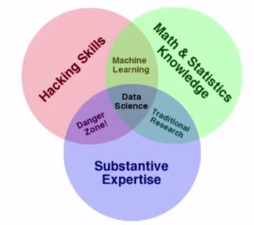
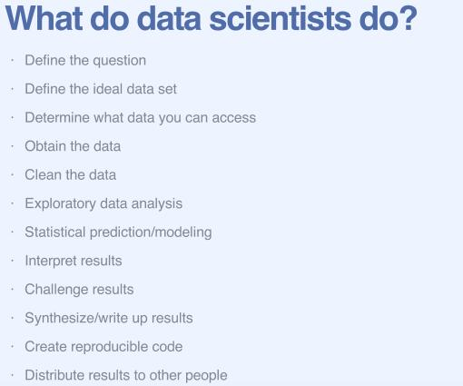
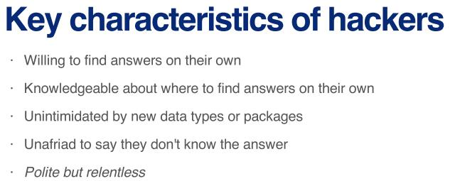
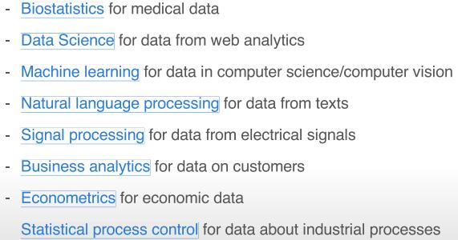

<!-- TOC -->

- [week 1](#week-1)
    - [Specialization Textbooks](#specialization-textbooks)
    - [The goal of this course](#the-goal-of-this-course)
    - [The Data Scientist's Toolbox](#the-data-scientists-toolbox)
    - [Getting Help](#getting-help)
    - [Finding Answers](#finding-answers)

<!-- /TOC -->
# week 1

## Specialization Textbooks

这门课是Johns Hopkins University开设的Data Science Specialization的第一门课，总共有9门，相关的textbooks如下：

- 1.Elements of Data Analytic Style by Jeff Leek
- 2.R Programming for Data Science by Roger Peng
- 3.Exploratory Data Analysis with R by Roger Peng
- 4.Report Writing for Data Science in R by Roger Peng
- 5.Statistical Inference for Data Science by Brian Caffo
- 6.Regression Modeling for Data Science in R by Brian Caffo
- 7.Developing Data Products in R by Brian Caffo

除此之外，还有两本相关度较高的书：

- 8.The Art of Data Science by Roger Peng
- 9.How to Be A Modern Scientist by Jeff Leek

## The goal of this course

下面这幅图给出了Data Science涉及的知识范围：

注：Hacking skills指的是数据处理技巧

## The Data Scientist's Toolbox

在这门课程中会使用到如下3种工具：R、R markdown、Git&Github。

## Getting Help

一些诸如how to ask questions the smart way的课前说明。

## Finding Answers

finding answers时常用的网站：
- 1.[stackoverflow][1]:Each month, over 50 million developers come to Stack Overflow to learn, share their knowledge, and build their careers.
- 2.[Cross Validated][2]: a question and answer site for people interested in statistics, machine learning, data analysis, data mining, and data visualization.
- 3.[R mailing list][3]: major announcements about the development of R and the availability of new code. 

[1]:https://stackoverflow.com/
[2]:https://stats.stackexchange.com/
[3]:https://www.r-project.org/mail.html

finding answers时对应不同data type的data analysis的术语名称：

