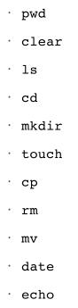

<!-- TOC -->

- [week 2](#week-2)
    - [Command Line Interface](#command-line-interface)
    - [Introduction to Git](#introduction-to-git)
    - [Introduction to Github](#introduction-to-github)
    - [Creating a Github Repository](#creating-a-github-repository)
    - [Basic Git Commands](#basic-git-commands)
    - [Basic Markdown](#basic-markdown)
    - [Installing R Packages](#installing-r-packages)
    - [Installing Rtools](#installing-rtools)

<!-- /TOC -->
# week 2

总体没啥东西，对于完全不懂的小白倒是有些帮助。

## Command Line Interface

重点就介绍了如下命令在liunx上的操作：



## Introduction to Git
pass
## Introduction to Github
pass
## Creating a Github Repository
pass
## Basic Git Commands
pass
## Basic Markdown
pass
## Installing R Packages

以安装包ggplot2为例：

安装命令：
```
install.packages("ggplot2")
```

调用包命令：
```
library(ggplot2)
```

得到当前已经安装的包的列表可用available.packages()函数，比如输出排序靠前的前20个包的名字：

```
> head(rownames(available.packages()),20)
 [1] "A3"            "abbyyR"        "abc"           "ABCanalysis"  
 [5] "abc.data"      "abcdeFBA"      "ABCoptim"      "ABCp2"        
 [9] "ABC.RAP"       "abcrf"         "abctools"      "abd"          
[13] "abf2"          "ABHgenotypeR"  "abind"         "abjutils"     
[17] "abn"           "abodOutlier"   "AbsFilterGSEA" "AbSim"  
```

## Installing Rtools

Rtools is a collection of resources for building packages for R under Microsoft Windows

下载地址：
https://cran.r-project.org/bin/windows/Rtools/

注意安装匹配当前R版本的Rtools