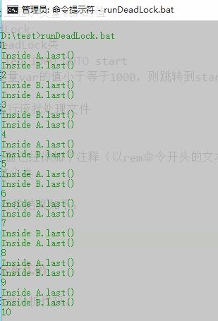

<!-- TOC -->

- [1. Lab 1 - 死锁](#1-lab-1---死锁)
    - [1.1. 代码运行结果](#11-代码运行结果)
    - [1.2. 分析代码](#12-分析代码)
        - [1.2.1. part 1](#121-part-1)
        - [1.2.2. part 2](#122-part-2)
    - [感想](#感想)

<!-- /TOC -->

# 1. Lab 1 - 死锁

这次实验的内容是运行如下的java代码（会产生死锁），并分析为什么产生死锁的原因。

```java
class A{
    synchronized void methodA(B b){
        b.last();
    }
    synchronized void last(){
        System.out.println("Inside A.last()");
    }
}
class B{
    synchronized void methodB(A a){
        a.last();
    }
    synchronized void last(){
        System.out.println("Inside B.last()");
    }
}
class DeadLock implements Runnable{
    A a = new A();
    B b = new B();

    DeadLock(){
        Thread t = new Thread(this);
        int count = 20000;

        t.start();
        while(count-->0);
        a.methodA(b);
    }

    public void run(){
        b.methodB(a);
    }
    public static void main(String args[]){
        new DeadLock();
    }
}
```
## 1.1. 代码运行结果

首先，将上面的java代码保存在DeadLock.java文件中，新建一个命名为runDeadLock.bat的批处理文件，在里面写入如下代码：

```java
@echo off
rem 关闭回显，即运行该批处理命令时下面的命令不会在命令行上显示，@表示echo off这条命令自身也不显示
javac Deadlock.java
rem 编译.java文件
set var=0
rem 初始设置变量为0
:start
rem 开始标志
set /a var+=1
rem 每一次循环变量var加一
echo %var%
rem 在cmd上显示变量var的值
java DeadLock
rem 运行DeadLock类
if %var% leq 1000 GOTO start
rem 如果变量var的值小于等于1000，则跳转到start处接着运行命令
pause
rem 停止运行该批处理文件
```

相关命令上面已经添加了注释（以rem命令开头的文本就是上一条命令的注释）。其首先使用javac编译java文件（会在当前目录生成A.class、B.class、DeadLock.class等三个文件），随后运行1000次Deadlock这个类。

在cmd上运行的结果如下：



可见在第10次就已经发生死锁，程序无法接着运行。

## 1.2. 分析代码

下面来逐步地分析代码。

### 1.2.1. part 1

先来分析上一部分代码：

```java
class A{
    synchronized void methodA(B b){
        b.last();
    }
    synchronized void last(){
        System.out.println("Inside A.last()");
    }
}
class B{
    synchronized void methodB(A a){
        a.last();
    }
    synchronized void last(){
        System.out.println("Inside B.last()");
    }
}

```
在这一部分代码中，类A和类B被声明。类A有两个成员函数：`void methodA(B b)`和`void last()`：

- methodA函数根据传入的类B的一个实例b作为参数，并在函数内使用b调用b的last函数；
- last函数输出一段字符串信息。

类B同理。

注意到在两个类的成员函数都用了`synchronized`关键字声明。所以先来看看它的作用是什么:

- 当`synchronized`用来修饰一个方法或者一个代码块的时候，其能够保证**在同一时刻最多只有一个线程**执行该段代码。

- 即是说，当一个线程访问object的一个`synchronized`同步代码块或同步方法时，其他线程对object中所有其它synchronized同步代码块或同步方法的访问将被阻塞。

**在java中，每一个对象都有一个内部锁，如果用`synchronized`对方法或代码块进行声明，那么对象的锁将保护整个方法或代码块，要调用这个方法或者执行这个代码块，必须获得这个对象的锁。**
    

### 1.2.2. part 2

接着分析下一部分代码：

```java
class DeadLock implements Runnable{
    A a = new A();
    B b = new B();

    DeadLock(){
        Thread t = new Thread(this);
        int count = 20000;

        t.start();
        while(count-->0);
        a.methodA(b);
    }

    public void run(){
        b.methodB(a);
    }
    public static void main(String args[]){
        new DeadLock();
    }
}
```

这里声明了一个为 `DeadLock` 的类，该类继承了java中已经定义好的 `Runnable` 类，`Runnable` 类是java实现**多线程**的一种途径，该类在**开始执行时**会调用里面的 `run()` 方法运行。

回到 `DeadLock` 类，其运行时的流程如下：

调用`main`函数 --> new一个`DeadLock` 类 --> 运行`DeadLock` 类的构造函数`DeadLock()`

在构造函数`DeadLock()`中，`Thread t = new Thread(this);` 表示创建一个线程(`Thread`类)对象`t`，`this` 表示当前类对象，当调用 `thread.start()` 时线程开始运行，从 `Runnable` 类的特性可以知道，`DeadLock`类的`run()`方法会被调用。

因此，构造函数`DeadLock()`中的代码所做的事可简化理解如下：首先运行 `b.methodB(a);`这段代码，过了一段时间（该时间由int变量count控制）后，运行 `a.methodA(b);`这段代码。

现在我们要分析的重点就是 `b.methodB(a);`和 `a.methodA(b);`这两段代码了。

---
首先，从上面的输出来看，可以看出这两段代码哪个先运行是随机的。那么为什么会发生死锁呢？

先来回顾死锁的4个条件：

- **互斥条件** ：一个资源每次只能被一个进程使用
- **请求与保持条件** ：一个进程因请求资源而阻塞时，对已获得的资源保持不放
- **不剥夺条件** :进程已获得的资源，在末使用完之前，不能强行剥夺
- **循环等待条件** :若干进程之间形成一种头尾相接的循环等待资源关系

结合上面对`synchronized`关键字声明的理解可知：

- 若线程1要运行 `b.methodB(a);`这段代码，就需要先获取b对象的内部锁，获取b对象的内部锁之后，由于methodB函数中又有利用参数a对象调用其成员函数——last函数，因此随后该线程要获取a对象的内部锁。同理，若线程2要运行 `a.methodA(b);`这段代码，就需要依次获得a对象、b对象的内部锁才可顺利执行完成。由于`synchronized`关键字的原因，每个对象的锁只有一个且同一个时刻只有一个线程能占用该锁，因此**互斥条件成立**。

- 而若线程1获取了b对象的内部锁，线程2获取了对象a的内部锁，两者随后会分别申请获取a对象、b对象的内部锁，而此时这两把锁都互相被对方所拥有，因此**循环等待条件成立**，而由于这两个线程在获得锁之前不会自定放弃已有的锁，也不能被剥夺已有的锁，因此，**请求与保持条件和不剥夺条件成立**。

- **综上，死锁的4个条件均成立，因此可能会产生死锁**。

---

## 感想

这次实验现学现卖，本来没了解过java，但是秉承着编程语言都是想通的理念，结合操作系统所学的知识和google便有了这次的成果。不过感觉java好像也可以做很多事情，以后有空也打算学学。

参考资料：

- 1.[DOS批处理BAT变量赋值及用户输入交互式赋值][1]
- 2.[死锁的例子和 synchronized 嵌套使用][2]

[1]:http://www.ecdoer.com/post/dos-bat-set-variable.html
[2]:http://technique-digest.iteye.com/blog/1122277