<!-- TOC -->

- [1. Lab 2 - DOL开发环境配置](#1-lab-2---dol开发环境配置)
    - [1.1. 实验操作流程](#11-实验操作流程)
        - [1.1.1. 预配置环境](#111-预配置环境)
        - [1.1.2. 下载文件](#112-下载文件)
        - [1.1.3. 解压文件](#113-解压文件)
        - [1.1.4. 编译systemc](#114-编译systemc)
        - [1.1.5. 编译dol](#115-编译dol)
    - [1.2. 相关理论知识](#12-相关理论知识)
- [2. 附录](#2-附录)
    - [2.1. 执行命令时遇到的问题及解决办法](#21-执行命令时遇到的问题及解决办法)
        - [2.1.1. 执行命令：sudo apt-get install openjdk-7-jdk](#211-执行命令sudo-apt-get-install-openjdk-7-jdk)
        - [2.1.2. 其他可能遇到的问题及解决方案](#212-其他可能遇到的问题及解决方案)
    - [2.2. 推荐阅读](#22-推荐阅读)

<!-- /TOC -->
# 1. Lab 2 - DOL开发环境配置

## 1.1. 实验操作流程

### 1.1.1. 预配置环境

打开ubuntu的terminal，输入如下命令：

```r
sudo apt-get update
sudo apt-get install ant
sudo apt-get install openjdk-7-jdk
sudo apt-get install unzip
```

### 1.1.2. 下载文件

接着使用wget下载两个文件：

```r
sudo wget http://www.accellera.org/images/downloads/standards/systemc/systemc-2.3.1.tgz

sudo wget http://www.tik.ee.ethz.ch/~shapes/downloads/dol_ethz.zip
```
### 1.1.3. 解压文件

接着新建dol的文件夹（下一步运行unzip命令是不会解压文件都一个新的文件夹的，所以我们要手动创建）：

```r
sudo mkdir dol
```

将dolethz.zip解压到 dol文件夹中:

```r
sudo unzip dol_ethz.zip -d dol
```

并在当前目录解压systemc:

```r
sudo tar -zxvf systemc-2.3.1.tgz
```

### 1.1.4. 编译systemc

解压后进入systemc-2.3.1的目录下

```r
cd systemc-2.3.1
```
新建一个临时文件夹objdir

```r
sudo mkdir objdir
```

进入该文件夹objdir

```r
cd objdir
```

运行configure(能根据系统的环境设置一下参数，用于编译)

```r
sudo ../configure CXX=g++ --disable-async-updates
```
运行结果为：

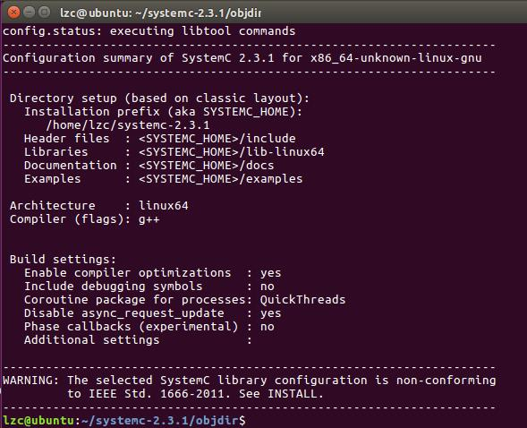

接着输入：

```r
sudo make install
```

返回到上一级目录(`cd ..`)，查看所有文件，并输出当前的工作路径（这个后续会用到）

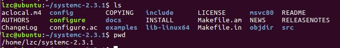

回到刚刚dol的那个文件夹`cd ../dol`，找到build_zip.xml这个文件

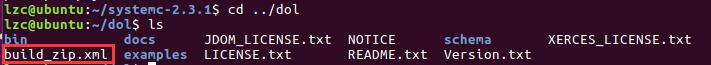

执行`sudo gedit build_zip.xml`命令，找到红色框中部分的两段代码：

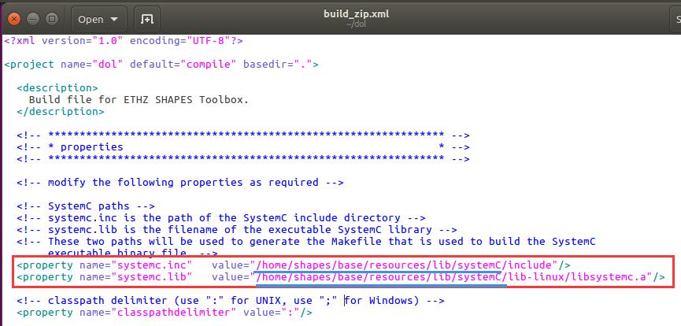

将蓝色部分的代码改为上面找到的systemC的工作路径，比如我的修改后则为：

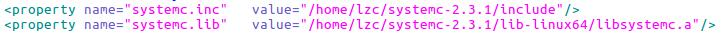

**注意：对于64位系统的机器，lib-linux要改成lib-linux64**，查询方式如下：

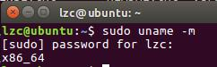

### 1.1.5. 编译dol

接着输入如下命令，成功后会显示BUILD SUCCESSFUL

```r
sudo ant -f build_zip.xml all
```

接着输入`cd build/bin/main`运行第一个例子，命令为：

```r
sudo ant -f runexample.xml -Dnumber=1
```

运行后得到如下结果就算成功啦

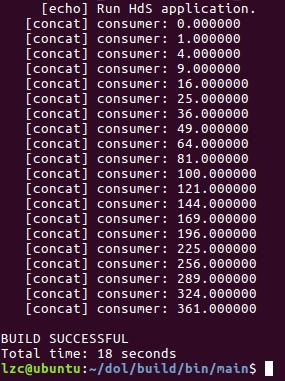

用ls命令发现在当前文件夹下多出了一个example1文件夹，打开后发现里面有个example1.dot文件

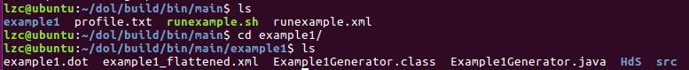

.dot文件需要xdot等软件才能打开，因此使用如下命令安装xodt：

```r
sudo apt-get install xdot
```

安装完成后执行`xdot example1.dot`可看到：

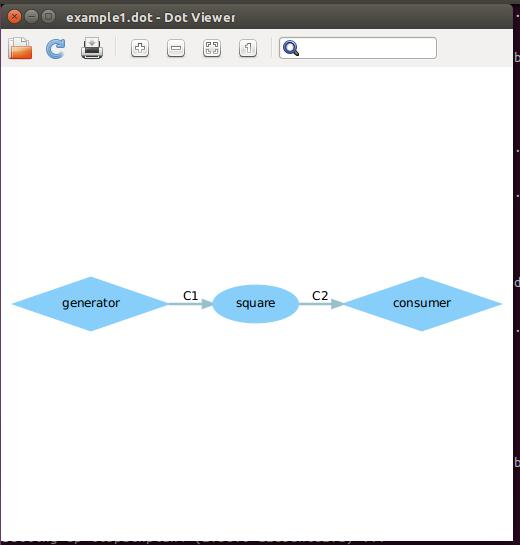

至此，环境搭建完成。

## 1.2. 相关理论知识

这次说是说DOL开发环境配置，但是这DOL到底是什么东西？

>分布式操作层（DOL）是用于编程并行应用程序的软件开发框架。DOL允许基于Kahn过程网络计算模型指定应用，并具有基于systemC的仿真引擎。此外，DOL提供基于XML的规范格式来描述多处理器系统上并行应用程序的实现，包括绑定和映射。

其框架图如下：

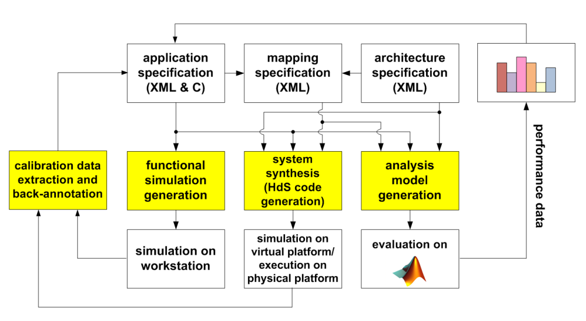

更多可参考这里：http://www.tik.ee.ethz.ch/~shapes/dol.html

除此之外，DOL还需要make，javac，ant等环境的支持，这又是些什么东西呢？

关于make:

>在开发一个系统时，一般是将一个系统分成几个模块，这样做提高了系统的可维护性，但由于各个模块间不可避免存在关联，所以当一个模块改动后，其他模块也许会有所更新，当然对小系统来说，手工编译连接是没问题，但是如果是一个大系统，存在很多个模块，那么手工编译的方法就不适用了。为此，在Linux系统中，专门提供了一个make命令来自动维护目标文件，与手工编译和连接相比，make命令的优点在于他只更新修改过的文件（在Linux中，一个文件被创建或更新后有一个最后修改时间，make命令就是通过这个最后修改时间来判断此文件是否被修改），而对没修改的文件则置之不理，并且make命令不会漏掉一个需要更新的文件。

关于makefile:

>Makefile文件可以理解为告诉make以何种方式编译源代码和链接程序的一个文件

更多可参考这里：

http://blog.csdn.net/yg_2012/article/details/38925161

http://blog.chinaunix.net/uid-9314244-id-2004686.html

关于ant：

>Ant是一种基于Java的build工具。理论上来说，它有些类似于（Unix）C中的make ，但没有make的缺陷。Ant本身就是一个流程脚本引擎，用于自动化调用程序完成项目的编译，打包，测试等。

其优点如下：

- 跨平台性。Ant是纯java语言编写的，所示具有很好的跨平台性。
- 操作简单。Ant是由一个内置任务和可选任务组成的。Ant运行时需要一个XML文件(构建文件)。
- 容易维护和书写，结构清晰。
- Ant可以集成到开发环境中。

更多可参考这里：

http://blog.163.com/qiangyongbin2000@126/blog/static/77517819201151653423687/

关于SystemC:

>SystemC是一组提供事件驱动的仿真接口的C++类和宏。这些设施使设计人员可以**模拟并发进程**，每个进程都使用简单的C++ 语法进行描述。SystemC进程可以在模拟实时环境中进行通信，使用C++提供的所有数据类型的信号，由SystemC库提供的其他数据类型以及用户定义的信号。在某些方面，SystemC刻意模拟硬件描述语言VHDL和Verilog，但更适合地描述为系统级建模语言。SystemC应用于系统级建模，架构探索，性能建模，软件开发，功能验证和高级综合。SystemC通常与电子系统级（ESL）设计以及事务级建模（TLM）相关联。

更多可参考这里：

https://en.wikipedia.org/wiki/SystemC

关于java和javac：

- javac命令用来编译java文件

- java命令可以执行生成的class文件

# 2. 附录

## 2.1. 执行命令时遇到的问题及解决办法

### 2.1.1. 执行命令：sudo apt-get install openjdk-7-jdk

在执行`sudo apt-get install openjdk-7-jdk`命令时出现如下问题：

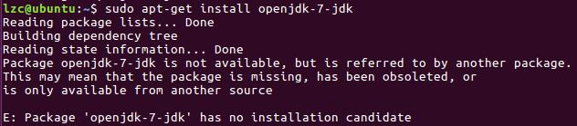

输入javac -v查询后如下：

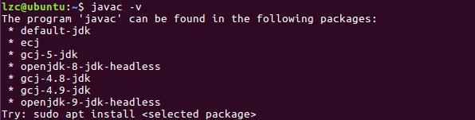

因此，可能在我的这个ubuntu下不能安装`openjdk-7-jdk`，因此可根据上图安装`openjdk-8-jdk`：

`sudo apt-get install openjdk-8-jdk`

安装后输如javac -version就可查询安装的版本了。

### 2.1.2. 其他可能遇到的问题及解决方案


1.sc_application没有找到，可能的三种原因如下：

- 1.1.systemC安装出问题，没有找到systemC的库，重新安装下systemC。
- 1.2.编译失败了，在所修改后的路径下没有找到文件。可能你的系统是32位的，用uname -a命令查。如果出现 x86_64,说明是64位的，如果是i686的，说明是32位的。根据位数来修改lib-linux。
- 1.3.中文系统会因为时间问题，导致runexample.xml文件编译出错，注释掉里面一段代码就行。具体看群文件。

2.xml文件双击打开后修改完无法保存。

因为里面的xml文件加锁了，只是普通的用户权限无法进行修改，需要root权限。可以在命令行用sudo gedit 文件名 指令来修改。也可以使用vi或vim命令去修改。

3.16.04的ubuntun需要安装jdk8，强行安装jdk7可能无法运行。

4.dot文件可以直接进入到对应文件夹，双击打开，打开时会提醒你安装xdot工具。安装后就能打开

## 2.2. 推荐阅读

1.[(SYSU)Embedded System 2016 by Gray][1]

[1]:http://durant35.github.io/2016/10/01/TACouses_Embedded_System_2016/#Overview
