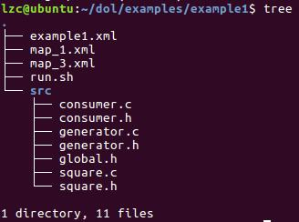
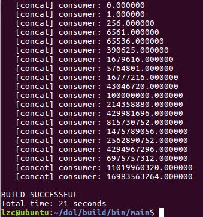
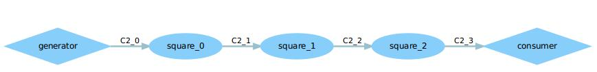
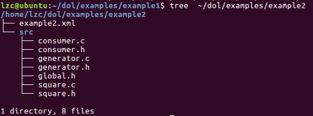
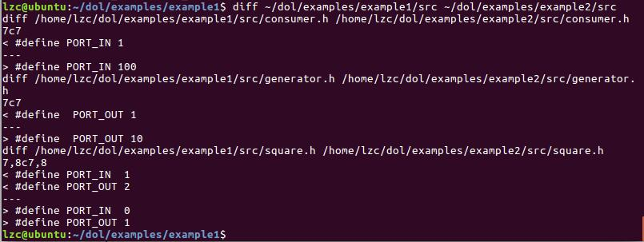
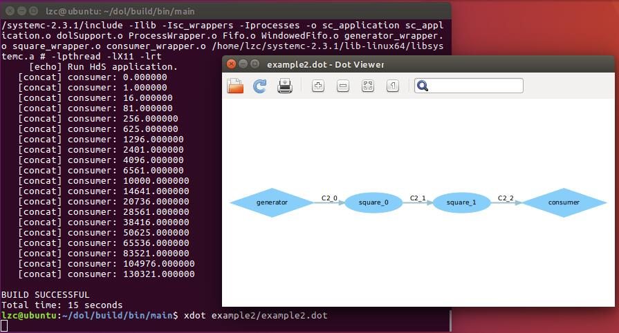
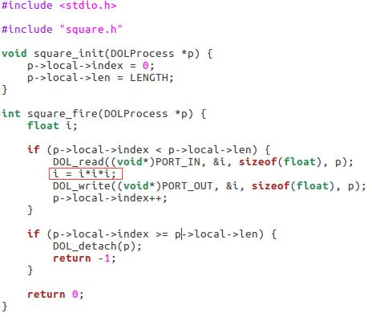
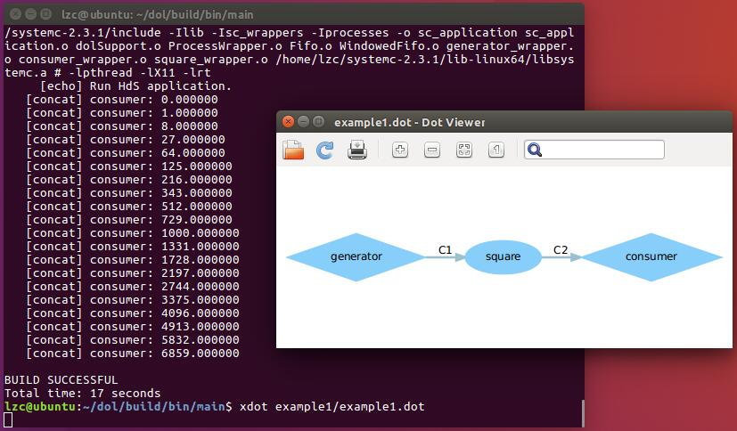

- [Lab 3 - DOL实例分析&编程](#lab-3---dol实例分析编程)
    - [example1分析](#example1分析)
    - [example2分析](#example2分析)
    - [实验任务](#实验任务)
        - [任务一：修改example2，让3个square模块变成2个](#任务一修改example2让3个square模块变成2个)
        - [任务二：修改example1，使其输出3次方数](#任务二修改example1使其输出3次方数)
        - [任务三：结合论文分析编译过程](#任务三结合论文分析编译过程)
- [附录](#附录)
    - [参考资料](#参考资料)
    - [额外收获](#额外收获)

<!-- /TOC -->
# Lab 3 - DOL实例分析&编程

接着上次实验的内容，这次实验分析上一次实验生成的example文件夹的内容。相关路径为：```~/dol/examples```。

## example1分析

以example1为例，该文件夹下有如下文件和文件夹：



先来看看example1.xml：

```xml
<?xml version="1.0" encoding="UTF-8"?>
<processnetwork 
xmlns="http://www.tik.ee.ethz.ch/~shapes/schema/PROCESSNETWORK" 
xmlns:xsi="http://www.w3.org/2001/XMLSchema-instance" 
xsi:schemaLocation="http://www.tik.ee.ethz.ch/~shapes/schema/PROCESSNETWORK
    http://www.tik.ee.ethz.ch/~shapes/schema/processnetwork.xsd" name="example1"> 

  <!-- processes -->
  <process name="generator"> 
    <port type="output" name="1"/>
    <source type="c" location="generator.c"/>
  </process>

  <process name="consumer"> 
    <port type="input" name="1"/> 
    <source type="c" location="consumer.c"/>
  </process>

  <process name="square"> 
    <port type="input" name="1"/>
    <port type="output" name="2"/>
    <source type="c" location="square.c"/>
  </process>

  <!-- sw_channels -->
  <sw_channel type="fifo" size="10" name="C1">
    <port type="input" name="0"/>
    <port type="output" name="1"/>
  </sw_channel>

  <sw_channel type="fifo" size="10" name="C2">
    <port type="input" name="0"/>
    <port type="output" name="1"/>
  </sw_channel>

  <!-- connections -->
  <connection name="g-c">
    <origin name="generator">
      <port name="1"/>
    </origin>
    <target name="C1">
      <port name="0"/>
    </target>
  </connection>

  <connection name="c-c">
    <origin name="C2">
      <port name="1"/>
    </origin>
    <target name="consumer">
      <port name="1"/>
    </target>
  </connection>

  <connection name="s-c">
    <origin name="square">
      <port name="2"/>
    </origin>
    <target name="C2">
      <port name="0"/>
    </target>
  </connection>

  <connection name="c-s">
    <origin name="C1">
      <port name="1"/>
    </origin>
    <target name="square">
      <port name="1"/>
    </target>
  </connection>

</processnetwork>
```

注：
- port中的name的值为整数，代表端口的编号，在相关的.h文件中有定义
- sw_channels中size代表缓冲区大小，name代表线的名字
- 每条线要有**2**个connection，从origin到target，name为线的名字（这个无关紧要）

对应下图，该文件提供系统架构（即**模块连接方式**）的定义，process对应**框**, sw_channel对应**线**（即通道定义）, connection对应**各个模块之间的连接**。


在这里，generator对应生产者，square对应处理模块，consumer对应消费者。

src文件夹内包含各进程（生产者，消费者，处理模块等）的功能定义，有.c和.h这两种文件，对应实现的模块，即是.dot文件中的框框的功能描述。每个模块要实现2个接口，xxx_init 和 xxx_fire两个函数，分别是初始化这个模块是干了什么，以及这个模块开始干的时候做什么。

接着来看generator.h和generator.c这两个文件：

```c
#ifndef GENERATOR_H
#define GENERATOR_H

#include <dol.h>
#include "global.h"

#define  PORT_OUT 1

typedef struct _local_states {
    int index;
    int len;
} Generator_State;

void generator_init(DOLProcess *);
int generator_fire(DOLProcess *);

#endif
```

```c
#include <stdio.h>
#include <string.h>

#include "generator.h"

// initialization function
void generator_init(DOLProcess *p) {
    p->local->index = 0;
    p->local->len = LENGTH;
}

int generator_fire(DOLProcess *p) {

    if (p->local->index < p->local->len) {
        float x = (float)p->local->index;
        //将x写到generator的端口“PORT_OUT”上
        DOL_write((void*)PORT_OUT, &(x), sizeof(float), p);
        p->local->index++;
    }

    if (p->local->index >= p->local->len) {
        DOL_detach(p);//销毁
        return -1;
    }

    return 0;
}
/*
注：DOL_write和DOL_detach都是DOL提供的APL接口。
*/
```

每个模块都要写上xxx_fire，其可能被执行无数次，至于xxx_init是可选择写或者不写的，其只会被执行一次（进行初始化操作）。

代码分析：

- generator_init：初始化函数，将当前位置置为0，设置生产者长度。这里的local指针指向的是.h文件的_local_states结构。

- generator_fire：信号产生函数，如果当前位置小于生产长度，则将x（这里是当前下标）写入到输出端，否则销毁进程。所以就是说，让这个程序被发射、开火、执行length次之后停下来。

再来看看consumer.h和consumer.c这两个文件：

```c
#ifndef CONSUMER_H
#define CONSUMER_H

#include <dol.h>
#include "global.h"

#define PORT_IN 1

typedef struct _local_states {
    char name[10];
    int index;
    int len;
} Consumer_State;

void consumer_init(DOLProcess *);
int consumer_fire(DOLProcess *);

#endif
```

```c
#include <stdio.h>

#include "consumer.h"

void consumer_init(DOLProcess *p) {
    sprintf(p->local->name, “consumer”); //就是p->local->name==“consumer”
    p->local->index = 0;
    p->local->len = LENGTH;
}
int consumer_fire(DOLProcess *p) {
    float c;
    if (p->local->index < p->local->len) {
        DOL_read((void*)PORT_IN, &c, sizeof(float), p);//读consumer的端口“PORT_IN”
        printf(“%s: %f\n”, p->local->name, c); //将结构输出到命令行
        p->local->index++;
    }
    if (p->local->index >= p->local->len) {
        DOL_detach(p);
        return -1;
    }
    return 0;
}
```

代码分析：

- consumer_init：初始化函数，含义同generator_init。
- consumer_fire：信号消费函数，若当前位置小于设定长度，则读出输入端信号，并且打印；否则销毁进程（停下来）。

再来看看square.c：

```c
int square_fire(DOLProcess *p) {
    float i;
    if (p->local->index < p->local->len) {
        //读square的端口“PORT_IN”,将值读到i
        DOL_read((void*)PORT_IN, &i, sizeof(float), p); 
        i = i*i;     //进行平方运算
        //写square的端口“PORT_OUT”,把 I 写到那个端口
        DOL_write((void*)PORT_OUT, &i, sizeof(float), p); 
        p->local->index++;
    }
    if (p->local->index >= p->local->len) {
        DOL_detach(p);
        return -1;
    }
    return 0;
}

```

该函数为信号处理函数，其读入输入端信号i，将其平方后写出到输出端，重复length次后停止。

简单地说，example1所做的事就是：由generator产生0-19的整数（length为20，初始值为0），square对这些数进行平方操作，最后由consumer输出结果。其运行结果如下：


## example2分析

首先输入如下命令运行example2：

```r
cd dol/build/bin/main
sudo ant -f runexample.xml -Dnumber=2
```

运行结果如下：



运行如下命令查看.dot文件：

```
cd example2
xdot example2.dot
```

可得结果：



比较该图与example1的结果，貌似两者有一些相似之处。下面来比较两个example的源码的不同之处。

首先，可看出example2下的文件结构如下：



可见src中的文件命名和example1的完全一样。

接着比较两者的src文件夹：```diff ~/dol/examples/example1/src ~/dol/examples/example2/src```



可以看到，除了端口号的定义不一样之外，函数的实现是和example1一样的，因此框框图中的process的功能是和example1一样的。

接着来比较example1.xml和example2.xml：```diff ~/dol/examples/example1/example1.xml ~/dol/examples/example2/example1.xml```

输出结果有些长，所以两个example的区别应该是这两个xml文件的区别，打开example2.xml后如下：

```xml
<?xml version="1.0" encoding="UTF-8"?>
<processnetwork 
xmlns="http://www.tik.ee.ethz.ch/~shapes/schema/PROCESSNETWORK" 
xmlns:xsi="http://www.w3.org/2001/XMLSchema-instance" 
xsi:schemaLocation=
"http://www.tik.ee.ethz.ch/~shapes/schema/PROCESSNETWORKhttp://www.tik.ee.ethz.ch/~shapes/schema/processnetwork.xsd"
name="example2"> 

  <variable value="3" name="N"/>

  <!-- instantiate resources -->
  <process name="generator">
    <port type="output" name="10"/>
    <source type="c" location="generator.c"/>
  </process>

  <iterator variable="i" range="N">
    <process name="square">
      <append function="i"/>
      <port type="input" name="0"/>
      <port type="output" name="1"/>
      <source type="c" location="square.c"/>
    </process>
  </iterator>

  <process name="consumer">
    <port type="input" name="100"/>
    <source type="c" location="consumer.c"/>
  </process>

  <iterator variable="i" range="N + 1">
    <sw_channel type="fifo" size="10" name="C2">
      <append function="i"/>
      <port type="input" name="0"/>
      <port type="output" name="1"/>
    </sw_channel>
  </iterator>

  <!-- instantiate connection -->
  <iterator variable="i" range="N">
    <connection name="to_square">
      <append function="i"/>
      <origin name="C2">
        <append function="i"/>
        <port name="1"/>
      </origin>
      <target name="square">
        <append function="i"/>
        <port name="0"/>
      </target>
    </connection>

    <connection name="from_square">
        <append function="i"/>
        <origin name="square">
          <append function="i"/>
          <port name="1"/>
        </origin>
        <target name="C2">
          <append function="i + 1"/>
          <port name="0"/>
        </target>
    </connection>
  </iterator>

  <connection name="g_">
    <origin name="generator">
     <port name="10"/>
    </origin>
    <target name="C2"> 
      <append function="0"/>
      <port name="0"/>
    </target>
  </connection>

  <connection name="_c">
    <origin name="C2">
      <append function="N"/>
      <port name="1"/>
    </origin>
    <target name="consumer">
      <port name="100"/>
    </target>
  </connection>

</processnetwork>
```

可以看到和example1的主要的区别就是：通过迭代器（iterator）定义了3个square模块。这里在.dot文件中也可以体现得出来。

因此，总的来说，example2所做的事就是：由generator产生0-19的整数（length为20，初始值为0），用3个square对这些数依次进行平方操作（所以总的效果是对这些数进行了8次方的操作），最后由consumer输出结果。

## 实验任务

### 任务一：修改example2，让3个square模块变成2个

在example2的分析中，可以发现，3个square模块是根据迭代器（iterator）来生成的。而迭代次数N是由如下代码声明的：

```xml
<variable value="3" name="N"/>
```

那么我们只需要将这行代码改为如下形式即可：

```xml
<variable value="2" name="N"/>
```

接着运行如下命令重新编译运行这个example：

```r
cd dol/build/bin/main
sudo rm -rf example2
sudo ant -f runexample.xml -Dnumber=2
xdot example2/example2.dot
```

运行结果如下，可见输出数据就是输入数据的4次方（2个square），符合预期。

**注意：如果这里没有运行```sudo rm -rf example2```来删除原有的example文件夹，那么修改的代码是不会生效的。**



### 任务二：修改example1，使其输出3次方数

首先，修改square.c这个文件，将红色区域的代码改为图中所示的代码：



接着运行如下命令重新编译运行这个example：

```r
cd dol/build/bin/main
sudo rm -rf example1
sudo ant -f runexample.xml -Dnumber=1
xdot example1/example1.dot
```

运行结果如下，可见输出数据就是输入数据的3次方，符合预期。



### 任务三：结合论文分析编译过程

问题：执行`sudo ant -f runexample.xml -Dnumber=1`的指令后，操作系统到底干了什么？

那么便来运行该命令，根据输出的结果逐步解释输出内容。

首先是输出一些运行环境相关的版本信息和一些文件的复制和创建操作。

值得注意的是，这里出现了一个名为`example1_flattened.xml`的文件，查看其内容后可发现其文件内容与后续在`~/dol/examples/example1`生成的example1.xml的内容基本一致，唯一的区别就是前者的xml标签里面多了一个为basename的属性（这个小区别应该无关紧要）。
```
Buildfile: /home/lzc/dol/build/bin/main/runexample.xml

showversion:

showantversion:
     [echo] Use Apache Ant(TM) version 1.9.6 compiled on July 8 2015.

showjavaversion1:
     [echo] Use Java version 1.8.0_131 (required version: 1.5.0 or higher).

showjavaversion2:

showjavacversion1:
     [echo] Use Java version 1.8.0_131 (required version: 1.5.0 or higher).

showjavacversion2:

runexample:

prepare:
     [echo] Create directory example1.
    [mkdir] Created dir: /home/lzc/dol/build/bin/main/example1
     [echo] Copy C source files.
    [mkdir] Created dir: /home/lzc/dol/build/bin/main/example1/src
     [copy] Copying 7 files to /home/lzc/dol/build/bin/main/example1/src

validate:
     [echo] check XML compliance of example1_flattened.xml.
     [java] /home/lzc/dol/examples/example1/example1.xml is valid.

flatten1:
     [echo] Create flattened XML example1_flattened.xml.
     [java] .....................................
    [javac] /home/lzc/dol/build/bin/main/runexample.xml:99: warning: 'includeantruntime' was not set, defaulting to build.sysclasspath=last; set to false for repeatable builds
    [javac] Compiling 1 source file to /home/lzc/dol/build/bin/main/example1

flatten2:
```

接下来开始运行DOL，这里有两个dol的执行步骤：dol1和dol2。

dol1根据用于XML process network description的`example1_flattened.xml`文件生成.dot文件，用于可视化。

```
dol1:
     [echo] Run DOL.
     [java] Read process network from XML file
     [java]  -- full filename: file:/home/lzc/dol/build/bin/main/example1/example1_flattened.xml
     [java]  -- Process network model from XML [Finished]
     [java] 
     [java] Consistency check:
     [java] APPL: Checking resource name ...
     [java] APPL: Checking channel ports ...
     [java] APPL: Checking channel connection ...
     [java] APPL: Checking Process connection ...
     [java]  -- Consistency check [Finished]
     [java] 
     [java] Generating ProcessNetwork in Dotty format:
     [java]  -- Generation [Finished]
     [java] 
     [java] Generating HdS package:
     [java]  -- Generation [Finished]
     [java] 
```

dol2则是根据 `example1_flattened.xml`和相关的C文件生成一个可执行的SystemC应用(sc_application就是System C application的简写)并输出该应用的功能仿真结果。

```
dol2:

execute:
     [echo] Make HdS application.
     [exec] g++ -g -O0 -Wall -D__DOL_ETHZ_GEN__  -DINCLUDE_PROFILER  -I/home/lzc/systemc-2.3.1/include -Ilib -Isc_wrappers -Iprocesses   -c -o sc_application.o sc_application.cpp
     [exec] sc_application.cpp: In constructor ‘sc_application::sc_application(sc_core::sc_module_name)’:
     [exec] sc_application.cpp:46:20: warning: deprecated conversion from string constant to ‘char*’ [-Wwrite-strings]
     [exec]      C2_ins("C2", 10)
     [exec]                     ^
     [exec] sc_application.cpp:46:20: warning: deprecated conversion from string constant to ‘char*’ [-Wwrite-strings]
     [exec] sc_application.cpp:46:20: warning: deprecated conversion from string constant to ‘char*’ [-Wwrite-strings]
     [exec] sc_application.cpp:46:20: warning: deprecated conversion from string constant to ‘char*’ [-Wwrite-strings]
     [exec] sc_application.cpp:46:20: warning: deprecated conversion from string constant to ‘char*’ [-Wwrite-strings]
     [exec] g++ -g -O0 -Wall -D__DOL_ETHZ_GEN__  -DINCLUDE_PROFILER  -I/home/lzc/systemc-2.3.1/include -Ilib -Isc_wrappers -Iprocesses   -c -o dolSupport.o lib/dolSupport.cpp
     [exec] g++ -g -O0 -Wall -D__DOL_ETHZ_GEN__  -DINCLUDE_PROFILER  -I/home/lzc/systemc-2.3.1/include -Ilib -Isc_wrappers -Iprocesses   -c -o ProcessWrapper.o lib/ProcessWrapper.cpp
     [exec] lib/ProcessWrapper.cpp: In constructor ‘ProcessWrapper::ProcessWrapper(sc_core::sc_module_name)’:
     [exec] lib/ProcessWrapper.cpp:16:51: warning: deprecated conversion from string constant to ‘char*’ [-Wwrite-strings]
     [exec]          _iteratorIndex[i] = getIndex(_name, "_", i);
     [exec]                                                    ^
     [exec] g++ -g -O0 -Wall -D__DOL_ETHZ_GEN__  -DINCLUDE_PROFILER  -I/home/lzc/systemc-2.3.1/include -Ilib -Isc_wrappers -Iprocesses   -c -o Fifo.o lib/Fifo.cpp
     [exec] g++ -g -O0 -Wall -D__DOL_ETHZ_GEN__  -DINCLUDE_PROFILER  -I/home/lzc/systemc-2.3.1/include -Ilib -Isc_wrappers -Iprocesses   -c -o WindowedFifo.o lib/WindowedFifo.cpp
     [exec] lib/WindowedFifo.cpp: In member function ‘virtual unsigned int WindowedFifo::capture(void**, unsigned int)’:
     [exec] lib/WindowedFifo.cpp:127:75: warning: operation on ‘((WindowedFifo*)this)->WindowedFifo::_tailRoom’ may be undefined [-Wsequence-point]
     [exec]          _tailRoom = (_tail + read) == _size ? 0 : _tailRoom = _tail + read;
     [exec]                                                                            ^
     [exec] g++ -g -O0 -Wall -D__DOL_ETHZ_GEN__  -DINCLUDE_PROFILER  -I/home/lzc/systemc-2.3.1/include -Ilib -Isc_wrappers -Iprocesses   -c -o generator_wrapper.o sc_wrappers/generator_wrapper.cpp
     [exec] g++ -g -O0 -Wall -D__DOL_ETHZ_GEN__  -DINCLUDE_PROFILER  -I/home/lzc/systemc-2.3.1/include -Ilib -Isc_wrappers -Iprocesses   -c -o consumer_wrapper.o sc_wrappers/consumer_wrapper.cpp
     [exec] g++ -g -O0 -Wall -D__DOL_ETHZ_GEN__  -DINCLUDE_PROFILER  -I/home/lzc/systemc-2.3.1/include -Ilib -Isc_wrappers -Iprocesses   -c -o square_wrapper.o sc_wrappers/square_wrapper.cpp
     [exec] g++ -g -O0 -Wall -D__DOL_ETHZ_GEN__  -DINCLUDE_PROFILER  -I/home/lzc/systemc-2.3.1/include -Ilib -Isc_wrappers -Iprocesses -o sc_application sc_application.o dolSupport.o ProcessWrapper.o Fifo.o WindowedFifo.o generator_wrapper.o consumer_wrapper.o square_wrapper.o /home/lzc/systemc-2.3.1/lib-linux64/libsystemc.a # -lpthread -lX11 -lrt
     [echo] Run HdS application.
   [concat] consumer: 0.000000
   [concat] consumer: 1.000000
   [concat] consumer: 8.000000
   [concat] consumer: 27.000000
   [concat] consumer: 64.000000
   [concat] consumer: 125.000000
   [concat] consumer: 216.000000
   [concat] consumer: 343.000000
   [concat] consumer: 512.000000
   [concat] consumer: 729.000000
   [concat] consumer: 1000.000000
   [concat] consumer: 1331.000000
   [concat] consumer: 1728.000000
   [concat] consumer: 2197.000000
   [concat] consumer: 2744.000000
   [concat] consumer: 3375.000000
   [concat] consumer: 4096.000000
   [concat] consumer: 4913.000000
   [concat] consumer: 5832.000000
   [concat] consumer: 6859.000000

BUILD SUCCESSFUL
Total time: 1 minute 1 second
```

# 附录

## 参考资料

1.[linux下tree命令详解][1]

2.[Linux文件夹文件创建、删除][2]


[1]:http://www.cnblogs.com/leijiangtao/archive/2014/06/08/3776280.html
[2]:http://www.cnblogs.com/end/archive/2012/06/05/2536835.html

## 额外收获

刚开始想从虚拟机复制代码到主机来写这篇总结，但是vmware-tool好像出了点问题（这家伙老是这样...），随后便找到了如下两个网站来共享代码：

- http://paste.ubuntu.com
- http://pasted.co

本来第一个网站已经可以满足需求了，但是它却不支持XML代码的分享，随后便找到了第二个网站。


