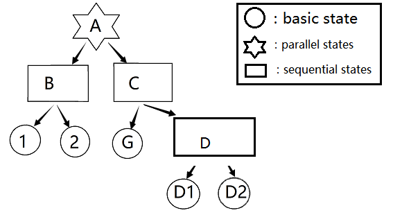
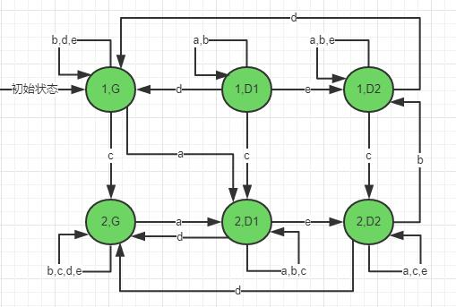
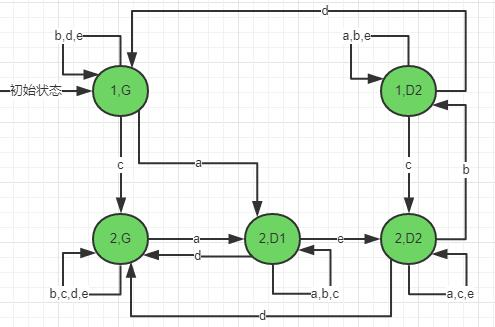
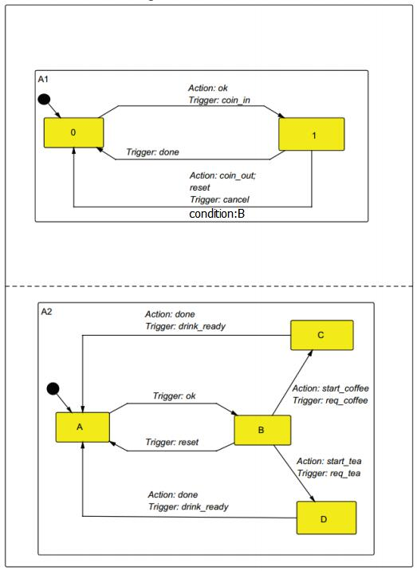

# exercise 1

### 1.What are the most important extensions of the StateChart model in comparison to an ordinary Finite state machine (FSM)?

解：

- 能表现出状态间的层次结构，方便我们对系统不同层次上的分析，更易于我们理解；
- 能表现状态间的并发性（比如And-Super-state这个概念的引入）；
- 状态间转移包含事件(event)、条件(condtion)、行动(action)；

### 2.What are the disadvantages of the StateChart formalism?

解：

- 对分布式应用程序建模效果差
- 对大型系统建模时由于过于复杂会显得不易理解
- 状态间转移中action的引入使得在分析系统状态时要变得困难
- 没有非功能行为的描述
- 不支持面向对象
- 没有结构层次的描述

### 3.Given the StateChart in Figure 1. Draw the state space of the StateChart as a tree, which shows the hierarchy of states anddenotes the state types (basic state, sequential states, and parallel states).

解：

注：这里的D从题目图中应是AND-super-state，但是由于D中只有子状态（该状态由D1、D2组成），因此为了画图简便以及简明层次结构，这里可将D视为OR-super-state。

### 4.How would you formally compute the set of states? Compute the set of states for the hierarchical automata which is defined by the StateChart from Fig.1

解：

### 5.The automaton defined by the StateChart from Fig. 1 passes through a number of states, when external events are applied.Show the sequence of state that are passed through, starting from the initial state, for the following sequence of events:a,b,e,b,d,b. Use a table notation.

解：

| 事件  | 状态B | 状态D | 状态C | 状态A |
| :---: | :---: | :---: | :---: | :---: |
| 初始  | 1     | D1    | G     | 1,G   |
| a     | 2     | D1    | D1    | 2,D1  |
| b     | 2     | D1    | D1    | 2,D1  |
| e     | 2     | D2    | D2    | 2,D2  |
| b     | 1     | D2    | D2    | 1,D2  |
| d     | 1     | D2    | G     | 1,G   |
| b     | 1     | D2    | G     | 1,G   |

### 6.Draw a finite state machine which is equivalent to the StateChart from Fig. 1. Minimize the number of states.

解：等价的FSM如下：

由于(1, D1)状态的入度为0，因此可将其删去，故最小化状态数目后有：

### 7.The StateChart model of a simplified vending machine is shown in Figure 2.

#### 7.1.Describe the trace of transitions occurring when the user inserts a coin and orders a tea.

解：状态转移序列如下：

A1：0 ------ coin_in/ok -----> 1

A2：A ------ ok -----> B

A2：B ------ req_tea/start_tea -----> D

A2：D ------ drink_ready/done -----> A

A1：1 ------ done -----> 0

#### 7.2.The control of the vending machine has a bug that allows the user to cheat. Describe the trace of transitions that illustrate the bug.

解：可以cheat的关键就是:利用A1的 1 --------cancel/coin_out,reset----------> 0 这条转移路径实现投了币后先取回币再点饮料的目的。在上题的基础上，可得到可以cheat的状态转移序列：

A1：0 ------ coin_in/ok -----> 1

A2：A ------ ok -----> B

A2：B ------ req_tea/start_tea -----> D

A1：1 --------cancel/coin_out,reset----------> 0     【这条便是关键】

A2：D ------ drink_ready/done -----> A

#### 7.3.Draw the corresponding StateChart that fixes the bug

解：要解决这个bug，就得针对上题提到的关键下手，就是用户投了币后，此时A1到达1状态，A2到达B状态,可cheat是因为在A2到达D状态（用户请求饮料）后紧接着A1可到达0状态（用户按下cancel），那么新的设计就可以设定为：用户请求饮料后就不能再退回钱币，即是说用户投币后只能在B状态进行退币行为，而进入D或者C状态就无法进行退币操作了。

因此，只需在A1的 1 --------cancel/coin_out,reset----------> 0 这条转移路径上加上一个condition:B就可以解决问题啦！

在原图的基础上修改后如下：

