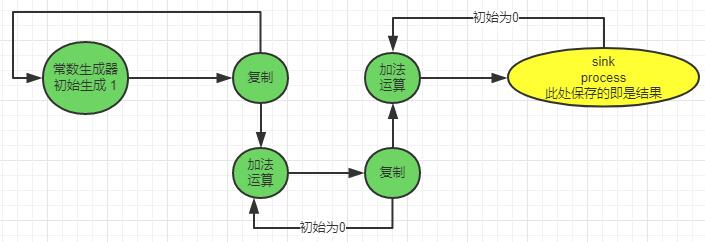

# exercise 2

## 第一题

### 判断两个算法的确定性，给出自己的证明。

解：

- 算法一：不确定的。
    - 原因：存在这样的一种情况——**相同的数据按照不同的顺序输入会得到不同的输出。**
    - 反例举例：假设L1要传送一个数据X1，L2要传送一个数据Y1，
        - 若按照X1先来Y1后来的顺序，输出结果是out[X1]、out[Y1];
        - 若按照Y1先来x1后来的顺序，输出结果是out[Y1]、out[X1];
        - 此时相同的数据按照不同的顺序输入会得到不同的输出。

- 算法二：确定的。
    - 原因：**相同的数据按照任意不同的顺序输入会得到相同的输出。**
    - 证明：假设L1要传送一个数据X1，L2要传送一个数据Y1，从算法伪代码可看出只有当L1和L2有数据时才会进行处理
        - 若按照X1先来Y1后来的顺序，则根据X1和Y1的长度进行相应的输出;
        - 若按照Y1先来X1后来的顺序，则同样根据X1和Y1的长度进行相应的输出;
        - 此时相同的数据按照任意不同的顺序会得到相同的输出，推广到任意多数据也成立。

### 判断两个算法的公平性。

解：

- 算法一：公平的。
    - 原因：只要L1和L2任意一个有数据到达都会有相应的输出，可以视为FIFO的处理模式，因此该算法是公平的。

- 算法二：不公平的。
    - 原因：**先到达的**长度较长的数据A不能比**后到达的**长度较短的数据B先进行处理，而若后续到达的数据的长度都比数据A的长度要短，那就会造成数据A一直无法被处理，因此该算法是不公平的。

## 第二题

### 绘制一个可生成n(n+1)/2的KPN

解：

## 第三题

### 得到两个SDF的拓扑矩阵

解：两个矩阵A、B依次如下：

### 判断两个矩阵是否是consistent的

解：

-  由于rank(A)=1且矩阵列数为2，因此A是consistent的。
-  由于rank(B)=2且矩阵列数为2，因此B不是consistent的。

### 若矩阵是consistent的，计算每个结点需要激活的次数

解：由于只有A是consistent的，解方程：

在a和b均为**满足条件的最小正整数**的约束下，可解得：a=1,b=1。

因此，a和b结点均需要激活一次。

## 第三题

### 得到图中SDF的拓扑矩阵

解：设该矩阵为A，则：

### 判断矩阵是否是consistent的

解：由于rank(A)=5且矩阵列数为6，因此A是consistent的。

### 若矩阵是consistent的，计算每个结点需要激活的次数

解：解如下方程：

在所有变量均为**满足条件的最小正整数**的约束下，可解得：Quelle=DCT=Q=RLC=77,C=R=1

因此，Quelle、DCT、Q、RLC这4个结点需要激活77次，C、R这2个结点需要激活1次。

