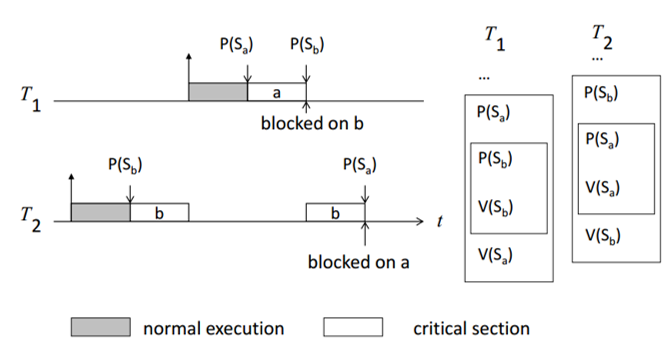
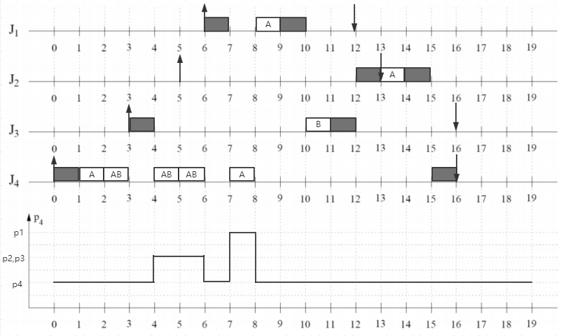
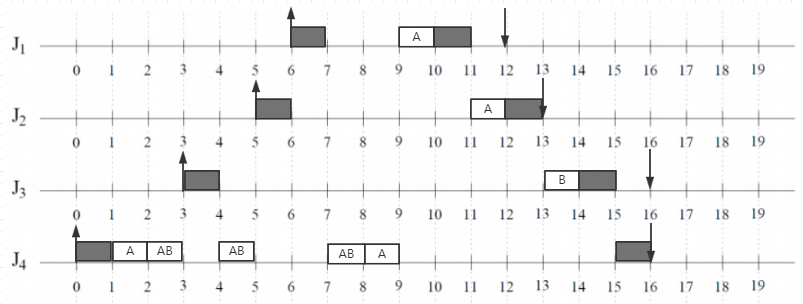

# exercise 3

## Ex 3.1

### 1. Explain the difference between private, shared and exclusive resources and give an example of problems encountered in exclusive resources.

答：

- private resources：私有资源，只能被单个线程或进程独自访问或修改的资源。
- shared resources：共享资源，能被多个线程或进程访问或修改的资源。
- exclusive resources：互斥资源，能被多个线程或进程访问或修改，但同一时刻只能有一个线程或进程在进行操作的资源。


互斥资源在多线程环境下会遇到问题的例子：

假设有这样的一个类SingleInstance，其在整个程序中只能有一个实例，其java代码如下：

```java
class SingleInstance{
    private static SingleInstance instance;
    private SingleInstance(){}
    public static SingleInstance getInstance(){
        /*************临界区代码***********/
        if(instance == null)//若还没有创建过实例
        {
            instance = new SingleInstance();//则新创建一个实例
        }
        //否则直接返回直接已经创建过的实例
        /*************临界区代码***********/
        return instance;
    }
}
```

其通过将类的构造方法设置为private使得用户不能在外部程序通过new关键字来创建实例，并只能通过调用getInstance()方法来得到实例。

尽管getInstance()方法中有通过if语句判断有无创建过实例来决定是否要新创建实例，但是在多线程环境下，可能存在着有多个线程同时进入了if语句，这样就会创建不只一个实例了，从而影响到最初只能有一个类实例的设计。

### 2.Propose three ways such that the problem occurring in Resource Sharing Problem of mutual exclusion (mutual exclusion) can be solved.

答：

- 使用信号量
- 不允许中断
- 使用静态调度

### 3. Explain the application of a possible solution of the previous part.

答：以信号量为例:

首先定义信号量S为大于0的整数，S>=0时代表并发的线程使用的资源实体数，S<0时其绝对值代表正在等待使用临界区的线程数。

接着是对信号量进行操作的PV操作：其由P操作原语和V操作原语组成（原语是不可中断的过程），具体定义如下：

- P（S）：
    - ①将信号量S的值减1，即S=S-1；
    - ②如果S>=0，则该进程继续执行；否则该进程置为等待状态，排入等待队列。

- V（S）：
    - ①将信号量S的值加1，即S=S+1；
    - ②如果S>0，则该进程继续执行；否则释放队列中第一个等待信号量的进程。

这样就可用信号量及PV操作来实现进程的同步和互斥。


具体应用：这里依旧以Ex3.1中题1举例的问题为例并给出其解决方法。

首先声明信号量mutex为1，表示一次只能有一个线程进入临界区。并在进入临界区之前线程进行P操作，离开临界区后线程进行V操作。

由于实际要用java代码实现这个思路需要涉及许多额外的java知识，因此这里便只简单地写出思路。

```java
class SingleInstance{
    private static int mutex = 1;

    private static SingleInstance instance;
    private SingleInstance(){}
    public static SingleInstance getInstance(){
        /*************临界区代码***********/
        P(mutex);//进行P操作
        if(instance == null)//若还没有创建过实例
        {
            instance = new SingleInstance();//则新创建一个实例
        }
        V(mutex);//进行V操作
        //否则直接返回直接已经创建过的实例
        /*************临界区代码***********/
        return instance;
    }
}
```

# Ex 3.2

### 1. In the lecture you learned about the Priority Inheritance Protocol (PIP). Does the PIP solve the problem of deadlocks? Give a brief explanation for your response.

答：PIP算法不能避免死锁，下面给出一个例子。线程T1优先级高于T2，整个流程如下：

- T2先运行，申请并占有资源b
- T1抢占T2并运行，申请并占有资源a
- T1申请资源b，但由于资源a被T2占有，T1阻塞
- T2**继承**T1的优先级接着运行，并申请资源a，此时T2也阻塞
- 发生死锁



### 2. Given are the four tasks J1, J2, J3 and J4. The table below contains information on their arrival times, deadlines, their execution time and priorities. The tasks with fixed priorities should be handled by a fixed priority scheduling processor as far as possible within their deadlines.create a scheduling with the Priority Inheritance Protocol and fill out the chart prepared below. Highlight the critical Portions of the tasks with the letters A and B as specified in the last line of the table . Please also characterized p4 which is the active priority of Task J4 in the given diagram. Note: Pay close attention to the priorities of the individual tasks!

答：以上箭头标识task到达时间，以下箭头标识task的dealline，绘制下图：



### 3. Are all deadlines satisfied through the application of the PIP? If not, how big is the maximum delay (maximum lateness) in units of time?

答：不是，任务J2的完成时间超过了其deadline两个单位时间。

### 4. Is there a schedule for the tasks specified J1 to J4 that meets all deadlines? What changes should be made to the priority? If there is a correct schedule, please show it in the graph provided below. Otherwise, explain why there can be no correct schedule.

答：根据题意，应是依旧使用PIP算法，并且还可以修改task的优先级。原先不能满足所有task都在deadline之前完成的task优先级是：J1>J2=J3>J4，然后是J2不能按时完成。而J2的可运行时间（deadline减去check in）是仅次于J1的，而在之前的task执行过程中，J2优先级等于J3，而J4在J2到达时由于继承了J3的优先级后与J2优先级相等，因此J4接着运行。而J4的可运行时间明显比J2要长，因此可尝试将优先级改为J1>J2>J3>J4来测试效果，验证后所有task都能在deadline执行完毕，对应运行图如下：



