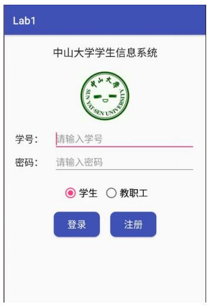
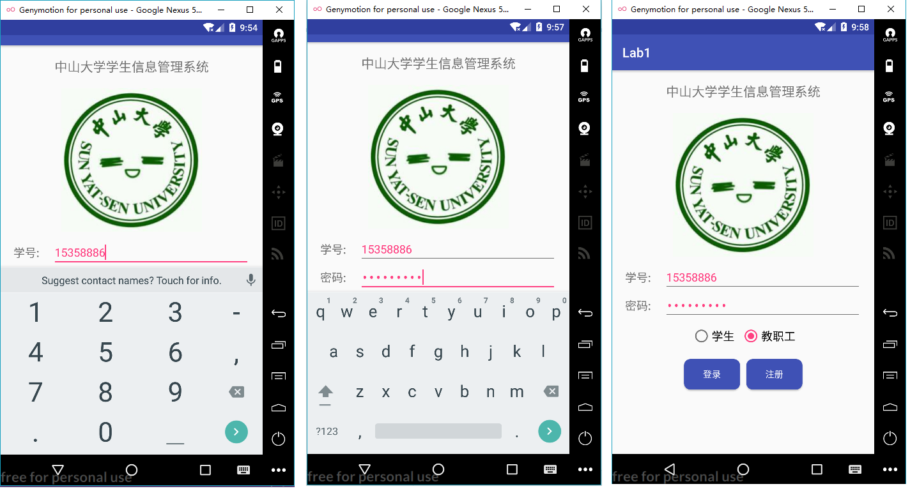
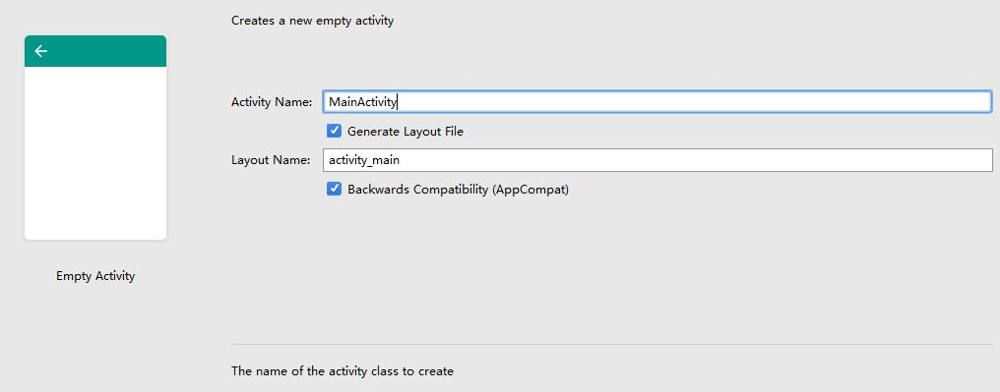
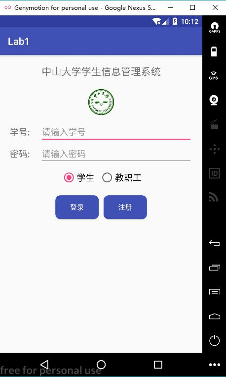

<!-- TOC -->

- [lab1 - 基本UI界面设计](#lab1---基本ui界面设计)
    - [实验内容](#实验内容)
    - [实验结果](#实验结果)
    - [实验过程](#实验过程)
        - [实验步骤](#实验步骤)
            - [step1: 实现标题的居中显示](#step1-实现标题的居中显示)
            - [step2: 实现图像的居中显示](#step2-实现图像的居中显示)
            - [step3: 实现两个输入框的显示](#step3-实现两个输入框的显示)
            - [step4: 实现两个单选按钮的居中显示](#step4-实现两个单选按钮的居中显示)
            - [step5: 实现两个按钮的居中显示](#step5-实现两个按钮的居中显示)
        - [遇到的困难及解决思路](#遇到的困难及解决思路)
    - [实验思考及感想](#实验思考及感想)

<!-- /TOC -->
# lab1 - 基本UI界面设计

## 实验内容

实现一个Android 应用，界面呈现如下效果：



要求：
- 1.该界面为应用启动后看到的第一个界面
- 2.各控件的要求如下：
    - 要求只用一个 ConstraintLayout 实现整个布局；
    - 标题字体大小 20sp，与顶部距离 20dp，居中；
    - 图片与标题的间距为 20dp，居中;
    - 输入框整体距屏幕右边间距 20dp，上下两栏间距 20dp，内容（包括提示内容）如图所示，内容字体大小 18sp；
    - 学号对应的 EditText 只能输入数字，密码对应的 EditText 输入方式为密码；
    - 两个单选按钮整体居中，字体大小 18sp，间距 10dp，默认选中的按钮为第一个；
    - 两个按钮整体居中，与上方控件间距 20dp，按钮间的间距 10dp，文字大小 18sp；
    - 按钮背景框左右边框与文字间距 10dp，上下边框与文字间距 5dp，圆角半径 10dp，背景色为#3F51B5
- 3.使用的布局和控件：ConstraintLayout、TextView、EditText、Button、ImageView、RadioGroup、RadioButton 

## 实验结果

使用Genymotion中的Google Nexus 5X -7.1.0 - API25 -1080x1920模拟器运行后的结果如下：


功能测试及结果：

- 1.测试学号输入框是否只能为数字（见如下左图）：正确，使用虚拟键盘输入时只能输入数字。
- 2.测试密码输入框是否只显示密码点（见如下中图）：正确，只显示密码点。
- 3.测试单选按钮是否可用（见如下右图）：正确，默认选择“学生”，可换成“教职工”。

测试结果图如下：



## 实验过程

### 实验步骤

首先，新建工程时选择“Empty Activity”，该Activity默认设置为应用启动时第一个加载的Activity，这样就可以省去新建布局文件、编写java代码、在注册文件中注册该Activity的麻烦步骤了。接下来需要就可以把重心移到activity_main.xml的编写中了。



activity_main.xml创建时默认选择是ConstraintLayout。

#### step1: 实现标题的居中显示

```xml
    <TextView
        android:id="@+id/title"
        android:layout_width="wrap_content"
        android:layout_height="wrap_content"
        android:text="中山大学学生信息管理系统"
        android:textSize="20sp"
        app:layout_constraintTop_toTopOf="parent"
        app:layout_constraintLeft_toLeftOf="parent"
        app:layout_constraintRight_toRightOf="parent"
        android:layout_marginTop="20dp" />
```

#### step2: 实现图像的居中显示

```xml
    <ImageView
        android:id="@+id/image"
        android:layout_width="wrap_content"
        android:layout_height="wrap_content"
        android:src="@drawable/sysu"
        app:layout_constraintTop_toBottomOf="@+id/title"
        app:layout_constraintLeft_toLeftOf="parent"
        app:layout_constraintRight_toRightOf="parent"
        android:layout_marginTop="20dp" />
```

#### step3: 实现两个输入框的显示

```xml
  <TextView
        android:id="@+id/textview1"
        android:layout_width="wrap_content"
        android:layout_height="wrap_content"
        android:text="学号:"
        android:textSize="18sp"
        app:layout_constraintLeft_toLeftOf="parent"
        app:layout_constraintTop_toBottomOf="@+id/image"
        android:layout_marginTop="20dp"
        android:layout_marginLeft="20dp"
        android:layout_marginStart="20dp" />

    <EditText
        android:layout_width="0dp"
        android:layout_height="wrap_content"
        android:gravity="left"
        android:textSize="18sp"
        android:hint="请输入学号"
        android:inputType="number"
        android:textColor="@color/colorAccent"
        app:layout_constraintLeft_toRightOf="@+id/textview1"
        app:layout_constraintTop_toBottomOf="@+id/image"
        app:layout_constraintRight_toRightOf="parent"
        android:layout_marginTop="10dp"
        android:layout_marginLeft="20dp"
        android:layout_marginRight="20dp"
        android:layout_marginStart="20dp"
        android:layout_marginEnd="20dp" />
```        

```xml
    <TextView
        android:id="@+id/textview2"
        android:layout_width="wrap_content"
        android:layout_height="wrap_content"
        android:text="密码:"
        android:textSize="18sp"
        app:layout_constraintLeft_toLeftOf="parent"
        app:layout_constraintTop_toBottomOf="@+id/textview1"
        android:layout_marginTop="20dp"
        android:layout_marginLeft="20dp"
        android:layout_marginStart="20dp" />

    <EditText
        android:layout_width="0dp"
        android:layout_height="wrap_content"
        android:gravity="left"
        android:textSize="18sp"
        android:hint="请输入密码"
        android:inputType="textPassword"
        android:textColor="@color/colorAccent"
        app:layout_constraintLeft_toRightOf="@+id/textview2"
        app:layout_constraintTop_toBottomOf="@+id/textview1"
        app:layout_constraintRight_toRightOf="parent"
        android:layout_marginTop="10dp"
        android:layout_marginLeft="20dp"
        android:layout_marginRight="20dp"
        android:layout_marginStart="20dp"
        android:layout_marginEnd="20dp" />
```

#### step4: 实现两个单选按钮的居中显示

```xml
    <RadioGroup
        android:id="@+id/radioGroup"
        android:layout_width="wrap_content"
        android:layout_height="wrap_content"
        android:orientation="horizontal"
        app:layout_constraintTop_toBottomOf="@id/textview2"
        app:layout_constraintLeft_toLeftOf="parent"
        app:layout_constraintRight_toRightOf="parent"
        android:layout_marginTop="20dp">

        <RadioButton
            android:id="@+id/radioButton1"
            android:layout_width="wrap_content"
            android:layout_height="wrap_content"
            android:checked="true"
            android:text="学生"
            android:textSize="18sp"/>
        <RadioButton
            android:id="@+id/radioButton2"
            android:layout_width="wrap_content"
            android:layout_height="wrap_content"
            android:layout_marginLeft="10dp"
            android:text="教职工"
            android:textSize="18sp"/>
    </RadioGroup>
```

#### step5: 实现两个按钮的居中显示

首先需要编写一条Guideline：

```xml
    <android.support.constraint.Guideline
        android:id="@+id/guideline"
        android:layout_width="wrap_content"
        android:layout_height="wrap_content"
        android:orientation="vertical"
        app:layout_constraintGuide_percent="0.5" />
```

再让这两个button向其对齐：

```xml
    <Button
        android:id="@+id/button1"
        android:background="@drawable/my_button"
        android:layout_width="wrap_content"
        android:layout_height="wrap_content"
        android:text="登录"
        android:textColor="@color/colorPrimaryWhite"
        app:layout_constraintTop_toBottomOf="@id/radioGroup"
        app:layout_constraintRight_toLeftOf="@id/guideline"
        android:layout_marginRight="5dp"
        android:layout_marginTop="20dp" />

    <Button
        android:id="@+id/button2"
        android:background="@drawable/my_button"
        android:layout_width="wrap_content"
        android:layout_height="wrap_content"
        android:text="注册"
        android:textColor="@color/colorPrimaryWhite"
        app:layout_constraintTop_toBottomOf="@id/radioGroup"
        app:layout_constraintLeft_toRightOf="@id/guideline"
        android:layout_marginLeft="5dp"
        android:layout_marginTop="20dp"/>
```

这里的button的形状需要自行实现（参考[这里][1]），实现文件放在drawable文件夹的my_button.xml中，代码如下：

```xml
<?xml version="1.0" encoding="utf-8"?>
<shape xmlns:android="http://schemas.android.com/apk/res/android"
    android:shape="rectangle">

    <corners android:radius="10dp"/>

    <padding
        android:top="10dp"
        android:bottom="10dp"
        android:left="20dp"
        android:right="20dp"/>

    <solid android:color="#3F51B5" />

</shape>
```

[1]:http://blog.csdn.net/sysukehan/article/details/52022307

### 遇到的困难及解决思路

一、sysu.jpg这个图像显示比示例的小，显示效果如下：



- 解决方案：这里我是将sysu.jpg这张图片放到了mipmap文件夹中，将其放到darwable文件夹后就可以正常显示了。

二、“登录”和“注册”这两个按钮的居中显示。

- 解决方案：新建一条竖直放置于屏幕中间的Guideline，并设置两个button向其对齐即可。


## 实验思考及感想

第一次用AS实现Android应用，光是配置Genymotion这个模拟器就花了好久的时间。在做实验的过程中，有很多概念也是不清晰的，所以便是一边看课件一边上网百度做出来的。不过，刚开始由于什么都不懂，看到实验要求也是吓了一跳，竟然有辣么多的要求。在经历了许多的折腾把实验完成之后，不禁感慨“纸上得来终觉浅，绝知此事要躬行”呀hhh，觉得安卓也蛮有趣的，这阵子有空得去跟着官方文档学一波٩(๑❛ᴗ❛๑)۶


