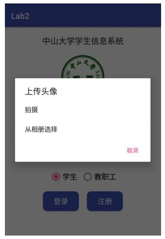
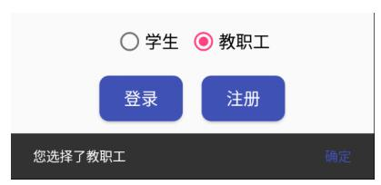
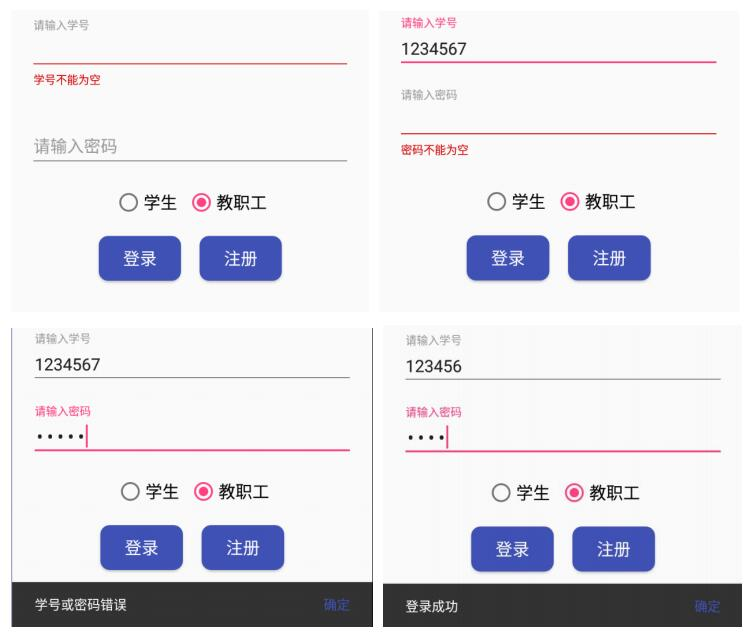
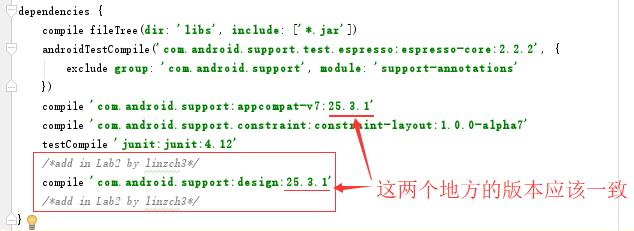
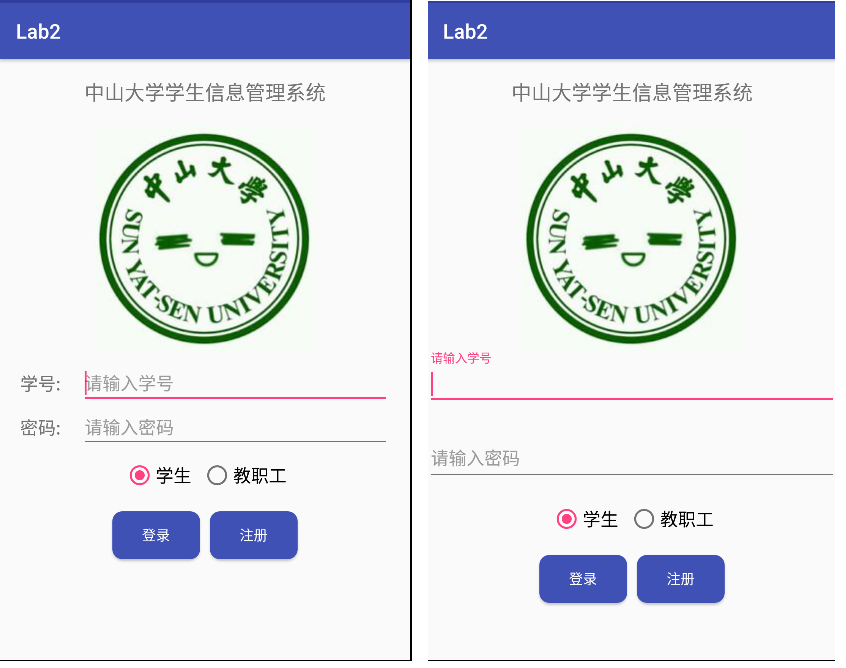
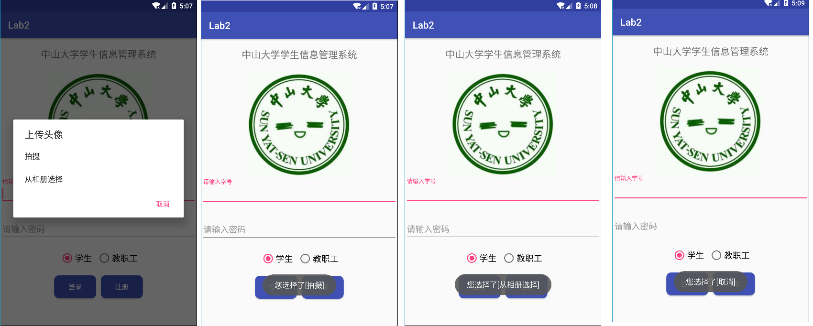
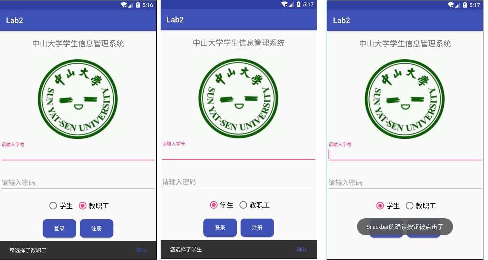
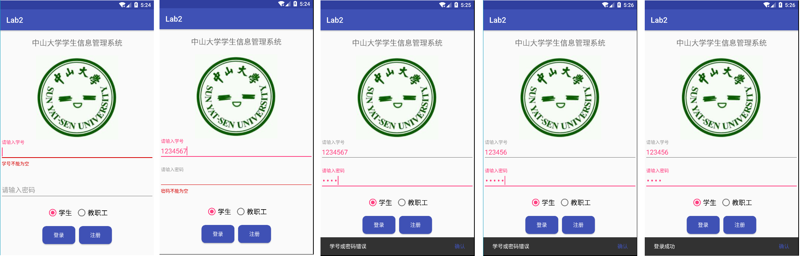
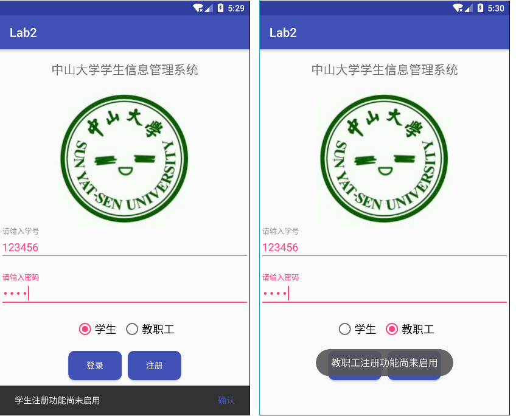

<!-- TOC -->

- [1. 实验目的](#1-实验目的)
- [2. 实验内容](#2-实验内容)
- [3. 实验过程](#3-实验过程)
    - [3.1. 实验步骤](#31-实验步骤)
        - [3.1.1. step1:实现实验基础界面](#311-step1实现实验基础界面)
            - [3.1.1.1. 实现效果](#3111-实现效果)
        - [3.1.2. step2:实现图片点击事件处理](#312-step2实现图片点击事件处理)
            - [3.1.2.1. 实现效果](#3121-实现效果)
        - [3.1.3. step3:实现单选按钮点击事件处理](#313-step3实现单选按钮点击事件处理)
            - [3.1.3.1. 实现效果](#3131-实现效果)
        - [3.1.4. step4:实现登录按钮点击事件处理](#314-step4实现登录按钮点击事件处理)
            - [3.1.4.1. 实现效果](#3141-实现效果)
        - [3.1.5. step5:实现注册按钮点击事件处理](#315-step5实现注册按钮点击事件处理)
            - [3.1.5.1. 实现效果](#3151-实现效果)
    - [3.2. 遇到的困难及解决思路](#32-遇到的困难及解决思路)
- [4. 实验思考及感想](#4-实验思考及感想)

<!-- /TOC -->

# 1. 实验目的

- 1.了解 Android 编程基础
- 2.熟悉 ImageView、Button、RadioButton 等基本控件，能够处理这些控件的基本事件
- 3.学会弹出基本的对话框，能够定制对话框中的内容，能对确定和取消按钮的事件做处理
    
# 2. 实验内容


实现一个 Android 应用，界面呈现与实验一基本一致，要求：

- 该界面为应用启动后看到的第一个界面

- 输入学号和密码的控件要求用 TextInputLayout 实现

- 点击图片，弹出对话框如下图

    - 点击“拍摄”选项，弹出 Toast 信息“您选择了[拍摄]”；

    - 点击“从相册选择”选项，弹出 Toast 信息“您选择了[从相册选择]；
    
    - 点击“取消”按钮，弹出 Toast 信息“您选择了[取消]”。
    


-  切换 RadioButton 的选项，弹出 Snackbar 提示“您选择了 xx”；
    - 例如从选项“学生”切换到选项“教职工”，则提示“您选择了教职工”；



- 点击 Snackbar 上的“确定”按钮，则弹出 Toast 信息“Snackbar 的确定按钮被点击了”

- 点击登录按钮
    - 依次判断学号是否为空，密码是否为空，用户名和密码是否正确（正确的学号和密码分别为“123456”，“6666”）；不正确则给出错误信息，如学号和密码都正确则提示“登陆成功”，如图：



- 点击注册按钮
    -如果切换选项时，RadioButton 选中的是“学生”，那么弹出 Snackbar 信息“学生注册功能尚未启用”，如果选中的是“教职工”，那么弹出 Toast 信息“教职工注册功能尚未启用”。


# 3. 实验过程

## 3.1. 实验步骤

### 3.1.1. step1:实现实验基础界面

在上一次实验的基础之上，这次实验在界面布局上需要做的修改就是:

- 去除输入学号和密码两个EditText左边的两个TextView
- 重新用TextInputLayout实现输入学号和密码的控件

TextInputLayout是Android Design Support Library中的一个控件，用于接受用户输入，与 EditText配合使用有更好的用户体验，TextInputLayout 集合了输入提示，报错等功能，并且自带动画效果。

关于TextInputLayout，需要注意的两点是：

- TextInputLayout不能单独使用，必须和EditText嵌套使用。

- 1个TextInputLayout只能包1个EditTExt。

若想在预览中看到TextInputLayout布局的效果，我们需要修改对Grade Scripts的build.gradle(Module: app)文件中的配置 —— 在dependencies中添加下图红色框框中的代码 `compile 'com.android.support:design:25.3.1'`：



接下来在activity_main.xml中修改代码，关键代码如下，除此之外还需修改部分id和相关控件的对齐，由于代码过长这里便不贴出来了。

```xml
  <android.support.design.widget.TextInputLayout
        android:id="@+id/usernameWrapper"
        android:layout_width="match_parent"
        android:layout_height="wrap_content"
        app:layout_constraintLeft_toLeftOf="parent"
        app:layout_constraintTop_toBottomOf="@+id/image"
        app:layout_constraintRight_toRightOf="parent"
        >
        <EditText
            android:id="@+id/username"
            android:layout_width="match_parent"
            android:layout_height="wrap_content"
            android:gravity="left"
            android:textSize="18sp"
            android:hint="请输入学号"
            android:inputType="number"
            android:textColor="@color/colorAccent" />
    </android.support.design.widget.TextInputLayout>


    <android.support.design.widget.TextInputLayout
        android:id="@+id/passwordWrapper"
        android:layout_width="match_parent"
        android:layout_height="wrap_content"
        app:layout_constraintLeft_toLeftOf="parent"
        app:layout_constraintTop_toBottomOf="@id/usernameWrapper"
        app:layout_constraintRight_toRightOf="parent"
        android:layout_marginTop="20dp">
        <EditText
            android:id="@+id/password"
            android:layout_width="match_parent"
            android:layout_height="wrap_content"
            android:gravity="left"
            android:textSize="18sp"
            android:hint="请输入密码"
            android:inputType="textPassword"
            android:textColor="@color/colorAccent" />
    </android.support.design.widget.TextInputLayout>
```

#### 3.1.1.1. 实现效果

修改前的界面（左图）和修改后的界面（右图）比较如下：



符合预期效果。

### 3.1.2. step2:实现图片点击事件处理

从这一步开始就要在MainActivity.java上写代码了，以下相关函数的实现均在onCreate函数中。

首先需要在MainActivity类中声明如下变量：

```java
private ImageView image;
```

并在onCreate函数得到对应的View对象：

```java
image = (ImageView) findViewById(R.id.image);
```

接着实现image的事件监听函数：

```java
image.setOnClickListener(new OnClickListener(){
    String [] uploadChoices = new String [] {"拍摄","从相册选择"};//上传图片的两个选择
    public void onClick(View v){
        new Builder(MainActivity.this)
            .setTitle("上传头像")
            .setItems(uploadChoices, new DialogInterface.OnClickListener(){
                @Override
                public void onClick(DialogInterface dialog, int which) {
                    dialog.dismiss();//隐藏窗口
                    Toast.makeText(MainActivity.this, "您选择了["+uploadChoices[which]+"]", Toast.LENGTH_SHORT).show();
                }
            })
            .setNegativeButton("取消", new DialogInterface.OnClickListener() {
                @Override
                public void onClick(DialogInterface dialog, int which) {
                    Toast.makeText(MainActivity.this, "您选择了[取消]", Toast.LENGTH_SHORT).show();
                }
            })
            .create().show();
    }
});
```

#### 3.1.2.1. 实现效果

下图从左到右依次为点击图片、点击“拍摄”选项、点击“从相册选择”选项，点击“取消”按钮的结果：



符合预期效果。

### 3.1.3. step3:实现单选按钮点击事件处理

由于在随后的代码中都有用到Snackbar的“确认”按钮的点击事件监听器，因此这里先将其实现出现，以供后续调用。

```java
/*点击确认按钮后的监听器*/
final View.OnClickListener confirmListener = new View.OnClickListener(){
    @Override
    public void onClick(View v){
        Toast.makeText(MainActivity.this, "Snackbar的确认按钮被点击了", Toast.LENGTH_SHORT).show();
    }
};
```
首先需要在MainActivity类中声明如下变量：

```java
private RadioGroup radioGroup;
private int radio_checkedId;//记录哪个radioButton是当前被选中的
```

并在onCreate函数得到对应的对象：

```java
radioGroup = (RadioGroup) findViewById(R.id.radioGroup);
radio_checkedId = R.id.student_radioButton;//默认情况
```

下面便是本部分的实现代码：

```java
radioGroup.setOnCheckedChangeListener(new RadioGroup.OnCheckedChangeListener(){
    @Override
    public void onCheckedChanged(RadioGroup group, @IdRes int checkedId){

        if(checkedId == R.id.student_radioButton){
            Snackbar.make(radioGroup, "您选择了学生", Snackbar.LENGTH_SHORT)
                    .setAction("确认", confirmListener)
                    .setActionTextColor(getColor(R.color.colorPrimary))
                    .setDuration(5000)
                    .show();
            radio_checkedId = R.id.student_radioButton;//记录当前选中的单选按钮
        }else if(checkedId == R.id.teacher_radioButton){
            Snackbar.make(radioGroup, "您选择了教职工", Snackbar.LENGTH_SHORT)
                    .setAction("确认",confirmListener)
                    .setActionTextColor(getColor(R.color.colorPrimary))
                    .setDuration(5000)
                    .show();
            radio_checkedId = R.id.teacher_radioButton;
        }
    }
});
```

#### 3.1.3.1. 实现效果

下图从左到右依次为单选按钮切换到教职工、单选按钮切换到学生，点击“确认按钮”的结果：



符合预期效果。

### 3.1.4. step4:实现登录按钮点击事件处理

首先需要在MainActivity类中声明如下变量：

```java
private Button login_button;
private TextInputLayout username;
private TextInputLayout password;
```

并在onCreate函数得到对应的View对象：

```java
login_button = (Button) findViewById(R.id.login_button);
username = (TextInputLayout) findViewById(R.id.usernameWrapper);
password = (TextInputLayout) findViewById(R.id.passwordWrapper);
```

下面便是本部分的实现代码：

```java
login_button.setOnClickListener(new OnClickListener() {
    @Override
    public void onClick(View v) {
        String number = username.getEditText().getText().toString();
        String pw = password.getEditText().getText().toString();
        if(TextUtils.isEmpty(number)){
            username.setErrorEnabled(true);
            username.setError("学号不能为空");
        }else{
            username.setErrorEnabled(false);//注意及时将报错信息关闭，下同
            if(TextUtils.isEmpty(pw)){
                password.setErrorEnabled(true);
                password.setError("密码不能为空");
            }else{
                password.setErrorEnabled(false);
                if(TextUtils.equals(number, "123456")&&TextUtils.equals(pw, "6666")) {
                    Snackbar.make(login_button, "登录成功", Snackbar.LENGTH_SHORT)
                            .setAction("确认",confirmListener)
                            .setActionTextColor(getColor(R.color.colorPrimary))
                            .setDuration(5000)
                            .show();
                }else{
                    Snackbar.make(login_button, "学号或密码错误", Snackbar.LENGTH_SHORT)
                            .setAction("确认",confirmListener)
                            .setActionTextColor(getColor(R.color.colorPrimary))
                            .setDuration(5000)
                            .show();
                }
            }
        }
    }
});
```

#### 3.1.4.1. 实现效果

下图从左到右依次为学号为空时、密码为空时，学号输入错误，密码输入错误、学号和密码均输入正确这5种情况时点击登录按钮的结果：



符合预期效果。

### 3.1.5. step5:实现注册按钮点击事件处理

首先需要在MainActivity类中声明如下变量：

```java
private Button register_button;
```

并在onCreate函数得到对应的View对象：

```java
register_button = (Button) findViewById(R.id.register_button);
```

下面便是本部分的实现代码：

```java
register_button.setOnClickListener(new OnClickListener() {
    @Override
    public void onClick(View v) {
        if(radio_checkedId == R.id.student_radioButton){
            Snackbar.make(register_button, "学生注册功能尚未启用", Snackbar.LENGTH_SHORT)
                    .setAction("确认",confirmListener)
                    .setActionTextColor(getColor(R.color.colorPrimary))
                    .setDuration(5000)
                    .show();
        }else if(radio_checkedId == R.id.teacher_radioButton){
            Toast.makeText(MainActivity.this, "教职工注册功能尚未启用", Toast.LENGTH_SHORT).show();
        }

    }
});
```

#### 3.1.5.1. 实现效果

下图从左到右依次为单选按钮切换选中“学生”、单选按钮切换选中“教职工”时点击注册按钮的结果：



符合预期效果。

## 3.2. 遇到的困难及解决思路

- 1.使用AS时电脑运行内存不足：实验时需要用到Genymotion开模拟器，因此也需要开Vmware，同时也需要chrome查资料，用vscode写实验报告，这几个东西凑在一起电脑内存瞬间炸开，电脑频繁提示运行内存不足。
    - 解决办法：运行了模拟器后，如果暂时不需要看模拟器的效果，可先在AS中点“暂停”按钮来停止运行模拟器，等到下一次需要时再开。这样在写代码的电脑运行会比较流畅一点。不过作用可能不太大。

- 2.写代码时出现`cannnot reslove symbols`的报错信息。
    - 解决办法：把光标移到对应的变量上，同时按住Alt和Enter两个键即可。

- 3.预览布局文件时出现`couldn't resolve resource @id/visible`的报错信息。
    - 解决办法：见[stackoverflow:couldnt-resolve-resource-id-visible-when-using-textinputlayout][1]


[1]:https://stackoverflow.com/questions/41303347/couldnt-resolve-resource-id-visible-when-using-textinputlayout

# 4. 实验思考及感想

这次的实验刚开始想要做的时候觉得困难重重，java代码看起来似懂非懂，而且安卓这里的java类各种各样，均是需要了解API怎么调用才可以完成实验的，因此在这里过程中百度了许多资料,再结合TA给的实验文档，才能一步一步地完成任务。做完之后回头看自己写的代码，觉得代码看起来好直白？感觉几乎不用注释都能看懂，安卓里的类封装和类命名是真的强大。


