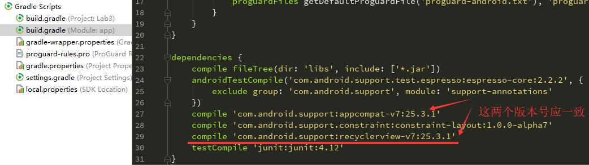
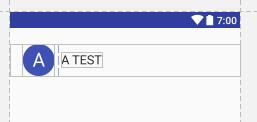
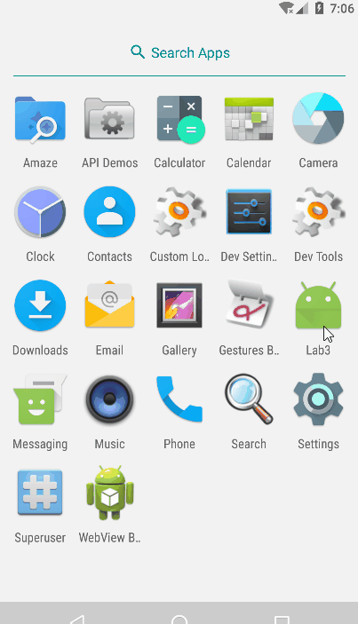

<!-- TOC -->

- [Lab 3 - 实现模拟商品列表](#lab-3---实现模拟商品列表)
    - [实验目的](#实验目的)
    - [实验内容](#实验内容)
    - [实现要求](#实现要求)
        - [布局方面](#布局方面)
        - [逻辑方面](#逻辑方面)
    - [实验步骤](#实验步骤)
        - [step0:总体实现思路](#step0总体实现思路)
        - [step1:去除界面标题栏](#step1去除界面标题栏)
            - [实现效果](#实现效果)
        - [step2:实现商品列表](#step2实现商品列表)
            - [添加依赖](#添加依赖)
            - [RecyclerView介绍](#recyclerview介绍)
            - [代码实现](#代码实现)
            - [实现效果](#实现效果-1)
        - [step3:实现商品详细内容界面](#step3实现商品详细内容界面)
            - [实现效果](#实现效果-2)
        - [step4:实现购物车内容界面](#step4实现购物车内容界面)
            - [实现效果](#实现效果-3)
    - [遇到的问题以及解决方案](#遇到的问题以及解决方案)

<!-- /TOC -->

# Lab 3 - 实现模拟商品列表

## 实验目的

- 1.复习事件处理
- 2.学习Intent、Bundle在Activity跳转中的应用
- 3.学习RecyclerView、ListView以各类适配器的用法

## 实验内容

本次实验模拟实现一些商品表，有两个界面，第一个界面用于呈现商品（如下左图，为长截屏），点击右下方的悬浮的按钮可切换到购物车（如下中图）；点击第一个界面中的列表的任一项，可看到商品的详细信息（如下右图）。


## 实现要求

### 布局方面

- [x] 1.商品列表界面
    - [x] 每一项为一个圆圈和一个名字，圆圈与名字均竖直居中。
    - [x] 圆圈中为名字的首字母，首字母要处于圆圈的中心，首字母为白色，名字为黑色，圆圈的颜色可自定义（尽量选择深色）。
- 2.购物车列表界面
    - [x] 在商品表界面的基础上增加一个价格，价格为黑色。
- [x] 3.商品详情界面
    - 顶部
        - [x] 顶部占整个界面的1/3。
        - [x] 每个商品的图片在商品数据中已给出，图片与当前view等高。
        - [x] 返回图标（即是“<”）处于当前view左上角。
        - [x] 商品名字处于左下角。
        - [x] 返回图标与商品名字左对齐。
        - [x] 星标位于右下角。
        - [x] 商品名字和星标底边对齐。
        - [x] 返回图标、商品、星标与边距都有一定距离，自己调出合适的距离即可。
        - [x] 该部分推荐用RelativeLayout实现。
    - 中部
        - [x] 黑色字体（比如价格和“更多产品信息”）的argb编码值为#D5000000，字体大小可自行调节，和给出的例子差不多就好了
        - [x] 价格下面的偏灰色的字体的argb编码值为#8A000000。
        - [x] 价格下面的分割线和购物车图标左侧的分割线的argb编码值为#1E000000。
        - [x] 购物车图标左侧分割线要求高度与购物车图像高度一致，并且竖直居中。
        - [x] “更多产品信息”底部的分隔区域高度也可自行调节，argb编码值为#1E000000。
    - 底部
        - [x] 按图照葫芦画瓢即可。
- [x] 4.【特别提醒】
    - [x] 这次的界面顶部都没有标题栏，需要用某些方法把它们去掉。

### 逻辑方面

- 1.商品列表界面
    - [x] 使用RecyclerView实现商品列表。
    - [x] 点击商品列表中的某一个商品会跳转到该商品详情界面。
    - [x] 长按商品列表中的第i个商品会删除该商品，并且弹出Toast提示“移除第i个商品”。（i从0开始）
- 2.点击右下方的FloatingActionButton，从商品列表切换到购物车或从购物车切换到商品列表，并且其里面的图标要做相应的变化。
    - [x] 可通过设置RecyclerView不可见+ListView可见来实现从商品列表切换到购物车。
    - [x] 可通过设置RecyclerView可见+ListView不可见来实现从购物车切换到商品列表。
- 3.购物车界面
    - [x] 使用ListView实现
    - [x] 点击购物车的某一个商品会跳转到商品详情界面。
    - [x] 长按购物列表中的xxx商品会弹出对话框询问“从购物车移除xxx？”，点击确定则移除，点击取消则对话框消失。(xxx为该商品名字)

    

- 4.商品详情界面
    - [x] 点击返回图标会返回上一层。
    - 点击星标会切换状态。
        -  [x] 若原来是空心星星，则变成实心星星。
        -  [x] 若原来是实心星星，则变成空心星星。
    - 点击购物车图标时
        - [x] 会将该商品添加到购物车并弹出Toast提示“商品已添加到购物车”
        - [x] 不要求判断购物车已否已有该商品，即多次点击购物车图标可以只添加一件商品，也可添加多件商品。(本人选择实现后者)
    - [x] 底部的四个操作的列表用ListView实现

## 实验步骤

### step0:总体实现思路

这一步是在写完代码整理思路后才可以总结出来的，刚开始写的时候都是删删改改，为了避免下面写实验步骤时出现混乱，这里就先总结下总体的思路以及相关的实现方法。

首先，简要地说，这次的实验需要实现三个界面：

- 界面一：打开app看到的商品列表界面
- 界面二：购物车的列表界面
- 界面三：商品的详细内容界面

除此之外，还需要实现一个FloatingActionButton（下面均简称为fab）。

但是这里就需要注意，虽然有三个界面，但是实际上我只实现了2个activity，原因就在于：

界面一和界面二是通过fab进行转换的，因此这两个界面都是在同个acitvity实现的。可以做到同一时刻只有一个界面可以呈现出来（使用`setVisibility`方法）。

同时注意到，在界面一和界面二点击商品后可以**跳转**到界面三，界面一显示的数据是商品的名称，界面二显示的是商品的名称和价格，考虑到商品名称都是不同的，那么就可以进行如下的设计：

- 在【界面三所在的activity】代码中存储所有商品的所有数据信息，将商品名称和商品其他信息建立一个映射
- 在【界面一所在的activity】代码中存储所有商品的名称信息，点击单个商品时就将商品名称通过intent传递到【界面三所在的activity】并跳转，后者根据映射得到对应商品的所有数据信息，并将所有信息显示出来
- 在【界面二所在的activity】代码中存储所有商品的名称信息和价格信息，点击单个商品时就将商品名称通过intent传递到【界面三所在的activity】并跳转，后者根据映射得到对应商品的所有数据信息，并将所有信息显示出来

除此之外，还有一个比较特别的功能——点击界面三的购物车图标后就可以将商品添加到购物车，这就需要将数据从【界面三所在的activity】传递到【界面二所在的activity】但是又不**跳转**，而用上面的“传递数据+跳转”的方面是无法完成这项功能的，因此这里采用**本地广播**的知识点来实现该功能。

### step1:去除界面标题栏

找到res文件夹下的styles.xml，将：

```xml
<style name="AppTheme" parent="Theme.AppCompat.Light.DarkActionBar">
```

修改为：

```xml
<style name="AppTheme" parent="Theme.AppCompat.Light.NoActionBar">
```

#### 实现效果

修改代码前（左图）和修改代码后（右图）视图比较：


可见标题栏已成功去除。

### step2:实现商品列表

#### 添加依赖

商品列表要求用RecyclerView实现，因此需要在`Grade Scripts\build.gradle(Module:app)`中的dependencies添加

```c++
compile 'com.android.support:recyclerview-v7:25.3.1'
```

同时，由于后续还要用到RecyclerView中的动画效果，因此还需添加如下两条配置：

```c++
compile 'jp.wasabeef:recyclerview-animators:2.2.2'
compile 'com.android.support:support-core-utils:25.3.1'
```



#### RecyclerView介绍

RecyclerView与ListView原理是类似的：都是仅仅维护少量的View并且可以展示大量的数据集。RecyclerView用以下两种方式简化了数据的展示和处理:

- 使用LayoutManager来确定每一个item的排列方式。
- 为增加和删除项目提供默认的动画效果。

RecyclerView项目结构如下：


- Adapter：使用RecyclerView之前，其需要一个继承自RecyclerView.Adapter的适配器，作用是将数据与每一个item的界面进行绑定。
- LayoutManager：用来确定每一个item如何进行排列摆放，何时展示和隐藏。回收或重用一个View的时候，LayoutManager会向适配器请求新的数据来替换旧的数据，这种机制避免了创建过多的View和频繁的调用findViewById方法（与ListView原理类似）。

#### 代码实现

首先，由于商品列表界面只显示商品名称和名称的第一个字母的大写形式，因此实现如下Product类供后续操作：

```java
public class Product {
    private String name;

    public Product(String name){
        this.name = name;
    }
    public String getName(){
        return name;
    }
    public String getName_firstLetter(){
        return  String.valueOf(name.charAt(0)).toUpperCase();
    }
}
```

接着来实现一个layout来定义RecyclerView中每个子项是如何显示的，新建product_item.xml:

```xml
<?xml version="1.0" encoding="utf-8"?>
<LinearLayout xmlns:android="http://schemas.android.com/apk/res/android"
    android:orientation="horizontal"
    android:layout_width="match_parent"
    android:layout_height="wrap_content"
    android:layout_marginTop="25dp"
    android:layout_marginBottom="25dp">

    <TextView
        android:id="@+id/product_name_firstLetter"
        android:layout_width="wrap_content"
        android:layout_height="wrap_content"
        android:background="@drawable/circle"
        android:gravity="center"
        android:layout_gravity="center_vertical"
        android:text="A"
        android:textSize="30sp"
        android:textColor="@color/white"
        android:layout_marginLeft="20dp"/>

    <TextView
        android:id="@+id/product_name"
        android:layout_width="wrap_content"
        android:layout_height="wrap_content"
        android:layout_gravity="center_vertical"
        android:gravity="left"
        android:text="A TEST"
        android:textSize="20sp"
        android:textColor="@color/black"
        android:layout_marginLeft="10dp"/>

</LinearLayout>
```

这里TextView中设置了text属性供编写这个layout时debug用，通过preview可以看到其效果如下，符合预期。



接着来为RecyclerView实现基于Product类的Adapter。新建ProductAdapter类，让这个Adapter继承自RecyclerView.Adapter，并将泛型指定为ProductAdapter.ViewHolder。其中，ViewHolder是该类的一个静态子类。

```java
public class ProductAdapter extends RecyclerView.Adapter<ProductAdapter.ViewHolder> {
    private List<Product> mProductList;
    private OnItemClickListener mOnItemClickListener;

    public  ProductAdapter(List<Product> productList){
        mProductList = productList;
    }

    /**********实现RecyclerView子项点击需自行实现的函数**********/
    public interface OnItemClickListener{
        /*定义点击和长按的方法，在子类中实现*/
        void onClick(int position);
        void onLongClick(int position);
    }

    public void setOnItemClickListener(OnItemClickListener onItemClickListener){
        /*设置监听器*/
        this.mOnItemClickListener = onItemClickListener;
    }

    public void removeItem(int position){
        /*在商品列表中删除下标为position的商品*/
        mProductList.remove(position);
        notifyItemRemoved(position);
    }
    /**********实现RecyclerView子项点击需自行实现的函数**********/

    /**********继承RecyclerView.Adapter必须重写的三个方法**********/
    @Override
    public ViewHolder onCreateViewHolder(ViewGroup parent, int viewType) {
        /*创建ViewHolder实例*/
       View view = LayoutInflater.from(parent.getContext())
                                 .inflate(R.layout.product_item, parent, false);
        ViewHolder holder = new ViewHolder(view);
        return holder;
    }

    @Override
    public void onBindViewHolder(final ViewHolder holder, int position) {
        /*对RecyclerView子项的数据进行赋值，在每个子项被滚动到屏幕内执行*/
        Product product = mProductList.get(position);
        holder.productName.setText(product.getName());
        holder.productName_firstLetter.setText(product.getName_firstLetter());
        if(mOnItemClickListener!=null){
            holder.itemView.setOnClickListener(new View.OnClickListener(){
                @Override
                public void onClick(View v){
                    mOnItemClickListener.onClick(holder.getAdapterPosition());
                }
            });
            holder.itemView.setOnLongClickListener(new View.OnLongClickListener() {
                @Override
                public boolean onLongClick(View v) {
                    mOnItemClickListener.onLongClick(holder.getAdapterPosition());
                    return false;
                }
            });
        }
    }

    @Override
    public int getItemCount() {
        /*得到RecyclerView的子项个数*/
        return mProductList.size();
    }
    /**********继承RecyclerView.Adapter必须重写的三个方法**********/

    /**********ViewHolder静态子类实现**********/
    static class ViewHolder extends RecyclerView.ViewHolder{
        TextView productName;
        TextView productName_firstLetter;

        public ViewHolder(View view){
            super(view);
            productName = (TextView)view.findViewById(R.id.product_name);
            productName_firstLetter = (TextView)view.findViewById(R.id.product_name_firstLetter);
        }
    }
    /**********ViewHolder静态子类实现**********/
}
```

接下来就可以在MainActivity.java中实现商品列表啦。

首先，在对应MainActivity.java的布局文件activity_main.xml中添加RecyclerView控件，添加后代码如下：

```xml
<?xml version="1.0" encoding="utf-8"?>
<android.support.design.widget.CoordinatorLayout xmlns:android="http://schemas.android.com/apk/res/android"
    xmlns:tools="http://schemas.android.com/tools"
    android:layout_width="match_parent"
    android:layout_height="match_parent"
    xmlns:app="http://schemas.android.com/apk/res-auto"
    tools:context="com.linzch3.lab3.MainActivity">

    <android.support.v7.widget.RecyclerView
        android:id="@+id/recycler_view"
        android:layout_width="match_parent"
        android:layout_height="match_parent">
    </android.support.v7.widget.RecyclerView>
</android.support.design.widget.CoordinatorLayout>

```
首先，在类中声明如下变量：

```java
private List<Product> mProductList = new ArrayList<>();
private RecyclerView mRecyclerView;
```

在onCreatea函数中添加变量的初始化代码：

```java
initProducts();//初始化商品列表数据
mRecyclerView = (RecyclerView) findViewById(R.id.recycler_view);
```

并接着添加如下代码：

```java
final ProductAdapter mProductAdapter = new ProductAdapter(mProductList);
ScaleInAnimationAdapter animationAdapter = new ScaleInAnimationAdapter(mProductAdapter);
animationAdapter.setDuration(1000);
animationAdapter.setInterpolator(new OvershootInterpolator());
mRecyclerView.setLayoutManager(new LinearLayoutManager(this));
mRecyclerView.setAdapter(animationAdapter);

mProductAdapter.setOnItemClickListener(new ProductAdapter.OnItemClickListener() {
    @Override
    public void onClick(int position) {
        /*点击跳转*/
        //Toast.makeText(MainActivity.this, "点击功能测试正常", Toast.LENGTH_SHORT).show();
        Intent intent = new Intent(MainActivity.this, Main2Activity.class);
        Bundle bundle = new Bundle();
        Product product = mProductList.get(position);
        bundle.putString("产品名称", product.getName());
        intent.putExtras(bundle);
        startActivity(intent);
    }

    @Override
    public void onLongClick(int position) {
        /*长按删除*/
        mProductAdapter.removeItem(position);
        Toast.makeText(MainActivity.this, "移除第"+position+"个商品", Toast.LENGTH_SHORT).show();
    }
});
```

这里的Main2Activity就是商品详情数据对应的activity，后续会讲到其实现。至此，商品列表部分已经全部完成。

#### 实现效果

实现效果如图，打开app后第一个界面就是商品列表界面，并且拉动界面有动画效果，可通过长按来删除某个商品，点击商品后可调转到商品详细内容界面（这个是要后续步骤实现后才可测试的，为了方便就一并在这里测试了）。



若无法观看动图，可点击<a href="https://github.com/linzch3/Open-Course-Learning/tree/master/D02.%E7%A7%BB%E5%8A%A8%E5%BA%94%E7%94%A8%E5%BC%80%E5%8F%91%20-%20SYSU%20-%20ZGF/Lab%203%20-%20%E5%AE%9E%E7%8E%B0%E6%A8%A1%E6%8B%9F%E5%95%86%E5%93%81%E5%88%97%E8%A1%A8/images/Animation1.gif">这里</a>查看原图片。

### step3:实现商品详细内容界面

该界面需要在一个新的activity中
```java

```
```java

```
#### 实现效果

### step4:实现购物车内容界面
```java

```
#### 实现效果

## 遇到的问题以及解决方案

- Java错误提示is not an enclosing class:
    - 解决方案：见[这里][19]
- xml中TextView引用已定义好的样式时出错：android.view.InflateException: Binary XML file line #14: Error inflating class
    - 解决方案：见[这里][18]
- 正确添加FloatingActionButton的依赖后，在xml文件中加入该控件，运行app后闪退，出现如下的报错信息：
 ```java
Caused by: android.view.InflateException: Binary XML file line #20: Binary XML file line #20: Error inflating class android.support.design.widget.FloatingActiongButton
Caused by: android.view.InflateException: Binary XML file line #20: Error inflating class android.support.design.widget.FloatingActiongButton
```
    - 解决方案：其实是拼错了！！！FloatingActiongButton中多了一个g。


## 参考资料

### 关乎实验内容的

- [RecyclerView使用介绍][4]
- [Github@wasabeef---recyclerview-animators][5]
- [Android RelativeLayout属性][7]
- [在xml和代码中设置ImageView图片的显示比例][8]
- [Android中为控件之间添加分割线][10]
- [Android相对布局(RelativeLayout)][11]
- [android使用Intent传递数据 2 种方式(Intent和Bundle)][12]
- [返回上一层activity的实现方式(拓展：不同activity间的任意跳转)][13]
- [Material Design之FloatingActionButton的使用][14]
- [FloatingActionButton的一点学习感悟][15]
- [Android本地广播LocalBroadcastManager][16]
- [FloatingActionButton 完全解析[Design Support Library(2)]][17]

### 无关乎实验内容的

- [android-studio-keeps-replacing-match-parent-with-fixed-dp-value][9]
- [自定义TextView字体step1: Android中通过typeface设置字体][1]
- [自定义TextView字体step2: Android Studio中新建和引用assets文件][2]
- [AndroidStudio设置创建文件开始时注释内容][3]
- [为什么用ConstraintLayout代替其他布局?][6]


[1]:http://www.cnblogs.com/bravestarrhu/archive/2012/07/17/2595598.html
[2]:http://blog.csdn.net/u011710991/article/details/52219648
[3]:http://jingyan.baidu.com/article/ff411625c6150912e48237a8.html
[4]:http://www.jcodecraeer.com/a/anzhuokaifa/androidkaifa/2014/1118/2004.html
[5]:https://github.com/wasabeef/recyclerview-animators
[6]:http://www.jianshu.com/p/32a0a6e0a98a
[7]:http://www.cnblogs.com/sevenyuan/archive/2010/09/16/1827940.html
[8]:http://blog.csdn.net/lixue9185/article/details/52037031
[9]:https://stackoverflow.com/questions/43452384/android-studio-keeps-replacing-match-parent-with-fixed-dp-value
[10]:http://blog.csdn.net/u012738773/article/details/50974175
[11]:http://blog.csdn.net/loongembedded/article/details/35569043
[12]:http://blog.csdn.net/neu_yousei/article/details/21953995
[13]:http://blog.csdn.net/dsa63/article/details/17010887
[14]:http://www.bubuko.com/infodetail-981369.html
[15]:http://www.cnblogs.com/joy99/p/5664827.html
[16]:http://www.jianshu.com/p/87d8fbb946d7
[17]:http://blog.csdn.net/lmj623565791/article/details/46678867
[18]:https://www.crifan.com/android_textview_android_view_inflateexception_binary_xml_file_line_error_inflating_class_unknown/
[19]:http://blog.csdn.net/zhouzme/article/details/20840439
