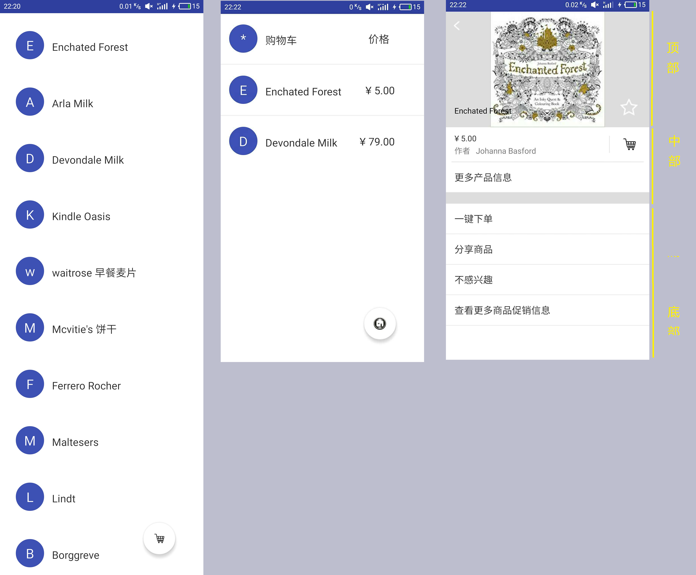
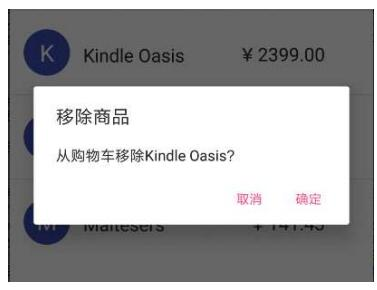

<!-- TOC -->

- [1. Lab 3 - 实现模拟商品列表](#1-lab-3---实现模拟商品列表)
    - [1.1. 实验目的](#11-实验目的)
    - [1.2. 实验内容](#12-实验内容)
    - [1.3. 实现要求](#13-实现要求)
        - [1.3.1. 布局方面](#131-布局方面)
        - [1.3.2. 逻辑方面](#132-逻辑方面)

<!-- /TOC -->

# 1. Lab 3 - 实现模拟商品列表

## 1.1. 实验目的

- 1.复习事件处理
- 2.学习Intent、Bundle在Activity跳转中的应用
- 3.学习RecyclerView、ListView以各类适配器的用法

## 1.2. 实验内容

本次实验模拟实现一些商品表，有两个界面，第一个界面用于呈现商品（如下左图，为长截屏），点击右下方的悬浮的按钮可切换到购物车（如下中图）；点击第一个界面中的列表的任一项，可看到商品的详细信息（如下右图）。

## 1.3. 实现要求

### 1.3.1. 布局方面

- 1.商品表界面
    - 每一项为一个圆圈和一个名字，圆圈与名字均竖直居中。
    - 圆圈中为名字的首字母，首字母要处于圆圈的中心，首字母为白色，名字为黑色，圆圈的颜色可自定义（尽量选择深色）。
- 2.购物车列表界面
    - 在商品表界面的基础上增加一个价格，价格为黑色。
- 3.商品详情界面
    - 顶部
        - 顶部占整个界面的1/3。
        - 每个商品的图片在商品数据中已给出，图片与当前view等高。
        - 返回图标（即是“<”）处于当前view左上角。
        - 商品名字处于左下角。
        - 返回图标与商品名字左对齐。
        - 星标位于右下角。
        - 商品名字和星标底边对齐。
        - 返回图标、商品、星标与边距都有一定距离，自己调出合适的距离即可。
        - 该部分推荐用RelativeLayout实现。
    - 中部
        - 黑色字体（比如价格和“更多产品信息”）的argb编码值为#D5000000，字体大小可自行调节，和给出的例子差不多就好了
        - 价格下面的偏灰色的字体的argb编码值为#8A000000。
        - 价格下面的分割线和购物车图标左侧的分割线的argb编码值为#1E000000。
        - 购物车图标左侧分割线要求高度与购物车图像高度一致，并且竖直居中。
        - “更多产品信息”底部的分隔区域高度也可自行调节，argb编码值为#1E000000。
    - 底部
        - 按图照葫芦画瓢即可。
- 4.【特别提醒】这次的界面顶部都没有标题栏，需要用某些方法把它们去掉。

### 1.3.2. 逻辑方面

- 1.使用RecyclerView实现商品列表。
    - 点击商品列表中的某一个商品会跳转到该商品详情界面。
    - 长按商品列表中的第i个商品会删除该商品，并且弹出Toast提示“移除第i个商品”。（i从0开始）
- 2.点击右下方的FloatingActionButton，从商品列表切换到购物车或从购物车切换到商品列表，并且其里面的图标要做相应的变化。
    - 可通过设置RecyclerView不可见+ListView可见来实现从商品列表切换到购物车。
    - 可通过设置RecyclerView可见+ListView不可见来实现从购物车切换到商品列表。
- 3.使用ListView实现购物车。
    - 点击购物车的某一个商品会跳转到商品详情界面。
    - 长按购物列表中的xxx商品会弹出对话框询问“从购物车移除xxx？”，点击确定则移除，点击取消则对话框消失。(xxx为该商品名字)

    

- 4. 在商品详情界面中：
    - 点击返回图标会返回上一层。
    - 点击星标会切换状态。
        - 若原来是空心星星，则变成实心星星。
        - 若原来是实心星星，则变成空心星星。
    - 点击购物车图标会将该商品添加到购物车并弹出Toast提示“商品已添加到购物车”
        - 不要求判断购物车已否已有该商品，即多次点击购物车图标可以只添加一件商品，也可添加多件商品。
