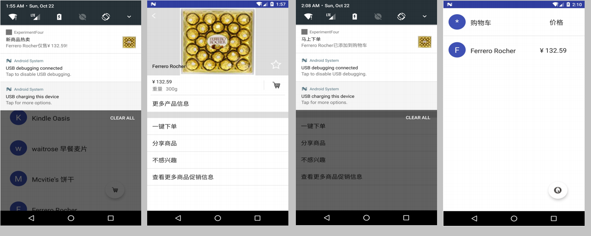
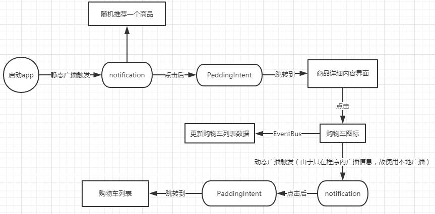

# Lab 4 - broadcast的使用

## 实验目的

- 1、掌握 Broadcast 编程基础
- 2、掌握动态注册 Broadcast 和静态注册 Broadcast
- 3、掌握Notification 编程基础
- 4、掌握 EventBus 编程基础

## 实验要求

在实验三的基础上，实现静态广播、动态广播两种改变Notification 内容的方法。具体要求如下：

- [x] 1.在启动应用时，会有通知产生，随机推荐一个商品。（见下图左一）

- [x] 2.点击通知跳转到该商品详情界面。（见下图左二）

- [x] 3.点击购物车图标，会有对应通知产生，并通过Eventbus在购物车列表更新数据。（见下图左三）

- [x] 4.点击通知返回购物车列表。（见下图左四）

- [x] 5.实现方式要求:启动页面的通知由**静态广播**产生，点击购物车图标的通知由**动态广播**产生。



注：

- 这里的Android System的信息是无关信息，无须关注。
- notification的通知显示中的图标可都用【购物车图标】代替。

## 实验步骤

### step0:理清思路

首先，来理清下整个app开发的思路，流程图整理如下：




### step1:实现启动应用后随机推荐商品功能

### 随机商品数据的广播

由于启动应用后MainActivity也就紧接着打开了，因此可在MainActivity中编写触发**静态广播**的代码，并且将商品的名称和价格数据一并和该广播发送出去，这样就实现了随机推荐的商品的数据的发送（广播）了。

先来回顾下商品数据在MainAcitivity是如何存储的:mProductList存储着的是Product类型的变量，每个变量都保存着一个商品的名称和对应的价格，该变量的数据的导入由如下函数实现，该函数在onCreate函数中会被调用。

```java
void initProducts(){
    /*初始化商品列表数据*/
    String [] names = new String[] {"Enchated Forest", "Arla Milk", "Devondale Milk",
                                    "Kindle Oasis", "waitrose 早餐麦片", "Mcvitie's 饼干",
                                    "Ferrero Rocher", "Maltesers", "Lindt", "Borggreve"};
    String [] prices = new String[] {"¥ 5.00", "¥ 59.00", "¥ 79.00", "¥ 2399.00",
            "¥ 179.00", "¥ 14.90", "¥ 132.59", "¥ 141.43",
            "¥ 139.43", "¥ 28.90"};

    for(int i=0; i < names.length; i++){
        Product product = new Product(names[i], prices[i]);
        mProductList.add(product);
    }
}
```

好，接下来就来实现得到随机的一个商品的数据。

首先，实现如下函数：

```java
void randomRecommendProduct(){
    /*随机推荐一个商品*/
    Random random = new Random();
    Product luckyOne =  mProductList.get(random.nextInt(mProductList.size()));//选择商品

    Intent mStartAppIntent = new Intent("com.linzch3.lab4.StartAppSingal");
    Bundle mStartAppBundle = new Bundle();
    mStartAppBundle.putString("产品名称", luckyOne.getName());
    mStartAppBundle.putString("产品价格", luckyOne.getPrice());
    mStartAppIntent.putExtras(mStartAppBundle);
    sendBroadcast(mStartAppIntent);
}
```

该函数根据**随机数**来得到随机的一个商品的下标，接着在`mProductList`中取出对应的Prduct变量，通过广播的方式将标识为`"com.linzch3.lab4.StartAppSingal"`的intent（携带着产品名称和产品价格的数据）发送出去。

接着在onCreate函数中调用该函数：

```java
randomRecommendProduct();
```

### 广播接收器+点击推荐通知后跳转到商品详情界面的实现

启动页面的通知由**静态广播**产生。那么自然就要新建一个广播接收器类了，并且该类必须在AndroidManifest.xml中定义。

首先，新建广播接收器类StartAppReceiver，其继承于Android中已有的BroadcastReceiver类。

```java
public class StartAppReceiver extends BroadcastReceiver {

    @Override
    public void onReceive(Context context, Intent intent) {

        //Toast.makeText(context, "数据接收功能测试正常", Toast.LENGTH_SHORT).show();
        /*得到广播传送过来的数据*/
        Bundle bundle = intent.getExtras();
        String productName = bundle.get("产品名称").toString();
        String productPrice = bundle.get("产品价格").toString();
        /*准备要跳转的数据*/
        Intent intent2DetailsPage = new Intent(context, Main2Activity.class);
        Bundle bundle2DetailPage = new Bundle();
        bundle2DetailPage.putString("产品名称", productName);
        intent2DetailsPage.putExtras(bundle2DetailPage);
        //注意将flag设置为 PendingIntent.FLAG_UPDATE_CURRENT
        PendingIntent pi = PendingIntent.getActivity(context, 0, intent2DetailsPage, PendingIntent.FLAG_UPDATE_CURRENT);
        NotificationManager notificationManager = (NotificationManager)
                            context.getSystemService(NOTIFICATION_SERVICE);
        Notification notification = new NotificationCompat.Builder(context)
                .setTicker("您有一条新信息")
                .setContentTitle("新商品热卖")
                .setContentText(productName+"仅售"+productPrice+"!")
                .setSmallIcon(R.drawable.buy_icon)
                .setLargeIcon(BitmapFactory.decodeResource(mContext.getResources(),R.drawable.buy_icon))
                .setWhen(System.currentTimeMillis())
                .setContentIntent(pi)
                .setAutoCancel(true)
                .build();
            int uniqueId = (int) System.currentTimeMillis();//根据时间来为每次id的显示指定不同的id
            notificationManager.notify(uniqueId, notification);
    }
}
```

这里有个很重要的一点：调用`notificationManager.notify`函数时传进去的第一个int型的参数是为每个notification指定的id，只有每个notification的id不一样时，新的notificatioin才不会覆盖之前的notification。因此，这里用了一个trick，根据系统时间来作为notification的id，完美实现id的唯一性。

首先需要说明一下，声明了该函数之后还需要在AndroidManifest.xml中进行与该接收器相关的配置：

```xml
<application>
    ....
    <!--新添加的代码-->
    <receiver android:name=".StartAppReceiver">
        <intent-filter>
            <action android:name="com.linzch3.lab4.StartAppSingal"/>
        </intent-filter>
    </receiver>
    <!--新添加的代码-->
</application>
```

这样该接收器可以得到带有`"com.linzch3.lab4.StartAppSingal"`标记的广播信号了。接着该函数先得到广播传送过来的产品名称和产品价格的数据，接着声明一个PendingIntent，该PendingIntent将携带着商品的名称信息在**合适**的时机会使得app跳转页面到Main2Activity(也就是商品的详细内容界面，由于需要指定是什么商品，所以这里需要传递商品的名称信息过去)。

然后便是Notification信息啦。接着便让NotificationManager把这条通知显示出来。

这里有用到mContext这个变量，其原因是：需要在该广播接收器中使用`getResources()`函数，但是由于该类不是Activity类，因此无法直接调用该函数，故从MainActivity中“借”一个只有Activity才有`context`，做法如下：

先在MainActivity声明如下类变量：

```java
public static Context mContext;
```

接着在onCreate函数中进行如下赋值：

```java
mContext = this.getBaseContext();
```

这样就可以用`mContext.getResources()`来调用`getResources()`函数了。


这样就可以完成该部分的内容了。

### step2:实现点击购物车图标后通过Eventbus在购物车列表更新数据

首先，添加如下依赖：

```c++
compile 'org.greenrobot:eventbus:3.0.0'
```

为了要使用EventBus，我们首先要实现一个事件类，由于购物车列表上的数据只包含产品名称和产品价格，因此便实现了如下下单事件类：

```java
public class PlaceOrderEvent {
    private String name;
    private String price;

    public PlaceOrderEvent(String name, String price){
        this.name = name;
        this.price = price;
    }
    public String getProductName_firstLetter(){
        return String.valueOf(name.charAt(0)).toUpperCase();
    }
    public String getProductName(){
        return name;
    }
    public String getProductPrice(){
        return price;
    }
}
```

好，现在我们就需要实现事件的发布了。很明显，该部分内容需要实现的代码就在购物车图标的setOnClickListener函数的onClick函数中。

因此，在购物车图标的setOnClickListener函数的onClick函数中添加：

```java
String productName = mProductName.getText().toString();
String productPrice = mProductPrice.getText().toString();
/*EventBus发布事件部分*/
EventBus.getDefault().post(new PlaceOrderEvent(productName, productPrice));
```

这里的`mProductName`和`mProductPrice`是当前商品内容详细界面的产品名称和产品价格对于的TextView控件在代码中的引用。

这样就可实现下单事件的发布啦。

好，接着需要做的就是**订阅**该事件了，很明显，购物车列表所在的MainAcitivity就是该事件的**订阅者**。

因此，第一步需要在MainAcitivity的onCreate函数中添加如下代码以注册EventBus的订阅。

```java
EventBus.getDefault().register(this);
```

接着在MainAcitivity中实现如下函数来实现**订阅**事件的接受和处理：得到**订阅**事件后将事件“携带”的相关数据保存到购物车列表中。

```java
@Subscribe   
    public  void onEventMainThread(PlaceOrderEvent event){
        //添加商品到购物车
        Map<String, Object> temp = new LinkedHashMap<>();
        temp.put("first_letter", event.getProductName_firstLetter());
        temp.put("name", event.getProductName());
        temp.put("price", event.getProductPrice());
        mShoppingCartList.add(temp);
    }
```

最后重载`onDestroy`函数来实现EventBus注册的取消：

```java
@Override
protected void onDestroy() {
    super.onDestroy();
    EventBus.getDefault().unregister(this);//取消注册
}
```

至此，EventBus部分的内容已实现完毕。

### step3:实现点击购物车图标发出下单通知

该部分要求使用动态广播来实现，由于这里广播的范围仅是在本app上，因此这里便用本地广播来实现该部分内容。

实现思路：广播的发送者和接受者均在Main2Activity中实现，当购物车按钮被点击时，发送广播，广播接受者接受到广播后发出下单提示。

首先，我们需先在Main2Activity实现广播接收器类，该类继承于Android内部已实现的BroadcastReceiver类，通过对onReceive函数的重载来实现广播的接受处理。其实现思路和StartAppReciver基本一致，这里不再赘述。

```java
private class LocalReceiver extends BroadcastReceiver {
        @Override
        public void onReceive(Context context, Intent intent) {
            //Toast.makeText(Main2Activity.this, "数据接收功能测试正常", Toast.LENGTH_SHORT).show();
            Bundle bundle = intent.getExtras();
            String productName = bundle.getString("产品名称");

            /*准备要跳转的数据*/
            Intent intent2ShoppingCart = new Intent(context, MainActivity.class);
            Bundle bundle2ShoppingCart = new Bundle();
            bundle2ShoppingCart.putBoolean("open shopping cart", true);
            intent2ShoppingCart.putExtras(bundle2ShoppingCart);
            
            //注意将flag设置为 PendingIntent.FLAG_UPDATE_CURRENT
            PendingIntent pi = PendingIntent.getActivity(context, 0, intent2ShoppingCart, PendingIntent.FLAG_UPDATE_CURRENT);
            NotificationManager notificationManager = (NotificationManager)
                    context.getSystemService(NOTIFICATION_SERVICE);
            Notification notification = new NotificationCompat.Builder(context)
                    .setTicker("您有一条新信息")
                    .setContentTitle("马上下单")
                    .setContentText(productName+"已添加到购物车")
                    .setSmallIcon(R.drawable.buy_icon)
                    .setLargeIcon(BitmapFactory.decodeResource(getResources(),R.drawable.buy_icon))
                    .setWhen(System.currentTimeMillis())
                    .setContentIntent(pi)
                    .setAutoCancel(true)
                    .build();
            int uniqueId = (int) System.currentTimeMillis();//根据时间来为每次id的显示指定不同的id
            notificationManager.notify(uniqueId, notification);
        }
    }
```

接着，需要在Main2Activity中声明广播接受者和广播发送者（或广播管理器）以及相关变量：

```java
private static final String PRODUCT_ON_SHOPPING_CART = "com.linzch3.lab4.LOCAL_BROADCAST";
private LocalReceiver mLocalReceiver;
private IntentFilter mIntentFilter;
private LocalBroadcastManager mLocalBroadcastManager;
```

接着在onCreate函数中添加如下代码以得到广播接受者和广播发送者实例并注册广播接受者。

```java
mLocalBroadcastManager = LocalBroadcastManager.getInstance(this);
mIntentFilter = new IntentFilter();
mIntentFilter.addAction(PRODUCT_ON_SHOPPING_CART);
mLocalReceiver = new LocalReceiver();
mLocalBroadcastManager.registerReceiver(mLocalReceiver, mIntentFilter);
```

这样我们就可以在购物车图标的setOnClickListener函数的onClick函数中添加如下代码以实现**下单**时广播的发送。

```java
Intent intent = new Intent(PRODUCT_ON_SHOPPING_CART);
Bundle bundle = new Bundle();
bundle.putString("产品名称",productName);
intent.putExtras(bundle);
mLocalBroadcastManager.sendBroadcast(intent);
```

由于广播接收器mLocalReceiver已经注册过了带有`PRODUCT_ON_SHOPPING_CART`的广播信息，因此该广播发送后，mLocalReceiver会收到该广播并且执行其onReceive函数，这样下单提示就实现完成了。

### step4:实现点击下单通知后跳转到购物车列表

在上面LocalReceiver的实现中就指明了当下单提示被点击时，其会跳转到购物车列表所在的MainAcitivity去，并通过bundle传递了一条key值为"open shopping cart"、value值为true的布尔型信息。

```java
bundle2ShoppingCart.putBoolean("open shopping cart", true);
```

那么接下来就只需要在MainAcitivity中实现代码了。

首先，很重要的一点，由于多次下单后可能有多条未点开的下单通知，如果每次点开下单通知都新建一个Acitivity的话，这样不仅影响用于体验（要退出“当前界面”就需要按很多次返回键）而且还影响性能。

因此，需要在AndroidManifest.xml中把：

```xml
<activity android:name=".MainActivity">
```

改成：

```xml
<activity android:name=".MainActivity"
    android:launchMode="singleInstance">
```

这样将MainActivity的launchMode设置为singleInstance后就可以保证，MainActivity只会创建一个实例，新点开一个下单通知后不会再新建一个MainActivity。

好，接下来先回顾下MainActivity中的商品列表和购物车列表是如何分开显示的。

首先，在该类中有如下变量声明：

```java
private boolean isShoppingCartView;//标记当前是否是购物车界面
```

在onCreate函数中有如下初始化：

```java
isShoppingCartView = false;
setCurrentView(); //根据isShoppingCartView设置当前的视图
```

其中setCurrentView函数实现如下：

```java
void setCurrentView(){
    /*设置当前的视图，在recyclerView和listView之间转换*/
    if(isShoppingCartView){
                /*处于购物车视图*/
        fab.setImageResource(R.drawable.mainpage_icon);
        isShoppingCartView = false;
        mRecyclerView.setVisibility(View.INVISIBLE);
        mListView.setVisibility(View.VISIBLE);

    }else{
                /*处于主界面视图*/
        fab.setImageResource(R.drawable.buy_icon);
        isShoppingCartView = true;
        mRecyclerView.setVisibility(View.VISIBLE);
        mListView.setVisibility(View.INVISIBLE);
    }
}
```

这样思路就明了了，setCurrentView函数根据isShoppingCartView变量的值来判断应该显示商品列表还是购物车列表。

因此便有了这样的一个思路：购物车图标被点击时Main2Activity会传给MainActivity一个intent，那么我们只要在MainActivity中判断当前是否有intent传进来来设置isShoppingCartView的值即可实现目标了。

但是，由于我们前面将MainActivity的launchMode设置为singleInstance，因此我们不能像往常一样在MainActivity的onCreate函数中写上**判断当前是否有intent传进来**的代码，因此MainActivity只创建一次，因此onCreate函数只创建一次，这样判断代码只能判断一次。在多次下单后点开下单通知后就不能先显示购物车列表了。

因此，我们需要重载MainActivity的onNewIntent函数，实现代码如下：

```java
@Override
protected void onNewIntent(Intent intent) {
    super.onNewIntent(intent);
    setIntent(intent);
    /************添加的代码****************/
    Bundle bundle = getIntent().getExtras();
    if(bundle != null && bundle.containsKey("open shopping cart")){
        isShoppingCartView = true;
    }else{
        isShoppingCartView = false;
    }
    setCurrentView();
    /************添加的代码****************/
}
```

这样就可以解决问题了。至此，所有功能实现完毕ヽ(￣▽￣)و

## 实现结果

实现效果如下：

- [x] 1.在启动应用时，会有通知产生，随机推荐一个商品。(如下图一、图二)

- [x] 2.点击通知跳转到该商品详情界面。(如下图三)

- [x] 3.点击购物车图标，会有对应通知产生，并且多次弹出的下单提示不会覆盖之前的未点开的下单提示。(如下图四)

- [x] 4.点击通知返回购物车列表。(如下图五)


## 遇到的问题及解决方案

- [在非Activity类里面启动Intent、Toast等、非Activity类引用getResources()方法问题的解决方法][3]
- [自己创建的非Activity类引用getResources()方法问题的解决方法][4]
- [PendingIntent传值接收时为null][5]
- [以singleTask或singleInstance方式加载的activity如何接收intent传递过来的的参数][7]
- [Android显示不重复通知的Notification][8]

## 参考资料

- [带你深入理解Activity启动模式（LaunchMode）][1]
- [Android EventBus框架（一）之使用详细介绍][2]
- [Android Notification 的四种使用方式][6]

[1]:http://blog.csdn.net/zhuzp_blog/article/details/51367477
[2]:http://blog.csdn.net/happy_horse/article/details/51565441
[3]:http://blog.csdn.net/qq_21856521/article/details/51810596
[4]:http://blog.csdn.net/xyzjl/article/details/9285093
[5]:http://www.cnblogs.com/yuzhongzheng/p/5412585.html
[6]:http://blog.csdn.net/yxncl/article/details/7280123
[7]:http://blog.csdn.net/myf408/article/details/18604669
[8]:http://blog.csdn.net/nihaoqiulinhe/article/details/50477960
