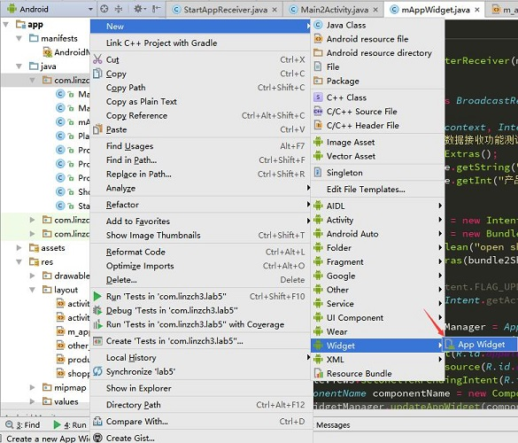
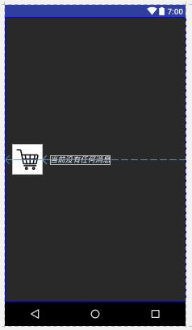
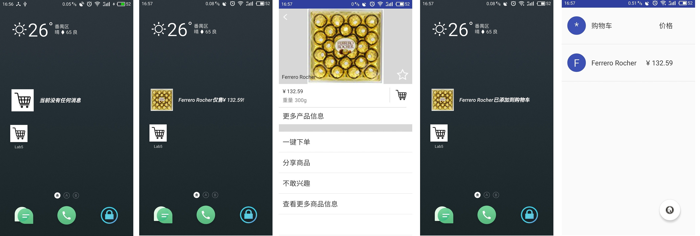

- [Lab 5 - appwidget 及broadcast 使用](#lab-5---appwidget-%E5%8F%8Abroadcast-%E4%BD%BF%E7%94%A8)
    - [实验目的](#%E5%AE%9E%E9%AA%8C%E7%9B%AE%E7%9A%84)
    - [实验内容](#%E5%AE%9E%E9%AA%8C%E5%86%85%E5%AE%B9)
    - [实验过程](#%E5%AE%9E%E9%AA%8C%E8%BF%87%E7%A8%8B)
        - [step1:创建widget类](#step1%E5%88%9B%E5%BB%BAwidget%E7%B1%BB)
        - [step2:实现widget的布局文件](#step2%E5%AE%9E%E7%8E%B0widget%E7%9A%84%E5%B8%83%E5%B1%80%E6%96%87%E4%BB%B6)
        - [step3:实现widget的初始界面+支持点击后启动app](#step3%E5%AE%9E%E7%8E%B0widget%E7%9A%84%E5%88%9D%E5%A7%8B%E7%95%8C%E9%9D%A2%E6%94%AF%E6%8C%81%E7%82%B9%E5%87%BB%E5%90%8E%E5%90%AF%E5%8A%A8app)
        - [step4:静态广播实现widget的随机商品推荐+支持跳转到商品详情界面](#step4%E9%9D%99%E6%80%81%E5%B9%BF%E6%92%AD%E5%AE%9E%E7%8E%B0widget%E7%9A%84%E9%9A%8F%E6%9C%BA%E5%95%86%E5%93%81%E6%8E%A8%E8%8D%90%E6%94%AF%E6%8C%81%E8%B7%B3%E8%BD%AC%E5%88%B0%E5%95%86%E5%93%81%E8%AF%A6%E6%83%85%E7%95%8C%E9%9D%A2)
            - [回顾静态广播发送过程](#%E5%9B%9E%E9%A1%BE%E9%9D%99%E6%80%81%E5%B9%BF%E6%92%AD%E5%8F%91%E9%80%81%E8%BF%87%E7%A8%8B)
            - [注册静态广播](#%E6%B3%A8%E5%86%8C%E9%9D%99%E6%80%81%E5%B9%BF%E6%92%AD)
            - [实现静态广播接收](#%E5%AE%9E%E7%8E%B0%E9%9D%99%E6%80%81%E5%B9%BF%E6%92%AD%E6%8E%A5%E6%94%B6)
        - [step5:动态广播实现widget的下单提示信息+支持跳转到购物车界面](#step5%E5%8A%A8%E6%80%81%E5%B9%BF%E6%92%AD%E5%AE%9E%E7%8E%B0widget%E7%9A%84%E4%B8%8B%E5%8D%95%E6%8F%90%E7%A4%BA%E4%BF%A1%E6%81%AF%E6%94%AF%E6%8C%81%E8%B7%B3%E8%BD%AC%E5%88%B0%E8%B4%AD%E7%89%A9%E8%BD%A6%E7%95%8C%E9%9D%A2)
            - [回顾动态广播发送过程](#%E5%9B%9E%E9%A1%BE%E5%8A%A8%E6%80%81%E5%B9%BF%E6%92%AD%E5%8F%91%E9%80%81%E8%BF%87%E7%A8%8B)
            - [实现动态广播接收器](#%E5%AE%9E%E7%8E%B0%E5%8A%A8%E6%80%81%E5%B9%BF%E6%92%AD%E6%8E%A5%E6%94%B6%E5%99%A8)
            - [注册和注销动态广播接收器](#%E6%B3%A8%E5%86%8C%E5%92%8C%E6%B3%A8%E9%94%80%E5%8A%A8%E6%80%81%E5%B9%BF%E6%92%AD%E6%8E%A5%E6%94%B6%E5%99%A8)
    - [实验结果](#%E5%AE%9E%E9%AA%8C%E7%BB%93%E6%9E%9C)
    - [遇到的问题及解决方案](#%E9%81%87%E5%88%B0%E7%9A%84%E9%97%AE%E9%A2%98%E5%8F%8A%E8%A7%A3%E5%86%B3%E6%96%B9%E6%A1%88)
    - [参考资料](#%E5%8F%82%E8%80%83%E8%B5%84%E6%96%99)

# Lab 5 - appwidget 及broadcast 使用

## 实验目的 

- 1、掌握 AppWidget 编程基础  
- 2、掌握 Broadcast 编程基础  
- 3、掌握动态注册 Broadcast 和静态注册 Broadcast  

## 实验内容

在上次实验的基础上进行修改,实现一个Android 应用，实现静态广播、动态广播两种改变widget内容的方法。

具体要求:   

- widget初始情况，如下图左一。

- 点击widget可以启动应用，并在widget随机推荐一个商品，如下图左二。

- 点击widget跳转到该商品详情界面，如下图左三。

- 点击购物车图标，widget相应更新，如下图左四。

- 点击widget跳转到购物车界面，如下图左五。


- 实现方式要求:
    - 启动时的widget的更新通过静态广播实现.
    - 点击购物车图标时候widget的更新通过动态广播实现。

## 实验过程

### step1:创建widget类

首先，新建一个widget类，命名为：mAppWidget.java：



同时会生成2个文件：一个是`res\xml`目录下的`m_app_widget_info.xml`，用于指定widget的大小属性和布局；一个是`res\layout`目录下的`m_app_widget.xml`，用于指定widget中元素的布局。

打开AndroidManifest.xml，可以看到，新增了如下的配置代码：

```xml
<receiver android:name="com.linzch3.lab5.mAppWidget">
    <intent-filter>
        <action android:name="android.appwidget.action.APPWIDGET_UPDATE" />
    </intent-filter>

    <meta-data
        android:name="android.appwidget.provider"
        android:resource="@xml/m_app_widget_info" />
</receiver>
```

### step2:实现widget的布局文件

首先在`m_app_widget_info.xml`中添加如下代码：

```xml
<?xml version="1.0" encoding="utf-8"?>
<appwidget-provider xmlns:android="http://schemas.android.com/apk/res/android"
    android:initialKeyguardLayout="@layout/m_app_widget"
    android:initialLayout="@layout/m_app_widget"
    android:minHeight="50dp"
    android:minWidth="300dp"
    android:previewImage="@drawable/buy_icon"
    android:resizeMode="horizontal|vertical"
    android:updatePeriodMillis="86400000"
    android:widgetCategory="home_screen|keyguard">
</appwidget-provider>
```

在`m_app_widget.xml`中添加如下代码：

```xml
<RelativeLayout xmlns:android="http://schemas.android.com/apk/res/android"
    android:layout_width="match_parent"
    android:layout_height="match_parent"
    android:background="#00000000"
    android:padding="0dp">

    <ImageView
        android:id="@+id/appwidegt_img"
        android:layout_width="60dp"
        android:layout_height="60dp"
        android:layout_centerVertical="true"
        android:layout_alignParentLeft="true"
        android:layout_marginLeft="15dp"
        android:src="@drawable/buy_icon"
        />
    <TextView
        android:id="@+id/appwidget_text"
        android:layout_width="wrap_content"
        android:layout_height="wrap_content"
        android:layout_toRightOf="@id/appwidegt_img"
        android:layout_marginLeft="15dp"
        android:layout_centerVertical="true"
        android:text="当前没有任何消息"
        android:textColor="@color/white"
        android:textSize="15sp"
        android:textStyle="bold|italic" />

</RelativeLayout>
```

对应的元素布局效果如下：



注：实验要求是widget的背景要设为透明色，这里为了截图方便，暂时将背景色设置为黑色，以突显效果的显示。

### step3:实现widget的初始界面+支持点击后启动app

实现了布局文件的编写后，下面就可以开始在mAppWidget.java编写关于widget初始界面的代码了。该类初步实现如下：

```java
public class mAppWidget extends AppWidgetProvider {

    @Override
    public void onUpdate(Context context, AppWidgetManager appWidgetManager, int[] appWidgetIds) {
        setDefaultWidget(context, appWidgetManager);/*设置默认的widget*/
    }

    public void setDefaultWidget(Context context, AppWidgetManager appWidgetManager){
        /*设置默认的widget*/
        Intent intent = new Intent(context, MainActivity.class);
        PendingIntent pi = PendingIntent.getActivity(context, 0, intent, PendingIntent.FLAG_UPDATE_CURRENT);

        RemoteViews updateViews = new RemoteViews(context.getPackageName(), R.layout.m_app_widget);
        updateViews.setOnClickPendingIntent(R.id.appwidegt_img, pi);
        ComponentName componentName = new ComponentName(context, mAppWidget.class);
        appWidgetManager.updateAppWidget(componentName, updateViews);
    }
}
```

这里在mAppWidget类中重写了`onUpdate`函数，在该函数中设置widget初始界面。在该初始界面下，点击widget会通过pendingIntent打开app的MainActivity，也即是实现了**点击widget可以启动应用**的功能了。

### step4:静态广播实现widget的随机商品推荐+支持跳转到商品详情界面

#### 回顾静态广播发送过程

首先，来回顾下商品列表所在界面（也即是MainActivity.java类中）中发送随机商品的静态广播过程：

在MainActivity的onCreate函数中调用了如下函数，该函数即是实现“随机推荐一个商品”的功能。

```java
void randomRecommendProduct(){
    /*随机推荐一个商品*/
    Random random = new Random();
    Product luckyOne =  mProductList.get(random.nextInt(mProductList.size()));//选择商品

    Intent mStartAppIntent = new Intent(STARTAPPSIGNAL);
    Bundle mStartAppBundle = new Bundle();
    mStartAppBundle.putString("产品名称", luckyOne.getName());
    mStartAppBundle.putString("产品价格", luckyOne.getPrice());
    mStartAppBundle.putInt("产品图片", luckyOne.getImageId());
    mStartAppIntent.putExtras(mStartAppBundle);
    sendBroadcast(mStartAppIntent);
}
```

其中`STARTAPPSIGNAL`被定义为：

```java
public static final String STARTAPPSIGNAL="com.linzch3.lab5.StartAppSingal";
```

#### 注册静态广播

为了实现widget可接收**打开app后发送的静态广播**的功能，需要在AndroidManifest.xml中添加对`STARTAPPSIGNAL`的“监听”：

即是在mAppWidget的intent-filter中添加如下代码：

```xml
<action android:name="com.linzch3.lab5.StartAppSingal" />
```

#### 实现静态广播接收

要实现静态广播的接收，需要重写widget的onReceive函数：

```java
@Override
public void onReceive(Context context, Intent intent) {
    super.onReceive(context, intent);

    if (intent.getAction().equals(STARTAPPSIGNAL)) {
        /**************app启动后显示随机推荐*****/

        /*得到广播传送过来的数据*/
        Bundle bundle = intent.getExtras();
        String productName = bundle.get("产品名称").toString();
        String productPrice = bundle.get("产品价格").toString();
        int productImageId = bundle.getInt("产品图片");

        /*准备要跳转的数据*/
        Intent intent2DetailsPage = new Intent(context, Main2Activity.class);
        Bundle bundle2DetailPage = new Bundle();
        bundle2DetailPage.putString("产品名称", productName);
        intent2DetailsPage.putExtras(bundle2DetailPage);
        //注意将flag设置为 PendingIntent.FLAG_UPDATE_CURRENT
        PendingIntent pi = PendingIntent.getActivity(context, 0, intent2DetailsPage, PendingIntent.FLAG_UPDATE_CURRENT);
        
        /*更新widget的图片和文字信息*/
        AppWidgetManager appWidgetManager = AppWidgetManager.getInstance(context);
        RemoteViews updateViews = new RemoteViews(context.getPackageName(), R.layout.m_app_widget);
        updateViews.setTextViewText(R.id.appwidget_text, productName+"仅售"+productPrice+"!");
        updateViews.setImageViewResource(R.id.appwidegt_img, productImageId);
        updateViews.setOnClickPendingIntent(R.id.appwidegt_img, pi);
        ComponentName componentName = new ComponentName(context, mAppWidget.class);
        appWidgetManager.updateAppWidget(componentName, updateViews);
    }
}
```

该函数首先得到打开app后静态广播发送的数据，接着根据产品名称得到要跳转到商品详情界面的数据，后续根据这两份数据更新widget上的图片、文字信息、并设置点击后可以跳转到商品详情界面。

### step5:动态广播实现widget的下单提示信息+支持跳转到购物车界面

#### 回顾动态广播发送过程

同样地，先来回顾下在商品详情界面时如何发送广播的，相关代码如下：

```java
/*加入购物车按钮*/
mBuyIcon.setOnClickListener(new View.OnClickListener() {
    @Override
    public void onClick(View v) {
        Toast.makeText(Main2Activity.this, "商品已添加到购物车", Toast.LENGTH_SHORT).show();

        String productName = mProductName.getText().toString();
        String productPrice = mProductPrice.getText().toString();
        int productImageId = productDetail.getImageId();

        /*动态广播部分*/
        Intent intent = new Intent(PRODUCT_ON_SHOPPING_CART);
        Bundle bundle = new Bundle();
        bundle.putString("产品名称",productName);
        bundle.putString("产品价格",productPrice);
        bundle.putInt("产品图片", productImageId);
        intent.putExtras(bundle);
        mLocalBroadcastManager.sendBroadcast(intent);
    }
});
```

当购物车图标被点击后，Main2Activity发送一个标识为`PRODUCT_ON_SHOPPING_CART`的本地广播。该标识定义如下：

```java
public static final String PRODUCT_ON_SHOPPING_CART = "com.linzch3.lab5.LOCAL_BROADCAST";
```

#### 实现动态广播接收器

接着就得在mAppWidget类中实现广播接收器了，其功能应是接受标识为`PRODUCT_ON_SHOPPING_CART`的本地广播，根据广播信息更新widget上的文字和图片显示，并设置点击后可跳转到购物车列表界面。

```java
private class LocalReceiver extends BroadcastReceiver {
    @Override
    public void onReceive(Context context, Intent intent) {
        Toast.makeText(mContext, "数据接收功能测试正常", Toast.LENGTH_SHORT).show();
        /*得到广播传送过来的数据*/
        Bundle bundle = intent.getExtras();
        String productName = bundle.getString("产品名称");
        int productImageId = bundle.getInt("产品图片");

        /*准备要跳转的数据*/
        Intent intent2ShoppingCart = new Intent(context, MainActivity.class);
        Bundle bundle2ShoppingCart = new Bundle();
        bundle2ShoppingCart.putBoolean("open shopping cart", true);
        intent2ShoppingCart.putExtras(bundle2ShoppingCart);

        //注意将flag设置为 PendingIntent.FLAG_UPDATE_CURRENT
        PendingIntent pi = PendingIntent.getActivity(context, 0, intent2ShoppingCart, PendingIntent.FLAG_UPDATE_CURRENT);

        /*更新widget的图片和文字信息*/
        AppWidgetManager appWidgetManager = AppWidgetManager.getInstance(context);
        RemoteViews updateViews = new RemoteViews(context.getPackageName(), R.layout.m_app_widget);
        updateViews.setTextViewText(R.id.appwidget_text, productName+"已添加到购物车");
        updateViews.setImageViewResource(R.id.appwidegt_img, productImageId);
        updateViews.setOnClickPendingIntent(R.id.appwidegt_img, pi);
        ComponentName componentName = new ComponentName(context, mAppWidget.class);
        appWidgetManager.updateAppWidget(componentName, updateViews);
    }
}
```

#### 注册和注销动态广播接收器

动态广播的特点是广播接收器的注册和注销都是在代码中完成的，而没有在AndroidManifest.xml进行操作。

首先，在mAppWidget类中声明如下变量：

```java
private static LocalReceiver mLocalReceiver;
private IntentFilter mIntentFilter;
private static LocalBroadcastManager mLocalBroadcastManager;
```

接着实现注册和注销动态广播接收器的两个函数：

```java
private void registerWidgetBroadcast(Context context){
    /*注册widget的广播*/
    mLocalBroadcastManager = LocalBroadcastManager.getInstance(context);
        mIntentFilter = new IntentFilter();
    mIntentFilter.addAction(Main2Activity.PRODUCT_ON_SHOPPING_CART);
    mLocalReceiver = new LocalReceiver();
    mLocalBroadcastManager.registerReceiver(mLocalReceiver, mIntentFilter);//注册广播接收器
}

public static void unregisterWidgetBroadcast(){
    /*注销widget的广播*/
    mLocalBroadcastManager.unregisterReceiver(mLocalReceiver);
}
```

到这里就需要稍微思考一下了，到底要在哪里注册和注销动态广播接收器呢？

- 在mAppWidget类的onUpdate函数？
    - 不行，这个函数是在widget更新时才被执行，而widget是每隔一段时间就会更新的（由updatePeriodMillis属性设置）。总不能每次更新都要判断要不要注册和注销吧。
- 在mAppWidget类的onEnable函数？
    - 不行，这个函数是第一个widget被创建时才执行的，如果打开app前就有一个widget在之前就创建好了，那这样就无法执行里面的注册代码了。

于是，便有了下面的思路：

- 在启动MainActivity时，实现动态广播接收器的注册
- 在关闭MainActivity时，实现动态广播接收器的注销

由于上面实现widget的静态广播功能时有注册【打开app进入MainActivity】的静态广播，因此可在其相关的onReceive函数中调用注册动态广播接收器函数，即是：

```java
@Override
public void onReceive(Context context, Intent intent) {
    super.onReceive(context, intent);

    if (intent.getAction().equals(STARTAPPSIGNAL)) {
        
        /******************添加这段代码**********************/
        registerWidgetBroadcast(context);//注册widget的动态广播
        /******************添加这段代码**********************/

        ...
    }
}
```

接着在MainActivity的onDestroy函数中添加如下代码进行 widget的动态广播注销操作：

```java
mAppWidget.unregisterWidgetBroadcast(); //注销widget的广播
```

至此所有功能实现完毕。

## 实验结果

- [x] widget初始情况，如下图左一。

- [x] 点击widget可以启动应用，并在widget随机推荐一个商品，如下图左二。

- [x] 点击widget跳转到该商品详情界面，如下图左三。

- [x] 点击购物车图标，widget相应更新，如下图左四。

- [x] 点击widget跳转到购物车界面，如下图左五。



## 遇到的问题及解决方案

- [AppWidgetManager.getAppWidgetIds in activity returns an empty list][1]

## 参考资料

- [Android 之窗口小部件详解--App Widget][2]

[1]:https://stackoverflow.com/questions/20273543/appwidgetmanager-getappwidgetids-in-activity-returns-an-empty-list
[2]:http://www.cnblogs.com/skywang12345/p/3158310.html