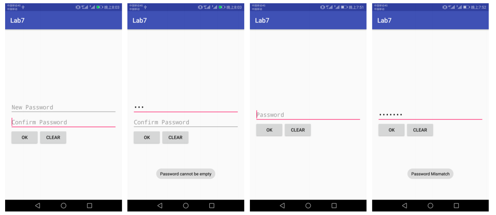
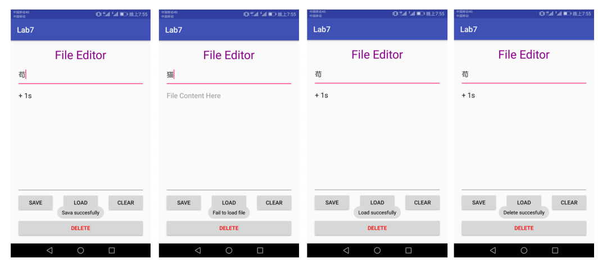
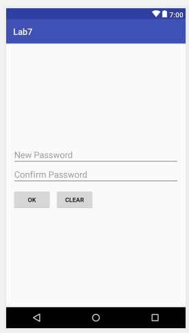
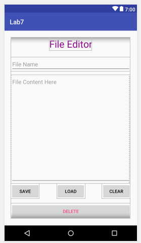
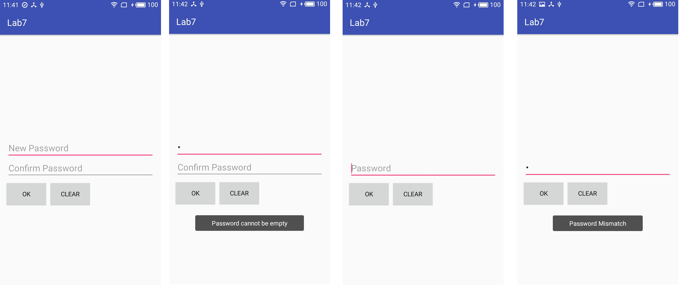
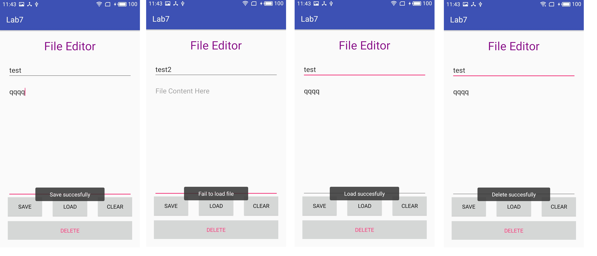

- [Lab 7 - 数据存储（一）](#lab-7---%E6%95%B0%E6%8D%AE%E5%AD%98%E5%82%A8%EF%BC%88%E4%B8%80%EF%BC%89)
    - [实验目的](#%E5%AE%9E%E9%AA%8C%E7%9B%AE%E7%9A%84)
    - [实验内容](#%E5%AE%9E%E9%AA%8C%E5%86%85%E5%AE%B9)
    - [实验过程](#%E5%AE%9E%E9%AA%8C%E8%BF%87%E7%A8%8B)
        - [step0: 实验思路复述](#step0-%E5%AE%9E%E9%AA%8C%E6%80%9D%E8%B7%AF%E5%A4%8D%E8%BF%B0)
        - [step1:实现密码输入activity布局](#step1%E5%AE%9E%E7%8E%B0%E5%AF%86%E7%A0%81%E8%BE%93%E5%85%A5activity%E5%B8%83%E5%B1%80)
        - [step2:实现密码输入activity整体逻辑](#step2%E5%AE%9E%E7%8E%B0%E5%AF%86%E7%A0%81%E8%BE%93%E5%85%A5activity%E6%95%B4%E4%BD%93%E9%80%BB%E8%BE%91)
            - [init函数](#init%E5%87%BD%E6%95%B0)
            - [checkPasswordStatus函数](#checkpasswordstatus%E5%87%BD%E6%95%B0)
            - [setupButton函数](#setupbutton%E5%87%BD%E6%95%B0)
        - [step3:实现文件编辑activity布局](#step3%E5%AE%9E%E7%8E%B0%E6%96%87%E4%BB%B6%E7%BC%96%E8%BE%91activity%E5%B8%83%E5%B1%80)
        - [step4:实现文件编辑activity整体逻辑](#step4%E5%AE%9E%E7%8E%B0%E6%96%87%E4%BB%B6%E7%BC%96%E8%BE%91activity%E6%95%B4%E4%BD%93%E9%80%BB%E8%BE%91)
            - [init函数](#init%E5%87%BD%E6%95%B0)
            - [setupButton函数](#setupbutton%E5%87%BD%E6%95%B0)
    - [实现测试](#%E5%AE%9E%E7%8E%B0%E6%B5%8B%E8%AF%95)
    - [实验思考](#%E5%AE%9E%E9%AA%8C%E6%80%9D%E8%80%83)
    - [遇到的问题及解决方案](#%E9%81%87%E5%88%B0%E7%9A%84%E9%97%AE%E9%A2%98%E5%8F%8A%E8%A7%A3%E5%86%B3%E6%96%B9%E6%A1%88)
    - [参考资料](#%E5%8F%82%E8%80%83%E8%B5%84%E6%96%99)

# Lab 7 - 数据存储（一）

## 实验目的

* a、 学习 SharedPreferences 的基本使用；
* b、学习 Android 中常见的文件操作方法；
* c、 复习 Android 界面编程。

## 实验内容



从左至右，依次为：初始密码界面、密码为空提示、密码匹配后重新进入界面、密码错误提示。



从左至右，依次为：保存成功提示、写入失败提示、写入成功提示、删除成功提示。

- 1、 如图所示，本次实验需要实现两个 activity；

- 2、 首先，需要实现一个密码输入 activity：
    - a、 如果应用首次启动，则界面呈现出两个输入框，分别为新密码输入和确认密码输入框；
    - b、输入框下方有两个按钮：
        - OK 按钮，点击之后：
            - 若 new password 为空，则弹出密码为空的提示；
            - 若 new password 与 comfirm password 不匹配，则弹出不匹配的提示；
            - 若密码不为空且互相匹配，则保存密码，进入文件编辑界面。
        - CLEAR 按钮，点击之后清除所有输入框的内容。
    - c、 完成创建密码后，退出应用再进入应用，则只呈现一个密码输入框；
        - 点击 OK 按钮后，如果输入的密码与保存的密码不匹配，则弹出 Toast 提示；
        - 点击 CLEAR 按钮后，清除密码输入框的内容。
    - d、出于学习的目的，我们使用 SharedPreferences 来保存密码，但是在实际应用中我们会用更加安全的机制来保存这些隐私信息，更多可以参考[链接一][1]和[链接二][2]。

- 3、 然后，实现一个文件编辑 activity：
    - a、 界面底部有两行四个按钮，第一行三个按钮高度一致，顶对齐，按钮水平均匀分布。按钮上方除了 ActionBar 和 StatusBar 之外的空间由标题和两个 EditText 占据，文件内容编辑的 EditText 需要占据除去其他控件的全部屏幕空间，且内部文字竖直方向置顶，左对齐；
    - b、在文件名输入框内输入文件名，在文件内容编辑区域输入任意内容，点击 SAVE 按钮后能够保存到指定文件，成功保存后弹出 Toast 提示；
    - c、 点击 CLEAR 按钮，能够清空文件内容编辑区域内的内容；
    - d、点击 LOAD 按钮，能够按照文件名从内存中读取文件内容，并将文件内容写入到编辑框中。如果成功导入，则弹出成功的 Toast 提示，如果导入失败（例如：文件不存在），则弹出读取失败的 Toast 提示。
    - e、 点击 DELETE 按钮，能够按照文件名从内容中删除文件，删除文件后再载入文件，弹出导入失败的 Toast 提示。

- 4、特殊要求：进入文件编辑的 Activity 之后，如果点击返回按钮，则直接返回 Home 界面，不再返回密码输入界面。

## 实验过程

### step0: 实验思路复述

这次TA提供的实验文档可以说是非常地贴心了，整体的实现逻辑都写得很清楚。这里便不再复述了。

这里密码输入activity命名为MainActivity.java，对应布局文件为activity_main.xml；文件编辑activity命令为FileEdit.java，对应布局文件为activit_file_edit.xml。

### step1:实现密码输入activity布局

首先，在activity_main.xml中添加如下代码：

```xml
<?xml version="1.0" encoding="utf-8"?>
<android.support.constraint.ConstraintLayout xmlns:android="http://schemas.android.com/apk/res/android"
    xmlns:app="http://schemas.android.com/apk/res-auto"
    xmlns:tools="http://schemas.android.com/tools"
    android:layout_width="match_parent"
    android:layout_height="match_parent"
    tools:context="com.linzch3.lab7.MainActivity">

    <EditText
        android:id="@+id/new_password"
        android:layout_width="match_parent"
        android:layout_height="wrap_content"
        android:hint="New Password"
        android:inputType="textPassword"
        android:textSize="20sp"
        app:layout_constraintTop_toTopOf="parent"
        app:layout_constraintLeft_toLeftOf="parent"
        app:layout_constraintRight_toRightOf="parent"
        android:layout_marginTop="230dp"
        android:layout_marginLeft="15dp"
        android:layout_marginRight="15dp"/>

    <EditText
        android:id="@+id/confirm_password"
        android:layout_width="match_parent"
        android:layout_height="wrap_content"
        android:hint="Confirm Password"
        android:inputType="textPassword"
        android:textSize="20sp"
        app:layout_constraintTop_toTopOf="parent"
        app:layout_constraintLeft_toLeftOf="parent"
        app:layout_constraintRight_toRightOf="parent"
        android:layout_marginTop="275dp"
        android:layout_marginLeft="15dp"
        android:layout_marginRight="15dp"/>

    <Button
        android:id="@+id/ok_button"
        android:layout_width="wrap_content"
        android:layout_height="wrap_content"
        android:text="OK"
        app:layout_constraintTop_toBottomOf="@id/confirm_password"
        app:layout_constraintLeft_toLeftOf="parent"
        android:layout_marginTop="10dp"
        android:layout_marginLeft="15dp"/>

    <Button
        android:id="@+id/clear_button"
        android:layout_width="wrap_content"
        android:layout_height="wrap_content"
        android:text="CLEAR"
        app:layout_constraintTop_toBottomOf="@id/confirm_password"
        app:layout_constraintLeft_toRightOf="@id/ok_button"
        android:layout_marginTop="10dp"
        android:layout_marginLeft="10dp"/>

</android.support.constraint.ConstraintLayout>
```

实现思路简单，不再赘述其实现。

实现效果如下：




### step2:实现密码输入activity整体逻辑

这个activity的实现逻辑都可在onCreate函数中添加。
```java
    @Override
    protected void onCreate(Bundle savedInstanceState) {
        super.onCreate(savedInstanceState);
        setContentView(R.layout.activity_main);

        init();
        checkPasswordStatus();
        setupButton();

    }
```

其中，init函数用于初始化变量信息；checkPasswordStatus函数用于检查之前是否保存过密码；setupButton函数用于设置按钮的一些点击事件。下面来一一给出其实现以及对应解释。

#### init函数

首先，声明如下类变量：

```java
    /*UI组件相关*/
    private EditText newPassword;
    private EditText confirmPassword;
    private Button okButton;
    private Button clearButton;
    /*SharedPreferences相关*/
    private SharedPreferences passwordSP;
    private SharedPreferences.Editor passwordSaver;
    final static String SP_key = "PASSWORD";
```

其中SP_key是用于存储和读取SharedPreferences时用到的键值。

函数实现如下，即是简单的初始化变量信息。

```java
    void init() {
        newPassword = findViewById(R.id.new_password);
        confirmPassword = findViewById(R.id.confirm_password);
        okButton = findViewById(R.id.ok_button);
        clearButton = findViewById(R.id.clear_button);

        passwordSP = this.getSharedPreferences(SP_key, MODE_PRIVATE);
        passwordSaver = passwordSP.edit();
    }
```

#### checkPasswordStatus函数

首先，声明如下变量，用于判断之前是否已经保存密码。

```java
private boolean haveBeenSavedPassword = false;
```

函数实现如下：

```java
    void checkPasswordStatus(){
        /*检查是否已经成功保存过密码*/
        if(passwordSP.getString(SP_key, null)!=null){
            haveBeenSavedPassword = true;
            newPassword.setVisibility(View.GONE);
            confirmPassword.setHint("Password");
        }
    }
```

其通过判断之前是否已经保存过密码来设置`New Password`输入框是否隐藏以及`Confirm Password`输入框的提示文字是否该修改。

#### setupButton函数

函数实现如下：

```java
void setupButton(){
        /*设置按钮的相关逻辑*/
        okButton.setOnClickListener(new View.OnClickListener() {
            @Override
            public void onClick(View view) {
                String newPasswordText = newPassword.getText().toString();
                String confirmPasswordText = confirmPassword.getText().toString();
                if(haveBeenSavedPassword){
                    if(confirmPasswordText.length()==0){
                        Toast.makeText(MainActivity.this, "Password cannot be empty", Toast.LENGTH_SHORT).show();
                    }else if(confirmPasswordText.equals(passwordSP.getString(SP_key, null))){
                        startActivity(new Intent(MainActivity.this, FileEdit.class));
                    }else{
                        Toast.makeText(MainActivity.this, "Password Mismatch", Toast.LENGTH_SHORT).show();
                    }
                }else{
                    if(newPasswordText.length()==0 || confirmPasswordText.length()==0){
                        Toast.makeText(MainActivity.this, "Password cannot be empty", Toast.LENGTH_SHORT).show();
                    }else if(newPasswordText.equals(confirmPasswordText)){
                            passwordSaver.putString(SP_key, newPasswordText);
                            passwordSaver.commit();
                            startActivity(new Intent(MainActivity.this, FileEdit.class));
                    }else{
                        Toast.makeText(MainActivity.this, "Password Mismatch", Toast.LENGTH_SHORT).show();
                    }
                }
            }
        });
```

实现逻辑严格按照实现要求，这里不再赘述其实现。

至此，密码输入activity实现完毕。

### step3:实现文件编辑activity布局

在`activit_file_edit.xml`中添加如下代码：

```xml
<?xml version="1.0" encoding="utf-8"?>
<LinearLayout xmlns:android="http://schemas.android.com/apk/res/android"
    xmlns:app="http://schemas.android.com/apk/res-auto"
    xmlns:tools="http://schemas.android.com/tools"
    android:layout_width="match_parent"
    android:layout_height="match_parent"
    android:orientation="vertical"
    android:layout_margin="20dp"
    tools:context="com.linzch3.lab7.FileEdit">

    <TextView
        android:id="@+id/title"
        android:layout_width="wrap_content"
        android:layout_height="wrap_content"
        android:layout_gravity="center_horizontal"
        android:text="File Editor"
        android:textSize="30sp"
        android:textColor="#8A018A"/>

    <EditText
        android:id="@+id/file_name_edit"
        android:layout_width="match_parent"
        android:layout_height="wrap_content"
        android:layout_marginTop="20dp"
        android:hint="File Name"/>

    <EditText
        android:id="@+id/file_content_edit"
        android:layout_width="match_parent"
        android:layout_height="0dp"
        android:layout_marginTop="10dp"
        android:layout_weight="1"
        android:gravity="top|left"
        android:hint="File Content Here"/>

    <RelativeLayout
        android:id="@+id/button_layout"
        android:layout_width="match_parent"
        android:layout_height="110dp">

        <Button
            android:id="@+id/save_button"
            android:layout_width="wrap_content"
            android:layout_height="wrap_content"
            android:layout_alignParentTop="true"
            android:layout_alignParentLeft="true"
            android:text="SAVE"/>

        <Button
            android:id="@+id/load_button"
            android:layout_width="wrap_content"
            android:layout_height="wrap_content"
            android:layout_alignTop="@id/save_button"
            android:layout_centerHorizontal="true"
            android:text="LOAD"/>

        <Button
            android:id="@+id/clear_button2"
            android:layout_width="wrap_content"
            android:layout_height="wrap_content"
            android:layout_alignTop="@id/save_button"
            android:layout_alignParentRight="true"
            android:text="CLEAR"/>

        <Button
            android:id="@+id/delete_button"
            android:layout_width="match_parent"
            android:layout_height="wrap_content"
            android:layout_alignParentBottom="true"
            android:text="DELETE"
            android:textColor="@color/colorAccent"/>

    </RelativeLayout>

</LinearLayout>

```

这个布局文件的实现需要点技巧，刚开始我是使用ConstraintLayout来实现最外层布局的，但是却无法实现文件内容输入框能占满中间剩余空间的效果，后来参考实验文档的资料后，将最外层布局修改为LinearLayout，并设置对应的EditText控件的相关属性如下即可解决问题。

```xml
android:layout_height="0dp"
android:layout_weight="1"
```

实现效果如下：



### step4:实现文件编辑activity整体逻辑

整体实现逻辑可在onCreate函数中实现：

```java
    @Override
    protected void onCreate(Bundle savedInstanceState) {
        super.onCreate(savedInstanceState);
        setContentView(R.layout.activity_file_edit);

        init();
        setupButton();
    }
```

同上一个activity，这里也实现了相同目的的两个函数：init和setupButton。下面来一一给出其实现和解释。

#### init函数

首先，在类中声明如下变量：

```java
    private EditText fileNameEdit;
    private EditText fileContentEdit;
    private Button saveButton;
    private Button loadButton;
    private Button clearButton;
    private Button deleteButton;
```

函数实现如下：

```java
    void init(){
        fileNameEdit = findViewById(R.id.file_name_edit);
        fileContentEdit = findViewById(R.id.file_content_edit);
        saveButton = findViewById(R.id.save_button);
        loadButton = findViewById(R.id.load_button);
        clearButton = findViewById(R.id.clear_button2);
        deleteButton = findViewById(R.id.delete_button);
    }
```

#### setupButton函数

实现代码如下：

```java
void setupButton(){
        saveButton.setOnClickListener(new View.OnClickListener() {
            @Override
            public void onClick(View view) {
                //保存文件
                String fileName = fileNameEdit.getText().toString();
                String fileContent = fileContentEdit.getText().toString();
                try {
                    FileOutputStream fileOutputStream = openFileOutput(fileName, MODE_PRIVATE);
                    fileOutputStream.write(fileContent.getBytes());
                    fileOutputStream.close();
                    Toast.makeText(FileEdit.this, "Save succesfully", Toast.LENGTH_SHORT).show();
                } catch (FileNotFoundException e) {
                    Toast.makeText(FileEdit.this, "Fail to save file", Toast.LENGTH_SHORT).show();
                    e.printStackTrace();
                } catch (IOException e) {
                    Toast.makeText(FileEdit.this, "Fail to save file", Toast.LENGTH_SHORT).show();
                    e.printStackTrace();
                }
            }
        });
        loadButton.setOnClickListener(new View.OnClickListener() {
            @Override
            public void onClick(View view) {
                //加载文件
                String fileName = fileNameEdit.getText().toString();
                try {
                    FileInputStream fileInputStream = openFileInput(fileName);
                    byte[] contents = new byte[fileInputStream.available()];
                    fileInputStream.read(contents);
                    fileInputStream.close();
                    fileContentEdit.setText(new String(contents));
                    Toast.makeText(FileEdit.this, "Load succesfully", Toast.LENGTH_SHORT).show();

                } catch (FileNotFoundException e) {
                    Toast.makeText(FileEdit.this, "Fail to load file", Toast.LENGTH_SHORT).show();
                    e.printStackTrace();
                } catch (IOException e) {
                    Toast.makeText(FileEdit.this, "Fail to load file", Toast.LENGTH_SHORT).show();
                    e.printStackTrace();
                }
            }
        });
        clearButton.setOnClickListener(new View.OnClickListener() {
            @Override
            public void onClick(View view) {
                //清空已填的所有信息
                fileContentEdit.setText("");
            }
        });
        deleteButton.setOnClickListener(new View.OnClickListener() {
            @Override
            public void onClick(View view) {
                //删除已保存的某个文件
                String fileName = fileNameEdit.getText().toString();
                deleteFile(fileName);
                Toast.makeText(FileEdit.this, "Delete succesfully", Toast.LENGTH_SHORT).show();
            }
        });
```

该函数设置了保存、加载、清空、删除按钮的点击事件的逻辑。其中，saveButton涉及到文件的写入，loadButton涉及到文件的读取，deleteButton涉及到文件的删除。对应API的用法参考实验文档即可，这里也不再赘述。

在这一部分，给出的实验文档没有指出在什么情况下应弹出包含什么信息的Toast，因此便依照TA给出的样例APP的作为基准。

## 实现测试

密码输入activity：



从左至右，依次为：初始密码界面、密码为空提示、密码匹配后重新进入界面、密码错误提示。实验效果与预期相符。

文件编辑activity：



从左至右，依次为：保存成功提示、写入失败提示、写入成功提示、删除成功提示。实验效果与预期相符。
## 实验思考

- 简要描述 Internal Storage 和 External Storage 的区别以及他们分别适用的场景。
    - Internal Storage中的数据存储在设备内部存储器上（在`/data/data/<package name>/files`目录下）。默认情况下在这里存储的数据为应用程序的私有数据，其它应用程序不能访问。无法在文件管理器中查看。
        - 适用于保存应用的保密的本地数据。
    - External storage中的数据是共有的，对所有应用都是可见的和可用的。可在文件管理器中查看。
        - 适用于保存可于其他应用共享的本地数据。
    - 这两个概念都是相对于应用来说的，应该理解为逻辑上的概念,不应理解为物理上的外部SD卡和手机或移动设备内存。


## 遇到的问题及解决方案

- 1.如何使EditText控件占据剩余屏幕空间？
    - 解决方案：https://developer.android.com/guide/topics/ui/layout/linear.html
- 2.当 Activity 不可见时，如何将其从 activity stack 中除去（按返回键直接返回 Home）？
    - 在 AndroidManifest.xml 中设置对应的acitvity 的 android:noHistory=true。
- 3.如何实现文件编辑activity中标题的颜色和实验要求的一致？
    - 使用QQ/Tim截图，移动鼠标到示例图片的标题上，按下Ctrl键，即可看到对应颜色的RGB编码值`#8A018A`。

## 参考资料

- 1.[Android 存储：Internal Storage的用法以及与External storage 的区别][3]

[1]:https://stackoverflow.com/questions/1925486/android-storing-username-and-password
[2]:https://stackoverflow.com/questions/785973/what-is-the-most-appropriate-way-to-store-user-settings-in-android-application/786588
[3]:http://blog.csdn.net/u014136472/article/details/47337299