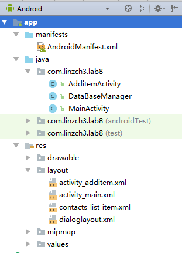
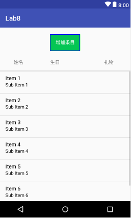
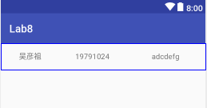
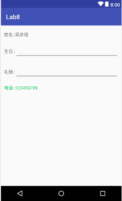
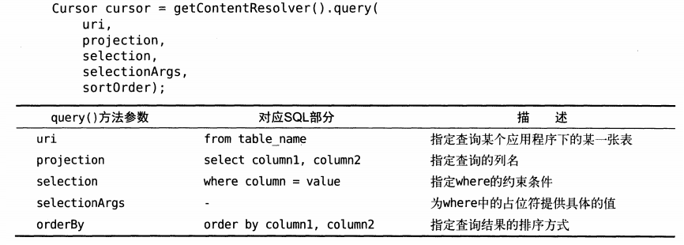
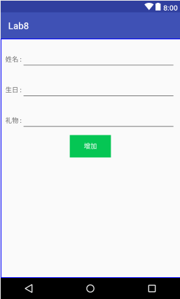
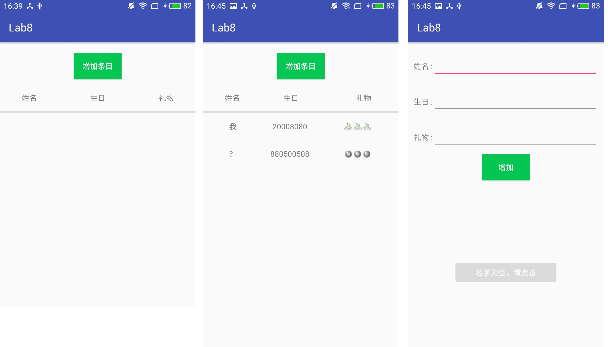
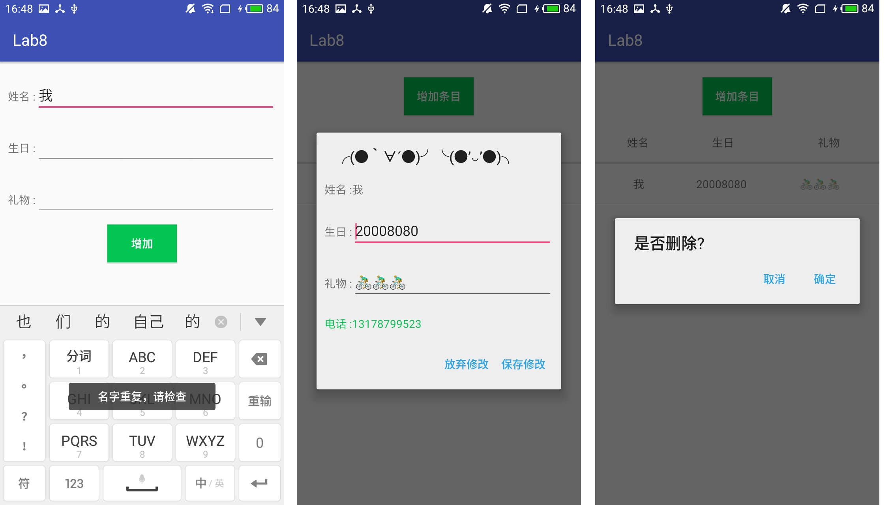

- [Lab 8 - 数据存储（二）](#lab-8---%E6%95%B0%E6%8D%AE%E5%AD%98%E5%82%A8%EF%BC%88%E4%BA%8C%EF%BC%89)
    - [实验目的](#%E5%AE%9E%E9%AA%8C%E7%9B%AE%E7%9A%84)
    - [实验内容](#%E5%AE%9E%E9%AA%8C%E5%86%85%E5%AE%B9)
    - [实验过程](#%E5%AE%9E%E9%AA%8C%E8%BF%87%E7%A8%8B)
        - [step0:思路复述](#step0%E6%80%9D%E8%B7%AF%E5%A4%8D%E8%BF%B0)
        - [step1:实现DataBaseManager](#step1%E5%AE%9E%E7%8E%B0databasemanager)
        - [step2:实现MainActivity的布局](#step2%E5%AE%9E%E7%8E%B0mainactivity%E7%9A%84%E5%B8%83%E5%B1%80)
        - [step3:实现listview子项的布局](#step3%E5%AE%9E%E7%8E%B0listview%E5%AD%90%E9%A1%B9%E7%9A%84%E5%B8%83%E5%B1%80)
        - [step4:实现对话框界面布局](#step4%E5%AE%9E%E7%8E%B0%E5%AF%B9%E8%AF%9D%E6%A1%86%E7%95%8C%E9%9D%A2%E5%B8%83%E5%B1%80)
        - [step5:实现MainActivity界面逻辑](#step5%E5%AE%9E%E7%8E%B0mainactivity%E7%95%8C%E9%9D%A2%E9%80%BB%E8%BE%91)
            - [init()函数](#init%E5%87%BD%E6%95%B0)
            - [setupButton()函数](#setupbutton%E5%87%BD%E6%95%B0)
            - [setupListViewData()函数实现](#setuplistviewdata%E5%87%BD%E6%95%B0%E5%AE%9E%E7%8E%B0)
            - [setupListView()函数实现](#setuplistview%E5%87%BD%E6%95%B0%E5%AE%9E%E7%8E%B0)
            - [修复一个“潜在”的bug](#%E4%BF%AE%E5%A4%8D%E4%B8%80%E4%B8%AA%E2%80%9C%E6%BD%9C%E5%9C%A8%E2%80%9D%E7%9A%84bug)
        - [step6:实现添加条目界面的布局](#step6%E5%AE%9E%E7%8E%B0%E6%B7%BB%E5%8A%A0%E6%9D%A1%E7%9B%AE%E7%95%8C%E9%9D%A2%E7%9A%84%E5%B8%83%E5%B1%80)
        - [step7:实现添加条目界面逻辑](#step7%E5%AE%9E%E7%8E%B0%E6%B7%BB%E5%8A%A0%E6%9D%A1%E7%9B%AE%E7%95%8C%E9%9D%A2%E9%80%BB%E8%BE%91)
            - [init()函数](#init%E5%87%BD%E6%95%B0)
            - [setupButton()函数](#setupbutton%E5%87%BD%E6%95%B0)
    - [实验结果](#%E5%AE%9E%E9%AA%8C%E7%BB%93%E6%9E%9C)
    - [参考资料](#%E5%8F%82%E8%80%83%E8%B5%84%E6%96%99)

# Lab 8 - 数据存储（二）

## 实验目的

* 学习 SQL 数据库的使用
* 学习 ContentProvider 的使用
* 复习 Android 界面编程

## 实验内容


从左至右：初始界面，添加一部分条目，名字不能为空。


从左至右：名字不能重复，点击条目显示信息（可修改），长按删除条目。

实现一个生日备忘录，要求实现：

* 使用 SQLite 数据库保存生日的相关信息，并使得每一次运行程序都可以显示出已经存储在数据库里的内容；

* 使用 ContentProvider 来获取手机通讯录中的电话号码。

功能要求：

* A. 主界面包含增加生日条目按钮和生日信息列表；
* B. 点击“增加条目”按钮，跳转到下一个 Activity 界面，界面中包含三个信息输入框（姓名、生日、礼物）和一个“增加”按钮，**姓名字段不能为空且不能重复**；
* C. 在跳转到的界面中，输入生日的相关信息后，点击“增加”按钮返回到主界面，**此时，主界面中应更新列表，增加相应的生日信息**；
* D. 主界面列表点击事件：
    * 点击条目：
    弹出对话框，对话框中显示该条目的信息，并允许修改；
    对话框下方显示该寿星电话号码（**如果手机通讯录中有的话，如果没有就显示“无”**）
    点击“保存修改”按钮，更新主界面生日信息列表。
    * 长按条目：
    弹出对话框显示是否删除条目；
    点击“是”按钮，删除该条目，并更新主界面生日列表。

## 实验过程

### step0:思路复述

这次需要实现2个Activity，一个用于显示主界面（MainActivity），一个用于新增条目（AdditemActivity）。除此之外，还需实现两个布局文件，一个是用于listview子项布局的`contacts_list_item.xml`，一个是用于点击listview子项弹出的对话框布局的`dialoglayout.xml`。最后，需要实现一个可用于操作数据库的后台类`DataBaseManager`。

工程目录结构如下：



### step1:实现DataBaseManager

由于实现过程中经常需要使用该数据库操作类的函数，因此这里先给出其实现：

```java
package com.linzch3.lab8;


import android.content.Context;
import android.database.Cursor;
import android.database.sqlite.SQLiteDatabase;
import android.database.sqlite.SQLiteOpenHelper;

/**
 * Created by linzch3 on 17/12/19.
 */

public class DataBaseManager extends SQLiteOpenHelper {

    public static final String DB_NAME = "Contacts.db";
    public static final int DB_VERSION = 1;

    public DataBaseManager(Context context) {
        super(context, DB_NAME, null, DB_VERSION);
    }

    @Override
    public void onCreate(SQLiteDatabase sqLiteDatabase) {
        sqLiteDatabase.execSQL("CREATE TABLE Contacts (id integer PRIMARY KEY AUTOINCREMENT, " +
                                                       "name text UNIQUE NOT NULL, " +
                                                       "birthday text, " +
                                                       "gift text);");
    }

    @Override
    public void onUpgrade(SQLiteDatabase sqLiteDatabase, int i, int i1) {

    }

    /**********增删改查*****************/
    private void executeSQL(String SQL){
        SQLiteDatabase writableDatabase = getWritableDatabase();
        writableDatabase.execSQL(SQL);
        writableDatabase.close();
    }
    public void insertContact(String name, String birthday, String gift){
        String insertSQL = String.format("INSERT INTO Contacts(name, birthday, gift) values('%s', '%s', '%s');",
         name, birthday, gift);
        executeSQL(insertSQL);
    }

    public void deleteContact(String name){
        String deleteSQL = String.format("DELETE FROM Contacts WHERE name = '%s';", name);
        executeSQL(deleteSQL);
    }

    public void updateContact(String name, String birthday, String gift){
        String updateSQL = String.format("UPDATE Contacts SET birthday = '%s', gift = '%s' WHERE name = '%s';",
         birthday, gift, name);
        executeSQL(updateSQL);
    }

   public Cursor queryAllContact(){
       SQLiteDatabase writableDatabase = getWritableDatabase();
       return writableDatabase.rawQuery("SELECT * FROM Contacts;", null);
   }

   public boolean queryIfNameExist(String name){
       SQLiteDatabase writableDatabase = getWritableDatabase();
       String querySQL = String.format("SELECT * FROM Contacts WHERE name = '%s';", name);
       Cursor cursor = writableDatabase.rawQuery(querySQL, null);
       int temp = cursor.getCount();
       cursor.close();
       return temp==1;
   }
    /**********增删改查*****************/
}
```

这里我均是使用原生SQL语句来实现数据库操作的，代码简单明了，这里不再赘述。

实现该函数需要注意的就是：使用完`cursor`后要记得调用`cursor.close()`。

### step2:实现MainActivity的布局

在布局文件activity_main.xml中实现如下代码：

```xml
<?xml version="1.0" encoding="utf-8"?>
<android.support.constraint.ConstraintLayout xmlns:android="http://schemas.android.com/apk/res/android"
    xmlns:app="http://schemas.android.com/apk/res-auto"
    xmlns:tools="http://schemas.android.com/tools"
    android:layout_width="match_parent"
    android:layout_height="match_parent"
    tools:context="com.linzch3.lab8.MainActivity">

    <Button
        android:id="@+id/additem_button"
        android:layout_width="wrap_content"
        android:layout_height="wrap_content"
        app:layout_constraintTop_toTopOf="parent"
        app:layout_constraintLeft_toLeftOf="parent"
        app:layout_constraintRight_toRightOf="parent"
        android:layout_marginTop="20dp"
        android:text="增加条目"
        android:textColor="#FFFFFF"
        android:background="#05C654" />

    <TextView
        android:id="@+id/name_text"
        android:layout_width="wrap_content"
        android:layout_height="wrap_content"
        android:text="姓名"
        app:layout_constraintTop_toBottomOf="@id/additem_button"
        app:layout_constraintLeft_toLeftOf="parent"
        android:layout_marginTop="25dp"
        android:layout_marginLeft="40dp"/>

    <TextView
        android:id="@+id/birthday_text"
        android:layout_width="wrap_content"
        android:layout_height="wrap_content"
        android:text="生日"
        app:layout_constraintTop_toBottomOf="@id/additem_button"
        app:layout_constraintLeft_toRightOf="@id/name_text"

        android:layout_marginLeft="80dp"
        android:layout_marginTop="25dp"/>

    <TextView
        android:id="@+id/gift_text"
        android:layout_width="wrap_content"
        android:layout_height="wrap_content"
        android:text="礼物"
        app:layout_constraintTop_toBottomOf="@id/additem_button"
        app:layout_constraintRight_toRightOf="parent"
        android:layout_marginTop="25dp"
        android:layout_marginRight="50dp"/>

    <View
        android:id="@+id/shadow_area"
        android:layout_width="match_parent"
        android:layout_height="3dp"
        app:layout_constraintTop_toBottomOf="@id/birthday_text"
        android:layout_marginTop="15dp"
        android:background="#DCDCDC"/>

    <ListView
        android:id="@+id/contacts_list"
        android:layout_width="match_parent"
        android:layout_height="wrap_content"
        app:layout_constraintTop_toBottomOf="@id/shadow_area">
    </ListView>

</android.support.constraint.ConstraintLayout>
```

预览效果如下：



### step3:实现listview子项的布局

在`contacts_list_item.xml`中添加如下代码：

```xml
<?xml version="1.0" encoding="utf-8"?>
<android.support.constraint.ConstraintLayout xmlns:android="http://schemas.android.com/apk/res/android"
    android:layout_width="match_parent"
    android:layout_height="wrap_content"
    xmlns:app="http://schemas.android.com/apk/res-auto">

    <TextView
        android:id="@+id/name"
        android:layout_width="110dp"
        android:layout_height="50dp"
        app:layout_constraintLeft_toLeftOf="parent"
        android:text="吴彦祖"
        android:gravity="center"/>

    <TextView
        android:id="@+id/birthday"
        android:layout_width="0dp"
        android:layout_height="50dp"
        app:layout_constraintLeft_toRightOf="@id/name"
        app:layout_constraintRight_toLeftOf="@id/gift"
        android:layout_marginLeft="10dp"
        android:layout_marginRight="10dp"
        android:text="19791024"
        android:gravity="center"/>

    <TextView
        android:id="@+id/gift"
        android:layout_width="150dp"
        android:layout_height="50dp"
        app:layout_constraintRight_toRightOf="parent"
        android:gravity="center"
        android:text="adcdefg" />

</android.support.constraint.ConstraintLayout>
```

实现效果如下：



### step4:实现对话框界面布局

在点击listview子项时会弹出对话框，其对应的布局实现为：

```xml
<?xml version="1.0" encoding="utf-8"?>
<android.support.constraint.ConstraintLayout xmlns:android="http://schemas.android.com/apk/res/android"
    android:layout_width="match_parent"
    android:layout_height="match_parent"
    xmlns:app="http://schemas.android.com/apk/res-auto">

    <LinearLayout
        android:id="@+id/layout_top"
        android:layout_width="match_parent"
        android:layout_height="wrap_content"
        android:orientation="horizontal"
        app:layout_constraintTop_toTopOf="parent"
        android:layout_marginTop="10dp"
        android:padding="10dp">
        <TextView
            android:layout_width="wrap_content"
            android:layout_height="wrap_content"
            android:text="姓名 :"
            />
        <TextView
            android:id="@+id/dialog_name"
            android:layout_width="wrap_content"
            android:layout_height="wrap_content"
            android:text="吴彦祖" />
    </LinearLayout>

    <LinearLayout
        android:id="@+id/layout_middle_up"
        android:layout_width="match_parent"
        android:layout_height="wrap_content"
        android:orientation="horizontal"
        app:layout_constraintTop_toBottomOf="@id/layout_top"
        android:padding="10dp">
        <TextView
            android:layout_width="wrap_content"
            android:layout_height="wrap_content"
            android:text="生日 :"
            />
        <EditText
            android:id="@+id/dialog_birthday"
            android:layout_width="match_parent"
            android:layout_height="wrap_content"/>
    </LinearLayout>

    <LinearLayout
        android:id="@+id/layout_middle_down"
        android:layout_width="match_parent"
        android:layout_height="wrap_content"
        android:orientation="horizontal"
        app:layout_constraintTop_toBottomOf="@id/layout_middle_up"
        android:padding="10dp">
        <TextView
            android:layout_width="wrap_content"
            android:layout_height="wrap_content"
            android:text="礼物 :"
            />
        <EditText
            android:id="@+id/dialog_gift"
            android:layout_width="match_parent"
            android:layout_height="wrap_content"/>
    </LinearLayout>

    <LinearLayout
        android:id="@+id/layout_bottom"
        android:layout_width="match_parent"
        android:layout_height="wrap_content"
        android:orientation="horizontal"
        app:layout_constraintTop_toBottomOf="@id/layout_middle_down"
        android:padding="10dp">
        <TextView
            android:layout_width="wrap_content"
            android:layout_height="wrap_content"
            android:text="电话 :"
            android:textColor="#05C654"
            />
        <TextView
            android:id="@+id/dialog_phone_number"
            android:layout_width="match_parent"
            android:layout_height="wrap_content"
            android:text="123456789"
            android:textColor="#05C654"/>
    </LinearLayout>

</android.support.constraint.ConstraintLayout>
```

实现效果如下：



### step5:实现MainActivity界面逻辑

下面来实现MainActivity的界面逻辑，该界面的主要代码均可在onCreate函数中实现:

```java
@Override
    protected void onCreate(Bundle savedInstanceState) {
        super.onCreate(savedInstanceState);
        setContentView(R.layout.activity_main);

        init();
        setupButton();
        setupListViewData();
        setupListView();
    }
```

这里添用的4个函数的作用依次是：初始化变量、设置添加新条目的按钮的点击事件、设置listview的数据、设置listview的相关点击事件。

下面来一一进行讲解。

#### init()函数

首先在类中声明如下变量:

```java
    private Button additemButton;
    private ListView contactsListView;
```

函数实现如下：

```java
    void init(){
        additemButton = findViewById(R.id.additem_button);
        contactsListView = findViewById(R.id.contacts_list);
    }
```

#### setupButton()函数

```java
void setupButton(){
        additemButton.setOnClickListener(new View.OnClickListener() {
            @Override
            public void onClick(View view) {
                startActivity(new Intent(MainActivity.this, AdditemActivity.class));
            }
        });
    }
```

该函数实现当添加条目按钮被点击后会跳转到添加条目界面的功能。

#### setupListViewData()函数实现

首先在类中声明如下变量：

```java
    private SimpleAdapter mSimpleAdapter;
    private List<Map<String, Object>> contactsListData = new ArrayList();
    private DataBaseManager mDataBaseManager = new DataBaseManager(this);
```

函数实现如下：

```java
void setupListViewData(){
        contactsListData.clear();
        Cursor cursor = mDataBaseManager.queryAllContact();
        while(cursor.moveToNext()){
            Map<String, Object> temp = new LinkedHashMap<>();
            temp.put("name", cursor.getString(cursor.getColumnIndex("name")));
            temp.put("birthday", cursor.getString(cursor.getColumnIndex("birthday")));
            temp.put("gift", cursor.getString(cursor.getColumnIndex("gift")));
            contactsListData.add(temp);
        }
        mSimpleAdapter = new SimpleAdapter(this, contactsListData, R.layout.contacts_list_item,
                new String[] {"name", "birthday", "gift"},
                new int[] {R.id.name, R.id.birthday, R.id.gift});
        contactsListView.setAdapter(mSimpleAdapter);
        cursor.close();
    }
```

该函数被调用时会加载数据库中的所有数据到listview的adapter中。

#### setupListView()函数实现

```java
 void setupListView(){
        contactsListView.setOnItemClickListener(new AdapterView.OnItemClickListener() {
            @Override
            public void onItemClick(AdapterView<?> adapterView, View view, final int i, long l) {
                View dialogView = LayoutInflater.from(MainActivity.this).inflate(R.layout.dialoglayout, null);

                TextView name = dialogView.findViewById(R.id.dialog_name);
                final EditText birthday = dialogView.findViewById(R.id.dialog_birthday);
                final EditText gift = dialogView.findViewById(R.id.dialog_gift);
                TextView phoneNumber = dialogView.findViewById(R.id.dialog_phone_number);

                final Map<String, Object> itemData_in_pos_i = contactsListData.get(i);
                name.setText(itemData_in_pos_i.get("name").toString());
                birthday.setText(itemData_in_pos_i.get("birthday").toString());
                gift.setText(itemData_in_pos_i.get("gift").toString());
                phoneNumber.setText(getAssociatedPhoneNumber(itemData_in_pos_i.get("name").toString()));

                new AlertDialog.Builder(MainActivity.this)
                        .setView(dialogView)
                        .setTitle("╭(●｀∀´●)╯╰(●’◡’●)╮")
                        .setNegativeButton("放弃修改", new DialogInterface.OnClickListener() {
                            @Override
                            public void onClick(DialogInterface dialog, int which) {
                                Toast.makeText(MainActivity.this, "修改已放弃", Toast.LENGTH_SHORT).show();
                            }
                        })
                        .setPositiveButton("保存修改", new DialogInterface.OnClickListener() {
                            @Override
                            public void onClick(DialogInterface dialog, int which) {
                                String name = itemData_in_pos_i.get("name").toString();
                                String birthday_new = birthday.getText().toString();
                                String gift_new = gift.getText().toString();

                                mDataBaseManager.updateContact(name, birthday_new, gift_new);

                                Map<String, Object> temp = new LinkedHashMap<>();
                                temp.put("name", name);
                                temp.put("birthday", birthday_new);
                                temp.put("gift", gift_new);

                                contactsListData.set(i, temp);
                                mSimpleAdapter.notifyDataSetChanged();
                            }
                        })
                        .create().show();

            }
        });
        contactsListView.setOnItemLongClickListener(new AdapterView.OnItemLongClickListener() {
            @Override
            public boolean onItemLongClick(AdapterView<?> adapterView, View view, final int i, long l) {
                new AlertDialog.Builder(MainActivity.this)
                        .setTitle("是否删除?")
                        .setNegativeButton("取消", new DialogInterface.OnClickListener() {
                            @Override
                            public void onClick(DialogInterface dialog, int which) {
                                Toast.makeText(MainActivity.this, "不删除联系人", Toast.LENGTH_SHORT).show();
                            }
                        })
                        .setPositiveButton("确定", new DialogInterface.OnClickListener() {
                            @Override
                            public void onClick(DialogInterface dialog, int which) {
                                mDataBaseManager.deleteContact(contactsListData.get(i).get("name").toString());

                                contactsListData.remove(i);
                                mSimpleAdapter.notifyDataSetChanged();
                            }
                        })
                        .create().show();

                return true;
            }
        });
    }
```

在该函数内依次实现了listview子项点击和长按的事件处理逻辑。

这里的`getAssociatedPhoneNumber()`函数实现的功能是：根据输入的联系人的名字得到对应的个人电话号码。其实现如下：

```java
String getAssociatedPhoneNumber(String name){
        String [] columnsToQuery = new String[]{ContactsContract.CommonDataKinds.Phone.DISPLAY_NAME, 
        ContactsContract.CommonDataKinds.Phone.NUMBER};
        String whereStatement = String.format(ContactsContract.CommonDataKinds.Phone.DISPLAY_NAME + " = '%s'", name);
        Cursor cursor = MainActivity.this.getContentResolver()
                                         .query(ContactsContract.CommonDataKinds.Phone.CONTENT_URI,
                                                 columnsToQuery,
                                                 whereStatement,
                                                 null, null);
        if(cursor!=null){
            String personalPhoneNumber = "无";
            while(cursor.moveToNext()){
                personalPhoneNumber = cursor.getString(cursor.getColumnIndex(
                    ContactsContract.CommonDataKinds.Phone.NUMBER));
                //Log.e("debug", personalPhoneNumber);
                break;
            }
            cursor.close();
            return personalPhoneNumber;
        }else return "无";
    }
```

由于涉及到了读取手机联系人的操作，因此需要在AndroidManifest.xml中声明读取权限：

```xml
<uses-permission android:name="android.permission.READ_CONTACTS"/>
```

这里的`.getContentResolver().query()`函数略微有点难用，试了挺多次才试出来的。

这里附上当时查到的资料的关键截图：



除此之外，当一个联系人在通讯录里除了个人电话号码外还有其他诸如公司电话等信息时，这里只取个人电话号码作为显示，其对应查询结果集的第一个结果。

#### 修复一个“潜在”的bug

至此，MainActivity的整体逻辑已经实现完毕，但是这里有一个问题，当用户点击增加条目按钮到达第二个界面成功添加新的数据后，MainActivity中listview显示的数据却是“老”的数据，因此这里需要实现一个新的功能：当用户从第二个界面返回到主界面时，重新从数据库中加载数据到listview中。

查阅资料后，可发现：当用户从第二个界面返回到主界面时，MainActivity的onStart()函数会被调用。因此便可考虑重载该函数来实现上述功能。

实现代码如下：

```java
    @Override
    protected void onStart() {
        super.onStart();
        setupListViewData();
    }
```

至此，第一个界面的所有功能均实现完毕。

### step6:实现添加条目界面的布局

在`activity_additem.xml`中添加如下代码：

```xml
<?xml version="1.0" encoding="utf-8"?>
<android.support.constraint.ConstraintLayout xmlns:android="http://schemas.android.com/apk/res/android"
    xmlns:app="http://schemas.android.com/apk/res-auto"
    xmlns:tools="http://schemas.android.com/tools"
    android:layout_width="match_parent"
    android:layout_height="match_parent"
    tools:context="com.linzch3.lab8.AdditemActivity">

    <LinearLayout
        android:id="@+id/layout_top"
        android:layout_width="match_parent"
        android:layout_height="wrap_content"
        android:orientation="horizontal"
        app:layout_constraintTop_toTopOf="parent"
        android:layout_marginTop="10dp"
        android:padding="10dp">
        <TextView
            android:layout_width="wrap_content"
            android:layout_height="wrap_content"
            android:text="姓名 :"
            />
        <EditText
            android:id="@+id/name2"
            android:layout_width="match_parent"
            android:layout_height="wrap_content"/>
    </LinearLayout>

    <LinearLayout
        android:id="@+id/layout_middle"
        android:layout_width="match_parent"
        android:layout_height="wrap_content"
        android:orientation="horizontal"
        app:layout_constraintTop_toBottomOf="@id/layout_top"
        android:padding="10dp">
        <TextView
            android:layout_width="wrap_content"
            android:layout_height="wrap_content"
            android:text="生日 :"
            />
        <EditText
            android:id="@+id/birthday2"
            android:layout_width="match_parent"
            android:layout_height="wrap_content"/>
    </LinearLayout>

    <LinearLayout
        android:id="@+id/layout_bottom"
        android:layout_width="match_parent"
        android:layout_height="wrap_content"
        android:orientation="horizontal"
        app:layout_constraintTop_toBottomOf="@id/layout_middle"
        android:padding="10dp">
        <TextView
            android:layout_width="wrap_content"
            android:layout_height="wrap_content"
            android:text="礼物 :"
            />
        <EditText
            android:id="@+id/gift2"
            android:layout_width="match_parent"
            android:layout_height="wrap_content"/>
    </LinearLayout>

    <Button
        android:id="@+id/additem_button2"
        android:layout_width="wrap_content"
        android:layout_height="wrap_content"
        app:layout_constraintLeft_toLeftOf="parent"
        app:layout_constraintRight_toRightOf="parent"
        app:layout_constraintTop_toBottomOf="@id/layout_bottom"
        android:text="增加"
        android:textColor="#FFFFFF"
        android:background="#05C654"/>

</android.support.constraint.ConstraintLayout>
```

实现效果如下：



### step7:实现添加条目界面逻辑

该界面的整体逻辑均可在onCreate函数中实现，对应代码为：

```java
@Override
    protected void onCreate(Bundle savedInstanceState) {
        super.onCreate(savedInstanceState);
        setContentView(R.layout.activity_additem);

        init();
        setupButton();
    }
```

下面来依次解释这里调用的两个函数：

#### init()函数

首先在类中声明如下变量：

```java
private EditText name, birthday, gift;
private Button additem_button;
```

函数实现如下：

```java
void init(){
        name = findViewById(R.id.name2);
        birthday = findViewById(R.id.birthday2);
        gift = findViewById(R.id.gift2);
        additem_button = findViewById(R.id.additem_button2);
}
```

#### setupButton()函数

首先在类中声明如下变量：

```java
private DataBaseManager mDataBaseManager = new DataBaseManager(this);
```

函数实现如下：

```java
void setupButton(){
        additem_button.setOnClickListener(new View.OnClickListener() {
            @Override
            public void onClick(View view) {
                String name_input = name.getText().toString();
                if(name_input.equals("")){
                    Toast.makeText(AdditemActivity.this, "名字为空，请完善", Toast.LENGTH_SHORT).show();
                }else if(mDataBaseManager.queryIfNameExist(name_input)){
                    Toast.makeText(AdditemActivity.this, "名字重复，请检查", Toast.LENGTH_SHORT).show();
                }else{
                    String birthday_input = birthday.getText().toString();
                    String gift_input = gift.getText().toString();
                    mDataBaseManager.insertContact(name_input, birthday_input, gift_input);
                    finish();
                }

            }
        });
    }
```

该函数实现了当点击“增加”按钮的点击事件的处理逻辑。


## 实验结果



从左至右：初始界面，添加一部分条目，名字不能为空。



从左至右：名字不能重复，点击条目显示信息（可修改），长按删除条目。

## 参考资料

- 1.[Android Activity 生命周期中onStart()和onResume()的区别][1]

[1]:https://www.cnblogs.com/fansen/p/5667450.html


