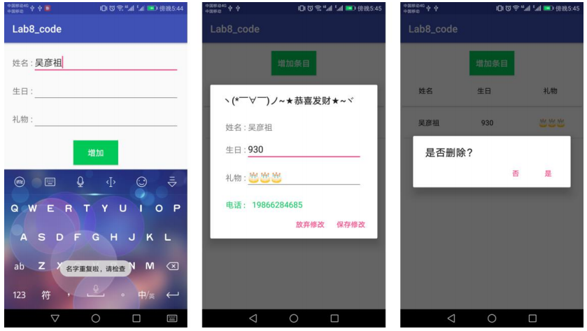

- [Lab 8 - 数据存储（二）](#lab-8---%E6%95%B0%E6%8D%AE%E5%AD%98%E5%82%A8%EF%BC%88%E4%BA%8C%EF%BC%89)
    - [实验目的](#%E5%AE%9E%E9%AA%8C%E7%9B%AE%E7%9A%84)
    - [实验内容](#%E5%AE%9E%E9%AA%8C%E5%86%85%E5%AE%B9)
    - [实验过程](#%E5%AE%9E%E9%AA%8C%E8%BF%87%E7%A8%8B)

# Lab 8 - 数据存储（二）

## 实验目的

* 学习 SQL 数据库的使用
* 学习 ContentProvider 的使用
* 复习 Android 界面编程

## 实验内容

从左至右：初始界面，添加一部分条目，名字不能为空。

从左至右：名字不能重复，点击条目显示信息（可修改），长按删除条目。

实现一个生日备忘录，要求实现：

* 使用 SQLite 数据库保存生日的相关信息，并使得每一次运行程序都可以显示出已经存储在数据库里的内容；

* 使用 ContentProvider 来获取手机通讯录中的电话号码。

功能要求：

* A. 主界面包含增加生日条目按钮和生日信息列表；
* B. 点击“增加条目”按钮，跳转到下一个 Activity 界面，界面中包含三个信息输入框（姓名、生日、礼物）和一个“增加”按钮，**姓名字段不能为空且不能重复**；
* C. 在跳转到的界面中，输入生日的相关信息后，点击“增加”按钮返回到主界面，**此时，主界面中应更新列表，增加相应的生日信息**；
* D. 主界面列表点击事件：
    * 点击条目：
    弹出对话框，对话框中显示该条目的信息，并允许修改；
    对话框下方显示该寿星电话号码（**如果手机通讯录中有的话，如果没有就显示“无”**）
    点击“保存修改”按钮，更新主界面生日信息列表。
    * 长按条目：
    弹出对话框显示是否删除条目；
    点击“是”按钮，删除该条目，并更新主界面生日列表。

## 实验过程

