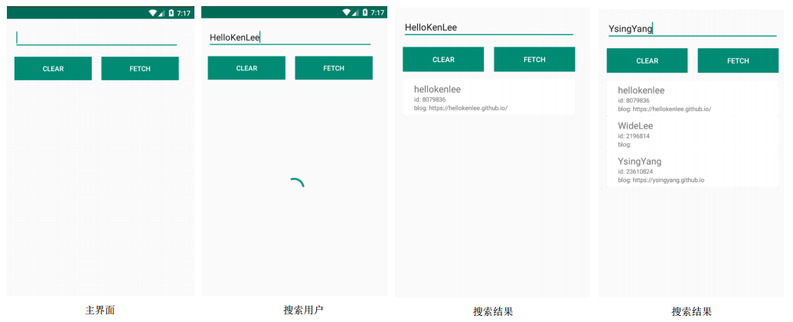
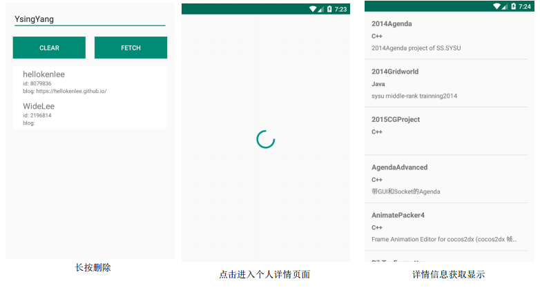

- [Lab 9 - Retrofit+RxJava+OkHttp 实现网络请求](#lab-9---retrofitrxjavaokhttp-%E5%AE%9E%E7%8E%B0%E7%BD%91%E7%BB%9C%E8%AF%B7%E6%B1%82)
    - [实验目的](#%E5%AE%9E%E9%AA%8C%E7%9B%AE%E7%9A%84)
    - [实验内容](#%E5%AE%9E%E9%AA%8C%E5%86%85%E5%AE%B9)
    - [实验过程](#%E5%AE%9E%E9%AA%8C%E8%BF%87%E7%A8%8B)
        - [step0:思路复述](#step0%E6%80%9D%E8%B7%AF%E5%A4%8D%E8%BF%B0)
        - [step1:添加依赖](#step1%E6%B7%BB%E5%8A%A0%E4%BE%9D%E8%B5%96)
        - [step2:使用 Retrofit 实现网络请求](#step2%E4%BD%BF%E7%94%A8-retrofit-%E5%AE%9E%E7%8E%B0%E7%BD%91%E7%BB%9C%E8%AF%B7%E6%B1%82)
        - [step3:实现主界面 RecyclerView 子项布局](#step3%E5%AE%9E%E7%8E%B0%E4%B8%BB%E7%95%8C%E9%9D%A2-recyclerview-%E5%AD%90%E9%A1%B9%E5%B8%83%E5%B1%80)
        - [step4:实现主界面 CardView 的适配器 - CardAdapter](#step4%E5%AE%9E%E7%8E%B0%E4%B8%BB%E7%95%8C%E9%9D%A2-cardview-%E7%9A%84%E9%80%82%E9%85%8D%E5%99%A8---cardadapter)
        - [step5:实现主界面布局](#step5%E5%AE%9E%E7%8E%B0%E4%B8%BB%E7%95%8C%E9%9D%A2%E5%B8%83%E5%B1%80)
        - [step6:实现主界面逻辑](#step6%E5%AE%9E%E7%8E%B0%E4%B8%BB%E7%95%8C%E9%9D%A2%E9%80%BB%E8%BE%91)
        - [step7:实现repo列表界面 ListView 子项布局](#step7%E5%AE%9E%E7%8E%B0repo%E5%88%97%E8%A1%A8%E7%95%8C%E9%9D%A2-listview-%E5%AD%90%E9%A1%B9%E5%B8%83%E5%B1%80)
        - [step8:实现repo列表界面布局](#step8%E5%AE%9E%E7%8E%B0repo%E5%88%97%E8%A1%A8%E7%95%8C%E9%9D%A2%E5%B8%83%E5%B1%80)
        - [step9:实现repo列表界面逻辑](#step9%E5%AE%9E%E7%8E%B0repo%E5%88%97%E8%A1%A8%E7%95%8C%E9%9D%A2%E9%80%BB%E8%BE%91)
    - [参考资料](#%E5%8F%82%E8%80%83%E8%B5%84%E6%96%99)

# Lab 9 - Retrofit+RxJava+OkHttp 实现网络请求

## 实验目的

* 学习使用 Retrofit 实现网络请求
* 学习 RxJava 中 Observable 的使用
* 复习同步异步概念

## 实验内容 

- 对于User Model, 显示 id, login, blog
- 对于Repository Model, 显示 name, description, language
    - 特别注意， 如果description超过1行则末尾要用省略号代替

## 实验过程

### step0:思路复述

总共需要实现两个界面，一个用于显示根据用户名搜索用户名称、id、博客地址的主界面，一个用于显示某个用户的repo列表界面。

其中，主界面中使用recyclerview记录每次搜索的用户的信息。repo列表界面使用listview显示repo列表信息。

### step1:添加依赖

### step2:使用 Retrofit 实现网络请求

Retrofit 实现的网络，请求分为以下步骤：

* 1. 定义 Model 类
* 2. 定义相应的访问接口(interface)
* 3. 构造 Retrofit 对象并设置相应的 URL 后， 调用即可获取到网络资源

### step3:实现主界面 RecyclerView 子项布局

### step4:实现主界面 CardView 的适配器 - CardAdapter

### step5:实现主界面布局

### step6:实现主界面逻辑

### step7:实现repo列表界面 ListView 子项布局

### step8:实现repo列表界面布局

### step9:实现repo列表界面逻辑

## 参考资料

- 1.[android.content.res.Resources$NotFoundException: String resource ID #0x1][1]
- 2.[android菜瓜笔记之missing INTERNET permission][2]
- 3.[【墙裂推荐】A type-safe HTTP client for Android and Java][3]
- 4.[【墙裂推荐】给初学者的RxJava2.0教程(一)][4]
- 5.[Retrofit 2.0：有史以来最大的改进][5]
- 6.[设置Textview最大长度，超出显示省略号][6]

[1]:http://blog.csdn.net/weizi4332/article/details/21345371
[2]:http://blog.csdn.net/hack8/article/details/28038541
[3]:https://square.github.io/retrofit/
[4]:https://juejin.im/post/5848d96761ff4b0058c9d3dc
[5]:http://www.jcodecraeer.com/a/anzhuokaifa/androidkaifa/2015/0915/3460.html
[6]:http://blog.csdn.net/lonewolf521125/article/details/45481157

