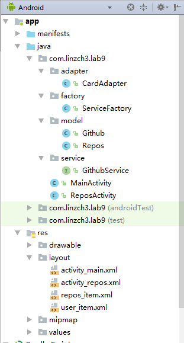
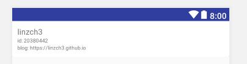
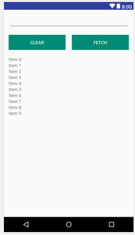
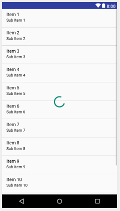
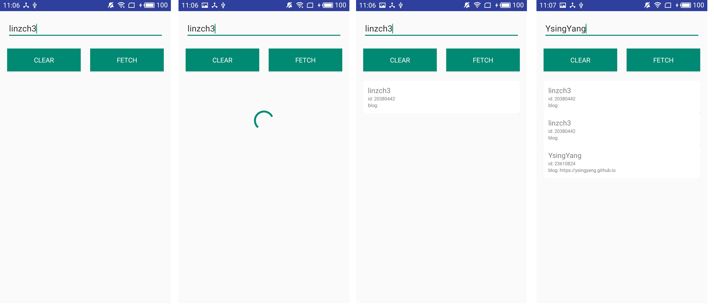
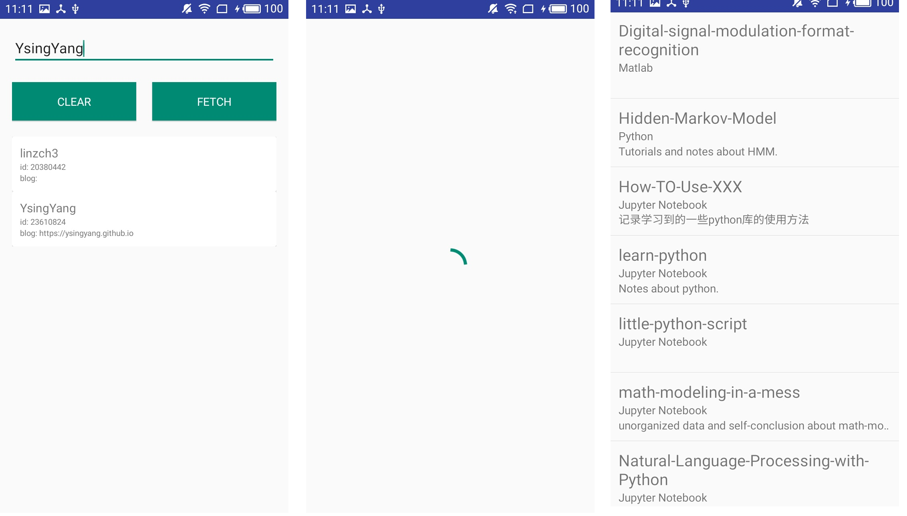

- [Lab 9 - Retrofit+RxJava+OkHttp 实现网络请求](#lab-9---retrofitrxjavaokhttp-%E5%AE%9E%E7%8E%B0%E7%BD%91%E7%BB%9C%E8%AF%B7%E6%B1%82)
    - [实验目的](#%E5%AE%9E%E9%AA%8C%E7%9B%AE%E7%9A%84)
    - [实验内容](#%E5%AE%9E%E9%AA%8C%E5%86%85%E5%AE%B9)
    - [实验过程](#%E5%AE%9E%E9%AA%8C%E8%BF%87%E7%A8%8B)
        - [step0:思路复述](#step0%E6%80%9D%E8%B7%AF%E5%A4%8D%E8%BF%B0)
        - [step1:添加依赖](#step1%E6%B7%BB%E5%8A%A0%E4%BE%9D%E8%B5%96)
        - [step2:使用 Retrofit 实现网络请求](#step2%E4%BD%BF%E7%94%A8-retrofit-%E5%AE%9E%E7%8E%B0%E7%BD%91%E7%BB%9C%E8%AF%B7%E6%B1%82)
            - [1. 定义 Model 类](#1-%E5%AE%9A%E4%B9%89-model-%E7%B1%BB)
            - [2. 定义相应的访问接口(interface)](#2-%E5%AE%9A%E4%B9%89%E7%9B%B8%E5%BA%94%E7%9A%84%E8%AE%BF%E9%97%AE%E6%8E%A5%E5%8F%A3interface)
            - [3. 构造 Retrofit 对象](#3-%E6%9E%84%E9%80%A0-retrofit-%E5%AF%B9%E8%B1%A1)
        - [step3:实现主界面 RecyclerView 子项布局](#step3%E5%AE%9E%E7%8E%B0%E4%B8%BB%E7%95%8C%E9%9D%A2-recyclerview-%E5%AD%90%E9%A1%B9%E5%B8%83%E5%B1%80)
        - [step4:实现主界面 CardView 的适配器 - CardAdapter](#step4%E5%AE%9E%E7%8E%B0%E4%B8%BB%E7%95%8C%E9%9D%A2-cardview-%E7%9A%84%E9%80%82%E9%85%8D%E5%99%A8---cardadapter)
        - [step5:实现主界面布局](#step5%E5%AE%9E%E7%8E%B0%E4%B8%BB%E7%95%8C%E9%9D%A2%E5%B8%83%E5%B1%80)
        - [step6:实现主界面逻辑](#step6%E5%AE%9E%E7%8E%B0%E4%B8%BB%E7%95%8C%E9%9D%A2%E9%80%BB%E8%BE%91)
            - [init()函数](#init%E5%87%BD%E6%95%B0)
            - [setupButton()函数](#setupbutton%E5%87%BD%E6%95%B0)
            - [setupAdapter()函数](#setupadapter%E5%87%BD%E6%95%B0)
        - [step7:实现repo列表界面 ListView 子项布局](#step7%E5%AE%9E%E7%8E%B0repo%E5%88%97%E8%A1%A8%E7%95%8C%E9%9D%A2-listview-%E5%AD%90%E9%A1%B9%E5%B8%83%E5%B1%80)
        - [step8:实现repo列表界面布局](#step8%E5%AE%9E%E7%8E%B0repo%E5%88%97%E8%A1%A8%E7%95%8C%E9%9D%A2%E5%B8%83%E5%B1%80)
        - [step9:实现repo列表界面逻辑](#step9%E5%AE%9E%E7%8E%B0repo%E5%88%97%E8%A1%A8%E7%95%8C%E9%9D%A2%E9%80%BB%E8%BE%91)
            - [init()函数](#init%E5%87%BD%E6%95%B0)
            - [setupListView()函数](#setuplistview%E5%87%BD%E6%95%B0)
    - [实验效果](#%E5%AE%9E%E9%AA%8C%E6%95%88%E6%9E%9C)
    - [参考资料](#%E5%8F%82%E8%80%83%E8%B5%84%E6%96%99)

# Lab 9 - Retrofit+RxJava+OkHttp 实现网络请求

## 实验目的

* 学习使用 Retrofit 实现网络请求
* 学习 RxJava 中 Observable 的使用
* 复习同步异步概念

## 实验内容 


- 对于User Model, 显示 id, login, blog
- 对于Repository Model, 显示 name, description, language
    - 特别注意， 如果description超过1行则末尾要用省略号代替

## 实验过程

### step0:思路复述

总共需要实现两个界面，一个用于显示根据用户名搜索用户名称、id、博客地址的主界面，一个用于显示某个用户的repo列表界面。

其中，主界面中使用recyclerview记录每次搜索的用户的信息。repo列表界面使用listview显示repo列表信息。

工程目录如下：



整体工程的模块划分参考实验文档的项目结构截图。值得一提的是，如果没有看实验文档的这个截图，我可能就是直接把要实现的所有类和接口都放在同一个目录里面了，这样明显就显得有点乱了。而实验文档中给出的参考项目结构则是将要实现的类、接口等都按照功能分目录存放了，这样看起来整体结构很清晰，而且有利于以后复用代码快速查找相关的模块。

### step1:添加依赖

这次实验用的库比较多，需要在`build.gradle(Module:app)`中添加如下依赖：

```c
    implementation 'com.android.support:recyclerview-v7:26.1.0'
    implementation 'com.android.support:cardview-v7:26.1.0'
    implementation 'io.reactivex:rxjava:1.0+'
    implementation 'io.reactivex:rxandroid:0.23+'
    implementation 'com.squareup.retrofit2:retrofit:2.1.0'
    implementation 'com.squareup.retrofit2:adapter-rxjava:2.1.0'
    implementation 'com.squareup.retrofit2:converter-gson:2.1.0'
    implementation 'com.android.support:design:26.1.0'
```

### step2:使用 Retrofit 实现网络请求

Retrofit 实现的网络，请求分为以下步骤：

* 1. 定义 Model 类
* 2. 定义相应的访问接口(interface)
* 3. 构造 Retrofit 对象并设置相应的 URL 后， 调用即可获取到网络资源

首先需要明确，实现网络请求需要在AndroidManifest.xml中声明如下权限：

```xml
<uses-permission android:name="android.permission.INTERNET" />
```

#### 1. 定义 Model 类

Model类可以简单地理解为所请求的网络数据的一个封装类型。此次实验我们需要请求两种不同的网络数据，一个是github用户的个人信息，一个是某个github用户的所有仓库信息。

首先从github用户的个人信息说起，数据API为`https://api.github.com/users/{user}`，比如`https://api.github.com/users/linzch3`，其对应的数据为：

```json
{
  "login": "linzch3",
  "id": 20380442,
  "avatar_url": "https://avatars1.githubusercontent.com/u/20380442?v=4",
  "gravatar_id": "",
  "url": "https://api.github.com/users/linzch3",
  "html_url": "https://github.com/linzch3",
  "followers_url": "https://api.github.com/users/linzch3/followers",
  "following_url": "https://api.github.com/users/linzch3/following{/other_user}",
  "gists_url": "https://api.github.com/users/linzch3/gists{/gist_id}",
  "starred_url": "https://api.github.com/users/linzch3/starred{/owner}{/repo}",
  "subscriptions_url": "https://api.github.com/users/linzch3/subscriptions",
  "organizations_url": "https://api.github.com/users/linzch3/orgs",
  "repos_url": "https://api.github.com/users/linzch3/repos",
  "events_url": "https://api.github.com/users/linzch3/events{/privacy}",
  "received_events_url": "https://api.github.com/users/linzch3/received_events",
  "type": "User",
  "site_admin": false,
  "name": "linzch3",
  "company": null,
  "blog": "",
  "location": "GUANG ZHOU,CHINA ",
  "email": null,
  "hireable": null,
  "bio": "From MOBILE INFORMATION ENGINEERING, SUN YAT-SEN UNIVERSITY",
  "public_repos": 13,
  "public_gists": 0,
  "followers": 1,
  "following": 9,
  "created_at": "2016-07-10T09:46:00Z",
  "updated_at": "2017-11-20T04:16:20Z"
}
```

这里我们只需要保存用户的登录名(对应login)、id(对应id)、博客地址(对应blog)这三个信息，因此可实现如下Model类：

```java
public class Github
{
    private int id;
    private String login, blog;

    public int getId()
    {
        return id;
    }

    public String getLogin()
    {
        return login;
    }

    public String getBlog()
    {
        return blog;
    }
}
```

可见，该Model类只是我们需要请求的用户数据的三个子项的封装而已。值得注意的是，该类实现了三个数据的getter函数，这是我们后续会用到的。同时，该Model类中定义的变量名称必须和请求的数据中json的键值相对应，比如这里我们只需要login、id、blog这三个键值对应的数据，所以需要命名三个同名的变量。

接下来看某个github用户的所有仓库信息，数据API为`https://api.github.com/users/{user}/repos`，比如`https://api.github.com/users/linzch3/repos`，其对应的数据为：

```json
[
  {
    "id": 94337991,
    "name": "Digital-signal-modulation-format-recognition",
    "full_name": "linzch3/Digital-signal-modulation-format-recognition",
    "owner": {
      "login": "linzch3",
      "id": 20380442,
      "avatar_url": "https://avatars1.githubusercontent.com/u/20380442?v=4",
      "gravatar_id": "",
      "url": "https://api.github.com/users/linzch3",
      "html_url": "https://github.com/linzch3",
      "followers_url": "https://api.github.com/users/linzch3/followers",
      "following_url": "https://api.github.com/users/linzch3/following{/other_user}",
      "gists_url": "https://api.github.com/users/linzch3/gists{/gist_id}",
      "starred_url": "https://api.github.com/users/linzch3/starred{/owner}{/repo}",
      "subscriptions_url": "https://api.github.com/users/linzch3/subscriptions",
      "organizations_url": "https://api.github.com/users/linzch3/orgs",
      "repos_url": "https://api.github.com/users/linzch3/repos",
      "events_url": "https://api.github.com/users/linzch3/events{/privacy}",
      "received_events_url": "https://api.github.com/users/linzch3/received_events",
      "type": "User",
      "site_admin": false
    },
    "private": false,
    "html_url": "https://github.com/linzch3/Digital-signal-modulation-format-recognition",
    "description": null,
    "fork": false,
    "url": "https://api.github.com/repos/linzch3/Digital-signal-modulation-format-recognition",
    "forks_url": "https://api.github.com/repos/linzch3/Digital-signal-modulation-format-recognition/forks",
    "keys_url": "https://api.github.com/repos/linzch3/Digital-signal-modulation-format-recognition/keys{/key_id}",
    "collaborators_url": "https://api.github.com/repos/linzch3/Digital-signal-modulation-format-recognition/collaborators{/collaborator}",
    "teams_url": "https://api.github.com/repos/linzch3/Digital-signal-modulation-format-recognition/teams",
    "hooks_url": "https://api.github.com/repos/linzch3/Digital-signal-modulation-format-recognition/hooks",
    "issue_events_url": "https://api.github.com/repos/linzch3/Digital-signal-modulation-format-recognition/issues/events{/number}",
    "events_url": "https://api.github.com/repos/linzch3/Digital-signal-modulation-format-recognition/events",
    "assignees_url": "https://api.github.com/repos/linzch3/Digital-signal-modulation-format-recognition/assignees{/user}",
    "branches_url": "https://api.github.com/repos/linzch3/Digital-signal-modulation-format-recognition/branches{/branch}",
    "tags_url": "https://api.github.com/repos/linzch3/Digital-signal-modulation-format-recognition/tags",
    "blobs_url": "https://api.github.com/repos/linzch3/Digital-signal-modulation-format-recognition/git/blobs{/sha}",
    "git_tags_url": "https://api.github.com/repos/linzch3/Digital-signal-modulation-format-recognition/git/tags{/sha}",
    "git_refs_url": "https://api.github.com/repos/linzch3/Digital-signal-modulation-format-recognition/git/refs{/sha}",
    "trees_url": "https://api.github.com/repos/linzch3/Digital-signal-modulation-format-recognition/git/trees{/sha}",
    "statuses_url": "https://api.github.com/repos/linzch3/Digital-signal-modulation-format-recognition/statuses/{sha}",
    "languages_url": "https://api.github.com/repos/linzch3/Digital-signal-modulation-format-recognition/languages",
    "stargazers_url": "https://api.github.com/repos/linzch3/Digital-signal-modulation-format-recognition/stargazers",
    "contributors_url": "https://api.github.com/repos/linzch3/Digital-signal-modulation-format-recognition/contributors",
    "subscribers_url": "https://api.github.com/repos/linzch3/Digital-signal-modulation-format-recognition/subscribers",
    "subscription_url": "https://api.github.com/repos/linzch3/Digital-signal-modulation-format-recognition/subscription",
    "commits_url": "https://api.github.com/repos/linzch3/Digital-signal-modulation-format-recognition/commits{/sha}",
    "git_commits_url": "https://api.github.com/repos/linzch3/Digital-signal-modulation-format-recognition/git/commits{/sha}",
    "comments_url": "https://api.github.com/repos/linzch3/Digital-signal-modulation-format-recognition/comments{/number}",
    "issue_comment_url": "https://api.github.com/repos/linzch3/Digital-signal-modulation-format-recognition/issues/comments{/number}",
    "contents_url": "https://api.github.com/repos/linzch3/Digital-signal-modulation-format-recognition/contents/{+path}",
    "compare_url": "https://api.github.com/repos/linzch3/Digital-signal-modulation-format-recognition/compare/{base}...{head}",
    "merges_url": "https://api.github.com/repos/linzch3/Digital-signal-modulation-format-recognition/merges",
    "archive_url": "https://api.github.com/repos/linzch3/Digital-signal-modulation-format-recognition/{archive_format}{/ref}",
    "downloads_url": "https://api.github.com/repos/linzch3/Digital-signal-modulation-format-recognition/downloads",
    "issues_url": "https://api.github.com/repos/linzch3/Digital-signal-modulation-format-recognition/issues{/number}",
    "pulls_url": "https://api.github.com/repos/linzch3/Digital-signal-modulation-format-recognition/pulls{/number}",
    "milestones_url": "https://api.github.com/repos/linzch3/Digital-signal-modulation-format-recognition/milestones{/number}",
    "notifications_url": "https://api.github.com/repos/linzch3/Digital-signal-modulation-format-recognition/notifications{?since,all,participating}",
    "labels_url": "https://api.github.com/repos/linzch3/Digital-signal-modulation-format-recognition/labels{/name}",
    "releases_url": "https://api.github.com/repos/linzch3/Digital-signal-modulation-format-recognition/releases{/id}",
    "deployments_url": "https://api.github.com/repos/linzch3/Digital-signal-modulation-format-recognition/deployments",
    "created_at": "2017-06-14T14:09:50Z",
    "updated_at": "2017-06-14T14:31:15Z",
    "pushed_at": "2017-06-14T14:31:14Z",
    "git_url": "git://github.com/linzch3/Digital-signal-modulation-format-recognition.git",
    "ssh_url": "git@github.com:linzch3/Digital-signal-modulation-format-recognition.git",
    "clone_url": "https://github.com/linzch3/Digital-signal-modulation-format-recognition.git",
    "svn_url": "https://github.com/linzch3/Digital-signal-modulation-format-recognition",
    "homepage": null,
    "size": 2,
    "stargazers_count": 0,
    "watchers_count": 0,
    "language": "Matlab",
    "has_issues": true,
    "has_projects": true,
    "has_downloads": true,
    "has_wiki": true,
    "has_pages": false,
    "forks_count": 2,
    "mirror_url": null,
    "archived": false,
    "open_issues_count": 0,
    "license": null,
    "forks": 2,
    "open_issues": 0,
    "watchers": 0,
    "default_branch": "master"
  },
  ...
] 
```

由于数据量比较大，这里不贴出后续部分，可以看到，由于用户的仓库可能有多个，因此该API返回的是一个列表，由于列表中都是相同类型的数据，因此这里便实现列表子项的Model类。

```java
public class Repos
{
    private String name, language, description;

    public String getName()
    {
        return name;
    }

    public String getLanguage()
    {
        return language;
    }
    
    public String getDescription()
    {
        return description;
    }
}
```

同Github类，这里只保存了三个我们需要的数据域到Repos类中。

#### 2. 定义相应的访问接口(interface)

实验需要给 retrofit 对象提供相应的 Interface, 我们需要指定的是提供相应的数据对应的URL、函数传入的参数、返回类型。

```java
public  interface GithubService
{
    @GET("/users/{user}")
    Observable<Github> getUser(@Path("user") String user);

    @GET("/users/{user}/repos")
    Observable<List<Repos>> getRepos(@Path("user") String user);
}
```

这里使用到了java的注解语法，刚开始看的时候有点不习惯，后来看着实验文档照葫芦画瓢尝试了几次之后也大概知道是什么意思了。

首选，retrofit 对象被创建时会传入一个API URL作为参数，然后该对象会“使用”我们指定的 Interface。

比如，在这次实验，我们需要用到github的用户数据，因此我们需要传入的 API URL参数就为：`https://api.github.com`，而这个GithubService则是说明，要取到github用户的个人信息和某个github用户的所有仓库信息需要到该URL的哪个“下级目录”去请求数据。

比如`getUser`这个函数，其指定“下级目录”为`/users/{user}`，当传入一个用户名作为参数时，比如`linzch3`，这时“下级目录”就变为了`/users/linzch3`，然后和总的API URL拼接到一起，就可得到可取到用户`linzch3`的个人用信息对应的API接口：`https://api.github.com/users/linzch3`了。

`getRepos`函数同理，但是由于API接口返回的是一个列表，因此我们要将Observable的类型定义为`List<Repos>`而不是`Repos`。

至于Observable，参考[这里][4]便大概知道是什么了。

关于GithubService，还想了解更多的，可参考[官方例子][3]（其实我们实验的这个例子就是从官方网站借鉴过来的）。

#### 3. 构造 Retrofit 对象

构造 Retrofit 对象并设置相应的 URL 后， 调用即可获取到网络资源。这里根据实验文档参考工程目录提示，实现如下工厂类：

```java
public class ServiceFactory
{
    private static OkHttpClient createOkHttp()
    {
        return new OkHttpClient.Builder()
                .connectTimeout(10L, TimeUnit.SECONDS)
                .readTimeout(30L, TimeUnit.SECONDS)
                .writeTimeout(10L, TimeUnit.SECONDS)
                .build();
    }

    public static Retrofit createRetrofit(String baseUrl)
    {
        return new Retrofit.Builder()
                .baseUrl(baseUrl)
                .addConverterFactory(GsonConverterFactory.create())
                .addCallAdapterFactory(RxJavaCallAdapterFactory.create())
                .client(createOkHttp())
                .build();
    }
}
```

工厂类顾名思义便是利用了设计模式中的工厂模式设计出来的类，其功能就是提供创建“产品”的接口，这里“产品”便是我们的 Retrofit 对象了。

本来实现一个`createRetrofit`函数即可满足我们的要求了，但是后来发现 Retrofit 是基于 OkHttp 的封装，所以便顺路加上`createOkHttp`函数。

说实话，这两个函数的实现是直接从实验文档上搬过来的，不然得查一段时间的文档或资料才可以找到了。

### step3:实现主界面 RecyclerView 子项布局

主界面 RecyclerView 子项布局要求使用CardView进行布局，具体可参考[CardView的使用][7]。

在`user_item.xml`中实现如下代码：

```xml
<?xml version="1.0" encoding="utf-8"?>
<LinearLayout xmlns:android="http://schemas.android.com/apk/res/android"
    xmlns:app="http://schemas.android.com/apk/res-auto"
    android:orientation="vertical"
    android:layout_width="match_parent"
    android:layout_height="wrap_content">

    <android.support.v7.widget.CardView
        android:layout_width="match_parent"
        android:layout_height="wrap_content"
        app:cardBackgroundColor="#FFFFFF"
        app:cardCornerRadius="2dp"
        app:cardPreventCornerOverlap="true"
        app:contentPadding="10dp">

        <LinearLayout
            android:orientation="vertical"
            android:layout_width="match_parent"
            android:layout_height="wrap_content">
            <TextView
                android:id="@+id/user_name"
                android:layout_width="wrap_content"
                android:layout_height="wrap_content"
                android:text="linzch3"
                android:textSize="15sp"/>

            <LinearLayout
                android:orientation="horizontal"
                android:layout_width="match_parent"
                android:layout_height="wrap_content">
                <TextView
                    android:layout_width="wrap_content"
                    android:layout_height="wrap_content"
                    android:text="id: "
                    android:textSize="10sp"/>

                <TextView
                    android:id="@+id/user_id"
                    android:layout_width="wrap_content"
                    android:layout_height="wrap_content"
                    android:text="20380442"
                    android:textSize="10sp"/>

            </LinearLayout>

            <LinearLayout
                android:orientation="horizontal"
                android:layout_width="match_parent"
                android:layout_height="wrap_content">
                <TextView
                    android:layout_width="wrap_content"
                    android:layout_height="wrap_content"
                    android:text="blog: "
                    android:textSize="10sp"/>

                <TextView
                    android:id="@+id/user_blog"
                    android:layout_width="wrap_content"
                    android:layout_height="wrap_content"
                    android:text="https://linzch3.github.io"
                    android:textSize="10sp"/>

            </LinearLayout>
        </LinearLayout>
    </android.support.v7.widget.CardView>

</LinearLayout>
```

关于CardView，这里用到其4个属性：

```r
        app:cardBackgroundColor="#FFFFFF"
        app:cardCornerRadius="2dp"
        app:cardPreventCornerOverlap="true"
        app:contentPadding="10dp"
```

实现效果如下：



但是按照这样的布局最终显示的效果是多个子项的相邻边界混合在一起，加上cardCornerRadius设置地小，很难看清楚这是CardView的布局方式，若要让相邻边界可明显地被区分开来，可使用`cardUseCompatPadding="true"`来实现。这里为了和TA给的样例APP一致便不实现这样的效果。

### step4:实现主界面 CardView 的适配器 - CardAdapter

这里便来实现RecyclerView中子项CardView对应的适配器，根据TA给的参考工程目录，也将其命名为CardAdapter。

其实现和实验三的RecyclerView子项的适配器基本一致，这里也不再赘述原理，按照实验三的实现思路实现如下：

```java
public class CardAdapter extends RecyclerView.Adapter<CardAdapter.ViewHolder> {

    private OnRecyclerViewItemClickListener mItemClickListener = null;
    private List<Github> mUserList = new ArrayList<>();

    /**********实现RecyclerView子项点击需自行实现的函数**********/
    public interface OnRecyclerViewItemClickListener {
        /*定义点击和长按的方法，在子类中实现*/
        void onClick(int position);
        void onLongClick(int position);
    }

    public void setOnItemClickListener(OnRecyclerViewItemClickListener onItemClickListener) {
        this.mItemClickListener = onItemClickListener; /*设置监听器*/
    }

    public void appendItem(Github github)
    {
        mUserList.add(github);
        notifyDataSetChanged();
    }

    public Github getItem(int position) {
        return mUserList.get(position);
    }

    public void removeItem(int position) {
        mUserList.remove(position);
        notifyItemRemoved(position);
    }

    public void removeAllItem() {
        mUserList.clear();
        notifyDataSetChanged();
    }

    /**********实现RecyclerView子项点击需自行实现的函数**********/

    /**********继承RecyclerView.Adapter必须重写的三个方法**********/
    @Override
    public CardAdapter.ViewHolder onCreateViewHolder(ViewGroup parent, int viewType) {
        View view = LayoutInflater.from(parent.getContext()).inflate(R.layout.user_item, parent, false);
        final ViewHolder holder = new ViewHolder(view);
        holder.itemView.setOnClickListener(new View.OnClickListener() {
            public void onClick(View v)
            {
                if(mItemClickListener != null)
                    mItemClickListener.onClick(holder.getAdapterPosition());
            }
        });
        holder.itemView.setOnLongClickListener(new View.OnLongClickListener() {
            public boolean onLongClick(View v)
            {
                if(mItemClickListener != null)
                    mItemClickListener.onLongClick(holder.getAdapterPosition());
                return false;
            }
        });
        return holder;
    }


    @Override
    public void onBindViewHolder(final CardAdapter.ViewHolder holder, int position) {
        Github github = mUserList.get(position);
        holder.login.setText(github.getLogin());
        holder.id.setText(String.valueOf(github.getId()));
        holder.blog.setText(github.getBlog());
    }

    @Override
    public int getItemCount() {
        return mUserList.size();
    }
    /**********继承RecyclerView.Adapter必须重写的三个方法**********/

    /**********ViewHolder静态子类实现**********/
    static class ViewHolder extends RecyclerView.ViewHolder
    {
        TextView id, login, blog;

        ViewHolder(View view)
        {
            super(view);
            login = view.findViewById(R.id.user_name);
            id = view.findViewById(R.id.user_id);
            blog = view.findViewById(R.id.user_blog);
        }
    }
    /**********ViewHolder静态子类实现**********/
}
```

### step5:实现主界面布局

在`activity_main.xml`中添加如下代码：

```xml
<?xml version="1.0" encoding="utf-8"?>
<android.support.constraint.ConstraintLayout xmlns:android="http://schemas.android.com/apk/res/android"
    xmlns:app="http://schemas.android.com/apk/res-auto"
    xmlns:tools="http://schemas.android.com/tools"
    android:layout_width="match_parent"
    android:layout_height="match_parent"
    android:padding="15dp"
    tools:context="com.linzch3.lab9.MainActivity">

    <EditText
        android:id="@+id/search_input_text"
        android:layout_width="match_parent"
        android:layout_height="wrap_content" />

    <android.support.constraint.Guideline
        android:id="@+id/guideline"
        android:layout_width="wrap_content"
        android:layout_height="wrap_content"
        android:orientation="vertical"
        app:layout_constraintGuide_percent="0.5"/>

    <Button
        android:id="@+id/clear_button"
        android:layout_width="0dp"
        android:layout_height="wrap_content"
        app:layout_constraintTop_toBottomOf="@id/search_input_text"
        app:layout_constraintLeft_toLeftOf="parent"
        app:layout_constraintRight_toLeftOf="@id/guideline"
        android:layout_marginRight="10dp"
        android:layout_marginTop="20dp"
        android:text="CLEAR"
        android:textColor="#FFFFFF"
        android:background="@color/colorAccent"/>

    <Button
        android:id="@+id/fetch_button"
        android:layout_width="0dp"
        android:layout_height="wrap_content"
        app:layout_constraintTop_toBottomOf="@id/search_input_text"
        app:layout_constraintRight_toRightOf="parent"
        app:layout_constraintLeft_toRightOf="@id/guideline"
        android:layout_marginLeft="10dp"
        android:layout_marginTop="20dp"
        android:text="FETCH"
        android:textColor="#FFFFFF"
        android:background="@color/colorAccent"/>

    <android.support.v7.widget.RecyclerView
        android:id="@+id/recycler_view"
        android:layout_width="match_parent"
        android:layout_height="wrap_content"
        app:layout_constraintTop_toBottomOf="@id/clear_button"
        android:layout_marginTop="20dp"/>

    <ProgressBar
        android:id="@+id/progress_bar"
        android:layout_width="wrap_content"
        android:layout_height="wrap_content"
        app:layout_constraintTop_toBottomOf="@id/clear_button"
        app:layout_constraintLeft_toLeftOf="parent"
        app:layout_constraintRight_toRightOf="parent"
        android:layout_marginTop="80dp"
        android:visibility="gone"/>

</android.support.constraint.ConstraintLayout>
```

实现效果如下：



实现该布局有几个要注意的地方：

1.实现clear和fetch两个button的布局可使用如下方法：

首先创建一条垂直平分屏幕的guideline

接着在clear button中设置：

```r
        android:layout_width="0dp"
        app:layout_constraintLeft_toLeftOf="parent"
        app:layout_constraintRight_toLeftOf="@id/guideline"
```

在fetch button中设置：

```r
        android:layout_width="0dp"
        app:layout_constraintRight_toRightOf="parent"
        app:layout_constraintLeft_toRightOf="@id/guideline"
```

2.ProgressBar默认要设置不可见：`android:visibility="gone"`，这样就不用再MainActivity初始化时设置其可见性了。

3.由于EditText在输入文字时下方会有一条大概是红色的线，而TA给出的样例APP中出现的大概是绿色的线，因此这里便将colors.xml中的colorAccent颜色值改为了#008B75（暗绿色）。

### step6:实现主界面逻辑

MainActivity整体逻辑可在onCreate函数中实现：

```java
@Override
    protected void onCreate(Bundle savedInstanceState) {
        super.onCreate(savedInstanceState);
        setContentView(R.layout.activity_main);

        init();
        setupButton();
        setupAdapter();
    }
```

下面来依次讲解这里使用的三个函数的实现及用处。

#### init()函数

首先在类中声明如下变量：

```java
    private EditText userSearch;
    private Button clearButton;
    private Button fetchButton;
    private ProgressBar progressBar;

    private CardAdapter mCardAdapter;
    private RecyclerView mRecyclerView;
```
函数实现如下：

```java
void init() {
        progressBar = findViewById(R.id.progress_bar);
        clearButton = findViewById(R.id.clear_button);
        fetchButton = findViewById(R.id.fetch_button);
        userSearch = findViewById(R.id.search_input_text);

        mRecyclerView = findViewById(R.id.recycler_view);
        mRecyclerView.setHasFixedSize(true);//设置固定宽度有助于提升效率
        mRecyclerView.setLayoutManager(new LinearLayoutManager(this));
        mCardAdapter = new CardAdapter();
        mRecyclerView.setAdapter(mCardAdapter);
    }
```

该函数实现了UI控件的初始化工作，其中recyclerview布局使用简单的线性布局即可满足要求，动画效果这里不考虑添加。

#### setupButton()函数

函数实现如下：

```java
void setupButton() {
        clearButton.setOnClickListener(new View.OnClickListener() {
            public void onClick(View view) {
                mCardAdapter.removeAllItem();
            }
        });
        fetchButton.setOnClickListener(new View.OnClickListener() {
            public void onClick(View view) {
                progressBar.setVisibility(View.VISIBLE);

                String userName = userSearch.getText().toString();
                ServiceFactory.createRetrofit("https://api.github.com")
                        .create(GithubService.class)
                        .getUser(userName)
                        .subscribeOn(Schedulers.newThread())
                        .observeOn(AndroidSchedulers.mainThread())
                        .subscribe(new Subscriber<Github>() {
                            public final void onCompleted() {
                                progressBar.setVisibility(View.GONE);
                            }

                            public void onError(Throwable throwable) {
                                Toast.makeText(MainActivity.this, "请确认你搜索的用户存在", Toast.LENGTH_SHORT).show();
                                progressBar.setVisibility(View.GONE);
                                throwable.printStackTrace();
                            }

                            public void onNext(Github github) {
                                mCardAdapter.appendItem(github);
                            }
                        });
            }
        });
    }
```

该函数设置了clear button和fetch button的点击事件监听器。其中，当点击fetch button时会使用Retrofit对象进行网络请求（这里链式调用了好多个函数，具体参见实验文档给的示例）。

#### setupAdapter()函数

回想起CardAdapter中还有如下接口函数需要在实例化Adapter时实现：

```java
public interface OnRecyclerViewItemClickListener {
        /*定义点击和长按的方法，在子类中实现*/
        void onClick(int position);
        void onLongClick(int position);
    }
```

根据实验要求，点击列表子项跳转到对应用户的仓库界面，长按子项则直接删除子项。

因此便在setupAdapter函数中实现该功能：

```java
void setupAdapter(){
        mCardAdapter.setOnItemClickListener(new CardAdapter.OnRecyclerViewItemClickListener() {
            public void onClick(int position) {
                Intent intent = new Intent(MainActivity.this, ReposActivity.class);
                intent.putExtra(KEY_EXTRA, mCardAdapter.getItem(position).getLogin());
                MainActivity.this.startActivity(intent);
            }

            public void onLongClick(int position) {
                mCardAdapter.removeItem(position);
            }
        });
    }
```

其中KEY_EXTRA在类中定义如下：

```java
public final static String KEY_EXTRA = "1";
```

### step7:实现repo列表界面 ListView 子项布局

在repos_item.xml中添加如下代码：

```xml
<?xml version="1.0" encoding="utf-8"?>
<LinearLayout
    xmlns:android="http://schemas.android.com/apk/res/android"
    android:orientation="vertical"
    android:layout_width="match_parent"
    android:layout_height="wrap_content"
    android:padding="10dp">
    <TextView
        android:id="@+id/repo_name"
        android:layout_width="wrap_content"
        android:layout_height="wrap_content"
        android:text="Hidden-Markow-Model"
        android:textSize="20sp"/>

    <TextView
        android:id="@+id/repo_language"
        android:layout_width="wrap_content"
        android:layout_height="wrap_content"
        android:text="Python"/>

    <TextView
        android:id="@+id/repo_intro"
        android:layout_width="wrap_content"
        android:layout_height="wrap_content"
        android:text="Tutorials and notes about HMM.Tutorials and notes about HMM."
        android:singleLine="true"
        android:ellipsize="end"/>


</LinearLayout>
```

实现效果如下：


该布局文件的实现有一个注意点：当repo的介绍超过一行时，需要显示末尾为省略号，因此需要在对应的TextView中配置如下属性：

```r
        android:singleLine="true"
        android:ellipsize="end"
```

### step8:实现repo列表界面布局

在activity_repos.xml中添加如下代码：

```xml
<?xml version="1.0" encoding="utf-8"?>
<android.support.constraint.ConstraintLayout xmlns:android="http://schemas.android.com/apk/res/android"
    xmlns:app="http://schemas.android.com/apk/res-auto"
    xmlns:tools="http://schemas.android.com/tools"
    android:layout_width="match_parent"
    android:layout_height="match_parent"
    tools:context="com.linzch3.lab9.ReposActivity">

    <ListView
        android:id="@+id/list_view"
        android:layout_width="match_parent"
        android:layout_height="wrap_content"/>

    <ProgressBar
        android:id="@+id/progress_bar2"
        android:layout_width="wrap_content"
        android:layout_height="wrap_content"
        app:layout_constraintLeft_toLeftOf="parent"
        app:layout_constraintRight_toRightOf="parent"
        app:layout_constraintTop_toTopOf="parent"
        app:layout_constraintBottom_toBottomOf="parent"/>

</android.support.constraint.ConstraintLayout>
```

实现效果如下：



### step9:实现repo列表界面逻辑

repo列表界面逻辑均可在ReposActivity的onCreate函数中实现：

```java
@Override
    protected void onCreate(Bundle savedInstanceState) {
        super.onCreate(savedInstanceState);
        setContentView(R.layout.activity_repos);

        init();
        setupListView();
    }
```

下面依次来讲解这里使用到的两个函数。

#### init()函数

首先在类中声明如下变量：

```java
    private ProgressBar progressBar;
    private ListView reposListView;
```

函数实现如下：

```java
    private void init() {
        reposListView = findViewById(R.id.list_view);
        progressBar = findViewById(R.id.progress_bar2);
    }
```

#### setupListView()函数

函数实现如下：

```java
private void setupListView() {
        String userName = getIntent().getStringExtra(MainActivity.KEY_EXTRA);
        ServiceFactory.createRetrofit("https://api.github.com")
                .create(GithubService.class)
                .getRepos(userName)
                .subscribeOn(Schedulers.newThread())
                .observeOn(AndroidSchedulers.mainThread())
                .subscribe(new Subscriber<List<Repos>>() {
                    public void onCompleted() {
                        progressBar.setVisibility(View.GONE);
                        reposListView.setVisibility(View.VISIBLE);
                    }

                    public void onError(Throwable throwable) {
                        Toast.makeText(ReposActivity.this, "貌似出了点问题(O_O)?", Toast.LENGTH_SHORT).show();
                        
                        progressBar.setVisibility(View.GONE);
                        reposListView.setVisibility(View.VISIBLE);

                        throwable.printStackTrace();
                    }

                    public void onNext(List<Repos> list) {
                        setupListViewData(list);
                    }
                });
    }
```

该函数实现了当进入repo列表界面时便请求对应用户的repo列表数据，当数据传送到APP时（也即是上面的`onNext`函数被调用时），便将数据加载到listview中。

其中，加载数据到listview的函数实现如下：

```java
private void setupListViewData(List<Repos> reposList) {
        List<Map<String, String>> repoListData = new ArrayList<>();
        for (Repos repo : reposList) {
            Map<String, String> temp = new LinkedHashMap<>();
            temp.put("name", repo.getName());
            temp.put("language", repo.getLanguage());
            temp.put("intro", repo.getDescription());
            repoListData.add(temp);
        }
        SimpleAdapter mSimpleAdapter = new SimpleAdapter(this, repoListData,
                R.layout.repos_item,
                new String[]{"name", "language", "intro"},
                new int[]{R.id.repo_name, R.id.repo_language, R.id.repo_intro});
        reposListView.setAdapter(mSimpleAdapter);
    }
```

至此，所有功能实现完毕。

## 实验效果




从左到右依次为主界面、搜索用户、搜索结果、更多搜索结果。



从左到右依次为长按删除、点击进入详情界面、详情信息获取。

## 参考资料

- 1.[android.content.res.Resources$NotFoundException: String resource ID #0x1][1]
- 2.[android菜瓜笔记之missing INTERNET permission][2]
- 3.[【墙裂推荐】A type-safe HTTP client for Android and Java][3]
- 4.[【墙裂推荐】给初学者的RxJava2.0教程(一)][4]
- 5.[Retrofit 2.0：有史以来最大的改进][5]
- 6.[设置Textview最大长度，超出显示省略号][6]
- 7.[CardView的使用][7]

[1]:http://blog.csdn.net/weizi4332/article/details/21345371
[2]:http://blog.csdn.net/hack8/article/details/28038541
[3]:https://square.github.io/retrofit/
[4]:https://juejin.im/post/5848d96761ff4b0058c9d3dc
[5]:http://www.jcodecraeer.com/a/anzhuokaifa/androidkaifa/2015/0915/3460.html
[6]:http://blog.csdn.net/lonewolf521125/article/details/45481157
[7]:https://seniorzhai.github.io/2015/01/06/CardView%E7%9A%84%E4%BD%BF%E7%94%A8/


