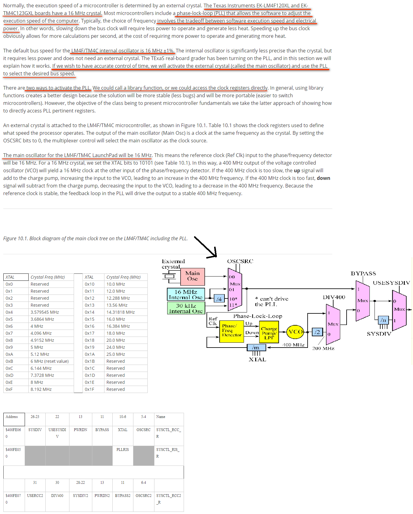
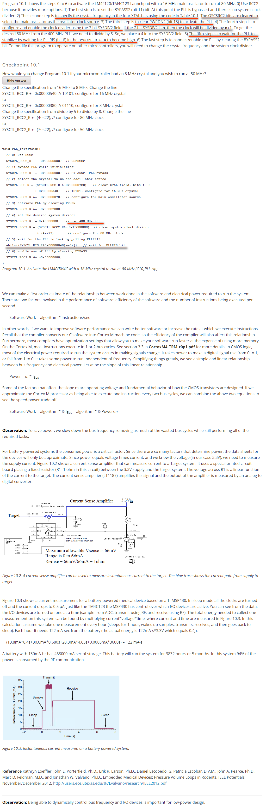
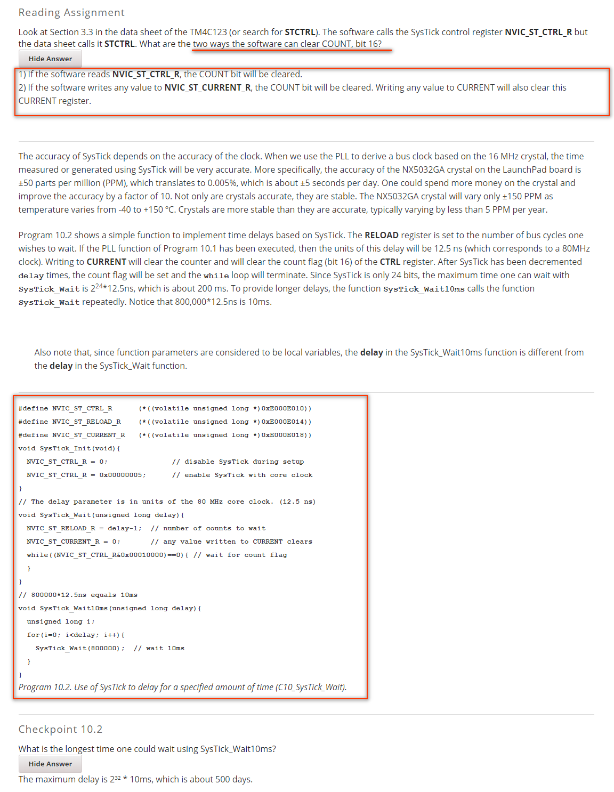

- [C10 Finite State Machine](#c10-finite-state-machine)
    - [10.0 Intro](#100-intro)
    - [10.1 Phase-Lock-Loop](#101-phase-lock-loop)
    - [10.2 Accurate Time Delays Using SysTick](#102-accurate-time-delays-using-systick)
    - [10.3 Abstraction](#103-abstraction)
    - [10.4 Finite State Machines with Indexed Structures](#104-finite-state-machines-with-indexed-structures)
    - [10.5 Stepper Motors](#105-stepper-motors)

# C10 Finite State Machine

## 10.0 Intro

Learning Objectives:

* Learn how to activate the PLL(phase-lock-loop) so the microcontroller has an accurate time base

* Use SysTick to produce accurate time delays

* Learn how to organize data on the computer using structures

* Develop a design strategy for building Finite State Machines

* Explain how stepper motors work using two motors to make an autonomous robot

## 10.1 Phase-Lock-Loop  

## 10.2 Accurate Time Delays Using SysTick  

## 10.3 Abstraction  

## 10.4 Finite State Machines with Indexed Structures  

pass

## 10.5 Stepper Motors

pass

