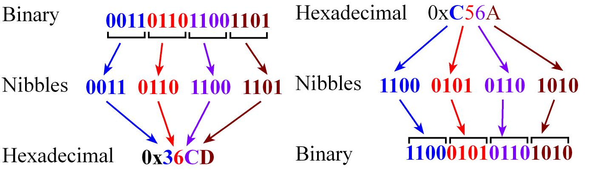
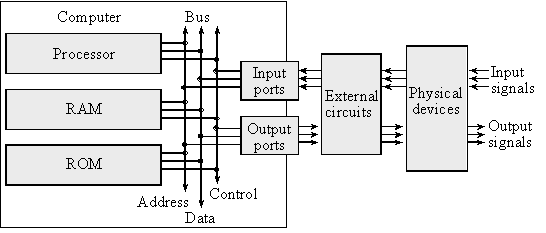
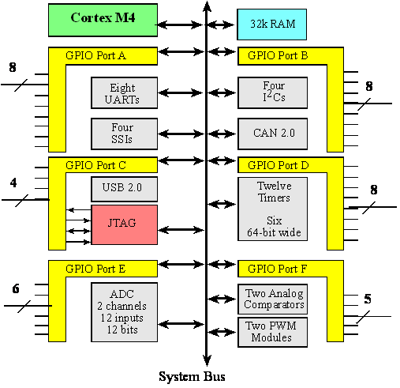
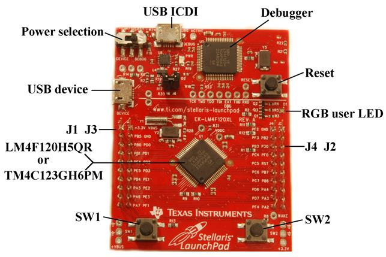
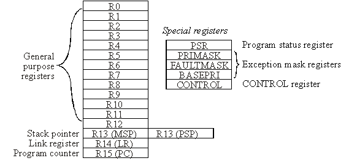
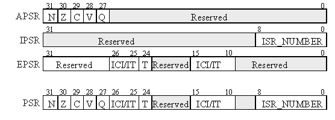
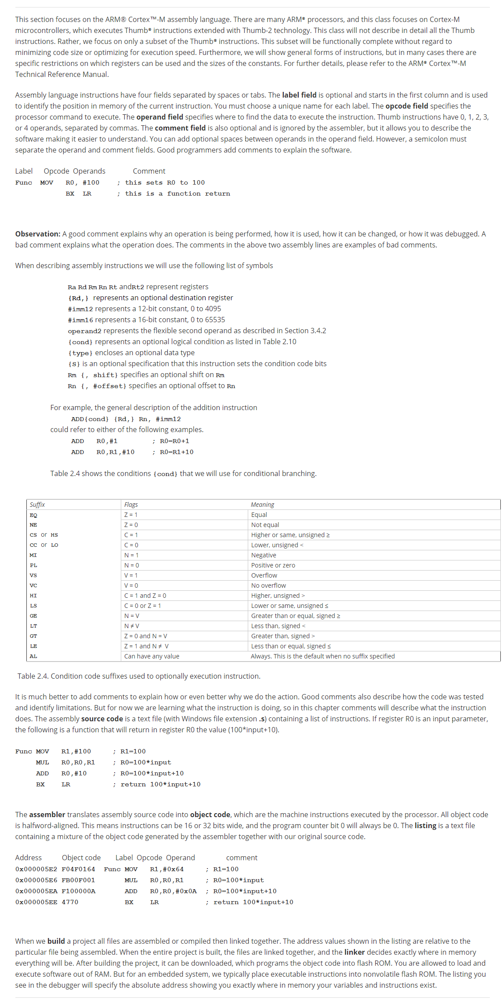
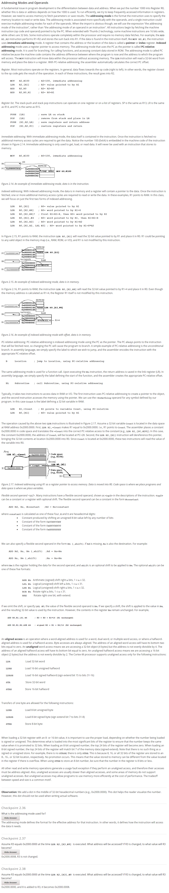
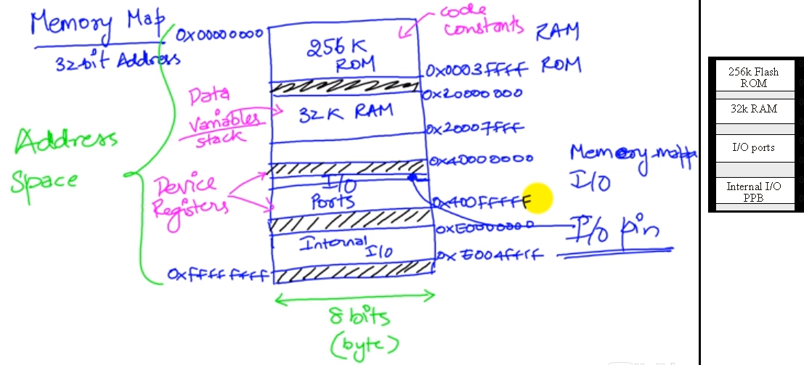
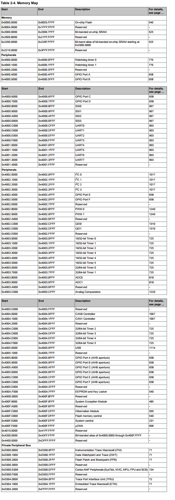

- [C2 Fundamental Concepts](#c2-fundamental-concepts)
    - [2.1 Binary Number and Systems](#21-binary-number-and-systems)
    - [2.2 Embedded Systems](#22-embedded-systems)
    - [2.3 Introduction to Computers](#23-introduction-to-computers)
    - [2.4 I/O Ports](#24-io-ports)
    - [2.5 CPU Registers](#25-cpu-registers)
        - [Registers on the ARM® Cortex-M processor](#registers-on-the-arm%C2%AE-cortex-m-processor)
            - [standard usage of R0\R1\R2\R3](#standard-usage-of-r0r1r2r3)
        - [three status registers and the Program Status Register](#three-status-registers-and-the-program-status-register)
        - [about exception mask register](#about-exception-mask-register)
            - [PRIMASK register and FAULTMASK register](#primask-register-and-faultmask-register)
            - [BASEPRI register](#basepri-register)
    - [2.6 Assembly Language](#26-assembly-language)
        - [Syntax](#syntax)
        - [Addressing Modes and Operands](#addressing-modes-and-operands)
    - [2.7 Address Space](#27-address-space)
        - [Memory Map Layout in leture note](#memory-map-layout-in-leture-note)
        - [Memory Map Layout in datasheet](#memory-map-layout-in-datasheet)
    - [2.8 Software Development Process](#28-software-development-process)

# C2 Fundamental Concepts  

for detail info, see [mainpage of this chapter][1].

[1]:http://users.ece.utexas.edu/~valvano/Volume1/E-Book/C2_FundamentalConcepts.htm

## 2.1 Binary Number and Systems

An 8-bit number is called a byte, and a 16-bit number is called a halfword. A 32-bit number is called a word. 

Hexadecimal Notation: start with the **0x** prefix, e.g. **0x**28. 

A nibble is defined as 4 binary bits, or one hexadecimal digit. 

convertion between binary and hexadecimal:

**Precision is the number of distinct or different values**. **We express precision in alternatives, bytes, or binary bits**. **Alternatives are defined as the total number of possibilities**. For example, an 8-bit number format can represent 256 different numbers. An 8-bit digital to analog converter (DAC) can generate 256 different analog outputs. An 8-bit analog to digital converter (ADC) can measure 256 different analog inputs

A byte contains 8 bits where each bit b7,...,b0 is binary and has the value 1 or 0. We specify b7 as **the most significant bit or MSB**, and b0 as **the least significant bit or LSB**.

- What are the basis elements of an unsigned 8-bit binary number system, and what do they mean?
    
    - There are eight basis elements: 10000000₂=128, 01000000₂=64, 00100000₂=32, 00010000₂=16, 00001000₂=8, 00000100₂=4, 00000010₂=2, and 00000001₂=1. Notice each basis element has exactly one binary bit high and the other seven are low. The basis is a subset of the numbers from which all numbers can be created using combinations of the basis.

the definition of Signed and Unsigned Numbers...

- one’s complement 反码

    -  **It was called one’s complement because to negate a number, we complement (logical not) each bit.**
    -  e.g. 25 equals 000110012 in binary, that -25 equals ~(00011001)=11100110 in binary.
    -  The difficulty with this format is that there are **two zeros +0 is 00000000, and –0 is 11111111**.

- two’s complement 补码

    - **It is called two’s complement because to negate a number, we complement each bit (like one’s complement), then add 1.**
    - e.g. 25 equals 000110012 in binary, that -25 equals ~(00011001)+1=11100111 in binary.

Why can’t you represent the number 150 using 8-bit signed binary?

- Because the range of 8-bit signed numbers is -128 to +127.

3 ways to convert a negative numbers into binary:

- we can use the basis to convert a decimal number into signed binary.
    - 从高位到低位逐个判断是否要将该位置一
- first convert them into unsigned binary, then do a two’s complement negate. 
- ses the number wheel with two’s complement.
    - e.g.假设有两个bit，可代表的数值范围为[-2,1]，若要求-1的二进制表示。可先将-1+2^n=3=-1+2^2(n为bit的位数)，再将3转换成无符号数的二进制表示11。最终11就是所求的答案。

## 2.2 Embedded Systems

What is an embedded system?
- An embedded system is a **microcomputer** with mechanical, chemical, or electrical devices attached to it, **programmed for a specific dedicated purpose, and packaged up as a complete system.**

In an embedded system, we use **ROM for storing the software and fixed constant data** and **RAM for storing temporary information**. Many microcomputers employed in embedded systems use **Flash EEPROM, which is an electrically-erasable programmable ROM, because the information can easily be erased and reprogrammed**.

What is a microcomputer?
- A microcomputer is a small computer that includes a **processor, memory and I/O devices**.

most embedded systems **run in real time**.

- In a real-time computer system, we can put an **upper bound on the time** required to perform the input-calculation-output sequence. A real-time system can **guarantee a worst case upper bound on the response time** between when the new input information becomes available and when that information is processed. This response time is called **interface latency(接口延迟)**. 

- Another real-time requirement that exists in many embedded systems is **the execution of periodic tasks**. A periodic task is one that **must be performed at equal-time intervals**. 

- A real-time system can **put a small and bounded limit on the time error** between when a task **should be run** and when **it is actually run**. Because of the real-time nature of these systems, microcontrollers **have a rich set of features to handle many aspects of time.**

In summary, embedded systems have these properties:

* 1. A microcontroller hidden inside
* 2. A dedicated purpose
* 3. Runs in real time
* 4. Input/output is important
* 5. High volume, low cost
* 6. Extremely reliable
* 7. Low power
* 8. Small size and weight

## 2.3 Introduction to Computers  

A computer combines **a processor, random access memory (RAM), read only memory (ROM), and input/output (I/O) ports**.

The basic components of a von Neumann computer include processor, memory and I/O.

A port is a **physical connection** between the computer and its outside world. Ports allow information to enter and exit the system. Information enters via the input ports and exits via the output ports. **Other names used to describe ports are I/O ports, I/O devices, interfaces, or sometimes just devices**. 

A bus is a **collection of wire**s used to **pass information between modules**.

RAM
- volatile memory, volatile means if we shut the power off, the information goes away.
- contains data

ROM/Flash
- nonvolatile memory, nonvolatile means if we shut the power off, the information doesn't away.
- ROM contains our instructions and our I/O

the processor that we're going to use, the Texas Instruments **TM4C123**, which is a **Cortex M4** processor, actually has **five or six buses allowing up to five or six operations to occur simultaneously**.

What are the differences between a microcomputer, a microprocessor, and a microcontroller?
- A microprocessor is a small processor. A microcomputer is a small computer that includes a processor, memory and I/O devices. A microcontroller is a single chip computer.

Programmable ROM (**PROM**)：Some PROMs are erased with ultraviolet light and programmed with voltages

electrically erasable PROM (**EEPROM**)：both erased and programmed with voltages

**Flash ROM is a popular type of EEPROM**. Each flash bit requires **only two MOSFET transistors**. The input (gate) of one transistor is electrically isolated, so if we trap charge on this input, it will remain there for years. The other transistor is used to read the bit by sensing whether or not the other transistor has trapped charge.

For all the systems in this class, we will **store instructions and constants in flash ROM and place variables and temporary data in static RAM.**

## 2.4 I/O Ports

An **input** **port** is hardware on the microcontroller that allows information about the external world to be entered into the computer. The microcontroller also has hardware called an **output port** to send information out to the external world. 

what is a **pin**?
-  a pin is an actual signal connected to the microcontroller with which we are going to do our input and output.

An **interface** is defined as **the collection of the I/O port, external electronics, physical devices, and the software, which combine to allow the computer to communicate with the external world**.
- An example of an input interface is a switch, where the operator toggles the switch, and the software can recognize the switch position.
- An example of an output interface is a light-emitting diode (LED), where the software can turn the light on and off, and the operator can see whether or not the light is shining.

In general, we can classify I/O interfaces into four categories

* Parallel - binary data are available simultaneously on a group of lines
* Serial - binary data are available one bit at a time on a single line
* Analog - data are encoded as an electrical voltage, current, or power
* Time - data are encoded as a period, frequency, pulse width, or phase shift

Architecture of TM4C123 microcontroller:

Tiva LaunchPad based on the TM4C123GH6PM:

## 2.5 CPU Registers  

### Registers on the ARM® Cortex-M processor

Registers are high-speed storage inside the processor. There are 13 general purpose registers (R0-R12) and 3 special purpose registers (R13, R14, R15).
- R0 toR12:general purpose registers and contain either data or addresses. 
- R13:stack pointer, SP, holds the address of the top of stack
- R14:link register, LR, holds the return addres of subroutines(or functions)
- R15:program counter, PC, points to the next instruction to be fetched from memory(The processor fetches an instruction using the PC and then increments the PC.)

Registers on the ARM® Cortex-M processor:

#### standard usage of R0\R1\R2\R3

The **ARM Architecture Procedure Call Standard, AAPCS**, part of the **ARM Application Binary Interface (ABI)**, **uses registers R0, R1, R2, and R3 to pass input parameters into a C function**. 

Also according to AAPCS we **place the return parameter in Register R0**. 

**In this class, the (R13)SP will always be the main stack pointer (MSP), not the Process Stack Pointer (PSP)**.

###  three status registers and the Program Status Register

The program status register(**PSR**) of the ARM® Cortex-M processor:

three status registers:

- **Application** Program Status Register (APSR)
- **Interrupt** Program Status Register (IPSR)
- **Execution** Program Status Register (EPSR)

These registers can be accessed individually or in combination as **the Program Status Register (PSR)**.

The N, Z, V, C, and Q bits give information about the result of a previous ALU operation. 

- the N bit is set after an arithmetical or logical operation signifying whether or not the result is negative. - the Z bit is set if the result is zero. 
- The C bit means carry and is set on an **unsigned** overflow.
- the V bit signifies **signed** overflow. 
- The Q bit indicates that “saturation”(饱和) has occurred – while you might want to look it up, _saturated arithmetic is beyond the scope of this class_.
- The T bit will always be 1, indicating the ARM®Cortex™-M processor is executing Thumb® instructions.
- The **ISR_NUMBER**(interrupt service routine, ISR) indicates which interrupt if any the processor is handling. 

### about exception mask register

#### PRIMASK register and FAULTMASK register

- Bit 0 of the special register **PRIMASK** is the interrupt mask bit.
    - If this bit is 1, most interrupts and exceptions are not allowed.
    - If the bit is 0, then interrupts are allowed.
- Bit 0 of the special register **FAULTMASK** is the fault mask bit.
    - If this bit is 1, all interrupts and faults are not allowed.
    - If the bit is 0, then interrupts and faults are allowed.
- **The nonmaskable interrupt (NMI) is not affected by these mask bits.**

####  BASEPRI register

The BASEPRI register defines **the priority of the executing software**. **It prevents interrupts with lower or equal priority but allows higher priority interrupts**. 

Priority is an important feature of interrupts. On the TM4C123 there are 8 levels of priority, numbered 0 to 7. **Level 0 is the highest priority and level 7 is the lowest priority**. When we configure the hardware to be able to interrupt we specify its priority level.  

## 2.6 Assembly Language  

### Syntax

### Addressing Modes and Operands

## 2.7 Address Space

terminology:

- ISA: Industry Standard Architecture

The address space constitutes the number of locations we can refer to.

### Memory Map Layout in leture note

Although specific for the TM4C123, all ARM®Cortex™-M microcontrollers have similar memory maps. In general, Flash ROM begins at address 0x0000.0000, RAM begins at 0x2000.0000, the peripheral I/O space is from 0x4000.0000 to 0x5FFF.FFFF, and I/O modules on the private peripheral bus exist from 0xE000.0000 to 0xE00F.FFFF. In particular, the only differences in the memory map for the various 180 members of the LM3S/TM4C family are the ending addresses of the flash and RAM. 

note: black/shadow region represents unused space, if for some state, our program use those region, it could be considered some error have happended.

### Memory Map Layout in datasheet

In Page 92/1409 in datasheet, we could found Table 2-4, which is exactly the Memory Map Layout.

## 2.8 Software Development Process  

nothing to write down. just practise.

