- [C4 Digital Logic](#c4-digital-logic)
    - [4.0 Introduction](#40-introduction)
    - [4.1 Binary Information Implemented with MOS Transistors](#41-binary-information-implemented-with-mos-transistors)
    - [4.2 Digital Logic](#42-digital-logic)
        - [Digital Logic: NOT gate](#digital-logic-not-gate)
        - [Logic and Boolean Operations](#logic-and-boolean-operations)
        - [Boolean Algebra](#boolean-algebra)
    - [4.3 Flip-Flops](#43-flip-flops)
        - [1.Flip Flops](#1flip-flops)
        - [2.Tristate Driver](#2tristate-driver)
    - [4.4 Binary Adder](#44-binary-adder)
        - [1. 1-bit Full Adder](#1-1-bit-full-adder)
        - [2. 8-bit Binary Adder](#2-8-bit-binary-adder)
    - [4.5 Digital Information Stored in Memory](#45-digital-information-stored-in-memory)
        - [1.Introduction to Memory](#1introduction-to-memory)
        - [2.From Kibibytes to Gibibytes](#2from-kibibytes-to-gibibytes)

# C4 Digital Logic

## 4.0 Introduction  

Learning Objectives

* Understand N-channel and P-channel MOS transistors (optional).
* Learn digital logic as implemented on a computer.
* Know how to build simple logic from transistors.
* Learn how to construct the basic components of a computer from the logic gates.
* Know the terms: flip flop, register, binary adder and memory.

## 4.1 Binary Information Implemented with MOS Transistors  

another name for **byte** is octet.

Every family of digital logic is a little different, but on Texas Instruments **TM4C123** microcontroller **powered with 3.3 V supply, a voltage between 2.145 and 5 V is considered high, and a voltage between 0 and 1.155 V is considered low**.

Mapping between analog voltage and the corresponding digital meaning on the TM4C123:

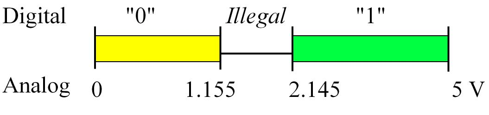

The **maximum allowable voltage that the input will consider as low** is called . For the TM4C123, it is **1.155V**.

The **minimum allowable voltage that the input will consider as high** is called . For the TM4C123, it is **2.145V**. 

**When the output is low, the maximum possible voltage that an output can be** is called . For the TM4C123, it is 0.4V. 

**When the output is high, the minimum possible voltage that an output can be** is called . For the TM4C123, it is 2.4V. 

a glimpse of "A byte is comprised of 8 bits(in this case representing the binary number 01100111)":

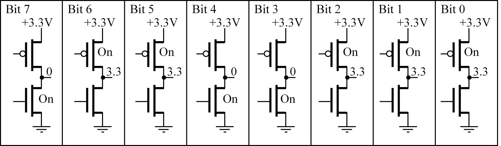

in this picture, **a bit is represeneted by a CMOS circuit**.

Information is stored on the computer in **binary** form. A binary bit can exist in one of **two** **possible** states.

In **positive** logic, the presence of a voltage is called the ‘1’, true, asserted, or high state. The absence of a voltage is called the ‘0’, false,  not asserted, or low state.

In **negative** logic, those definition vice versa.

## 4.2 Digital Logic  

### Digital Logic: NOT gate
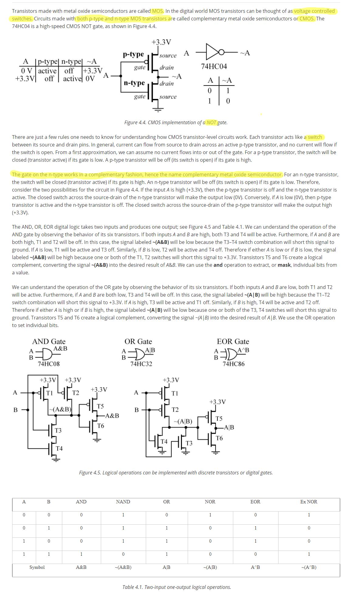

### Logic and Boolean Operations

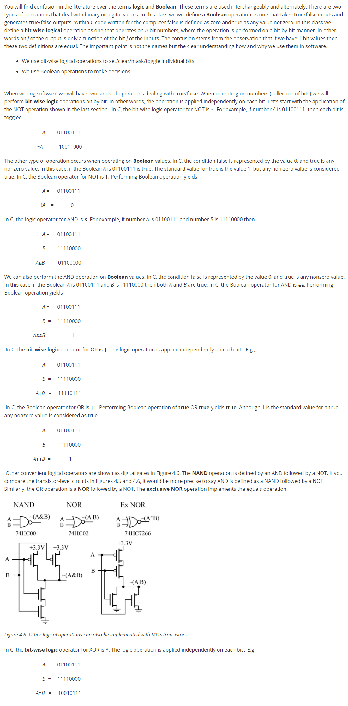

### Boolean Algebra

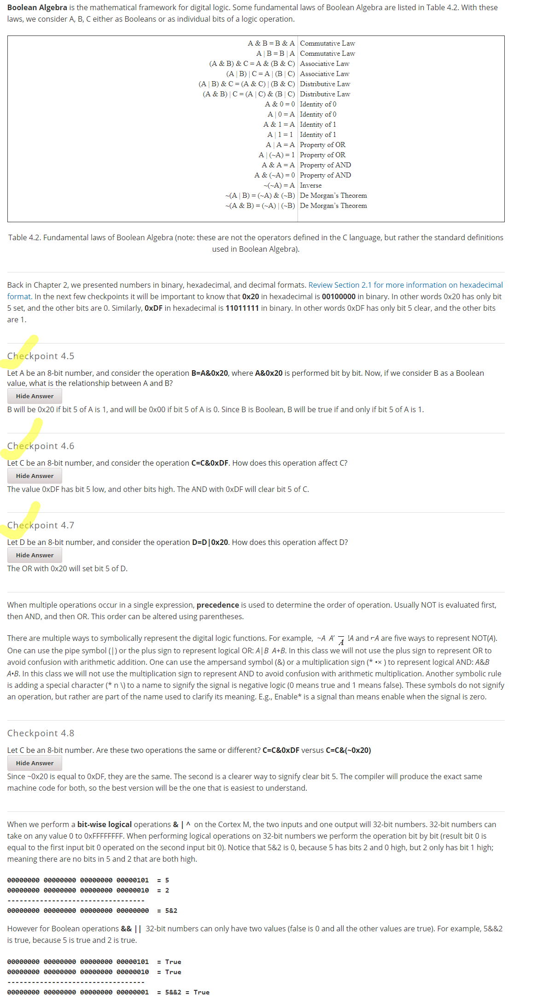

## 4.3 Flip-Flops

### 1.Flip Flops

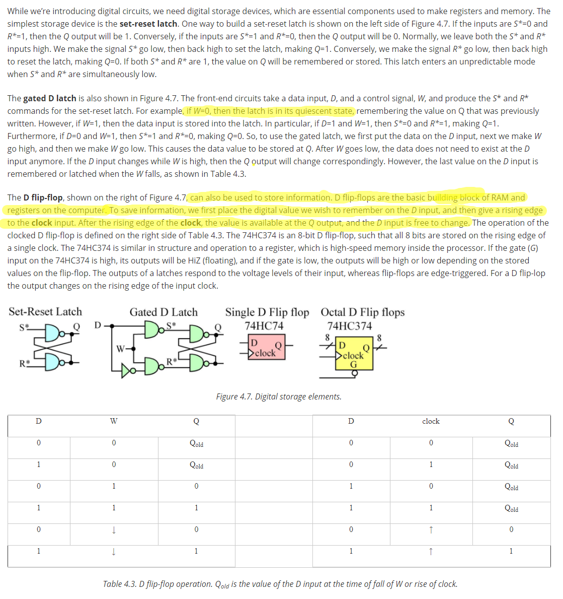

### 2.Tristate Driver

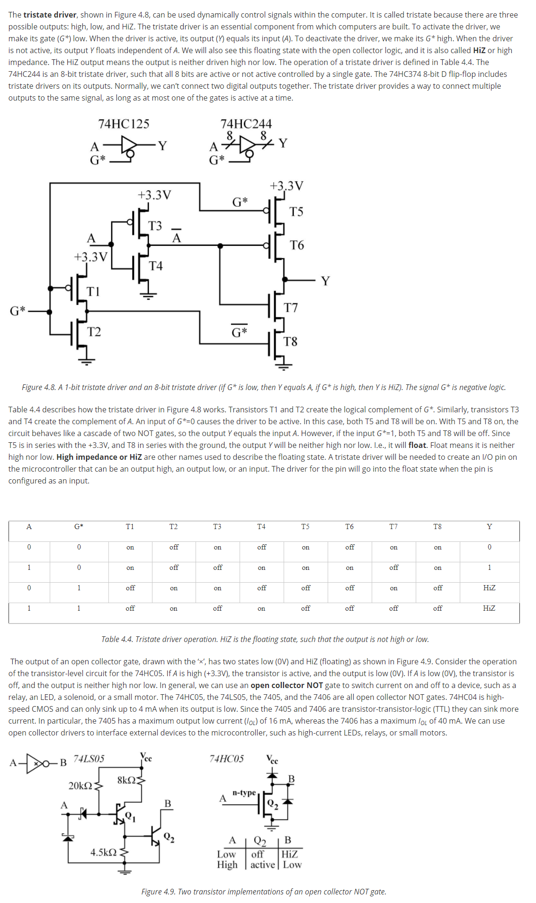

## 4.4 Binary Adder

### 1. 1-bit Full Adder

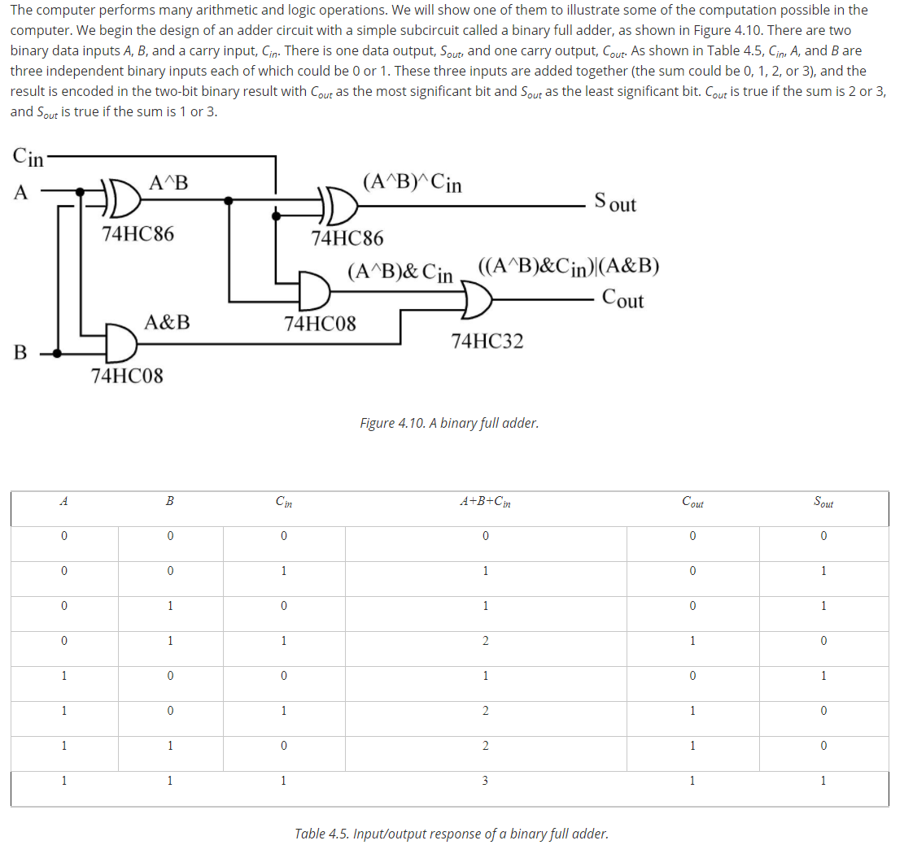

### 2. 8-bit Binary Adder

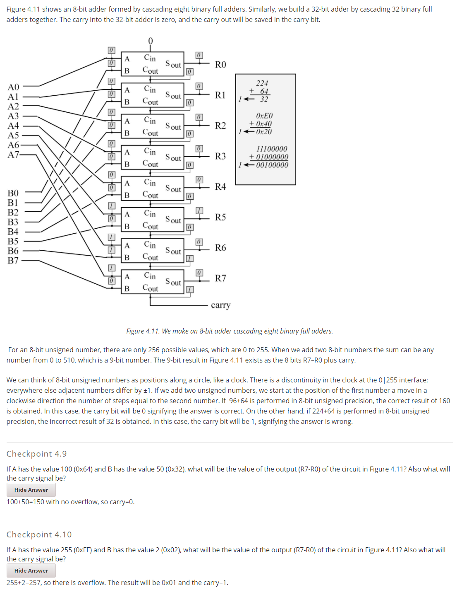

## 4.5 Digital Information Stored in Memory

### 1.Introduction to Memory

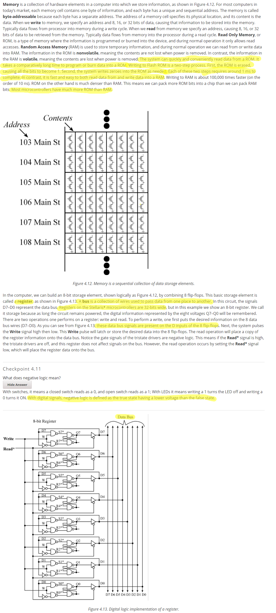

### 2.From Kibibytes to Gibibytes

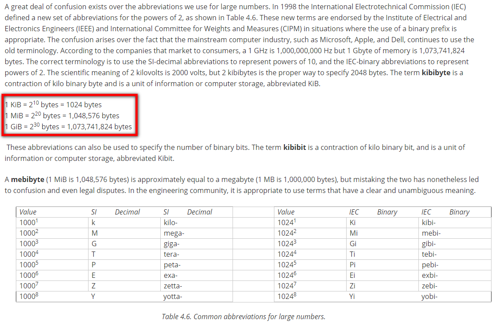

---

well, this chapter is quite conceptual, and just go through the material is OK.