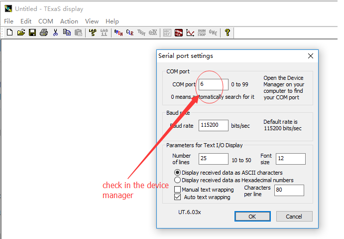
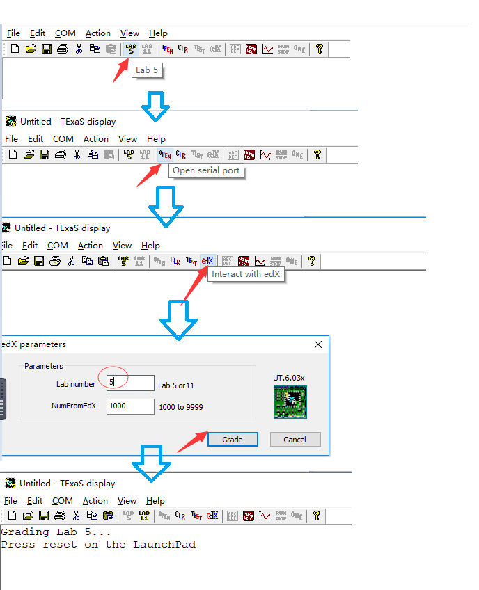

# Lab5

## simulation

well, restart is magic operation.

the function should be implemented is:

```c
unsigned long Calc_Area(unsigned long l, unsigned long w) {
  unsigned long result;
	/*my lab5 code is here*/
	if(l>=3&&l<=20&&w>=3&&w<=20){
		result = l*w;
	}else{
		result = 0;
	}
	/*my lab5 code is here*/
  return result;
}
```

well, it is really simple.

## real board

well, first, you need a new software, TExaSdisplay, whose path is `Keil\TExaSware`.

step 1 : build project and download the code to real board.

step 2 : open TExaSdisplay, click COM -> setting, set the COM port to the number of you port number of your board in computer.


step 3 : start grading.

