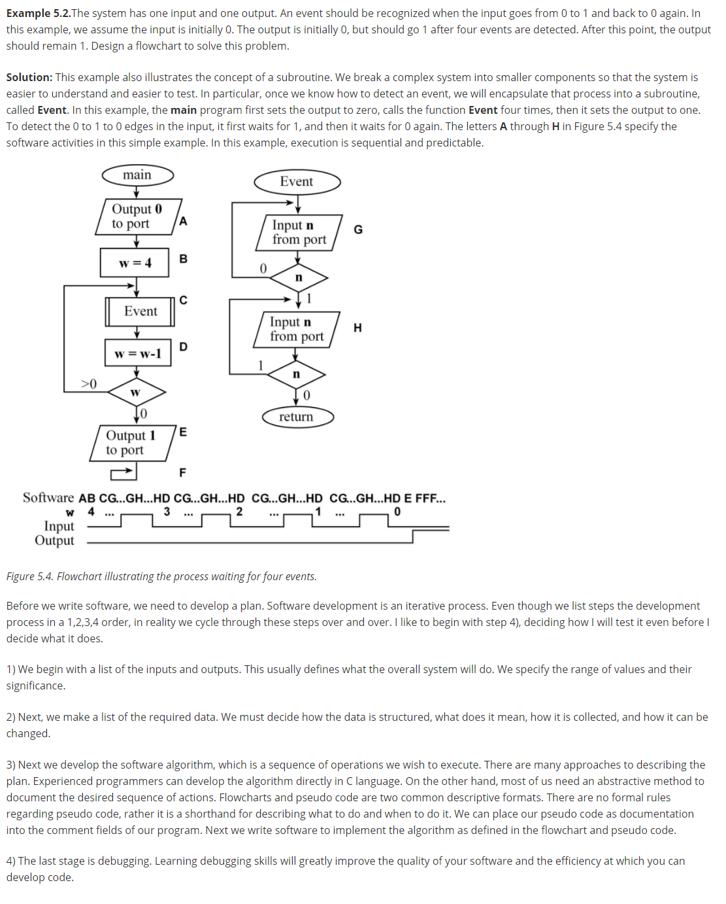
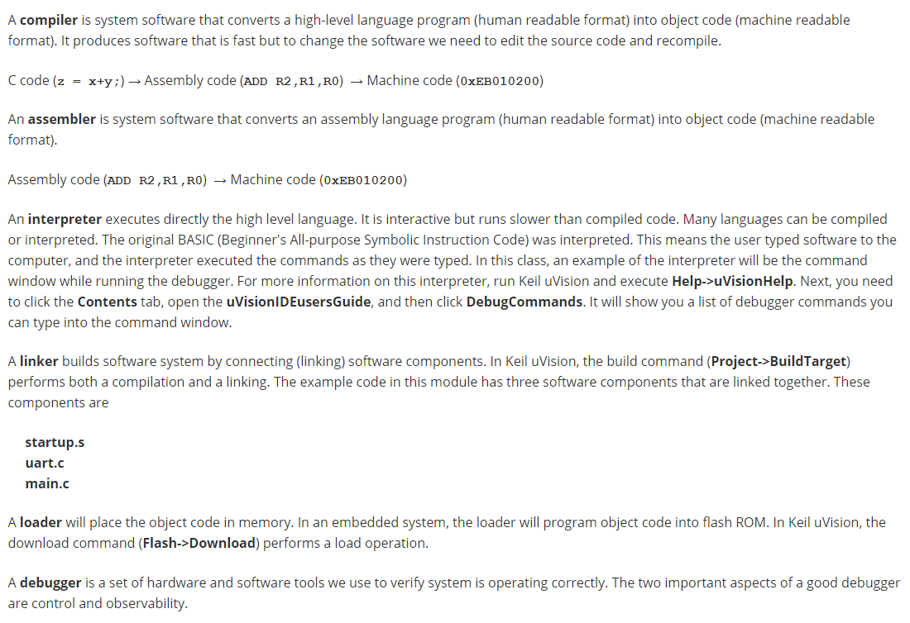
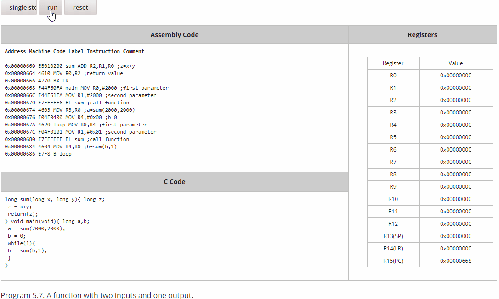
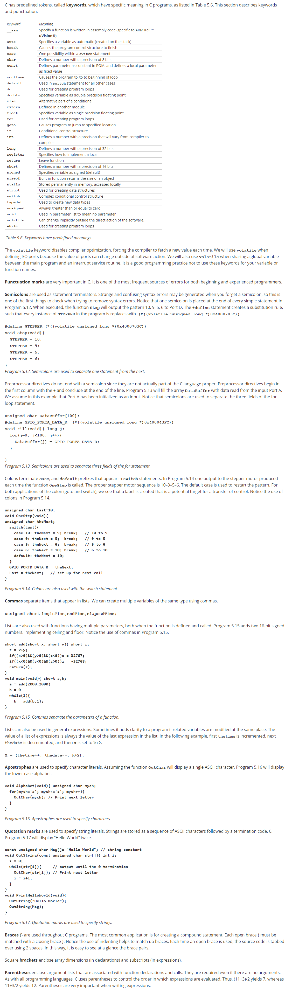

# 5.0 Introduction to C

## 5.0 intro

Learning Objectives:

* Know the elements of a C program: What goes where, what are the syntax rules
* Know declarations: simple data types, char, short, long (unsigned and signed)
* Know the form of the mandatory main subroutine for a program to be executable
* Know the basic assignment statement: variable = expression;
* Know how to use printf and scanf for I/O.
* Know the basic form of the if-statement and the while(1) statement and how they use the conditional Boolean expression.
* Know the importance of functions and understand the use with inputs and outputs.

### Using Flowcharts to Design



## 5.1 Background Information  

### Terminology



## 5.2 Structure and Organization  

### Sections of a Program

```c
//**** 0. Documentation Section
//  This program calculates the area of square shaped rooms
//  Author: Ramesh Yerraballi & Jon Valvano
//  Date: 11/20/2015
//
// 1. Pre-processor Directives Section
#include <stdio.h>  // Diamond braces for sys lib: Standard I/O
#include "uart.h"   // Quotes for user lib: UART lib
// 2. Global Declarations section
// 3. Subroutines Section
// MAIN: Mandatory routine for a C program to be executable 
int main(void) {
  UART_Init();  // call subroutine to initialize the uart 
  printf("This program calculates areas of square-shaped rooms\n");
}
```

## 5.3 Variables and Expressions

skip, it is too easy for me:)

## 5.4 Functions

function (aka subroutine)

a example c program and corresponding assembly code and corresponding registers changes in animation:



## 5.5 Conditional Branching and Loops

skip for the same reason:)

## 5.6 Keyboard Input using scanf

skip for the same reason:)

## 5.7 C Keywords and Punctuation  



---

well, just go through those materials is quite helpful, so not more self-conclusion in here :)


