- [C6 Microcontroller Ports](#c6-microcontroller-ports)
    - [6.0 intro](#60-intro)
        - [Overview of I/O Ports](#overview-of-io-ports)
    - [6.1 Tiva TM4C123 LaunchPad I/O Pins](#61-tiva-tm4c123-launchpad-io-pins)
        - [TM4C123 Block Diagram](#tm4c123-block-diagram)
        - [input port and ouput port](#input-port-and-ouput-port)
        - [LaunchPad Pins (Table 6.1 is in this section)](#launchpad-pins-table-61-is-in-this-section)
        - [LaunchPad External Hardware](#launchpad-external-hardware)
    - [6.2 Basic Concepts of Input and Output Ports](#62-basic-concepts-of-input-and-output-ports)
    - [6.3 I/O Programming and the Direction Register](#63-io-programming-and-the-direction-register)
        - [Device Registers, Port Initialization](#device-registers-port-initialization)
        - [GPIO Registers](#gpio-registers)
        - [**Software to Initialize Port F(very practical and useful seciton)**](#software-to-initialize-port-fvery-practical-and-useful-seciton)
        - [Examples of Friendly Code](#examples-of-friendly-code)
        - [Bit-specific Addressing](#bit-specific-addressing)
    - [6.4 Debugging Monitor Using an LED](#64-debugging-monitor-using-an-led)
        - [Intrusiveness and a Heartbeat](#intrusiveness-and-a-heartbeat)
        - [Logic Analyzer](#logic-analyzer)
- [checkpoint](#checkpoint)

# C6 Microcontroller Ports

## 6.0 intro

Learning Objectives:

* Know what is a parallel port
* Learn how a pin can be either input or output as specified by the direction register
* Understand the steps required to initialize a parallel port
* Learn how to access I/O registers in a friendly manner
* Know how to read data from an input port
* Learn how to write data to an output port
* Know how to use the logic analyzer in the simulator

### Overview of I/O Ports

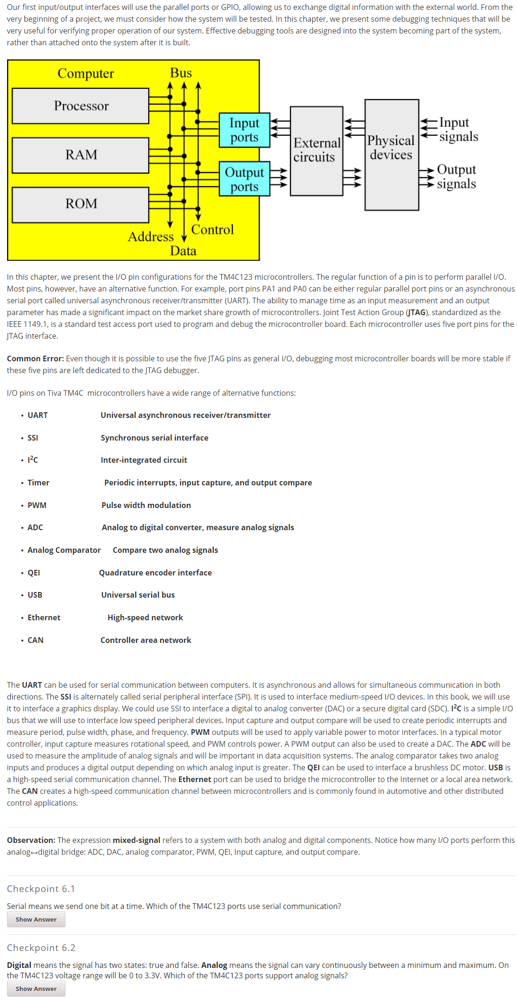

well, with so much new concept spring up here, I think it will be better if I just reference those concepts when I may want to use them.

## 6.1 Tiva TM4C123 LaunchPad I/O Pins  

### TM4C123 Block Diagram

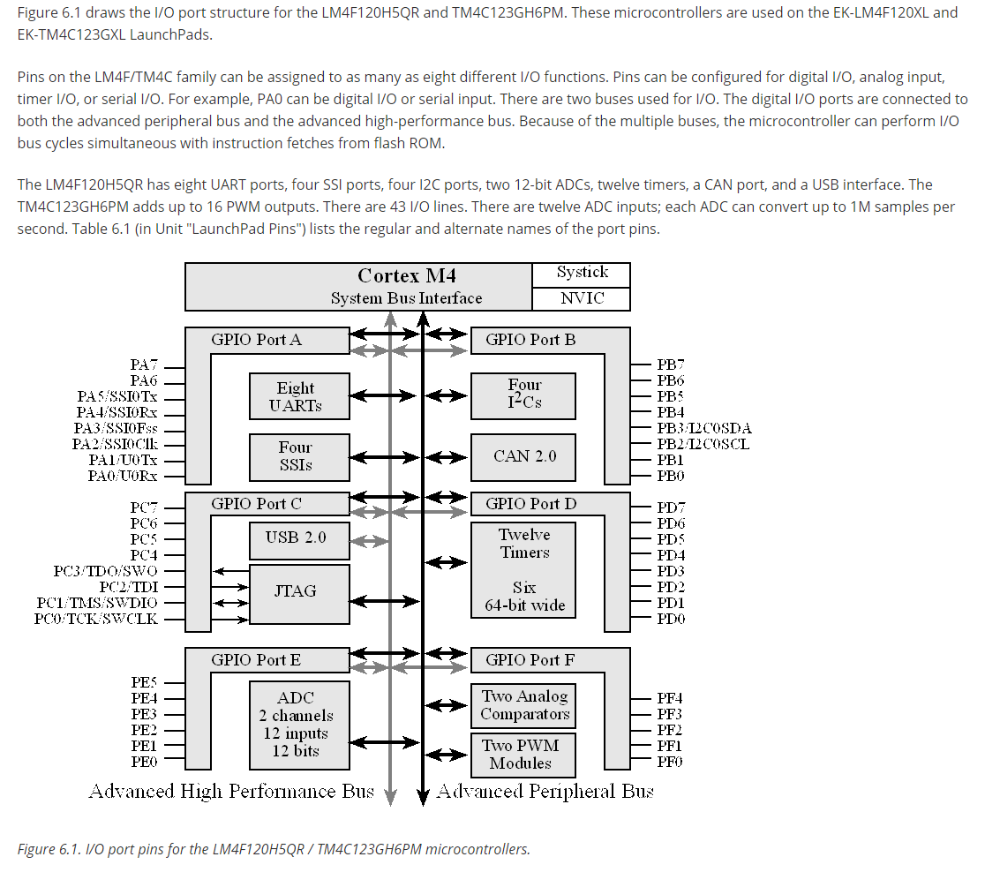

### input port and ouput port

The follwing picture is a illstruation about how the port register control the type of the port.

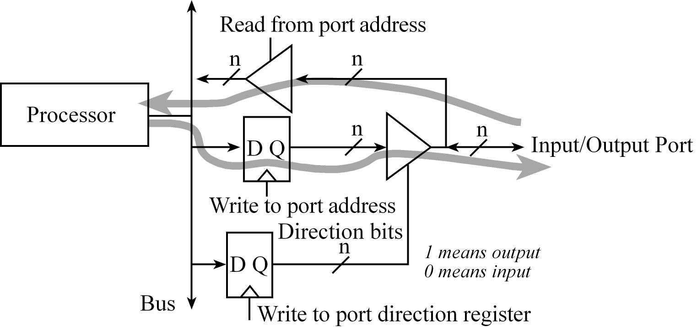

we could set the corresponding direction register bit to 0 to specify an input port.

we could set the corresponding direction register bit to 1 to specify an output port.

### LaunchPad Pins (Table 6.1 is in this section)

well, since Table 6.1 have been metioned for so much time in the following section, I just put it to the title, which may seems more obviously to reference:)

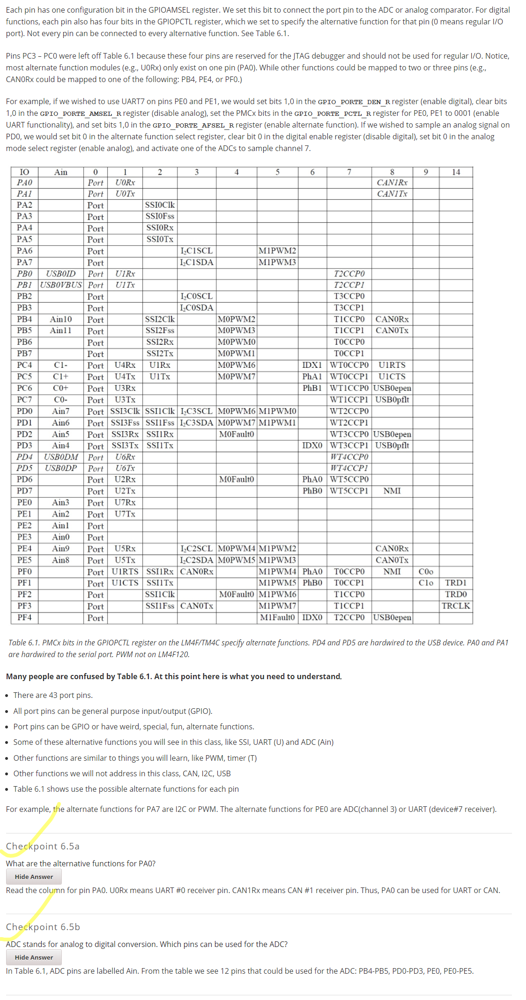

### LaunchPad External Hardware

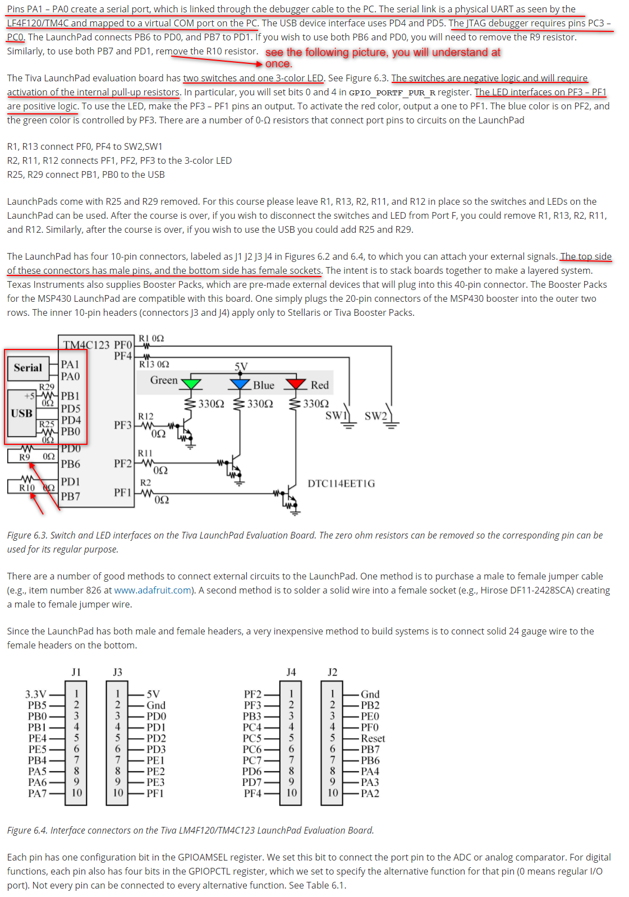

## 6.2 Basic Concepts of Input and Output Ports  

somethings have been metioned before, so skip:)

## 6.3 I/O Programming and the Direction Register  

### Device Registers, Port Initialization

a very interesting behavior of PortF:

**Notice that writing to the Port Data register affects the three outputs on PF3, PF2, PF1. Writing to PF4 and PF0 has no effect because these are inputs. The value of inputs is determined by the switches.**

**------------------------testing-----------------------------**

test1: write 0 to PF0, fail.

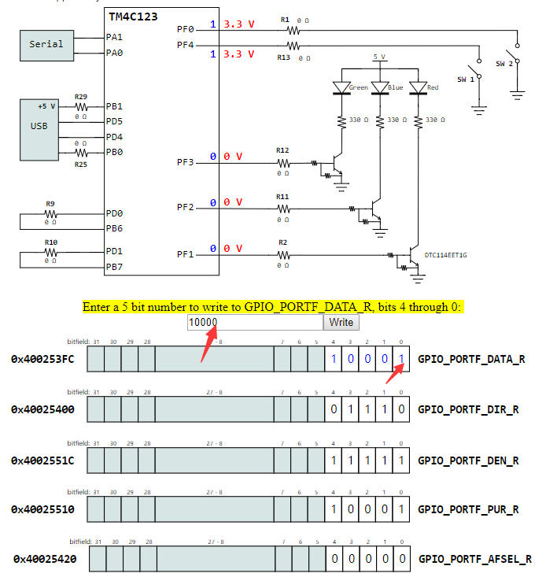

test2: write 0 to PF0 and PF4, fail.

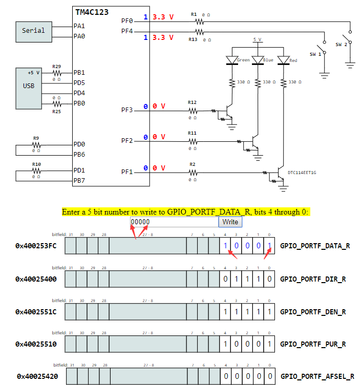

test3: write 1 to PF1 and PF3, success.

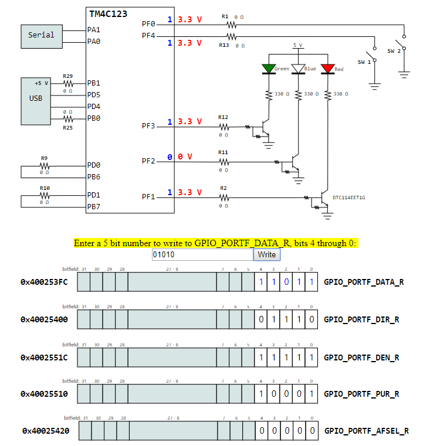

this interactive tool is [here][tool6.1]

[tool6.1]:http://users.ece.utexas.edu/~valvano/Volume1/E-Book/C6_Interactives.htm#ITool6.1

**------------------------testing-----------------------------**

### GPIO Registers

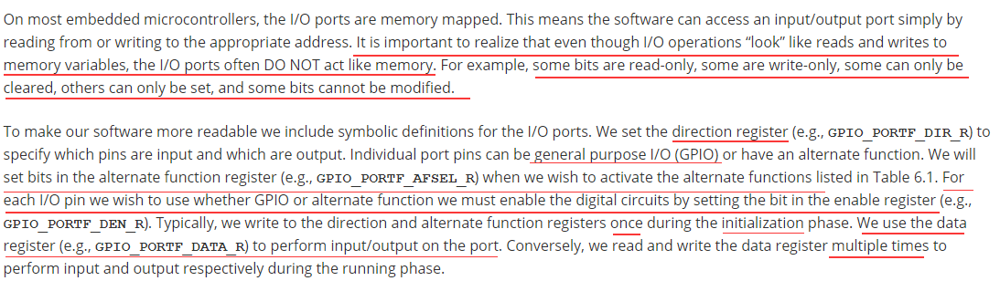

### **Software to Initialize Port F(very practical and useful seciton)**

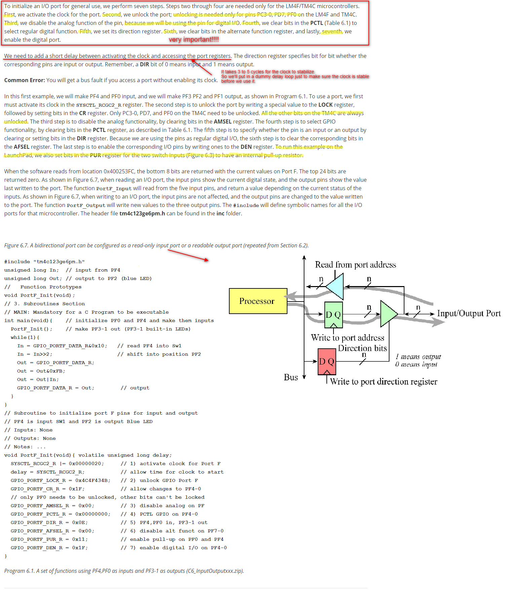

**very important:** well, in this program, normaly, we should do seven step to init a port, like port F, but here, beacause SW1 and SW2 is a switch than should be press to trigger, so here may add one more line code to **"pull up"** those two switch.

### Examples of Friendly Code

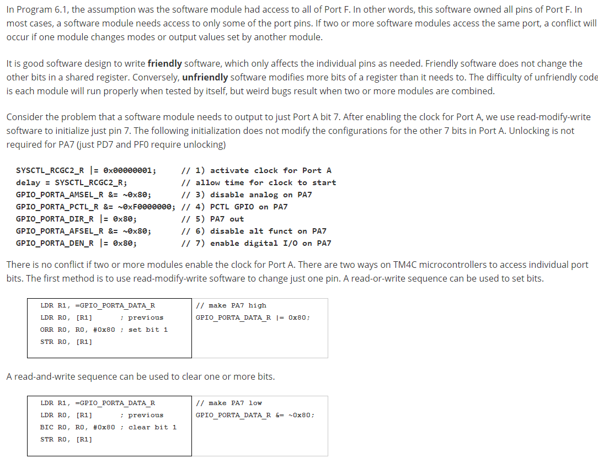

### Bit-specific Addressing

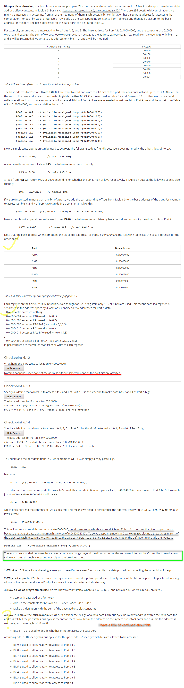

## 6.4 Debugging Monitor Using an LED  

### Intrusiveness and a Heartbeat

Intrusiveness may be interpreted as disturbance.

What does minimally intrusive mean and why is it important in debugging?
- Minimally intrusive means the presence of the debugging code has a small but inconsequential effect on the code being tested. More specifically, the time to execute the debugging code is small compared to the time interval between executes of the code. It is important because we do not want take an operational system and cause it to fail just because we tried to debug it.
- such as debugging with a LED, which is really low cost.

### Logic Analyzer

A logic analyzer is essentially a multiple channel digital storage scope with many ways to trigger. As a troubleshooting aid, it allows the experimenter to observe numerous digital signals at various points in time and thus make decisions based upon such observations. As with any debugging process, it is necessary to select which information to observe out of a vast set of possibilities. Any digital signal in the system can be connected to the logic analyzer.

---

# checkpoint 

well, I think the quiz in this chapter is quite good to remind me of some important point in this chapter, and for the reason that the instructor of ths course have already publish those answer in their website, so I think it is OK to take a screenshot of this quiz :). But if anybody think it is a offense to do this, please contact me and I will consider to delete this.

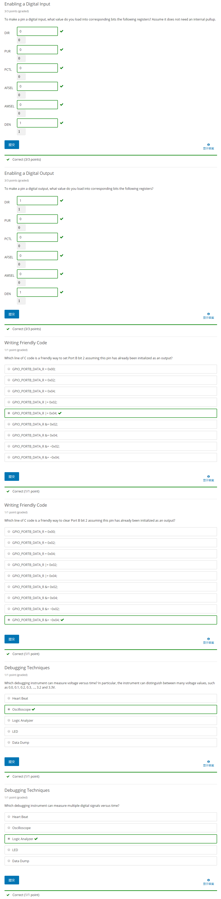

