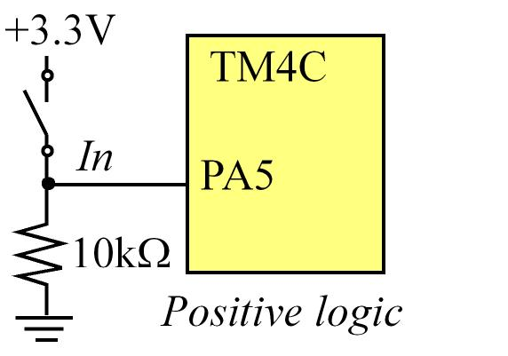
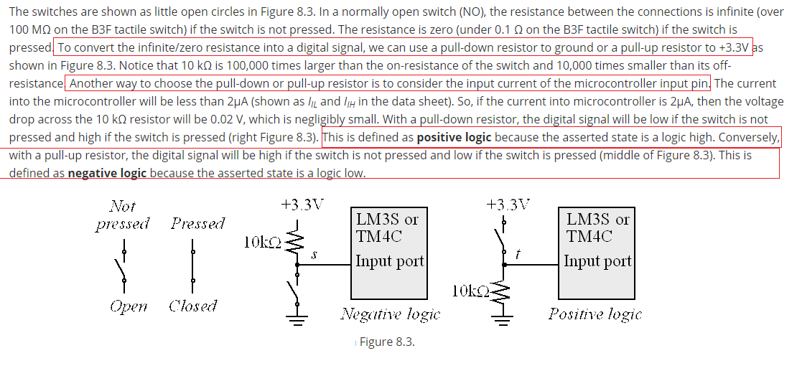
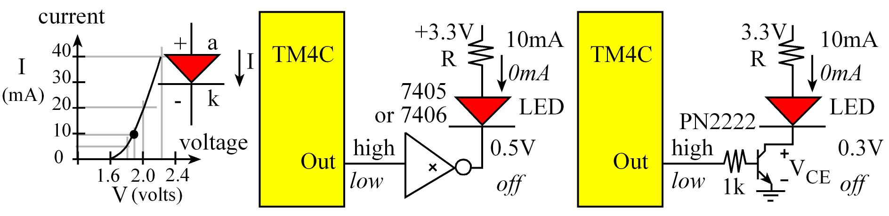
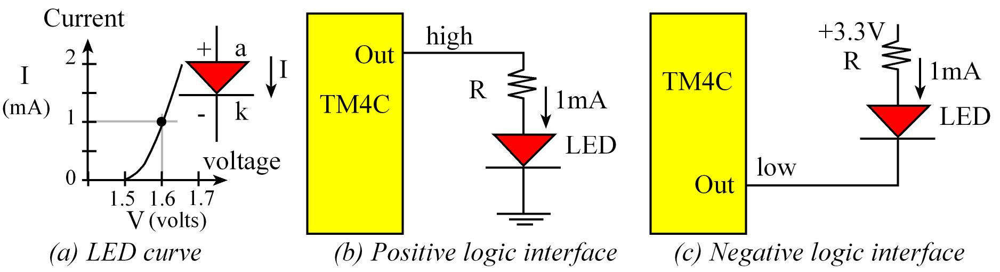

- [C8 Switches and LEDs](#c8-switches-and-leds)
    - [8.1 intro](#81-intro)
    - [8.2 Switch Interfaces](#82-switch-interfaces)
    - [8.3 LED Interfaces](#83-led-interfaces)
    - [8.4 Design Example](#84-design-example)

# C8 Switches and LEDs  

well, this chapter is some kind of "you can know some those knowledge after you carefully read those material in [here][1] without too much thinking". So only for those that should be noted I will write them down in this readme.

[1]:http://users.ece.utexas.edu/~valvano/Volume1/E-Book/C8_SwitchLED.htm

## 8.1 intro

Learning Objectives:

* Understanding basic circuit elements like source, ground, and resistors.
* Understanding how switches and LEDs work.                      
* Application of Ohm’s Law
* Analog circuit design and construction on a solderless breadboard
* Interfacing switches and LEDs to a microcontroller
* Programming simple logic.

## 8.2 Switch Interfaces  

well, a interesting program is showed in this section.

It shows us the a specifical way to init a single pin, such as PA5.

```c
#define PA5   (*((volatile unsigned long *)0x40004080))
void Switch_Init(void){ volatile unsigned long delay;
  SYSCTL_RCGC2_R |= 0x00000001;     // 1) activate clock for Port A
  delay = SYSCTL_RCGC2_R;           // allow time for clock to start
                                    // 2) no need to unlock GPIO Port A
  GPIO_PORTA_AMSEL_R &= ~0x20;      // 3) disable analog on PA5
  GPIO_PORTA_PCTL_R &= ~0x00F00000; // 4) PCTL GPIO on PA5
  GPIO_PORTA_DIR_R &= ~0x20;        // 5) direction PA5 input
  GPIO_PORTA_AFSEL_R &= ~0x20;      // 6) PA5 regular port function
  GPIO_PORTA_DEN_R |= 0x20;         // 7) enable PA5 digital port
}
unsigned long Switch_Input(void){
  return PA5; // return 0x20(pressed) or 0(not pressed)
}
unsigned long Switch_Input2(void){
  return (GPIO_PORTA_DATA_R&0x20); // 0x20(pressed) or 0(not pressed)
}
```

Interface of a switch to a microcomputer input, PA5:





Positive logic says that if the switch is open, then I read 0 volts, and if the switch is closed, then I read 3.3 volts. So negative logic, by the same measure, would be exactly the opposite.

**And it is important to know that why there should be a pull-up or pull-down resistor.**

## 8.3 LED Interfaces  

reading the material is enough.

If the LED current is above 8 mA, we cannot connect it directly to the microcontroller because the high currents may damage the chip. 

Positive logic LED interface (Lite-On LTL-10223W) Use this for LEDs requiring more than 8 mA:



Low current LED interface (Agilent HLMP-D150). Use these circuits for LEDs requiring less than 8 mA:




## 8.4 Design Example

skip.


