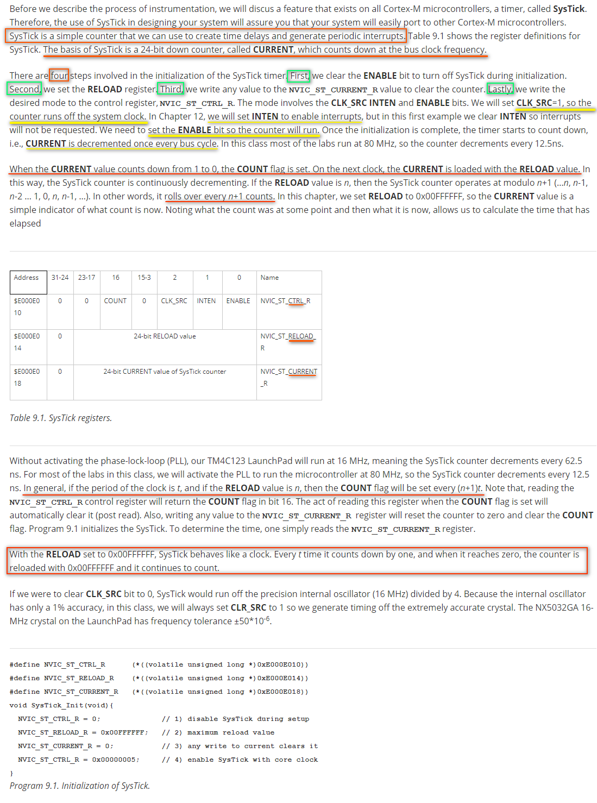
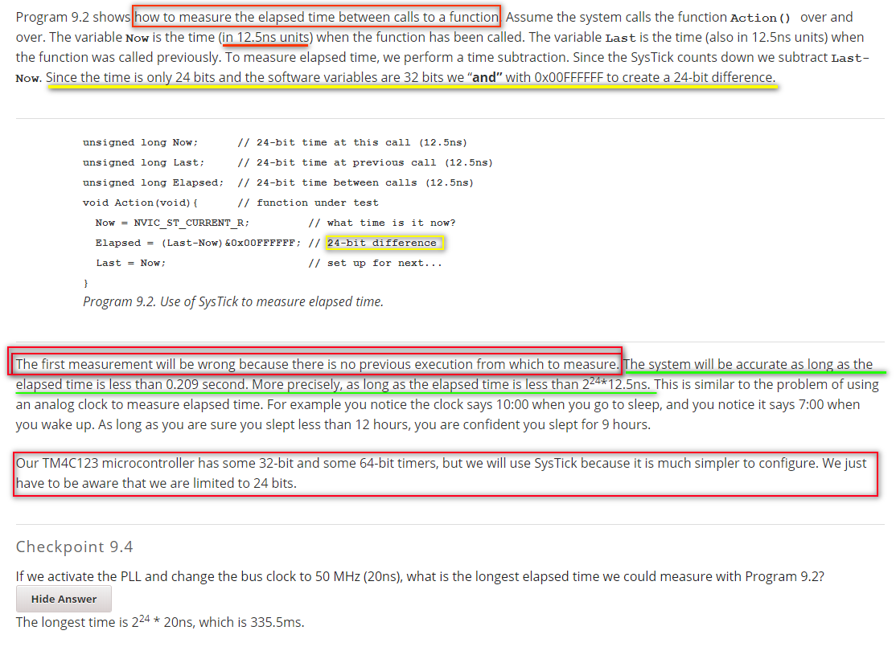
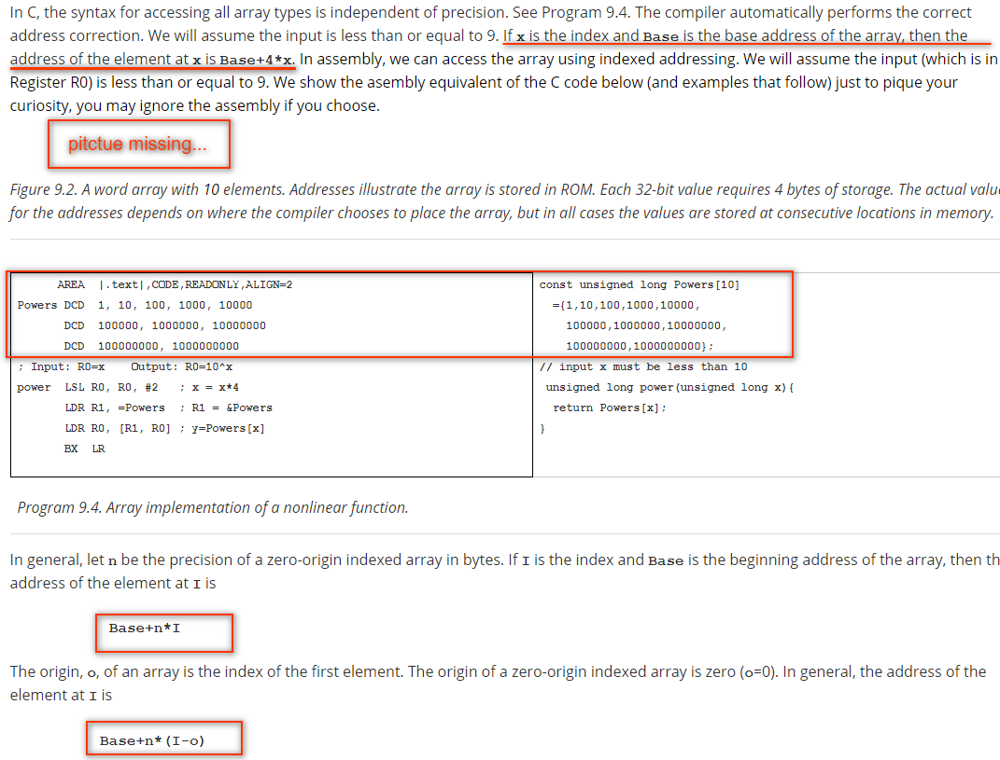
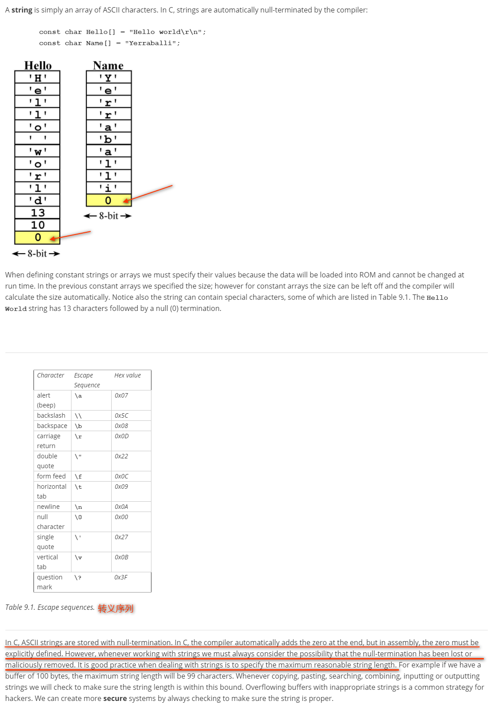
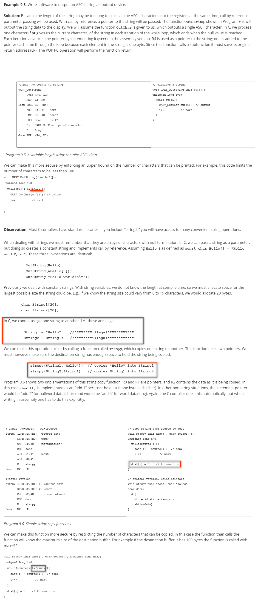
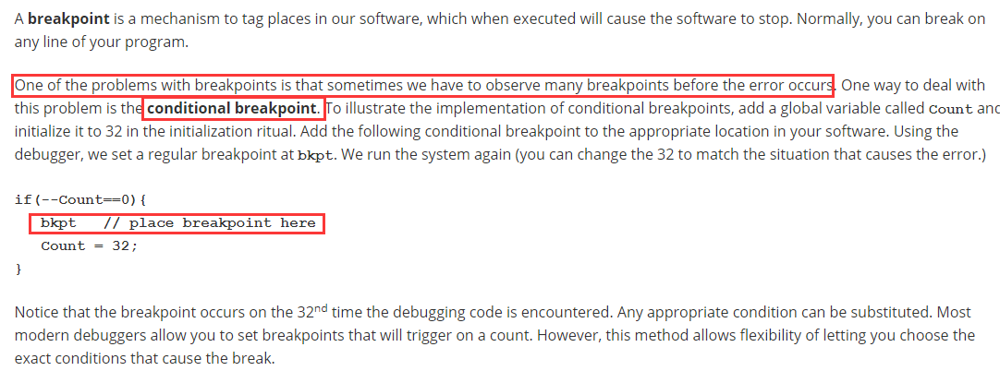
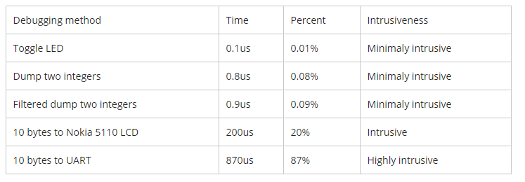

- [C9 Arrays and Functional Debugging](#c9-arrays-and-functional-debugging)
    - [9.0 Introduction](#90-introduction)
    - [9.1 Debugging Theory](#91-debugging-theory)
        - [Intrusiveness](#intrusiveness)
        - [Black-box, White-box Testing](#black-box-white-box-testing)
    - [9.2 SysTick Timer](#92-systick-timer)
        - [SysTick Initialization](#systick-initialization)
        - [Using SysTick to Determine Time](#using-systick-to-determine-time)
    - [9.3 Arrays](#93-arrays)
    - [9.4 Strings](#94-strings)
        - [synatx](#synatx)
        - [String Examples](#string-examples)
    - [9.5 Functional Debugging](#95-functional-debugging)

# C9 Arrays and Functional Debugging  

## 9.0 Introduction  

Learning Objectives:

* Understand the concept of minimally intrusive debugging
* Learn how the SysTick counter works
* Learn about arrays
* Learn how to use indexing to access arrays
* Understand precision, length and origin
* Learn how to create a debugging dump
* Understand that a formal method to verify program correctness
* Learn how to use the dump to collect debugging information in real time

## 9.1 Debugging Theory  

### Intrusiveness

**Nonintrusiveness** is the characteristic or quality of a debugger that allows the software/hardware system to operate normally as if the debugger did not exist.

**Intrusiveness** is used as a measure of the degree of perturbation caused in system performance by the debugging instrument itself. For example, a print statement added to your source code is very intrusive because it significantly affects the real-time interaction of the hardware and software.

A debugging instrument is classified as **minimally intrusive** if it has a small but negligible effect on the system being debugged. 

A **dump** is a debugging technique that records strategic information into memory. We can add a **filter** to the dump so that information is recorded only if certain conditions are true. A **monitor** is a debugging technique that outputs strategic information on LEDs or an LCD. Dumps, dumps with filter, and monitors are much less intrusive than print statements. 

**A real-time system, where software execution timing is critical, usually cannot be debugged with simple print statements, because the print statement itself will require too much time to execute. (It is very very important to recongize this!)**

### Black-box, White-box Testing

Black-box testing is simply observing the inputs and outputs without looking inside. Black-box testing has an important place in debugging a module for its functionality. On the other hand, white-box testing allows you to control and observe the internal workings of a system. A common mistake made by new engineers is to just perform black box testing. Effective debugging uses both. One must always start with black-box testing by subjecting a hardware or software module to appropriate test-cases. Once we document the failed test-cases, we can use them to aid us in effectively performing the task of white-box testing.

Although using print statements for debugging is widely used in software development, we will avoid using print output when debugging embedded systems because

* Outputting to a display device takes a 1ms or more, so print statements are usually intrusive.
* Most embedded systems do not have a display device onto which you can print.
* If an embedded system has a display it is typically dedicated for the operation of the system and not available for displaying debugging information. 

**For these reasons we will use a dump, which records strategic information into memory.**

## 9.2 SysTick Timer  

Time is an important factor for embedded systems. The **SysTick** timer is simple mechanism we can use to measure and control time. It is **a 24-bit timer such that CURRENT counts down every bus cycle**. After CURRENT counts to **0**, it is **automatically reloaded with the RELOAD value and continues to count**.

### SysTick Initialization



### Using SysTick to Determine Time



## 9.3 Arrays  

**An array is a collection of data elements where each element is of the same size and type.** We will use arrays in this chapter to record debugging data as our program executes. Recording in an array will be a minimally intrusive debugging technique.

array in RAM (can be modified in run time):

```c
short Image[5][10]={
  {0,0,1,0,1,1,1,0,1,0},
  {0,0,1,0,0,1,0,0,1,0},
  {0,0,1,0,0,1,0,0,1,0},
  {0,0,1,0,0,0,0,0,1,0},
  {0,0,0,1,1,1,1,1,0,0}};
```

array in ROM (only for read):

```c
const short Image[5][10]={
  {0,0,1,0,1,1,1,0,1,0},
  {0,0,1,0,0,1,0,0,1,0},
  {0,0,1,0,0,1,0,0,1,0},
  {0,0,1,0,0,0,0,0,1,0},
  {0,0,0,1,1,1,1,1,0,0}};
```



## 9.4 Strings  

### synatx



### String Examples



## 9.5 Functional Debugging  






