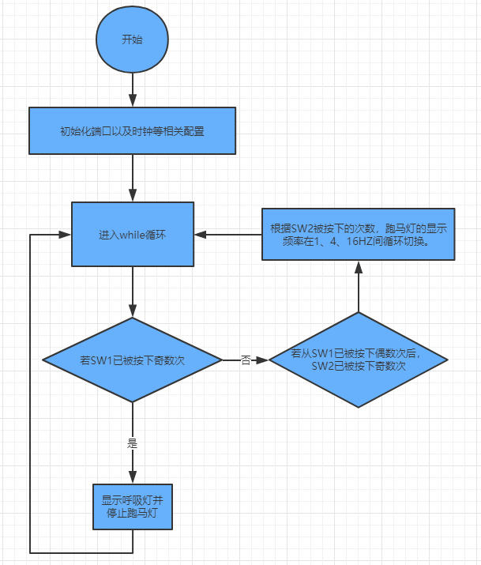
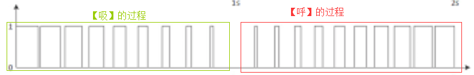

# 期末project

## 实验要求

设置PF0，PF4两个输入，一个使用外部触发中断，一个使用查询方式。多设置几种灯的变换模式，多个灯的变化速度等。

说明设计思路，实现功能、使用工具、程序流程图、实际运行现象（比如拍照），设计分析体会等，并附上代码。

## 实验目的

* 进一步掌握本学期以来所做实验用到的各种元器件的使用方法和编程；
* 加深GPIO、中断、定时器、LED等的使用；
* 加强综合问题解决能力和拓展思维创新能力。

## 实现功能

本人实现了两个功能：

* 功能一：按下按钮可以改变跑马灯切换灯光颜色的频率；

    * 该功能总共设置了3个频率，依次是1HZ、4HZ、16HZ，当按下PF0（SW2）时灯光的切换频率会在这3个频率上切换。

* 功能二：按下另外一个按钮切换到呼吸灯。
    * 当按下PF4（SW1）时，LED会显示为绿色的呼吸灯。

## 使用工具

程序开发IDE:Keil

程序测试开发板：TM4C123系列

## 实现效果

由于之前验收时顺路也把板子交上去了，实际运行的效果也经TA验收了，而由于是动态的实验效果，贴图也无法展示其运行过程，因此这里便不贴上运行截图了。

## 程序流程图

总体程序流程图如下：




## 实现思路

这里将讲解实现过程的关键代码和思路，诸如端口初始化等简单细节这里不会过多提及。

### 功能一

#### step 1 - 理解Timer0A_Init()函数

实现该功能涉及核心函数如下，该函数接受的参数为2个：一个是每隔多久要执行的函数，一个是指定函数每隔多久要执行一次的时间。

```c
// ***************** Timer0A_Init ****************
// Activate TIMER0 interrupts to run user task periodically
// Inputs:  task is a pointer to a user function
//          period in units (1/clockfreq), 32 bits
// Outputs: none
void Timer0A_Init(void(*task)(void), uint32_t period){long sr;
  sr = StartCritical(); 
  SYSCTL_RCGCTIMER_R |= 0x01;   // 0) activate TIMER0
  PeriodicTask = task;          // user function
  TIMER0_CTL_R = 0x00000000;    // 1) disable TIMER0A during setup
  TIMER0_CFG_R = 0x00000000;    // 2) configure for 32-bit mode
  TIMER0_TAMR_R = 0x00000002;   // 3) configure for periodic mode, default down-count settings
  TIMER0_TAILR_R = period-1;    // 4) reload value
  TIMER0_TAPR_R = 0;            // 5) bus clock resolution
  TIMER0_ICR_R = 0x00000001;    // 6) clear TIMER0A timeout flag
  TIMER0_IMR_R = 0x00000001;    // 7) arm timeout interrupt
  NVIC_PRI4_R = (NVIC_PRI4_R&0x00FFFFFF)|0x80000000; // 8) priority 4
// interrupts enabled in the main program after all devices initialized
// vector number 35, interrupt number 19
  NVIC_EN0_R = 1<<19;           // 9) enable IRQ 19 in NVIC
  TIMER0_CTL_R = 0x00000001;    // 10) enable TIMER0A
  EndCritical(sr);
}
```

那么我们就利用Timer0A定时器来定时地完成我们要实现的跑马灯了。

#### step 2 - 实现跑马灯切换程序

首先实现如下函数，该函数便是我们要指定的跑马灯切换程序，该函数被调用一次，灯光就切换一次，依次反复在8种灯光效果上切换。

```c
#define LEDS      (*((volatile uint32_t *)0x40025038))
#define RED       0x02
#define BLUE      0x04
#define GREEN     0x08
#define WHEELSIZE 8           // must be an integer multiple of 2
                              //    red, yellow,    green, light blue, blue, purple,   white,          dark
const long COLORWHEEL[WHEELSIZE] = {RED, RED+GREEN, GREEN, GREEN+BLUE, BLUE, BLUE+RED, RED+GREEN+BLUE, 0};
void UserTask(void){
  static int i = 0;
  LEDS = COLORWHEEL[i&(WHEELSIZE-1)];
  i = (i + 1) % 8;
}
```

#### step 3 - 使用轮询来实现PF0的按下事件检测

那么我们便可以在main函数中监控PF0（SW2）是否被按下的操作来切换灯光的频率。这里按照实验要求，使用轮询的方法来检测该动作的发现。

因此可在main函数的while(1)循环中如此实现。要注意PF0是负逻辑的，因此当PF0被按下的时候，有`(GPIO_PORTF_DATA_R&0x01) == 0x00`，而不是`(GPIO_PORTF_DATA_R&0x01) == 0x01`。

```c
while(1){
    //detect PF0 input status
    if((GPIO_PORTF_DATA_R&0x01) == 0x00){
        if(speed_flag == 0)
            Timer0A_Init(&UserTask, F1HZ);  // initialize timer0A (1 Hz)
        else if(speed_flag == 1){
            Timer0A_Init(&UserTask, F4HZ);  // initialize timer0A (4 Hz)
        }else if(speed_flag == 2){
            Timer0A_Init(&UserTask, F16HZ);  // initialize timer0A (16 Hz)
        }
        speed_flag = (speed_flag + 1)%3;
    }
  }
```

关于频率的定义如下：

```c
// if desired interrupt frequency is f, Timer0A_Init parameter is busfrequency/f
#define busfrequency 5000000
#define F16HZ (busfrequency/16)
#define F1HZ (busfrequency/1)
#define F4HZ (busfrequency/4)
```

### 功能二

该功能实现当按下PF4（SW1）时，LED会显示为绿色的呼吸灯。

#### step 1 - 使用中断来实现PF4的按下事件检测

首先按照实验要求用中断来检测PF4被按下的触发动作。对应需要在F端口的初始化过程中多设置一些操作（下方代码重要标注部分），对应F端口的初始化函数为：

```c
void PortF_Init(void){
  SYSCTL_RCGCGPIO_R |= 0x20;  // 1) activate clock for Port F
  while((SYSCTL_PRGPIO_R&0x0020) == 0){};// ready?
  GPIO_PORTF_LOCK_R = 0x4C4F434B;   // 2) unlock GPIO Port F
  GPIO_PORTF_CR_R = 0x1F;           // allow changes to PF4-0
  // only PF0 needs to be unlocked, other bits can't be locked
  GPIO_PORTF_AMSEL_R = 0x00;        // 3) disable analog on PF
  GPIO_PORTF_PCTL_R = 0x00;   // 4) PCTL GPIO on PF4-0
  GPIO_PORTF_DIR_R = 0x0E;          // 5) PF4,PF0 in, PF3-1 out
  GPIO_PORTF_AFSEL_R = 0x00;        // 6) disable alt funct on PF7-0
  GPIO_PORTF_PUR_R = 0x11;          // enable pull-up on PF0 and PF4
  GPIO_PORTF_DEN_R = 0x1F;          // 7) enable digital I/O on PF4-0
	/*该端代码用于设置PF4下降沿的中断事件*/
	GPIO_PORTF_IS_R &= ~0x10;     //  PF4 is edge-sensitive
  GPIO_PORTF_IBE_R &= ~0x10;    //     PF4 is not both edges
  GPIO_PORTF_IEV_R &= ~0x10;    //     PF4 falling edge event
  GPIO_PORTF_ICR_R = 0x10;      //  clear flag4
  GPIO_PORTF_IM_R |= 0x10;      //  arm interrupt on PF4 *** No IME bit as mentioned in Book ***
  NVIC_PRI7_R = (NVIC_PRI7_R&0xFF00FFFF)|0x00A00000; //  priority 5
  NVIC_EN0_R = 0x40000000;      //  enable interrupt 30 in NVIC
  EnableInterrupts();           //  Clears the I bit
	/*该端代码用于设置PF4下降沿的中断事件*/
}
```

接着实现端口F的中断处理函数GPIOPortF_Handler，定义变量 sleep_light_flag 来检测是否开启呼吸灯。

```c
short sleep_light_flag = 0;
void GPIOPortF_Handler(void){
  GPIO_PORTF_ICR_R = 0x10;      // acknowledge flag4
  if(sleep_light_flag == 0)
		sleep_light_flag = 1;
	else
		sleep_light_flag = 0;
}
```

#### step 2 - 呼吸灯的核心函数的实现

接下来便要实现呼吸灯的核心函数。所谓呼吸灯，从字面含义来讲，便是灯光的亮度变化的节奏和我们人类呼吸的节奏很相似。

关键就在于怎么控制灯光的亮度会随着时间变化。利用我们人类的视觉暂留效应结合PWM的思想可以实现这个功能。

具体便是：先设置一个固定的周期T，在该周期内，T也为灯光亮和灭的时间总和。那么,

- **在亮度逐步增加（模拟【呼】）的过程中，我们便可逐步地增加灯光亮的时间，也即是逐步地降低灯光暗的时间。**

- **在亮度逐步减低（模拟【吸】）的过程中，我们便可逐步地增加灯光暗的时间，也即是逐步地降低灯光亮的时间。**

对应的示意图如下：



实现代码如下：

```c
void sleep_light()
{
	uint32_t i;
	uint32_t period = 1000;
    //第一步:先灭一秒
	LEDS = 0;
    SysTick_Wait1s(1);
    
	//第二步:亮度逐步增加（模拟【呼】的过程，该过程持续一秒）
	for(i=10; i<=period; i+=10){
		LEDS = GREEN;
		SysTick_Wait10us(i);
		LEDS = 0;
		SysTick_Wait10us(period-i);
    }
    
	//第三步:保持最高亮度两秒
	LEDS = GREEN;
    SysTick_Wait1s(2);
    
	//第四步:亮度逐步减低（模拟【吸】的过程，该过程持续一秒）
	for(i=period; i>0; i-=10){
		LEDS = GREEN;
		SysTick_Wait10us(i);
		LEDS = 0;
		SysTick_Wait10us(period-i);
	}	
}
```

这里为了使得效果明显，先让灯灭一秒，然后再让亮度逐步地亮起来，当亮度到达最大值时让灯光保持两秒后再让灯光开始衰弱。

#### step 3 - 时间的精准控制

那么，**可以注意到，要实现这个功能就必须要涉及到时间的精准控制**。在上面的代码中便用到了基于SysTick实现的两个函数：`SysTick_Wait1s()`和`SysTick_Wait10us()`。

下面来讲解该部分的实现。

首先调整SYSDIV和LSB来设置时钟频率为5MHZ：

```c
#define SYSDIV 39
#define LSB 1
// bus frequency is 400MHz/(2*SYSDIV+1+LSB) = 400MHz/(2*39+1+1) = 5 MHz
```

接着实现SysTick的初始化函数和延时函数：

```c
void SysTick_Init(void){
  NVIC_ST_CTRL_R = 0;               // disable SysTick during setup
  NVIC_ST_RELOAD_R = 0x00FFFFFF;    // maximum reload value
  NVIC_ST_CURRENT_R = 0;            // any write to current clears it
  NVIC_ST_CTRL_R = 0x05;            // enable SysTick with core clock
  
}

void SysTick_Wait(uint32_t delay){
  NVIC_ST_RELOAD_R = delay-1;  // number of counts
  NVIC_ST_CURRENT_R = 0;       // any value written to CURRENT clears
  while((NVIC_ST_CTRL_R&0x00010000)==0){ // wait for flag
	}
}
```

关于这两个函数的原理之前的实验已经有提及，这里不再赘述。

基于`SysTick_Wait()`函数，便可实现呼吸灯用到的`SysTick_Wait1s()`和`SysTick_Wait10us()`这两个函数了。

```c
void SysTick_Wait1s(uint32_t delay){
 unsigned long i; 
 for(i=0; i<delay; i++){
   SysTick_Wait(5000000); // wait 10ms
}
} 
 
void SysTick_Wait10us(uint32_t delay){
 unsigned long i; 
 for(i=0; i<delay; i++){
   SysTick_Wait(50); // wait 100us
}
}
```

#### step 4 - 整合

这里整合上面的3个步骤，在main函数中实现如下代码即可实现目标了。

```c
int main(void){ 
  PLL_Init();                      // bus clock at 5 MHz
	PortF_Init();
	SysTick_Init();
  LEDS = 0;                        // turn all LEDs off
  EnableInterrupts();
	
	short speed_flag = 0;
  while(1){
    //WaitForInterrupt();
		if(sleep_light_flag)
		{
			sleep_light();
			Timer0A_Init(&UserTask2, F1HZ);
		}
		else{
			//detect PF0 input status
			if((GPIO_PORTF_DATA_R&0x01) == 0x00){
				if(speed_flag == 0)
					Timer0A_Init(&UserTask, F1HZ);  // initialize timer0A (1 Hz)
				else if(speed_flag == 1){
					Timer0A_Init(&UserTask, F4HZ);  // initialize timer0A (4 Hz)
				}else if(speed_flag == 2){
					Timer0A_Init(&UserTask, F16HZ);  // initialize timer0A (16 Hz)
				}
				speed_flag = (speed_flag + 1)%3;
			}
		}
  }
}

```

注意到呼吸灯和跑马灯都是在同一个LED上实现，因此两个功能的效果在一起展示的时候效果可能有点乱，因此便在原来的基础上设置当呼吸灯启用时，跑马灯将会被取消显示，对应的代码为`Timer0A_Init(&UserTask2, F1HZ);`，其中`UserTask2()`函数实现如下：

```
void UserTask2(void){
  //do nothing
}
```

## 设计分析体会

在这次的project中，我先是利用了Time0A定时器来实现跑马灯的频率切换功能，然后利用SysTick实现精准计时并结合PWM的思想实现呼吸灯。之前实现中学习到的端口初始化及设置、Time0A定时器初始化及设置、SysTick初始化及设置、PLL初始化及设置也都应用上了。可以说通过了这次尝试对这些知识点也有了更深的理解了。虽然嵌入式这门课程结束了，但是却为我们走进嵌入式编程领域作为很好的铺垫，现在看到各种各样的板子上运行的代码也不会一脸懵逼了。在探索TM4C123的过程中也遇到了许许多多地困难，比如我们用来开发程序的KEIL的仿真是有bug的，也明白了代码的准确性是要在板子上检验才可以的，在这个过程中也考验了我的批判精神。除此之外，在探索板子里面的“奥秘”的时候，学会查看datasheet是一个很重要的技能，遇到问题时第一时间查看datasheet对我进行板子的编程特别有帮助。

## 附录-代码

```c
// PeriodicTimer0AInts.c
// Runs on LM4F120/TM4C123
// Use Timer0A in periodic mode to request interrupts at a particular
// period.
// Daniel Valvano
// September 11, 2013

/* This example accompanies the book
   "Embedded Systems: Real Time Interfacing to Arm Cortex M Microcontrollers",
   ISBN: 978-1463590154, Jonathan Valvano, copyright (c) 2014
  Program 7.5, example 7.6

 Copyright 2014 by Jonathan W. Valvano, valvano@mail.utexas.edu
    You may use, edit, run or distribute this file
    as long as the above copyright notice remains
 THIS SOFTWARE IS PROVIDED "AS IS".  NO WARRANTIES, WHETHER EXPRESS, IMPLIED
 OR STATUTORY, INCLUDING, BUT NOT LIMITED TO, IMPLIED WARRANTIES OF
 MERCHANTABILITY AND FITNESS FOR A PARTICULAR PURPOSE APPLY TO THIS SOFTWARE.
 VALVANO SHALL NOT, IN ANY CIRCUMSTANCES, BE LIABLE FOR SPECIAL, INCIDENTAL,
 OR CONSEQUENTIAL DAMAGES, FOR ANY REASON WHATSOEVER.
 For more information about my classes, my research, and my books, see
 http://users.ece.utexas.edu/~valvano/
 */

// oscilloscope or LED connected to PF3-1 for period measurement
// When using the color wheel, the blue LED on PF2 is on for four
// consecutive interrupts then off for four consecutive interrupts.
// Blue is off for: dark, red, yellow, green
// Blue is on for: light blue, blue, purple, white
// Therefore, the frequency of the pulse measured on PF2 is 1/8 of
// the frequency of the Timer0A interrupts.

#include "..//inc//tm4c123gh6pm.h"
#include <stdint.h>
//#include "PLL.h"
#include "Timer0A.h"


#define PF1       (*((volatile uint32_t *)0x40025008))
#define PF2       (*((volatile uint32_t *)0x40025010))
#define PF3       (*((volatile uint32_t *)0x40025020))
#define LEDS      (*((volatile uint32_t *)0x40025038))
#define RED       0x02
#define BLUE      0x04
#define GREEN     0x08
#define WHEELSIZE 8           // must be an integer multiple of 2
                              //    red, yellow,    green, light blue, blue, purple,   white,          dark
const long COLORWHEEL[WHEELSIZE] = {RED, RED+GREEN, GREEN, GREEN+BLUE, BLUE, BLUE+RED, RED+GREEN+BLUE, 0};


void DisableInterrupts(void); // Disable interrupts
void EnableInterrupts(void);  // Enable interrupts
long StartCritical (void);    // previous I bit, disable interrupts
void EndCritical(long sr);    // restore I bit to previous value
void WaitForInterrupt(void);  // low power mode

void UserTask(void){
  static int i = 0;
  LEDS = COLORWHEEL[i&(WHEELSIZE-1)];
  i = (i + 1) % 8;
}

void UserTask2(void){
  //do nothing
}

void PortF_Init(void){
  SYSCTL_RCGCGPIO_R |= 0x20;  // 1) activate clock for Port F
  while((SYSCTL_PRGPIO_R&0x0020) == 0){};// ready?
  GPIO_PORTF_LOCK_R = 0x4C4F434B;   // 2) unlock GPIO Port F
  GPIO_PORTF_CR_R = 0x1F;           // allow changes to PF4-0
  // only PF0 needs to be unlocked, other bits can't be locked
  GPIO_PORTF_AMSEL_R = 0x00;        // 3) disable analog on PF
  GPIO_PORTF_PCTL_R = 0x00;   // 4) PCTL GPIO on PF4-0
  GPIO_PORTF_DIR_R = 0x0E;          // 5) PF4,PF0 in, PF3-1 out
  GPIO_PORTF_AFSEL_R = 0x00;        // 6) disable alt funct on PF7-0
  GPIO_PORTF_PUR_R = 0x11;          // enable pull-up on PF0 and PF4
  GPIO_PORTF_DEN_R = 0x1F;          // 7) enable digital I/O on PF4-0
	/*该端代码用于设置PF4下降沿的中断事件*/
	GPIO_PORTF_IS_R &= ~0x10;     //  PF4 is edge-sensitive
  GPIO_PORTF_IBE_R &= ~0x10;    //     PF4 is not both edges
  GPIO_PORTF_IEV_R &= ~0x10;    //     PF4 falling edge event
  GPIO_PORTF_ICR_R = 0x10;      //  clear flag4
  GPIO_PORTF_IM_R |= 0x10;      //  arm interrupt on PF4 *** No IME bit as mentioned in Book ***
  NVIC_PRI7_R = (NVIC_PRI7_R&0xFF00FFFF)|0x00A00000; //  priority 5
  NVIC_EN0_R = 0x40000000;      //  enable interrupt 30 in NVIC
  EnableInterrupts();           //  Clears the I bit
	/*该端代码用于设置PF4下降沿的中断事件*/
}

#define SYSDIV 39
#define LSB 1
// bus frequency is 400MHz/(2*SYSDIV+1+LSB) = 400MHz/(2*39+1+1) = 5 MHz

// configure the system to get its clock from the PLL
void PLL_Init(void){
  // 1) configure the system to use RCC2 for advanced features
  //    such as 400 MHz PLL and non-integer System Clock Divisor
  SYSCTL_RCC2_R |= SYSCTL_RCC2_USERCC2;
  // 2) bypass PLL while initializing
  SYSCTL_RCC2_R |= SYSCTL_RCC2_BYPASS2;
  // 3) select the crystal value and oscillator source
  SYSCTL_RCC_R &= ~SYSCTL_RCC_XTAL_M;   // clear XTAL field
  SYSCTL_RCC_R += SYSCTL_RCC_XTAL_16MHZ;// configure for 16 MHz crystal
  SYSCTL_RCC2_R &= ~SYSCTL_RCC2_OSCSRC2_M;// clear oscillator source field
  SYSCTL_RCC2_R += SYSCTL_RCC2_OSCSRC2_MO;// configure for main oscillator source
  // 4) activate PLL by clearing PWRDN
  SYSCTL_RCC2_R &= ~SYSCTL_RCC2_PWRDN2;
  // 5) use 400 MHz PLL
  SYSCTL_RCC2_R |= SYSCTL_RCC2_DIV400;
  // 6) set the desired system divider and the system divider least significant bit
  SYSCTL_RCC2_R &= ~SYSCTL_RCC2_SYSDIV2_M;  // clear system clock divider field
  SYSCTL_RCC2_R &= ~SYSCTL_RCC2_SYSDIV2LSB; // clear bit SYSDIV2LSB

// set SYSDIV2 and SYSDIV2LSB fields
  SYSCTL_RCC2_R += (SYSDIV<<23)|(LSB<<22);  // divide by (2*SYSDIV+1+LSB)

  // 7) wait for the PLL to lock by polling PLLLRIS
  while((SYSCTL_RIS_R&SYSCTL_RIS_PLLLRIS)==0){};
  // 8) enable use of PLL by clearing BYPASS
  SYSCTL_RCC2_R &= ~SYSCTL_RCC2_BYPASS2;
}
void SysTick_Init(void){
  NVIC_ST_CTRL_R = 0;               // disable SysTick during setup
  NVIC_ST_RELOAD_R = 0x00FFFFFF;    // maximum reload value
  NVIC_ST_CURRENT_R = 0;            // any write to current clears it
  NVIC_ST_CTRL_R = 0x05;            // enable SysTick with core clock
  
}


void SysTick_Wait(uint32_t delay){
  NVIC_ST_RELOAD_R = delay-1;  // number of counts
  NVIC_ST_CURRENT_R = 0;       // any value written to CURRENT clears
  while((NVIC_ST_CTRL_R&0x00010000)==0){ // wait for flag
	}
}

void SysTick_Wait1s(uint32_t delay){
 unsigned long i; 
 for(i=0; i<delay; i++){
   SysTick_Wait(5000000); // wait 10ms
}
} 
 
void SysTick_Wait10us(uint32_t delay){
 unsigned long i; 
 for(i=0; i<delay; i++){
   SysTick_Wait(50); // wait 100us
}
}

// if desired interrupt frequency is f, Timer0A_Init parameter is busfrequency/f
#define busfrequency 5000000
#define F16HZ (busfrequency/16)
#define F1HZ (busfrequency/1)
#define F4HZ (busfrequency/4)

short sleep_light_flag = 0;
void GPIOPortF_Handler(void){
  GPIO_PORTF_ICR_R = 0x10;      // acknowledge flag4
  if(sleep_light_flag == 0)
		sleep_light_flag = 1;
	else
		sleep_light_flag = 0;
}

void sleep_light()
{
	uint32_t i;
	uint32_t period = 1000;

	LEDS = 0;
	SysTick_Wait1s(1);
	
	for(i=10; i<=period; i+=10){
		LEDS = GREEN;
		SysTick_Wait10us(i);
		LEDS = 0;
		SysTick_Wait10us(period-i);
	}
	
	LEDS = GREEN;
	SysTick_Wait1s(2);
	
	for(i=period; i>0; i-=10){
		LEDS = GREEN;
		SysTick_Wait10us(i);
		LEDS = 0;
		SysTick_Wait10us(period-i);
	}	
}
int main(void){ 
  PLL_Init();                      // bus clock at 5 MHz
	PortF_Init();
	SysTick_Init();
  LEDS = 0;                        // turn all LEDs off
  EnableInterrupts();
	
	short speed_flag = 0;
  while(1){
    //WaitForInterrupt();
		if(sleep_light_flag)
		{
			sleep_light();
			Timer0A_Init(&UserTask2, F1HZ);
		}
		else{
			//detect PF0 input status
			if((GPIO_PORTF_DATA_R&0x01) == 0x00){
				if(speed_flag == 0)
					Timer0A_Init(&UserTask, F1HZ);  // initialize timer0A (1 Hz)
				else if(speed_flag == 1){
					Timer0A_Init(&UserTask, F4HZ);  // initialize timer0A (4 Hz)
				}else if(speed_flag == 2){
					Timer0A_Init(&UserTask, F16HZ);  // initialize timer0A (16 Hz)
				}
				speed_flag = (speed_flag + 1)%3;
			}
		}
  }
}

```