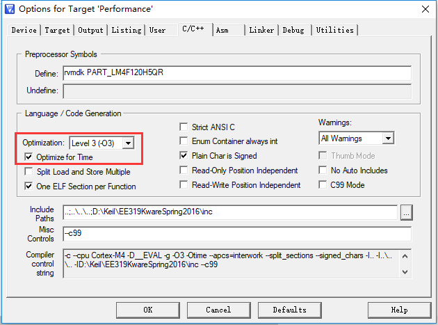
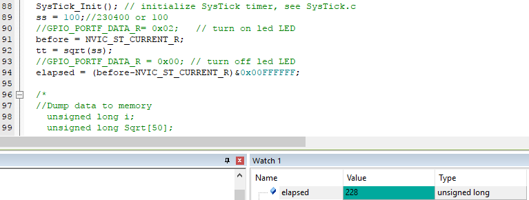
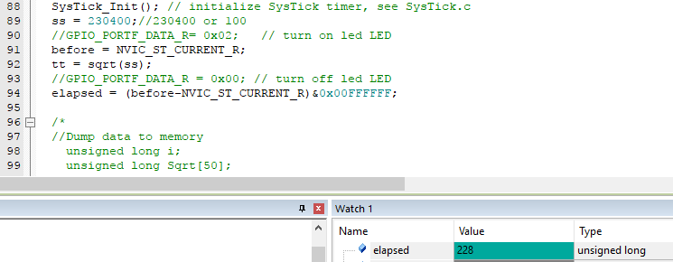
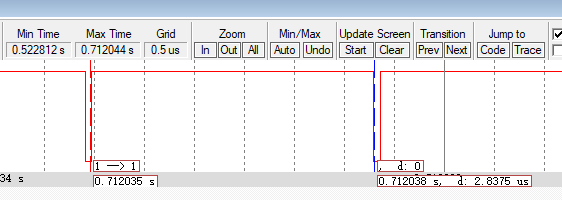
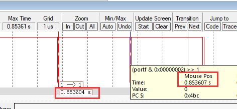
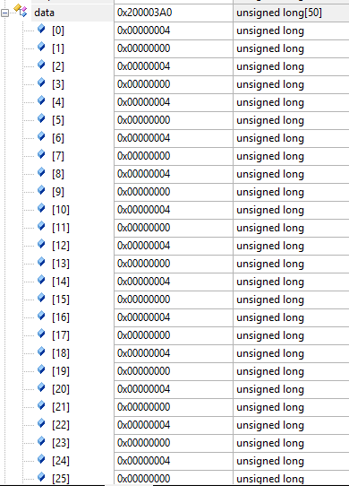
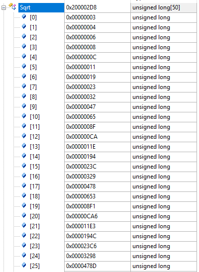

# Lab 10

## 实验一

运行附件工程文件”Performance”，先选择不同优化级别，运行程序，观察elapsed记录的对100和230400两个数求平方根的执行时间。

## 实验过程

首先，配置编译器优化级别为级别三：



对100求平方根的执行时间为：228*12.5ns=2850ns



对230400求平方根的执行时间为：228*12.5ns=2850ns



同理，可求出优化级别为级别0、级别1、级别2的运行时间，在仿真情况下，总结得下表：

操作 | 优化级别|  运行周期 | 运行时间(ns) |
:--:|:--:|:--:|:--:|
对100求平方根 | 0 | 237 | 2962.5 |
对230400求平方根| 0 | 237|2962.5 |
对100求平方根 | 1 | 228 | 2850 |
对230400求平方根| 1| 228|2850 |
对100求平方根 | 2 | 228 | 2850 |
对230400求平方根| 2| 228|2850 |
对100求平方根 | 3 | 228 | 2850 |
对230400求平方根| 3| 228|2850 |

## 实验二

把注释语句对PF1开灯和关灯语句取代用定时器测量的elapsed语句，用逻辑分析仪观察PF1波形，计算函数运算时间（仿真模式运行程序）。

### 实验过程

首先，为了能够让逻辑分析仪能捕获数据，在测试代码最外层添加while循环：

```c
  while(1){
	GPIO_PORTF_DATA_R= 0x02;   // turn on led LED
	//before = NVIC_ST_CURRENT_R;
  tt = sqrt(ss);              
	GPIO_PORTF_DATA_R = 0x00; // turn off led LED
  //elapsed = (before-NVIC_ST_CURRENT_R)&0x00FFFFFF;
	}
```

设置优化级别为级别三。

对100求平方根的执行时间为：0.712038-0.712035=0.000003s



对230400求平方根的执行时间为：0.853607-0.853604=0.000003s



## 实验三

板级运行程序，观察pf2灯的亮灭、观察存入内存记录的PF2状态值，以及tt所求的ss平方根值。

### 实验过程

设置优化级别为级别三、初始被开根数ss为10（在代码中每次求完ss平方根值后都将ss乘以2）。

在板子上运行代码，观察发现PF2灯大概每1秒左右就更改一次灯的状态。

观察存入内存记录的PF2状态值，可发现PF2的状态值一直在0x00000004和0x00000000之间交替变化。



观察tt所求的ss平方根值，可发现相邻数值之间的倍数差大概为根号2（=1.414）。



