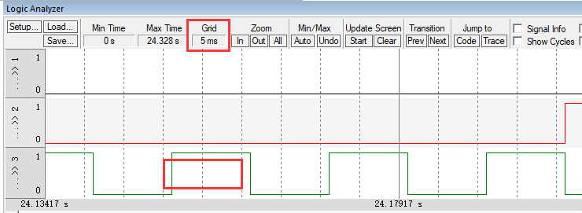

# Lab 11

## 实验要求

本实验对应工程文件为：`\Keil\EE319KwareSpring2016\Profile_4C123`。

任务一：仿真完成后把相应端口PA3,4,5换成PF1,2,3。重新对端口初始化设置。

任务二：设置每0.2s Time定时中断并PF2切换亮灭，改变定时初值观察结果。

任务三：对系统定时器中断时间重新设定为10ms，在其中断服务程序中对PF3切换状态。

## 实验过程

### 任务一：仿真完成后把相应端口PA3,4,5换成PF1,2,3。重新对端口初始化设置。

修改代码之前的仿真结果如下：


- 第一个红色框标记的是**嵌套中断**，优先级依次为PA4、PA3、PA5。
    - 首先，PA3中断PA5的运行过程，所以PA5会先保持被中断时的状态（也即是输出逻辑低）而暂时不会在逻辑低和逻辑高之间交替变换。
    - 接着，PA4中断PA3的运行过程，所以PA4会保持被中断时的状态（也即是输出逻辑高）。
- 第二个红色框标记的是PA3中断PA5的现象，可见前者优先级相对较高。
- 第三个红色框标记的是PA4中断PA5的现象，可见前者优先级相对较高。

为了更清晰地解释修改的过程，下面先总结如下表：

线程 | 修改之前对应的端口 | 修改之后对应的端口
:-:|:-:|:-:|
main |PA5 | PF1
SysTick ISR| PA4 | PF3
Time0 ISR | PA3 | PF2

接着是对中断优先级设置的说明:

修改代码之前的优先级为：SysTick ISR > Time0 ISR > main，对应端口优先级为PA4 > PA3 > PA5。

修改代码之后的优先级为：Time0 ISR > SysTick ISR > main，对应端口优先级为PF2 > PF3 > PF1。

接下来来修改代码：

首先来更改SysTick ISR和Time0 ISR的中断优先级。

```c
volatile uint32_t Counts;
void SysTick_Init(uint32_t period){
  Counts = 0;
  NVIC_ST_CTRL_R = 0;            // disable SysTick during setup
  NVIC_ST_RELOAD_R = period - 1; // reload value
  NVIC_ST_CURRENT_R = 0;         // any write to current clears it
  /********修改代码部分************/
  //NVIC_SYS_PRI3_R = (NVIC_SYS_PRI3_R&0x00FFFFFF)|0x40000000; //priority 2 
  NVIC_SYS_PRI3_R = (NVIC_SYS_PRI3_R&0x00FFFFFF)|0x60000000; //priority 3  
  /********修改代码部分************/              
  NVIC_ST_CTRL_R = 0x00000007;   // enable with core clock and interrupts
}
```

```c
void Timer0A_Init(unsigned short period){ volatile uint32_t delay;
  SYSCTL_RCGCTIMER_R |= 0x01;      // 0) activate timer0
  delay = SYSCTL_RCGCTIMER_R;      // allow time to finish activating
  TIMER0_CTL_R &= ~0x00000001;     // 1) disable timer0A during setup
  TIMER0_CFG_R = 0x00000004;       // 2) configure for 16-bit timer mode
  TIMER0_TAMR_R = 0x00000002;      // 3) configure for periodic mode
  TIMER0_TAILR_R = period - 1;     // 4) reload value
  TIMER0_TAPR_R = 49;              // 5) 1us timer0A
  TIMER0_ICR_R = 0x00000001;       // 6) clear timer0A timeout flag
  TIMER0_IMR_R |= 0x00000001;      // 7) arm timeout interrupt
  /********修改代码部分************/
  //NVIC_PRI4_R = (NVIC_PRI4_R&0x00FFFFFF)|0x60000000; // 8) priority 3
  NVIC_PRI4_R = (NVIC_PRI4_R&0x00FFFFFF)|0x40000000; // 8) priority 2
  /********修改代码部分************/
  NVIC_EN0_R = NVIC_EN0_INT19;     // 9) enable interrupt 19 in NVIC
  TIMER0_CTL_R |= 0x00000001;      // 10) enable timer0A
}
```

注：这里被注释的代码即是原先的代码，对应下方是修改后的代码，下同。

接着来修改不同中断服务对应的输出口的操作：

```c
void Timer0A_Handler(void){
  //PA3 = 0x08;
  GPIO_PORTF_DATA_R |= 0x04; //PF2 high
  TIMER0_ICR_R = TIMER_ICR_TATOCINT;// acknowledge timer0A timeout
  //PA3 = 0;
  GPIO_PORTF_DATA_R &= ~0x04;//PF2 low
}
void SysTick_Handler(void){
  //PA4 = 0x10;
  GPIO_PORTF_DATA_R |= 0x08; //PF3 high
  Counts = Counts + 1; 
  //PA4 = 0;
  GPIO_PORTF_DATA_R &= ~0x08; //PF3 low
}
```

接着实现初始化端口F的函数，替代main中初始化端口A的代码，并修改main中操作的输出口为PF1。
```c
void PortF_Init(void){	
  volatile uint32_t delay;
  SYSCTL_RCGCGPIO_R |= 0x00000020;  // 1) activate clock for Port F
  delay = SYSCTL_RCGCGPIO_R;        // allow time for clock to start
  GPIO_PORTF_LOCK_R = 0x4C4F434B;   // 2) unlock GPIO Port F
  GPIO_PORTF_CR_R = 0x1F;           // allow changes to PF4-0
  // only PF0 needs to be unlocked, other bits can't be locked
  GPIO_PORTF_AMSEL_R = 0x00;        // 3) disable analog on PF
  GPIO_PORTF_PCTL_R = 0x00000000;   // 4) PCTL GPIO on PF4-0
  GPIO_PORTF_DIR_R = 0x0E;          // 5) PF4,PF0 in, PF3-1 out
  GPIO_PORTF_AFSEL_R = 0x00;        // 6) disable alt funct on PF7-0
  GPIO_PORTF_PUR_R = 0x11;          // enable pull-up on PF0 and PF4
  GPIO_PORTF_DEN_R = 0x1F;          // 7) enable digital I/O on PF4-0
}

int main(void){ 
  DisableInterrupts();
  PLL_Init();                // configure for 50 MHz clock
  PortF_Init();
  /*
  SYSCTL_RCGCGPIO_R |= 0x01;   // 1) activate clock for Port A 
  while((SYSCTL_PRGPIO_R&0x01) == 0){};
  GPIO_PORTF_AMSEL_R &= ~0x38;    // disable analog function
  GPIO_PORTF_PCTL_R &= ~0x00FFF000; // GPIO
  GPIO_PORTF_DIR_R |= 0x38;  // make PA5-3 outputs
  GPIO_PORTF_AFSEL_R &= ~0x38;// disable alt func on PA5-3
  GPIO_PORTF_DEN_R |= 0x38;  // enable digital I/O on PA5-3
                             // configure PA5-3 as GPIO
	*/
  Timer0A_Init(5);           // 200 kHz
  SysTick_Init(304);         // 164 kHz
  EnableInterrupts();
  while(1){
    //PA5 = PA5^0x20;  
	GPIO_PORTF_DATA_R ^= 0x02; // toggle PF1
  }
}
```

修改代码之后的仿真结果为：


可看到出现了PF3中断PF1、PF2中断PF1的现象，符合预期效果。

### 任务二：设置每0.2s Time定时中断并PF2切换亮灭，改变定时初值观察结果。

首先，必须得说明一下，在不改SYSDIV和LSB的情况下，也即是原始的时钟频率为50MHZ的前提下，并且只能改Timer0A_Init传入的参数的数值的前提下，设置每1s Time0A定时中断是**不可实现的**。但是在keil的仿真上却能在这种情况下仿真出没每1s改变PF2波形的效果出来，所以这又是keil的一个bug了。**因此仿真的截图是没有意义的==**

证明：TIMER0_TAILR_R可指定的最大值为2^16，TIMER0_TAPR_R可指定的最大值为2^8，因此可得出的最小频率为：50MHZ/2^16/2^8=2.98023223877HZ > 1HZ

下面进入正题。。。

----

经过了上面的分析，实现0.2s定时中断，也即是PF2切换频率为5HZ。想着如果要改Timer0A_Init传入的参数period和分频值就有点麻烦，于是便打算改其他地方。

首先设定Timer0A_Inits传入的参数为20000（只要不超过65536即可，但之所以选这个数是方便后续计算），假定基础时钟频率为X HZ，则有：`5Hz = X HZ/(49+1)/20000`，得：X = 5MHZ。

这里的49是从Timer0A_Inits中的这行代码得到的：`TIMER0_TAPR_R = 49;              // 5) 1us timer0A`

再看到工程文件上面的一些宏定义，可看到如下这些信息：

```c
// The two #define statements SYSDIV and LSB 0 
// initialize the PLL to the desired frequency.
#define SYSDIV 3
#define LSB 1
// bus frequency is 400MHz/(2*SYSDIV+1+LSB) = 400MHz/(2*3+1+1) = 50 MHz
```

也即是修改SYSDIV即可达到目的了，即是说必须有：`400MHz/(2*SYSDIV+1+1) = X HZ = 5MHz`，可得 SYSDIV = 39。

因此修改`#define SYSDIV 3`为`#define SYSDIV 39`即可。

接着为了能在板子上分辨出实验效果，修改如下函数：

```c
void Timer0A_Handler(void){
    //PA3 = 0x08;
    //GPIO_PORTF_DATA_R |= 0x04; //PF2 high
    GPIO_PORTF_DATA_R ^= 0x04; //toggle PF2
    TIMER0_ICR_R = TIMER_ICR_TATOCINT;// acknowledge timer0A timeout
    //PA3 = 0;
    //GPIO_PORTF_DATA_R &= ~0x04;//PF2 low
}
```

同时注释main函数中while循环的代码：

```c
  while(1){
    //PA5 = PA5^0x20;  
    //GPIO_PORTF_DATA_R ^= 0x02; // toggle PF1
  }
```

修改代码后在板子上运行后可观察到大概0.2*2=0.4s蓝灯就会闪一次（仿真就不做了，有bug）。

### 任务三：对系统定时器中断时间重新设定为10ms，在其中断服务程序中对PF3切换状态。

首先，先注释掉Timer0A_Handler中切换PF2灯光的代码：`GPIO_PORTF_DATA_R ^= 0x04; //toggle PF2`。

10ms也即是对应100HZ，即有`100Hz = 5*10^6HZ/5*10^4`，故SysTick_Init传入参数为50000。

100HZ肉眼无法验证，这里还是用仿真吧（对实验涉及到的SysTick相关的部分仿真倒是没有问题），仿真后的结果如下：



每个grid为5ms，可看到每隔10msPF3切换一次。


