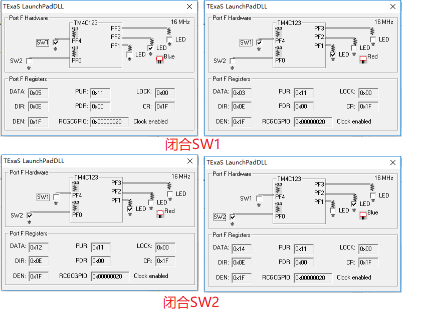
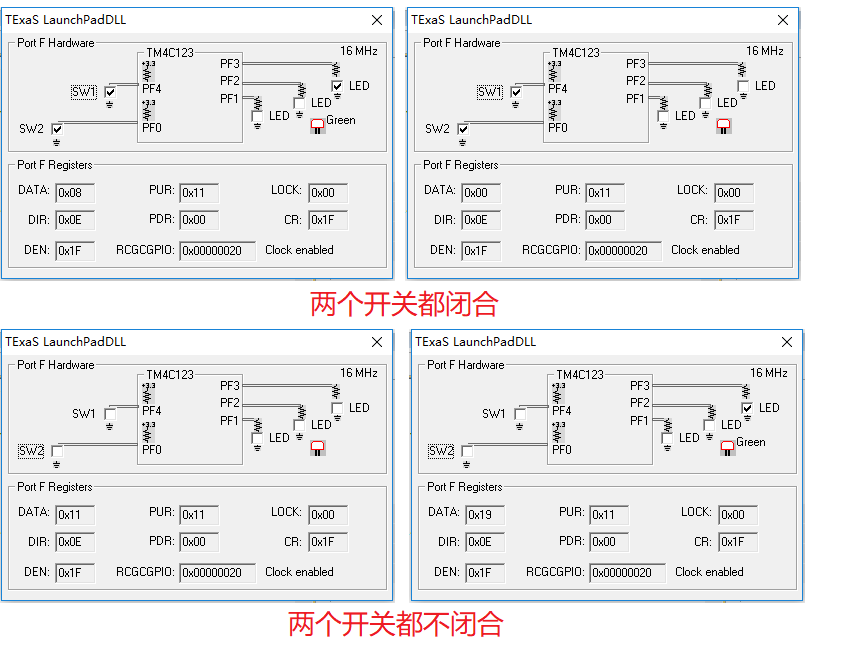
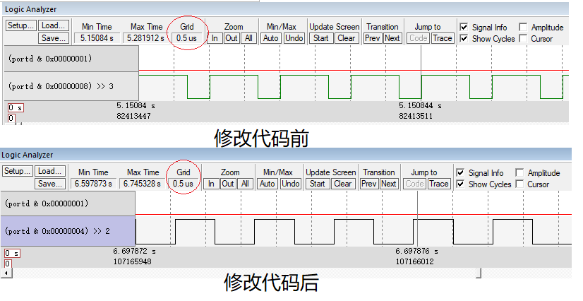

- [Lab7](#lab7)
    - [实验要求](#%E5%AE%9E%E9%AA%8C%E8%A6%81%E6%B1%82)
    - [实验过程](#%E5%AE%9E%E9%AA%8C%E8%BF%87%E7%A8%8B)
        - [实现目标](#%E5%AE%9E%E7%8E%B0%E7%9B%AE%E6%A0%87)
        - [实验原理](#%E5%AE%9E%E9%AA%8C%E5%8E%9F%E7%90%86)
        - [修改代码](#%E4%BF%AE%E6%94%B9%E4%BB%A3%E7%A0%81)
        - [修改代码前后的结果对比](#%E4%BF%AE%E6%94%B9%E4%BB%A3%E7%A0%81%E5%89%8D%E5%90%8E%E7%9A%84%E7%BB%93%E6%9E%9C%E5%AF%B9%E6%AF%94)
- [lab8](#lab8)
    - [实验要求](#%E5%AE%9E%E9%AA%8C%E8%A6%81%E6%B1%82)
    - [实验过程](#%E5%AE%9E%E9%AA%8C%E8%BF%87%E7%A8%8B)
        - [实现目标](#%E5%AE%9E%E7%8E%B0%E7%9B%AE%E6%A0%87)
        - [实验原理](#%E5%AE%9E%E9%AA%8C%E5%8E%9F%E7%90%86)
        - [修改代码](#%E4%BF%AE%E6%94%B9%E4%BB%A3%E7%A0%81)
        - [修改代码前后的结果对比](#%E4%BF%AE%E6%94%B9%E4%BB%A3%E7%A0%81%E5%89%8D%E5%90%8E%E7%9A%84%E7%BB%93%E6%9E%9C%E5%AF%B9%E6%AF%94)
        - [遇到的问题及思考](#%E9%81%87%E5%88%B0%E7%9A%84%E9%97%AE%E9%A2%98%E5%8F%8A%E6%80%9D%E8%80%83)

# Lab7

## 实验要求

- 修改程序改变按键对应的驱动灯颜色，做个前后对比，并作调试分析。

## 实验过程

### 实现目标

本次实验涉及的工程路径为：`\Keil\EE319KwareSpring2016\InputOutput_4C123`

首先从硬件讲起，这次实验用到了PF0-PF4这5个端口，其中PF4和PF0是开关，闭合开关时是低电平，打开开关时是高电平，而PF3、PF2、PF1各自连接着绿色、蓝色、红色的LED灯。图示如下：


总体要实现的效果如下：

| 开关输入         | LED输出 |
| ---------------- | ------- |
| 同时按下SW1和SW2 | 蓝灯亮  |
| 按下SW1          | 红灯亮  |
| 按下SW2          | 绿灯亮  |
| 都不按           | 都不亮  |

### 实验原理

由于此次实验代码都是已经给好的，这里便来一一进行分析。

首先是宏定义，这一步便是将板子上的地址用我们可理解的方式定义出来而已，可不必深究。

```c
#include <stdint.h>
#include "inc/tm4c123gh6pm.h"
#define GPIO_LOCK_KEY           0x4C4F434B  // Unlocks the GPIO_CR register
#define PF0       (*((volatile uint32_t *)0x40025004))
#define PF4       (*((volatile uint32_t *)0x40025040))
#define SWITCHES  (*((volatile uint32_t *)0x40025044))
#define SW1       0x10                      // on the left side of the Launchpad board
#define SW2       0x01                      // on the right side of the Launchpad board
#define SYSCTL_RCGC2_GPIOF      0x00000020  // port F Clock Gating Control
#define RED       0x02
#define BLUE      0x04
#define GREEN     0x08
```

需要注意，这里地址是以**十六进制**进行表示的。

接着来看初始化F端口的函数`PortF_Init()`：

```c
void PortF_Init(void){
  volatile uint32_t delay;
  SYSCTL_RCGCGPIO_R |= 0x00000020;  // 1) activate clock for Port F
  delay = SYSCTL_RCGCGPIO_R;        // allow time for clock to start
  GPIO_PORTF_LOCK_R = 0x4C4F434B;   // 2) unlock GPIO Port F
  GPIO_PORTF_CR_R = 0x1F;           // allow changes to PF4-0
  // only PF0 needs to be unlocked, other bits can't be locked
  GPIO_PORTF_AMSEL_R = 0x00;        // 3) disable analog on PF
  GPIO_PORTF_PCTL_R = 0x00000000;   // 4) PCTL GPIO on PF4-0
  GPIO_PORTF_DIR_R = 0x0E;          // 5) PF4,PF0 in, PF3-1 out
  GPIO_PORTF_AFSEL_R = 0x00;        // 6) disable alt funct on PF7-0
  GPIO_PORTF_PUR_R = 0x11;          // enable pull-up on PF0 and PF4
  GPIO_PORTF_DEN_R = 0x1F;          // 7) enable digital I/O on PF4-0
}
```

在初始化板子上的端口都有一个固定的流程（即是注释中的1到7这个步骤），至于为什么有这样的写法只能说**本来设计就是如此**，没有为什么。仔细看一遍注释后也能够知道每一步在做什么，所以这里来讲一下对这个初始化流程的理解：

- 1.注释中标注的7个步骤都是初始化所有端口（比如PORT A、PORT B、...）时都需要走一遍的。但是这里也有比较特殊的地方，由于PF4和PF0对应的是开关，因此需要在PORT F的初始化上加入上拉两个开关的代码（即是`GPIO_PORTF_PUR_R = 0x11;`）。
- 2.在PORT F中，只有PF0是需要解锁的，因此对于其他端口的初始化可能要查一下datasheet看看是否需要解锁。这个是比较特殊的。

接着是PORT F的输入读取函数，思路也很简单，通过位的与运算得到PF4和PF0的值。

```c
uint32_t PortF_Input(void){     
  return (GPIO_PORTF_DATA_R&0x11);  // read PF4,PF0 inputs
}
```

PORT F的输出函数也是类似，只要知道了对输入输出进行赋值和取值在`GPIO_PORTF_DATA_R`上进行操作也就可以了。

```c
void PortF_Output(uint32_t data){ // write PF3-PF1 outputs
  GPIO_PORTF_DATA_R = data;        	
}
```

最后便是main函数了，在进行了初始化之后，便在一个while循环里面不断地读取输入，并根据输入对PF1-PF3这3个位进行赋值，从而使得不同的LED发亮。这里需要注意的是开关未闭合是高电平，闭合是低电平，比如闭合SW1后，通过`GPIO_PORTF_DATA_R&0x11`取出来的值应该是`0x01`而不是`0x10`。然后具体的逻辑代码注释写得非常明白，这里不再赘述。

```c
int main(void){
  uint32_t status;
  PortF_Init();              // initialize PF0 and PF4 and make them inputs
                             // make PF3-1 out (PF3-1 built-in LEDs)
  while(1){
    status = PortF_Input();
    switch(status){                    // switches are negative logic on PF0 and PF4
      case 0x01: PortF_Output(BLUE); break;   // SW1 pressed
      case 0x10: PortF_Output(RED); break;    // SW2 pressed
      case 0x00: PortF_Output(GREEN); break;  // both switches pressed
      case 0x11: PortF_Output(0); break;      // neither switch pressed
    }
  }
}
```

### 修改代码

要实现实验要求中的“**修改程序改变按键对应的驱动灯颜色**”，思路还是很简单的，只需要调换main函数中switch语句的case即可。

比如现在实现，闭合SW1为红灯亮，闭合SW2为蓝灯亮，两个开关同时闭合则都不亮，两个开关都不闭合就绿灯亮。实现代码如下：

```c
switch(status){                    // switches are negative logic on PF0 and PF4
      case 0x01: PortF_Output(RED); break;   // SW1 pressed
      case 0x10: PortF_Output(BLUE); break;    // SW2 pressed
      case 0x00: PortF_Output(0); break;  // both switches pressed
      case 0x11: PortF_Output(GREEN); break;      // neither switch pressed
    }
```
### 修改代码前后的结果对比

修改代码前后的结果对比如下，左右两边分别是修改代码前后在KEIL上模拟的效果：





# lab8

## 实验要求

- 修改输出位到portd.2后，与之前输出位为portd.3时的截图做对比
- 修改程序，使脉宽有所变化，也对比修改前后的截图，并解释相关修改的代码

## 实验过程

### 实现目标

本次实验涉及的工程为老师发的`NOTGate-asm`工程，不是keil路径下的同名工程。

这个实验要实现的目标比较纯粹，就是实现一个非门，具体就是用PD0为输入端，PD3为PD0取反后的结果。

### 实验原理

由于此次实验代码也都是已经给好的，这里便来一一进行分析。

首先是初始化PORT D的函数，初始化流程和上个实验的PORT F的一样，唯一的区别就是，这里不需要对PD0进行解锁操作（即是下面注释的那部分代码）。

```py
GPIO_Init
    ; 1) activate clock for Port D
	
	LDR R1, =SYSCTL_RCGCGPIO_R
    LDR R0, [R1]                    ; R0 = [R1]
    ORR R0, R0, #0x08 ; R0 = R0|0x08
    STR R0, [R1]                    ; [R1] = R0
    NOP
	NOP
	NOP
    NOP                             ; allow time to finish activating
	;unlock PD0,PD3
	;LDR R1, =GPIO_PORTD_LOCK_R
    ;LDR R0, [R1]                    ; R0 = [R1]
    ;ORR R0, R0, #0x09 ; R0 = R0|0x08
    ;STR R0, [R1]                    ; [R1] = R0
    ; 3) set direction register
    LDR R1, =GPIO_PORTD_DIR_R       ; R1 = &GPIO_PORTD_DIR_R
    LDR R0, [R1]                    ; R0 = [R1]
    ORR R0, R0, #0x08               ; R0 = R0|0x08 (make PD3 output)
	BIC R0, R0, #0x01				; R0 = R0 & NOT(0x01) (make PD0 input)
    STR R0, [R1]                    ; [R1] = R0
    ; 4) regular port function
    LDR R1, =GPIO_PORTD_AFSEL_R     ; R1 = &GPIO_PORTD_AFSEL_R
    LDR R0, [R1]                    ; R0 = [R1]
    BIC R0, R0, #0x09               ; R0 = R0&~0x09 (disable alt funct on PD3,PD0)
    STR R0, [R1]                    ; [R1] = R0
    ; 5) enable digital port
    LDR R1, =GPIO_PORTD_DEN_R       ; R1 = &GPIO_PORTD_DEN_R
    LDR R0, [R1]                    ; R0 = [R1]
    ORR R0, R0, #0x09               ; R0 = R0|0x09 (enable digital I/O on PD3,PD0)
    STR R0, [R1]                    ; [R1] = R0
   
    BX  LR
```

接着也是用于初始化的Start函数，即是调用了上面的函数并进行一次取值而已。

```py
Start
    BL  GPIO_Init
    LDR R0, =GPIO_PORTD_DATA_R
```

接下来便是整个实验的重点了，这段代码大概做的就是：先读取PD0的输入值，再将该值取反后赋值赋值给PD3。这样便实现了非门的逻辑。

```py
loop
	LDR R1,[R0]
	AND	R1,#0x01		; Isolate PD0
	EOR	R1,#0x01		; NOT state of PD0 read into R1
	STR R1,[R0]
	nop
	nop
	LSL R1,#3			; SHIFT left negated state of PD0 read into R1
	STR R1,[R0]			; Write to PortD DATA register to update LED on PD3
    B loop                          ; unconditional branch to 'loop'


    ALIGN                           ; make sure the end of this section is aligned
    END                             ; end of file
```

### 修改代码

先整合下实验要求所要做的事情，那就是：把输出口从portd.3改为portd.2，并改变逻辑分析中方波的带宽。

首先来修改输出口，共有4处需要修改。

这里要先在输出化端口部分把portd.3改为portd.2，有修改的部分均已用注释表明。

```py
GPIO_Init
    ; 1) activate clock for Port D
	
	LDR R1, =SYSCTL_RCGCGPIO_R
    LDR R0, [R1]                    ; R0 = [R1]
    ORR R0, R0, #0x08 ; R0 = R0|0x08
    STR R0, [R1]                    ; [R1] = R0
    NOP
	NOP
	NOP
    NOP                             ; allow time to finish activating
	;unlock PD0,PD3
	;LDR R1, =GPIO_PORTD_LOCK_R
    ;LDR R0, [R1]                    ; R0 = [R1]
    ;ORR R0, R0, #0x09 ; R0 = R0|0x08
    ;STR R0, [R1]                    ; [R1] = R0
    ; 3) set direction register
    LDR R1, =GPIO_PORTD_DIR_R       ; R1 = &GPIO_PORTD_DIR_R
    LDR R0, [R1]                    ; R0 = [R1]
	;---修改1----该段为修改后的代码--------------
    ORR R0, R0, #0x04               ; R0 = R0|0x04 (make PD3 output)
	;---修改1----该段为修改后的代码--------------
	BIC R0, R0, #0x01				; R0 = R0 & NOT(0x01) (make PD0 input)
    STR R0, [R1]                    ; [R1] = R0
    ; 4) regular port function
    LDR R1, =GPIO_PORTD_AFSEL_R     ; R1 = &GPIO_PORTD_AFSEL_R
    LDR R0, [R1]                    ; R0 = [R1]
	;---修改2----该段为修改的代码--------------
    BIC R0, R0, #0x05               ; R0 = R0&~0x05 (disable alt funct on PD2,PD0)
	;---修改2----该段为修改的代码--------------
    STR R0, [R1]                    ; [R1] = R0
    ; 5) enable digital port
    LDR R1, =GPIO_PORTD_DEN_R       ; R1 = &GPIO_PORTD_DEN_R
    LDR R0, [R1]                    ; R0 = [R1]
	;---修改3----该段为修改的代码--------------
    ORR R0, R0, #0x05               ; R0 = R0|0x05 (enable digital I/O on PD2,PD0)
	;---修改3----该段为修改的代码--------------
    STR R0, [R1]                    ; [R1] = R0
   
    BX  LR
```

接着还需要在循环中修改对输出口进行赋值的部分代码，有修改的部分均已用注释表明（对应“修改4”）。这里也顺路在这个循环里面增加4条nop语句来影响对输出口取反的时间，从而影响带宽（对应“修改5”）。

```py
loop
	LDR R1,[R0]
	AND	R1,#0x01		; Isolate PD0
	EOR	R1,#0x01		; NOT state of PD0 read into R1
	STR R1,[R0]
	nop
	nop
	;---修改5----该段为修改的代码--------------
	nop
	nop
	nop
	nop
	;---修改5----该段为修改的代码--------------

	;---修改4----该段为修改的代码--------------
	LSL R1,#2			; SHIFT left negated state of PD0 read into R1
	;---修改4----该段为修改的代码--------------
	STR R1,[R0]			; Write to PortD DATA register to update LED on PD2
    B loop                          ; unconditional branch to 'loop'


    ALIGN                           ; make sure the end of this section is aligned
    END                             ; end of file
```

### 修改代码前后的结果对比

修改代码前后的结果对比如下，上下两图分别是修改代码前后在KEIL上模拟的效果：



可以看到，输出口从portd.3改为portd.2，在缩放比例都相同的情况下(即是每个方格都代表0.5us)，方波的带宽相对大小发生了改变。

### 遇到的问题及思考

- 1.修改后要及时地build一下，不然代码改了之后可能还没有发生效果，遇到神奇的问题时，退出debug模式rebuild一下或者reset CPU都是很必须的debug方法。不然可能debug半天发现原来自己的代码是没有bug的。
- 2.在做第二个实验时，出现了一个很神奇的问题:右键变量`GPIO_PORTD_DATA_R`添加到WATCH窗口查看变量值时，发现当对`GPIO_PORTD_DATA_R`赋值的时候，其最低位（也就是对应PD0）竟然会被影响，按道理来说，PD0是输入端，对`GPIO_PORTD_DATA_R`赋值是不会影响到其最低位的值得，比如`GPIO_PORTD_DATA_R=0x80`并不会使得`GPIO_PORTD_DATA_R`的最低位发生改变，然而WATCH窗口中显示的变量值表明上面的这种赋值运算是会影响到`GPIO_PORTD_DATA_R`的最低位。
    - 解决方案：本来的理解是没有错的，运行`GPIO_PORTD_DATA_R=0x80`并不会使得`GPIO_PORTD_DATA_R`的最低位（即是对应输入位）发生改变。而**真正出错的地方是keil这个软件**。刚开始得出这个结论的时候还不怎么相信，后来去查了keil的官方论坛，发现还真的是这里出了问题。这就真的很坑了。果然还是需要有批判精神！
        - 论坛链接：http://www.keil.com/forum/7144/ 和 http://www.onarm.com/forum/10617/ 。


