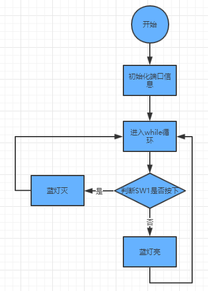
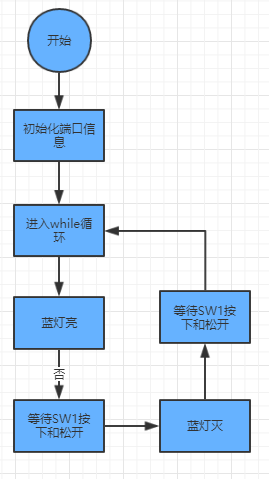
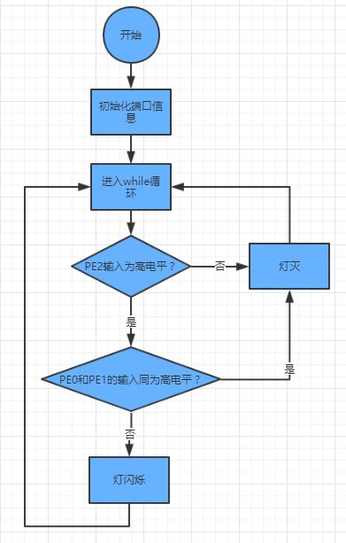
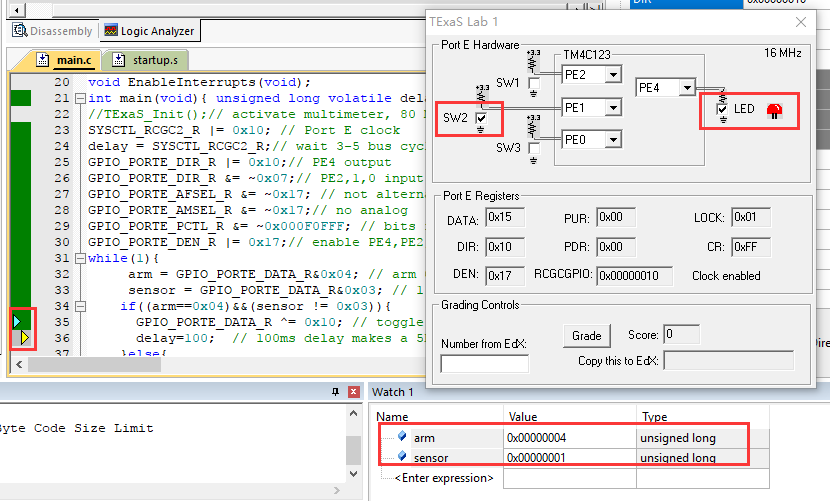
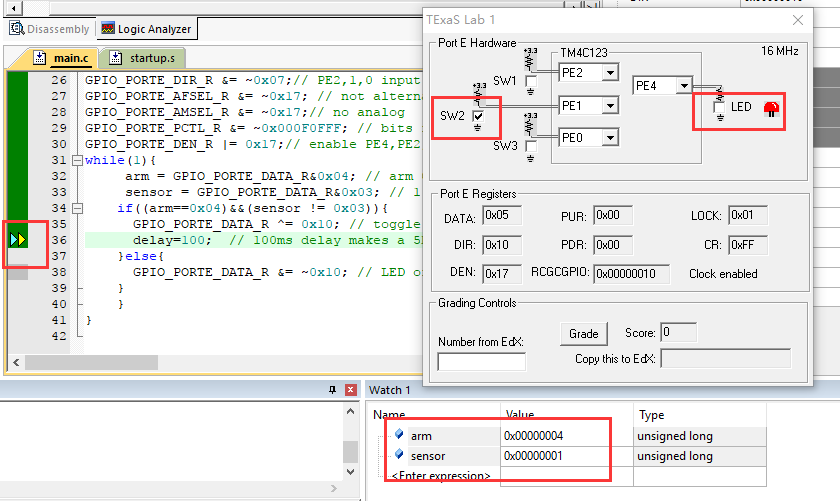
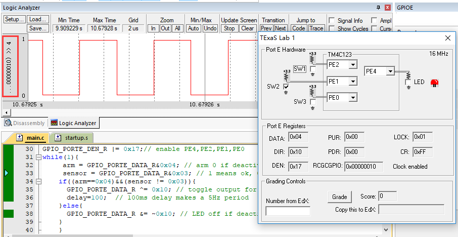
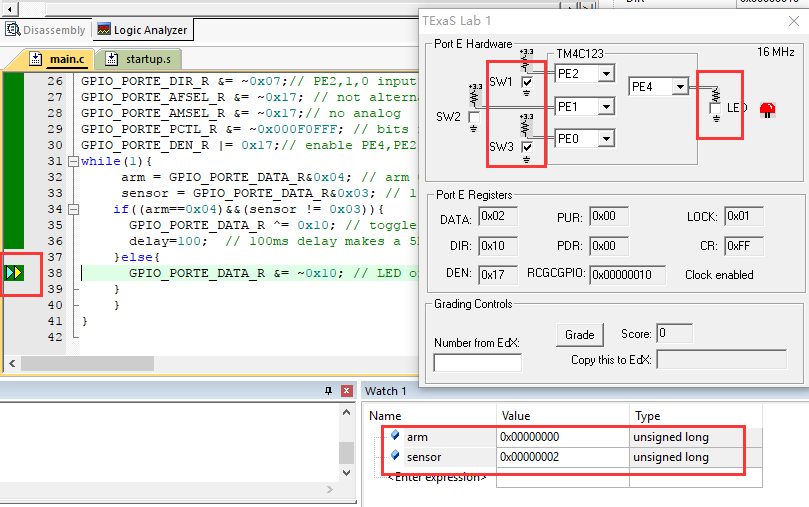

# lab 9

## 实验一

### 要求

修改源程序的输入输出位，观察实验现象，用照片或截图显示实验结果。

### 实验过程

分析源代码，绘制流程图如下：



重点是while循环中的代码，对应如下：

```c
while(1)
{
    In = GPIO_PORTF_DATA_R&0x10;   // read PF4 into Sw1
    Out = In>>2;                    // shift into position PF2
    GPIO_PORTF_DATA_R = Out;        // output 
}
```

这里首先读取SW1的输入值，SW1对应端口PF4，同时由于SW1是负逻辑，PF1-3均是正逻辑，所以当SW1没有按下的时候，PF2的输出为高，蓝灯亮；当SW1没有按下的时候PF2的输出为低，灯不亮。

修改代码之前的实验现象如下，左右两图分别为不按和按下SW1的效果。


接着修改输入端口为PF0，输出端口为PF1，对应修改while循环中的代码为：

```c
In = GPIO_PORTF_DATA_R&0x01;   // read PF0 into Sw2
Out = In<<1;                    // shift into position PF1
GPIO_PORTF_DATA_R = Out;        // output 
```

修改代码之前的实验现象如下，左右两图分别为不按和按下SW2的效果。


## 实验二

### 要求

修改源程序的输入输出位，观察实验现象，用照片或截图显示实验结果。

### 实验过程

分析源代码，绘制流程图如下：



重点是while循环中的代码，对应如下：

```c
SSR_On();
while(GPIO_PORTF_DATA_R&0x10);        // wait for button press
while((GPIO_PORTF_DATA_R&0x10) == 0); // wait for button release
SSR_Off();
while(GPIO_PORTF_DATA_R&0x10);        // wait for button press
while((GPIO_PORTF_DATA_R&0x10) == 0); // wait for button release
```

这里使用的两个函数为：

```c
// Make PF2 high
void SSR_On(void){
  PF2 = 0x04;
//  GPIO_PORTF_DATA_R |= 0x04;
}
// Make PF2 low
void SSR_Off(void){
  PF2 = 0x00;
//  GPIO_PORTF_DATA_R &= ~0x04;
}
```

修改代码之前的实验现象如下，从左到右四图分别为初始状态、按下SW1、松开SW1、再按下松开SW1的效果。


下面修改输入端为PF0，也即是SW2，修改输出端为PF1，也即是对应红灯的输出。

首先在SSR_Init函数中添加解锁语句：

```c
void SSR_Init(void){ 
  SYSCTL_RCGCGPIO_R |= 0x20;        // 1) activate clock for Port F
  while((SYSCTL_PRGPIO_R&0x20)==0){}; // allow time for clock to start
  /*这是添加的代码*/
  GPIO_PORTF_LOCK_R = 0x4C4F434B;   // 2) unlock GPIO Port F
  GPIO_PORTF_CR_R = 0x1F; // allow changes to PF4-0
  /*这是添加的代码*/
  GPIO_PORTF_PCTL_R &= ~0x00000F00; // 3) regular GPIO
  GPIO_PORTF_AMSEL_R &= ~0x02;      // 4) disable analog function on PF2
  GPIO_PORTF_DIR_R |= 0x02;         // 5) set direction to output
  GPIO_PORTF_AFSEL_R &= ~0x02;      // 6) regular port function
  GPIO_PORTF_DEN_R |= 0x02;         // 7) enable digital port
}
```

接着修改显示灯和关闭灯的函数：

```c
// Make PF2 high
void SSR_On(void){
  //PF2 = 0x04;
  GPIO_PORTF_DATA_R |= 0x02;
}
// Make PF2 low
void SSR_Off(void){
  //PF2 = 0x00;
  GPIO_PORTF_DATA_R &= ~0x02;
}
```

再修改main函数中的代码：

```c
int main(void){
  SSR_Init();               // initialize PF2 and make it output
  GPIO_PORTF_DIR_R &= ~0x01;// make PF4 in (PF4 built-in button #1)
  GPIO_PORTF_AFSEL_R &= ~0x01;// disable alt funct on PF4
  GPIO_PORTF_PUR_R |= 0x01; // enable pull-up on PF4
  GPIO_PORTF_DEN_R |= 0x01; // enable digital I/O on PF4
                            // configure PF4 as GPIO
  GPIO_PORTF_PCTL_R = (GPIO_PORTF_PCTL_R&0xFFF0FFFF)+0x00000000;
  while(1){
    SSR_On();
    while(GPIO_PORTF_DATA_R&0x01);        // wait for button press
    while((GPIO_PORTF_DATA_R&0x01) == 0); // wait for button release
    SSR_Off();
    while(GPIO_PORTF_DATA_R&0x01);        // wait for button press
    while((GPIO_PORTF_DATA_R&0x01) == 0); // wait for button release
  }
}
```

修改代码之后的实验现象如下，从左到右四图分别为初始状态、按下SW0、松开SW0、再按下松开SW0的效果。


## 实验三

### 要求

运行给出的工程代码，截图。

### 实验过程

分析源代码，绘制流程图如下：



重点是while循环中的代码，对应如下：

```c
while(1){
		 arm = GPIO_PORTE_DATA_R&0x04; // arm 0 if deactivated, 1 if activated(PE2)
		 sensor = GPIO_PORTE_DATA_R&0x03; // 1 means ok, 0 means break in
		if((arm==0x04)&&(sensor != 0x03)){
			GPIO_PORTE_DATA_R ^= 0x10; // toggle output for alarm
			delay=100;  // 100ms delay makes a 5Hz period
		}else{
			GPIO_PORTE_DATA_R &= ~0x10; // LED off if deactivated
		}
		}
}
```

可以看到，在PE2输入为高的前提下，只要PE1和PE0两者输入之间有一个为低，则灯将会交替闪烁。

这里的开关输入都是负逻辑，在PE2为高，将PE1设置为低的情况下，PE4输出从低变为高，灯亮。



保持输入不变，再运行一遍while循环，发现PE4输出从高变为低，灯灭。



以下是该情况下的逻辑分析仪对PE4的捕获输出：



在保持其他条件不变的情况下，将PE1设置为低改为PE0设置为低时效果一样。

而在PE2为低的情况下，无论其他输入口的输入怎样，PE4的输出始终为低，灯一直处于灭的状态。




