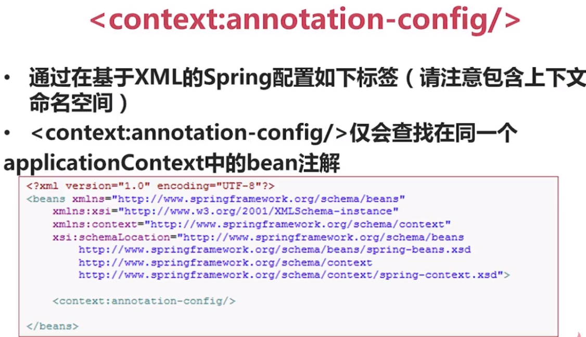
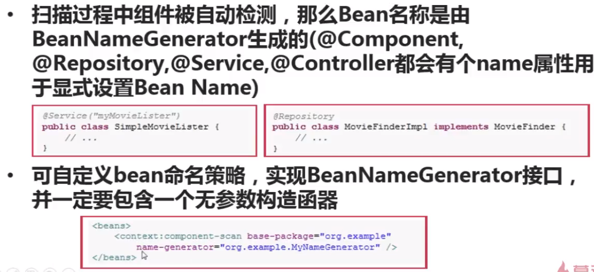
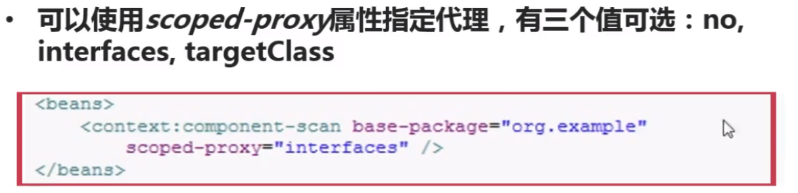
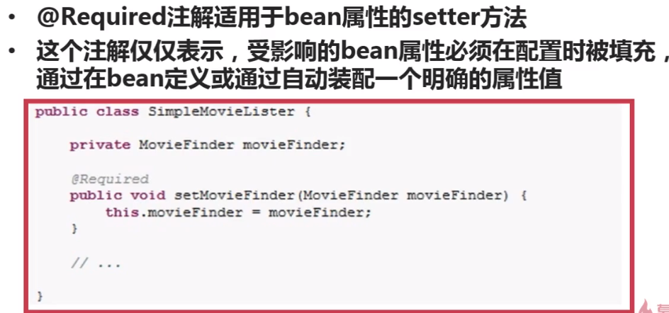
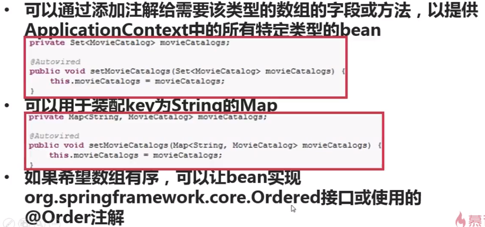
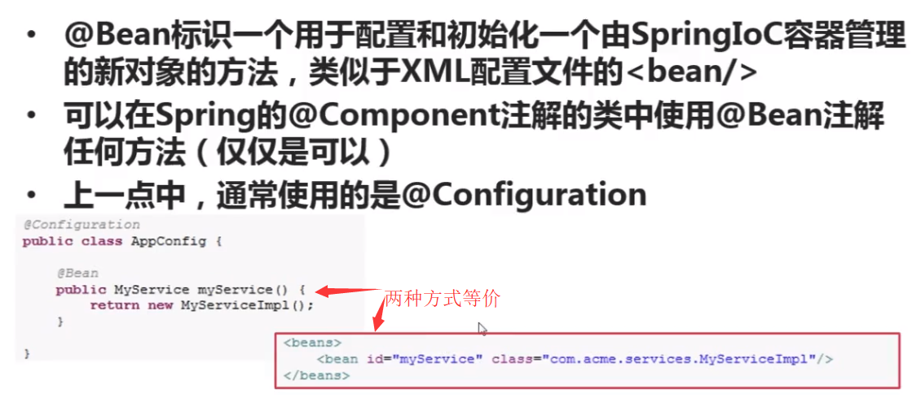
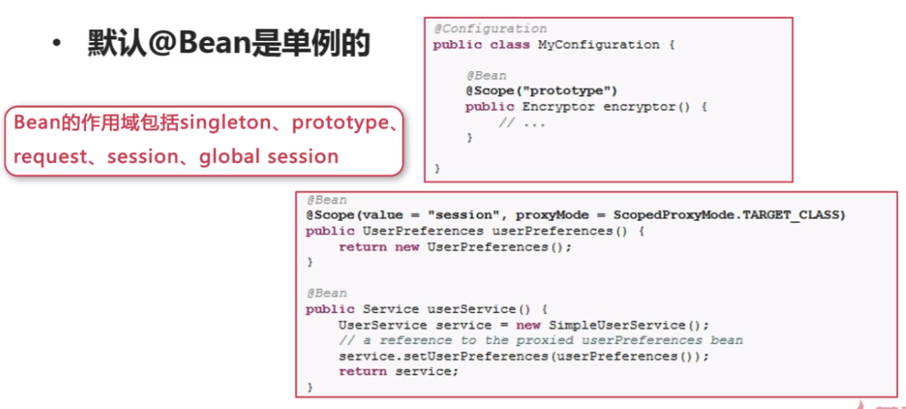
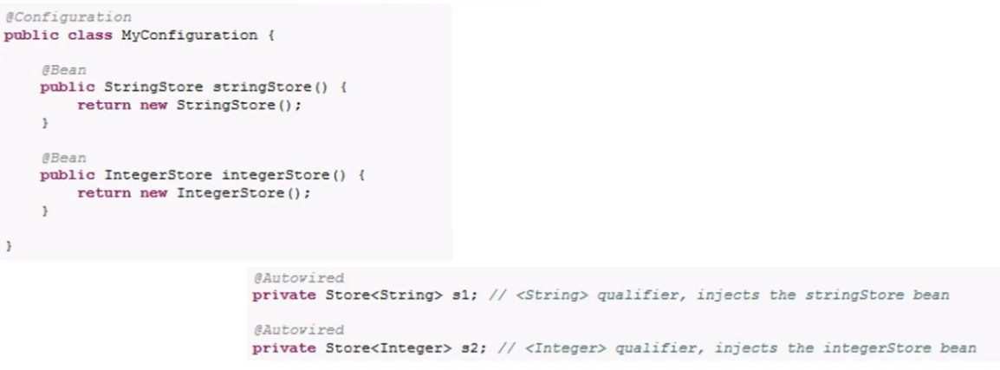

# Bean的定义

## classpath扫描与组件管理

## 类的自动监测以及Bean的注册

注：这里SimpleMovielister已经被注解为Service，Spring可以自动监测并注册Bean，如果没有注解则需要在XML文件中配置。

## context:annotation-config

## 类的自动监测以及Bean的注册

## 使用过滤器进行自定义扫描

## 定义bean

注：默认Bean的名称是类名第一个字母变为小写，该名称也对应XML文件中的id属性值。如这里被注解为Repository的类的默认Bean名为movidFinderImpl。

## 作用域

## 代理方式

----

# @Autowired注解说明

## @Required注解（并不怎么常用）

## @Autowired注解（非常常用）

## @Qualifier注解

使用XML配置的方式：

# 基于Java的容器注解说明——@Bean

# 基于Java的容器注解说明——@ImportResource和@Value

第一种方式：使用XML配置：

第二种方式：使用注解：

以上两种方式等价

# 基于Java的容器注解说明——@Bean和@Scope

# 基于Java的容器注解说明——基于泛型的自动装配

# Spring对JSR支持的说明

