# AOP的基本概念及特点

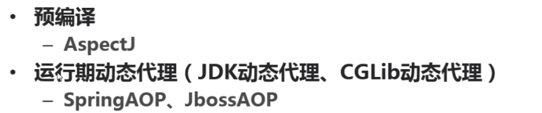

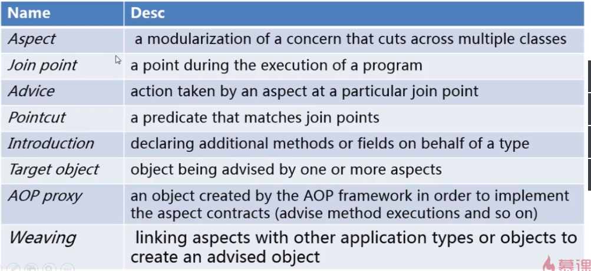

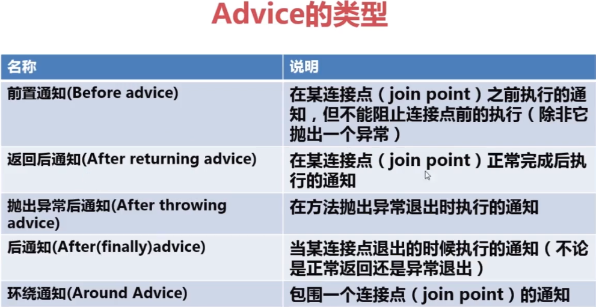

## Spring框架中AOP的用途

## Spring的AOP实现

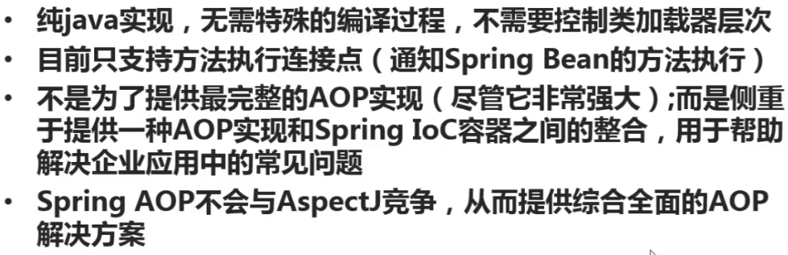

# 配置切面aspect

在XML上的配置方式如下：

# 配置切入点PointCut

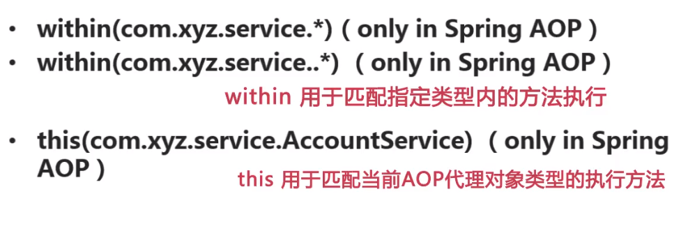

在XML上的配置例子如下：

# advice应用（上）

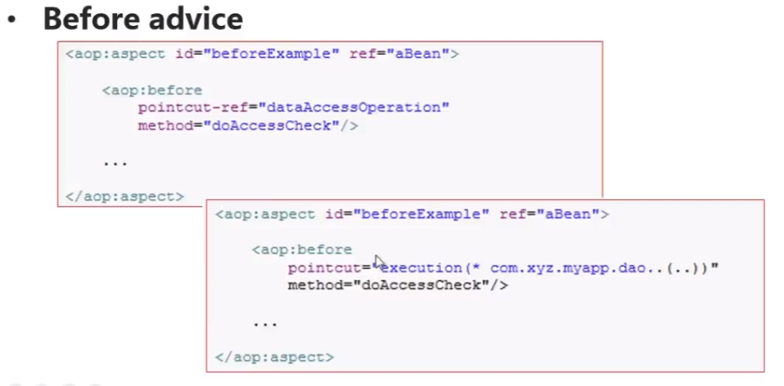

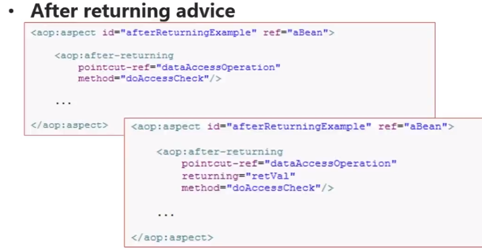

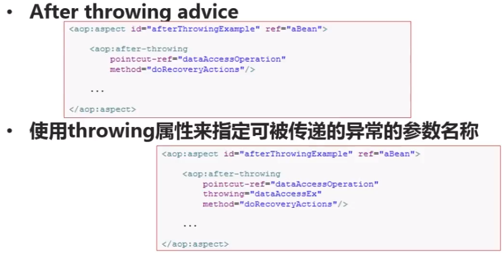

# advice应用（下）

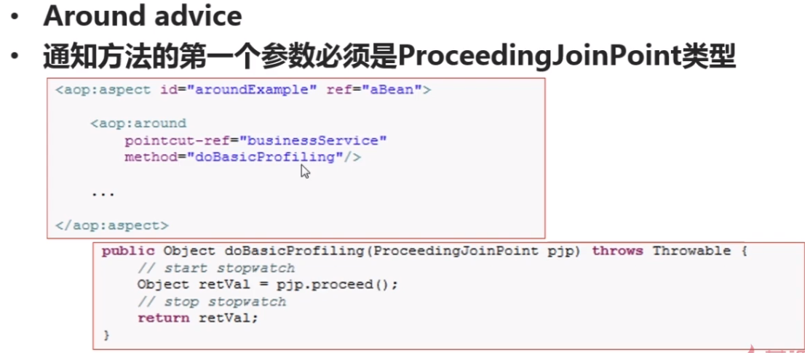

# Introductions

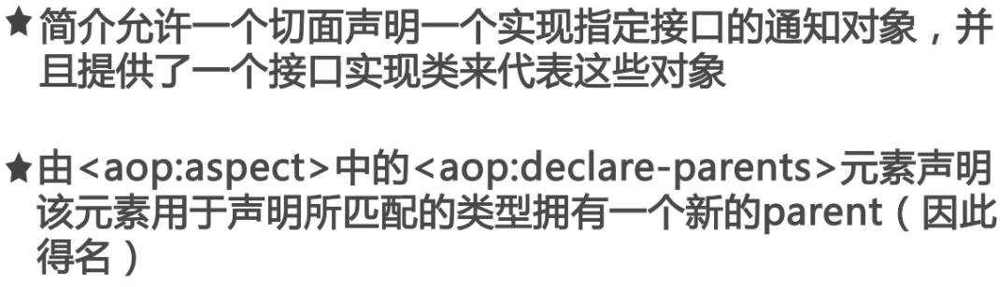

注意：所有基于配置文件的aspect都是单例模式的。

# Adavisors

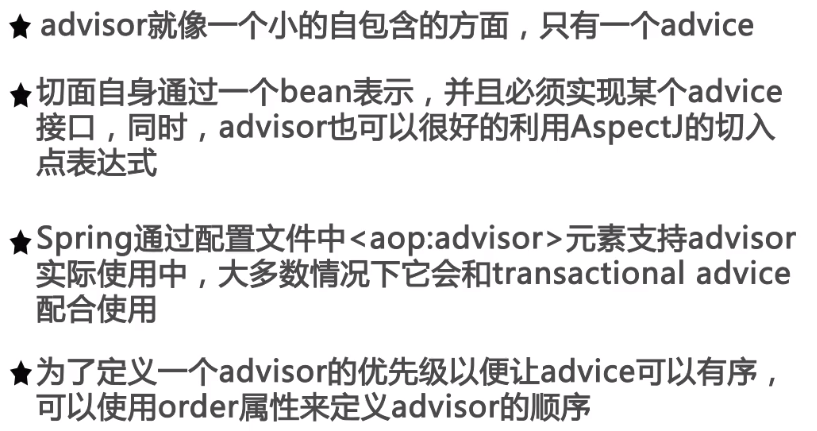

暂时先pass

