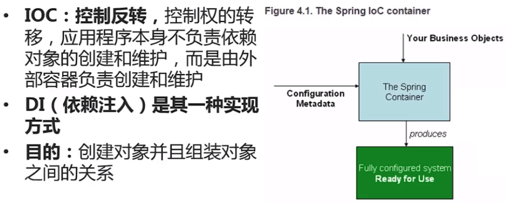
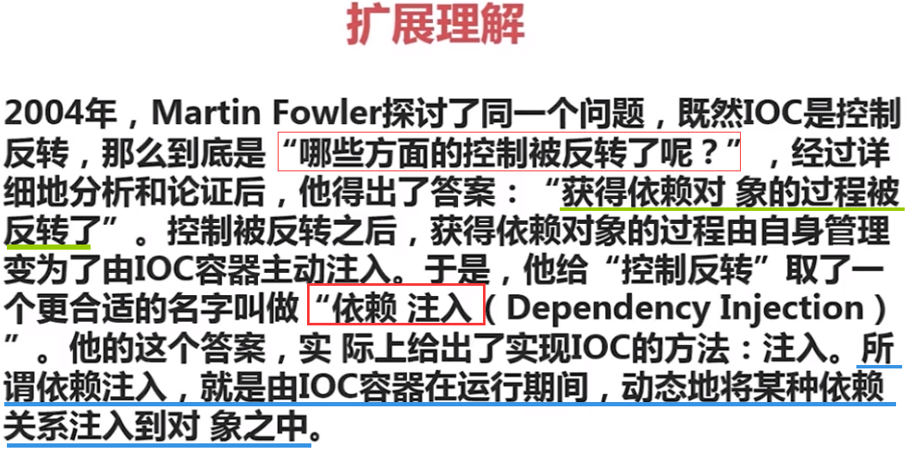
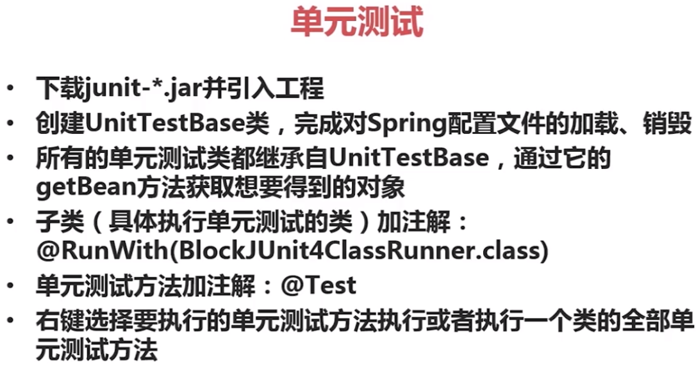

# IOC以及Bean容器

## 接口

实体把自己提供给外界的一种抽象化说明，用以由内部操作分离出外部沟通方法，使其能被修改而不影响外界其他实体与其交互的方式。

对应JAVA，接口即是声明，声明了哪些方法是对外公开的。

## 面向接口编程

- 结构设计中，分清层次及调用关系，每层只向上层提供一组功能接口，各层间仅依赖接口而非实现类。
- 接口实现的变动不影响各层间的调用，这一点在公共服务上尤为重要。

## 什么是IOC

## Spring的Bean配置

Spring的Bean配置有XML和注解两种方式。

## 单元测试

## Bean容器初始化

# Spring的注入方式

Spring注入是指启动Spring容器加载bean配置的时候，完成对变量的赋值行为，常用的两种注入方式有：
- 设值注入
- 构造注入

## 设值注入

## 构造注入

