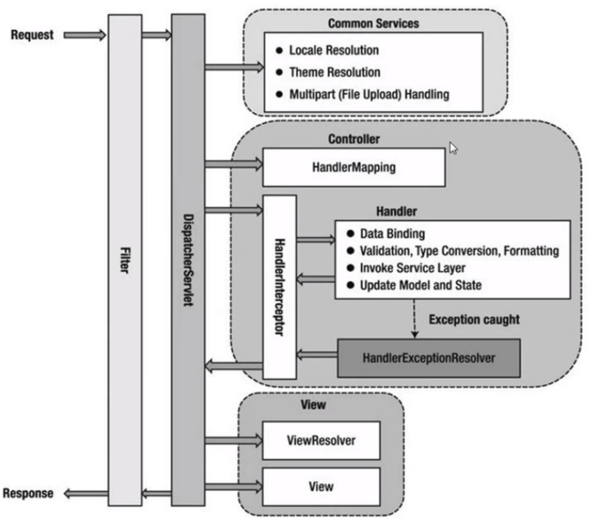

# 静态概念

１、DispatcherServlet：前端控制器。

２、Controller：调用业务逻辑生成model的地方。

３、HandlerAdapter：DispatcherServlet通过HandlerAdapter调用controller。

４、HandlerInterceptor：拦截器。该接口提供after postHandle preHandle 三个方法，调用controller前后使用。

５、HandlerMapping：前端控制器与controller映射关系的类。

６、HandlerExecutionChain: preHandle --> Controller method --> postHandle --> afterCompletion 的执行链。

７、ModelAndView：model的具体表现。

８、ViewResolver：视图解析器，决定需要用哪个视图来进行视图的呈现。

９、View：界面。

# 动态概念

